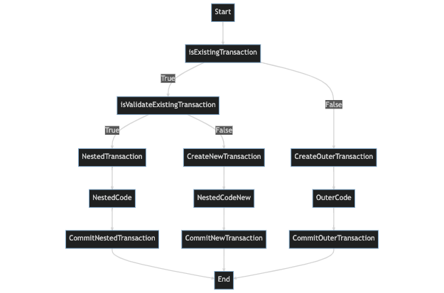
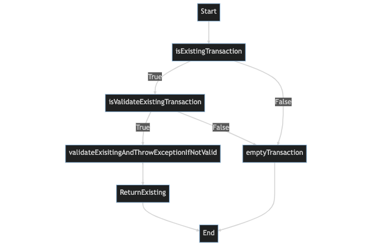
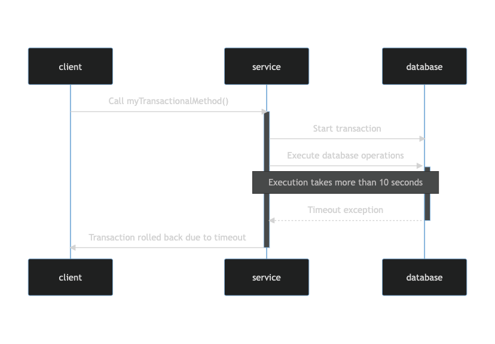

# @Transactional Annotation

> **데이터베이스 작업에서 트랜잭션을 관리하는 데 사용되는 어노테이션이다.**<br>
> 클래스 또는 메소드 레벨에 적용할 수 있으며 클래스 수준에서 적용하면 클래스의 모든 메소드에 대한
> 기본 트랜잭션 설정을 설정한다.

@Transactional annotation이 지원하는 설정들
1. 트랜잭션 전파 유형
2. 트랜잭션 격리 수준
3. 트랜잭션에 의해 래핑된 연산에 대한 시간제한
4. readOnly flag
5. 트랜잭션에 대한 롤백 규칙


## 1. 트랜잭션 전파 유형(Transaction Propagation Types)

여러 트랜잭션이 관련된 경우 **트랜잭션이 전파되는 방식**을 결정한다.

<br>

#### 1. Required
> Default 전파유형으로 트랜잭션이 이미 있는 경우 현재 메소드가 해당 트랜잭션에 참여한다.


```java
@Transactional(propagation = Propagation.REQUIRED)
public void example(){
    //...
        }
```
Default값이므로 생략 가능하다.

<br>

#### 2. Requires New

> 항상 새 트랜잭션을 만든다. 트랜잭션이 이미 존재하는 경우 새 트랜잭션이 완료될 때까지 일시 중단한다.


```java
@Transactional(propagation = Propagation.REQUIRED_NEW)
public void example(){
    //...
        }
```

<br>

#### 3. Nested

> 중첩된 트랜잭션을 생성한다. 트랜잭션이 이미 존재하는 경우 새 트랜잭션이 생성되어
> 기존 트랜잭션 내에 중첩되고, 트랜잭션이 존재하지 않으면 새 트랜잭션이 생성된다.



```java
@Transactional(propagation = Propagation.NESTED)
public void example(){
    //...
        }
```

<br>

#### 4. Mandatory

> 트랜잭션이 이미 존재해야 하며, 트랜잭션이 존재하지 않으면 예외가 발생한다.


```java
@Transactional(propagation = Propagation.MANDATORY)
public void example(){
    //...
        }
```

<br>

#### 5. Supports

> 트랜잭션이 이미 존재하는 경우 트랜잭션을 지원한다. 트랜잭션이 존재하면 해당 트랜잭션
> 내에서 현재 메소드가 실행되고 트랜잭션이 존재하지 않으면 트랜잭션 없이 메소드가 실행된다.



```java
@Transactional(propagation = Propagation.SUPPORTS)
public void example(){
    //...
        }
```

<br>

#### 6. Not Supported

> 트랜잭션을 지원하지 않는다. 트랜잭션이 존재하면 현재 메소드가 실행되는 동안
> 트랜잭션이 일시 중단된다.

```java
@Transactional(propagation = Propagation.NOT_SUPPORTED)
public void example(){
    //...
        }
```

<br>

#### 7. Never

> 현재 메소드가 실행될 때 트랜잭션이 존재하지 않는지 확인한다. 
> 트랜잭션이 존재하면 예외가 발생한다.


```java
@Transactional(propagation = Propagation.NEVER)
public void example(){
    //...
        }
```

<br>
<br>

## 2. 동시성 부작용과 트랜잭션 격리 수준

> 트랜잭션 격리수준(Transaction Isolation Levels)은 concurrent 트랜잭션에 의해
> 적용된 변경사항이 서로에게 표시되는 방식을 설명한다.<br>
> **concurrent 트랜잭션** : 여러 사용자가 동시에 실행할 수 있는 트랜잭션

<br>

### 동시성 부작용(concurrency side effects)

1. **Dirty read**

concurrent 트랜잭션의 커밋되지 않은 변경 내용을 읽는다.

2. **Non-repeatable read**

concurrent 트랜잭션이 동일한 행을 업데이트하고 커밋하는 경우 행을 다시 읽을 때
다른 값을 가져온다.

3. **Phantom read**

다른 트랜잭션이 범위의 일부 행을 추가 또는 제거하고 커밋하는 경우 range-query를 다시 실행한 후
다른 행을 가져온다.

<br>

### 트랜잭션 격리 수준(Transaction Isolation Level)

1. Read Uncommitted
2. Read Committed
3. Repeatable Read
4. Serializable

순서대로 Read Uncommitted의 격리 수준이 가장 낮고 Serializable의 격리 수준이 가장 높다.
격리 수준이 낮을수록 동시성은 증가하지만 격리 수준에 따른 다양한 문제가 발생한다.

| 격리 수준            | Dirty Read | Non-repetable read | Phantom read |
|------------------|------------|-------------------|--------------|
| Read Uncommitted | o          | o                 | o            |
| Read committed   |            | o                 | o            |
| Repeatable Read  |            |                   | o            |
| Serializable     |            |                   |              |

격리 수준이 낮을수록 더 많은 문제가 발생한다.

<br>

#### 1. Read Uncommitted

> 커밋하지 않은 데이터를 읽을 수 있다. 예를 들어 트랜잭션1이 데이터를 수정하고 있는데
> 커밋하지 않아도 트랜잭션2가 수정 중인 데이터를 조회할 수 있다. 이것을 **Dirty Read** 라고 한다.
> 트랜잭션2가 Dirty Read한 데이터를 사용하는데 트랜잭션1을 롤백하면 데이터 정합성에
> 심각한 문제가 발생할 수 있다.<br>
> Dirty Read를 허용하는 격리 수준을 **Read Uncommitted**라 한다.

```java
@Transactional(Isolation = Isolation.READ_UNCOMMITTED)
public void example(){
        //...
        }
```

<br>

#### 2. Read Committed

> 커밋한 데이터만 읽을 수 있다. 따라서 Dirty Read는 발생하지 않지만 Non-Repeatable Read는 발생할 수 있다.
> 예를 들어 트랜잭션1이 회원A를 조회 중인데 갑자기 트랜잭션2가 회원A를 수정하고 커밋하면
> 트랜잭션1이 다시 회원A를 조회했을 때 수정된 데이터가 조회된다.<br>
> 이처럼 반복해서 같은 데이터를 읽을 수 없는 상태를 **Non-Repeatalbe Read**라고 한다.

```java
@Transactional(Isolation = Isolation.READ_COMMITTED)
public void example(){
        //...
        }
```

<br>

#### 3. Repeatable Read

> 한 번 조회한 데이터를 반복해서 조회해도 같은 데이터가 조회된다. Dirty Read, Non-Repeatable Read는 방지할 수 있지만
> Phantom Read는 발생할 수 있다.<br>
> 예를 들어 트랜잭션1이 10살 이하의 회원을 조회했는데 트랜잭션2가 5살 회원을 추가하고 커밋하면
> 트랜잭션1이 다시 10살 이하의 회원을 조회했을 때 회원 하나가 추가된 상태로 조회된다.<br>
> 이처럼 반복 조회 시 결과 집합이 달라지는 것을 **Phantom Read**라고 한다.

```java
@Transactional(Isolation = Isolation.REPEATABLE_READ)
public void example(){
        //...
        }
```

<br>

#### 4. Serializable

> 가장 엄격한 트랜잭션 격리 수준으로 모든 동시성 부작용을 방지할 수 있다. 하지만
> 동시성 처리 성능이 급격히 떨어질 수 있다.

<br>
<br>

**애플리케이션 대부분은 동시성 처리가 중요하므로 데이터베이스들은 보통 ``Read Committed`` 격리 수준을
Default로 사용한다.**

<br>
<br>

## 3. Timeout

> 트랜잭션에 시간 제한을 정의하여 트랜잭션이 주어진 시간 내에 완료되어야 한다는 것을 의미한다.
> 시간 내에 완료되지 않으면 트랜잭션을 롤백시키고, 트랜잭션 예외(트랜잭션 시간 만료 오류)를 발생시킨다.<br>
> 시간 값 유형은 **정수**여야 하며 밀리초(ms) 단위로 간주된다.

**timeout의 default는 -1이다. 즉 default는 timeout이 지원되지 않는다.**

```java
@Transactional(timeout = 10)
public void example(){
        //...
        }
```



<br>
<br>

## 4. readOnly Flag

```java
@Transactional(readOny = true)
public void example(){
        //...
        }
```

> @Transactional에 readOnly = true 옵션을 주면 Spring framework가 세션 플러시 모드를
> Maunal로 설정하며 강제로 플러시를 호출하지 않는 한 플러시가 일어나지 않게 되어서, 트랜잭션이
> 커밋되면서 실수로 엔티티가 등록, 수정, 삭제되는 일을 방지할 수 있다.


#### 장점

- 실수로 인한 수정 방지

트랜잭션이 읽기 전용인데 해당 트랜잭션 내에서 엔티티를 수정하려고 시도하면 예외가 발생한다.<br>
실수로 엔티티를 수정하는 것을 방지하고 데이터의 일관성을 유지할 수 있다.

- 성능 향상

트랜잭션이 읽기 전용으로 표시되면 JPA는 엔티티의 스냅샷을 저장하거나 변경 감지를 수행할 필요가 없게 된다.
많은 엔티티에 액세스하지만 수정되는 엔티티가 거의 없는 상황에서 성능 향상을 가져올 수 있다.

<br>

#### 한계

- 읽기 전용 트랜잭션의 한계

트랜잭션이 읽기 전용인 경우, **영속성 컨텍스트 내에서 엔티티를 관리할 수 없게 된다.**
즉, 기본 캐시 또는 지연 로딩과 같은 기능을 사용할 수 없다.
엔티티에서 지연 로드된 프로퍼티에 액세스 하려고 하면 예외가 발생한다.

<br>
<br>

## 5. 트랜잭션 롤백

> rollbackFor 및 noRollbackFor을 사용하여 트랜잭션 롤백을 할지 안 할지에 대한 설정을 할 수 있다.

```java
@Transactional(rollbackFor = SQLException.class)
public void example() throws SQLException{
        //...
        }
```

```java
@Transactional(noRollbackFor = NullPointerException.class)
public void example() throws NullPointException{
        //...
        }
```

메소드 실행 중에 SQLException이 발생하는 경우 트랜잭션을 롤백하고<br>
메소드 실행 중에 NullPointException이 발생하는 경우 트랜잭션이 롤백되지 않도록 한다.


