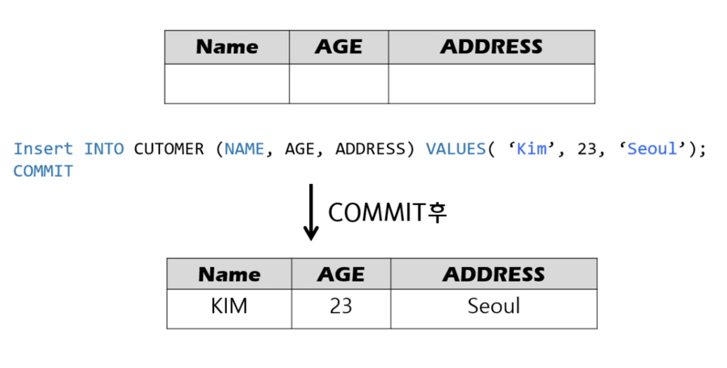
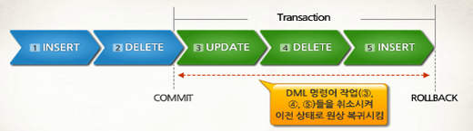
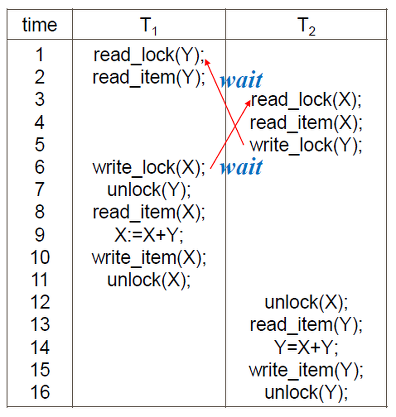
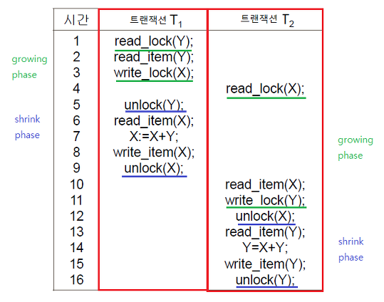
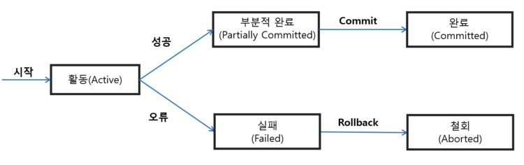

# DB 트랜잭션

## Transaction 

> 데이터베이스의 상태를 변환시키는 **하나의 논리적 기능**을 수행하기 위한 작업의 단위 
또는 한꺼번에 모두 수행되어야 할 일련의 연산들을 의미한다.

 예를 들어, A가 B에게 1,000원을 주고 B가 그 돈을 받을 경우 이 거래 기록은
 더 이상 작게 쪼갤 수가 없는 하나의 트랜잭션을 구성한다. 
 만약 A는 돈을 지불했으나 B는 돈을 받지 못했다면 그 거래는 성립되지 않는다. 이처럼
 A가 돈을 지불하는 행위와 B가 돈을 받는 행위는 별개로 분리될 수 없으며 하나의 
 거래내역으로 처리되어야 하는 단일 거래이다. 이런 거래의 최소 단위를 **트랜잭션**이라고 한다.
  
 트랜잭션 처리가 정상적으로 완료된 경우 **커밋(commit)** 을 하고,
 오류가 발생할 경우 원래 상태대로 **롤백(rollback)** 을 한다.

 

#### 커밋 commit

- 아직 저장되지 않은 데이터를 DB에 저장하고 트랜잭션을 종료시키는 것으로 트랜잭션을 제어하는 명령어 중 하나이다.
- 즉 DB 또는 프로그램 소스의 변경 내용을 확정하는 것을 말하며, 트랜잭션에서 모든 처리가 완료된 경우
커밋 명령어를 통해 변화를 확정하고 다른 사용자에게 보이도록 할 수 있다.

 

#### 롤백 rollback

- DB에서 업데이트에 오류가 발생할 때 이전 상태로 되돌리는 것을 말한다.
- DB는 업데이트 이전 **저널 파일**을 사용하여 원래의 정상적인 상태로 되돌린다.
오류 동작 이후에도 깨끗한 사본으로 복원시킬 수 있기 때문에 무결성을 위해 중요하다.
- 충돌이 일어날 때 특정 트랜잭션을 롤백시킴으로써 DB는 일관적인 상태로 되돌려진다.
- 저널 파일 : 파일 시스템에 변경사항을 반영(커밋)하기 전에 생성되는 변경사항을 추적하는
파일 시스템이다.

- SQL에서 롤백은 마지막 커밋을 완료한 시점으로 다시 돌아간다. 중요한 건
커밋하여 저장한 것만 복구한다.

 
 

## Transaction 조건

> 트랜잭션이 안전하게 수행되기 위해서는 *ACID* 라는 4가지의 필수적인 성질을 가져야 한다.

### 1. Atomicity 원자성

> 트랜잭션이 DB에 모두 반영되던지, 아니면 전혀 반영되지 않아야 하며 작업이 
부분적으로 실행되거나 중단되지 않는 것을 보장하는 것으로 즉, ``All or Nothing``의 개념으로서
작업 단위를 일부분만 실행하지 않는다는 것을 의미한다.

트랜잭션 실행 도중 문제가 발생했을 경우 중단된 상태가 아닌 **모두 실패하거나, 모두 완성되거나**
둘 중 하나의 상태가 되어야 한다. 100개 명령어로 구성된 트랜잭션 중 99개 완료 1개 실패가 된다면,
이는 무조건 실패로 간주하여 트랜잭션 시작 전 상태로 돌려야 한다.

- **원자성 보장** : 트랜잭션에서 원자성은 수행하고 있는 트랜잭션에 의해 변경된 내역을 유지하면서,
이전에 커밋된 상태를 임시 영역에 따로 저장함으로써 보장한다. 즉, 현재 수행하고 있는
트랜잭션에서 오류가 발생하면 현재 내역을 날려버리고 임시 영역에 저장했던 상태로 롤백한다.

### 2. Consistency 일관성

> 트랜잭션이 완료된 결과값이 일관적인 DB 상태를 유지하는 것을 말한다. 
> 시스템이 가지고 있는 고정요소는 수행 전과 후의 상태가 같아야 하며 트랜잭션의 작업 처리 결과가
> 항상 일관성이 있어야 한다는 것으로 트랜잭션이 진행되는 동안 DB가 변경되더라도 업데이트된 DB로 트랜잭션이 
> 진행되는 것이 아니라 처음 트랜잭션을 진행하기 위해 참조한 DB로 진행된다.

트랜잭션 수행 전후의 DB 상태는 각각 일관성이 보장되는 **서로 다른 상태**가 된다.
트랜잭션 수행이 보존해야 할 일관성은 기본 키, 외래 키 제약과 같은 명시적인 무결성 제약 조건들을 포함해
A에서 B로 돈을 이체할 때 A와 B 계좌의 돈의 총합이 같아야 한다는 사항과 같은 비명시적인 일관성 조건들도 있다.

- **일관성 보장** : 트랜잭션에서 일관성은 수행 전후에 데이터 모델의 모든 제약 조건(기본 키, 외래 키, 도메인 제약 조건 등)을
만족하는 것을 통해 보장한다. 예를 들어 A와 B 테이블이 있을 때 B테이블의 기본 키인 A_id가
외래 키로 존재한다. 만약 A_id의 제약 조건이 A테이블에서 변경되면, B테이블에서도 A_id가 변경되어야 한다.
한 쪽의 테이블에서만 데이터 변경사항이 이루어져서는 안 된다는 것이다.
이 때 어떤 이벤트와 조건이 발생했을 때, 트리거(Trigger)를 통해 보장하는 것이다.
트리거는 '방아쇠'라는 뜻으로 DB 시스템이 어떤 행위의 시작을 알리는 것으로
자동적으로 수행할 동작을 명시할 때 사용된다.

### 3. Isolation 고립성

> 하나의 트랜잭션 수행 시 다른 트랜잭션의 작업이 끼어들지 못하도록 보장하는 것이다.
> 트랜잭션 끼리는 서로 간섭할 수 없으며, 트랜잭션이 실행하는 도중에 변경한 데이터는 이 트랜잭션이 완료될 때까지
> 다른 트랜잭션이 참조하지 못하게 하는 특성이다.

DB는 클라이언트들이 같은 데이터를 공유하는 것이 목적이므로 여러 트랜잭션이 동시에 수행되어야 한다.
이때 트랜잭션은 상호 간의 존재를 모르고 독립적으로 수행되어야 한다. 
이를 유지하기 위해서는 여러 트랜잭션이 동시에 접근하는 데이터에 대한 제어가 필요하다. 여러 트랜잭션이 동시에
수행되더라도 각각의 트랜잭션은 다른 트랜잭션의 수행에 영향을 받지 않고 독립적으로 수행되어야 한다. 
한 트랜잭션에서 DB를 변경한 내용은 트랜잭션이 커밋되기 전까지는 다른 어떤 질의나 트랜잭션과도 고립되어야만 한다.
즉, 각 트랜잭션은 시스템 내에서 동시에 수행되고 있는 다른 트랜잭션들을 알지 못하는 것이다.

- **고립성 보장** : **병행처리**과정에서 트랜잭션의 고립성이 보장되어야 하는 이유를 알 수 있다.
    > **병행 처리(concurrent processing)** : CPU가 여러 프로세스를 처리하는 것처럼
  > 트랜잭션에 정해진 시간을 할당해서 작업을 하다가 부여된 시간이 끝나면 다른 트랜잭션을 실행하는
  > 이런 방식으로 트랜잭션들을 조금씩 처리하는 것을 말한다. 하지만 이렇게 되면 많은 트랜잭션들이
  > 조금씩 처리되는 과정에서 공통된 데이터를 조작하게 되는데 이 경우 데이터가 혼란스러워질 수 있다.

    OS의 세마포어(semaphore)와 비슷한 개념으로 **lock&execute unlock**을 통해 고립성을 보장할 수 있다.
    즉 데이터를 읽거나 쓸 때는 문을 잠궈서 다른 트랜잭션이 접근하지 못하도록 하여 고립성을 보장하고,
    수행을 마치면 unlock을 통해 데이터를 다른 트랜잭션이 접근할 수 있도록 허용하는 방식이다.
    트랜잭션에서는 데이터를 읽을 때, 여러 트랜잭션이 읽을 수는 있도록 허용하는 **공유 록(shared_lock)** 을 한다.
    공유 록은 데이터 쓰기를 허용하지 않고 오직 읽기만 허용하는 것이다. 또한 데이터를 쓸 때는
    다른 트랜잭션이 읽을 수도 쓸 수도 없도록 하는 **베타 록(exclusive_lock)** 을 사용한다. 그리고 읽기, 쓰기 작업이 끝나면
    unlock을 통해 다른 트랜잭션이 lock할 수 있도록 데이터에 대한 잠금을 풀어준다.
    주의할 점은 lock과 unlock을 잘못 사용하면 모든 트랜잭션이 아무것도 수행할 수 없는 상태가 되는 **데드락(deadlock)** 상태에 
    빠질 수 있다.

- **2PL 프로토콜(2 Phase Locking protocol)**

    - 당연히 데드락에 걸리면 안 되므로 어떤 규칙에 의해서 고립성이 보장되어야 한다는
    2PL 프로토콜이 생겨났다. **여러 트랜잭션이 공유하고 있는 데이터에 동시에 접근할 수 없도록
    하기 위한 목적을 가진 프로토콜**이다. 이름 그대로 2가지 단계의 locking이 존재하는데 ``growing phase``와 ``shrink phase``가 있다.
    상승 단계란 read_lock, write_lock을 의미하고 하강 단계란 unlock을 의미한다. 
    2PL 프로토콜은 상승 단계와 하강 단계가 섞이면 안 된다는 것을 의미한다. 즉, lock과 unlock이
    번갈아 수행되지 않고 lock이 쭉 수행된 후에 unlock이 쭉 수행되어야 한다는 것이 2PL 프로토콜이다.

**성능을 위해 병행처리를 해야 하는데, 트랜잭션의 고립성을 보장하기 위해서는 2PL 프로토콜을 사용해야 한다.**(Serializable Schedule)

### Durability 지속성

> 트랜잭션이 정상적으로 종료된 다음에는 영구적으로 DB에 작업의 결과가 저장되어야 한다.
> 트랜잭션의 성공 결과 값은 장애 발생 후에도 변함없이 보관되어야 한다는 것으로 트랜잭션이 정상적으로
> 완료된 경우에는 버퍼의 내용을 하드디스크(DB)에 확실히 기록해야 하며, 부분 완료된 경우에는 작업을 취소(Aborted)해야 한다.

 

## Transaction 상태

- **활동(Active)** : 트랜잭션이 실행 중인 상태
- **실패(Failed)** : 트랜잭션 실행에 오류가 발생하여 중단된 상태
- **철회(Aborted)** : 트랜잭션이 비정상적으로 종료되어 롤백 연산을 수행한 상태
- **부분 완료(Partially Committed)** : 트랜잭션의 마지막 연산까지 실행했지만, 커밋 연산이 실행되기 직전의 상태
- **완료(Committed)** : 트랜잭션이 성공적으로 종료되어 커밋 연산을 실행한 후의 상태