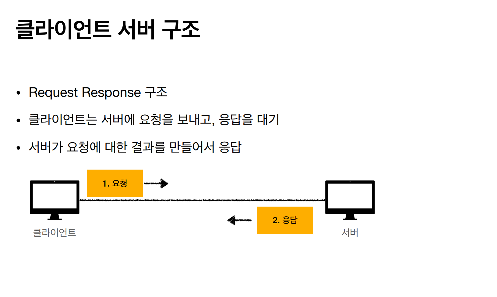
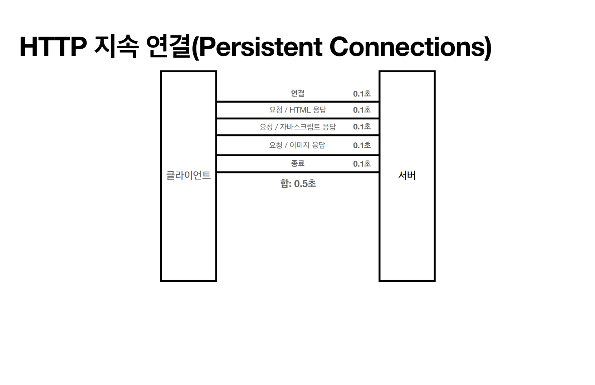
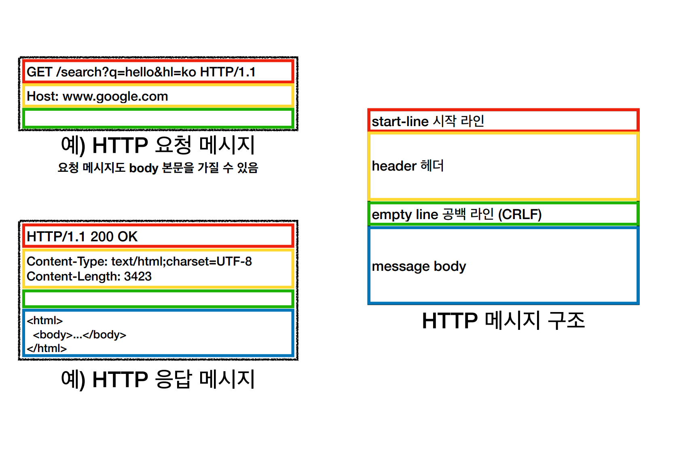
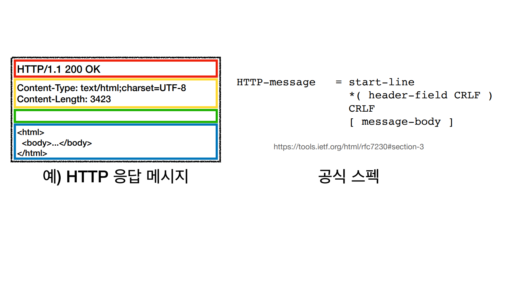

# HTTP 
> **H**yper**T**ext **T**ransfer **P**rotocol 
> 현대 시대에는 HTML, TEXT, IMAGE, 영상, 파일, JSON, API 등 거의 모든 형태의 데이터를 주고 받을 때 대부분 HTTP를 사용한다.

- TCP : HTTP/1.1, HTTP/2
- UDP : HTTP/3

# HTTP 특징
- 클라이언트 서버 구조
- 무상태 프로토콜(Stateless), 비연결성
- HTTP 메시지
- 단순함, 확장 가능

 

## 클라이언트 서버 구조
> 클라이언트는 UI, UX에 집중하고 서버에서는 데이터와 중요한 비즈니스 로직에 집중하여 분리를 철저히 하여 독립적으로 만든다.
> 이렇게 하면 각각 독립적으로 진화가 가능하다.

 

## 무상태 프로토콜
>  서버가 클라이언트의 상태를 보존하지 않는다.(Stateless)

상태를 유지하면 항상 같은 서버가 유지되어야 하므로 그 서버에 장애가 일어나면 통신을 할 수 없게 된다.

하지만 상태를 유지하지 않으면 장애가 일어난 서버 대신 정상적인 서버에서 응답을 줄 수 있기 때문에 언제나 정상 응답을 받을 수 있게 된다.

이러한 무상태 특징은 스케일 아웃(수평 확장)에 매우 유리하다.

하지만 모든 것을 무상태로 하기는 어렵고, 예를 들어 로그인 같은 경우는 브라우저 쿠키와 서버 세션 등을 사용해서 로그인한 사용자의 경우 로그인 했다는 상태를 서버에 유지해야 한다.

이렇게 불가피한 상태 유지는 최소한만 사용해야 한다.

 

## 비연결성
> 클라이언트와 서버는 필요한 데이터만 주고 받고 연결을 끊는다.

서버는 연결을 유지하지 않으므로 최소한의 자원만 사용할 수 있는 장점이 있지만 몇 가지 한계가 있다.

- 요청이 올 때마다 TCP/IP 연결을 새로 맺어야 하므로 3 way handshake 시간이 추가된다.
- 사이트를 요청하면 HTML, CSS, JS 등 많은 자원이 반복적으로 다운로드 된다.

HTTP는 지속 연결(Persistence Connections)로 문제를 해결 했다. 바로 연결을 끊는 게 아닌 약 10초 정도는 연결을 유지하여 HTML, CSS 등 
리소스들을 보내고 받을 수 있게 된다.

 

## HTTP 메시지
> HTTP 요청 메시지와 HTTP 응답 메시지

공백은 무조건 있어야 한다.

요청 메시지 start-line은 3가지로 구분할 수 있다.
- method SP(공백) request-target SP HTTP-version CRLF(엔터)
  - HTTP 메서드(GET) - 서버가 수행해야 할 동작을 지정해준다.(GET, POST 등)
  - 요청 대상(/search?q=hello&hl=ko) - absolute-path[?query] 형태로 absolute-path는 "/"로 시작하는 경로이다.
  - HTTP version(HTTP/1.1)

응답 메시지 start-line은 3가지로 구분할 수 있다.
- HTTP-version SP status-code SP reason-phrase CRLF
  - HTTP 버전
  - HTTP 상태 코드 - 2xx(성공), 4xx(클라이언트 요청 오류), 5xx(서버 내부 오류)
  - 이유 문구 : 사람이 이해할 수 있는 짧은 상태 코드 설명 글

요청/응답 header의 구조는 똑같다.
- field-name ":" OWS field-value OWS (OWS : 띄어쓰기 허용)

이 header의 용도는 메시지 바디의 내용, 크기, 요청 클라이언트 정보, 캐시 관리 정보 등등 HTTP 전송에 필요한 모든 부가정보를 포함해준다. 
필요시 임의의 헤더 추가도 가능하다.

메시지 바디에는 HTML 문서, 이미지, 영상, JSON 등 byte로 표현할 수 있는 모든 전송할 데이터가 담겨 있다.

