# HTTP 일반 헤더

 

## 표현
- **Content-Type** : 표현 데이터의 형식
  - 미디어 타입, 문자 인코딩
  - text/html; charset=uft-8
  - application/json
  - image/png
- **Content-Encoding** : 표현 데이터의 압축 방식
  - 데이터를 전달하는 곳에서 압축 후 인코딩 헤더 추가
  - 데이터를 읽는 쪽에서 인코딩 헤더의 정보로 압축 해제
  - gzip, deflate, identity
- **Content-Language** : 표현 데이터의 자연 언어
  - ko(한), en(영), en-US
- **Content-Length** : 표현 데이터의 길이
  - 바이트 단위
  - Transfer-Encoding(전송 코딩)을 사용하면 Content-Length를 사용하면 안 된다.

 

## 협상(콘텐츠 네고시에이션)
> 클라이언트가 선호하는 표현 요청, **협상 헤더는 요청시에만 사용한다.**
- Accept : 클라이언트가 선호하는 미디어 타입 전달
- Accept-Charset : 클라이언트가 선호하는 문자 인코딩
- Accept-Encoding : 클라이언트가 선호하는 압축 인코딩
- Accept-Language : 클라이언트가 선호하는 자연 언어

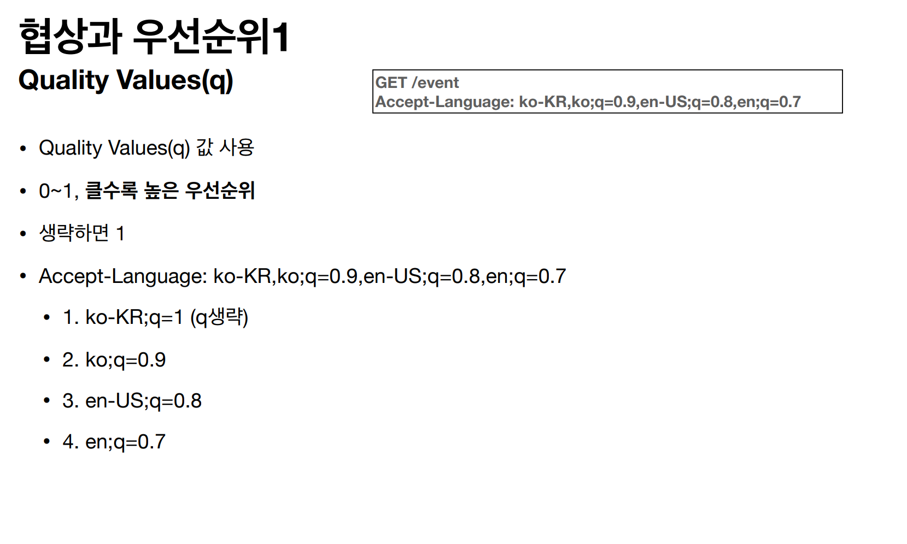

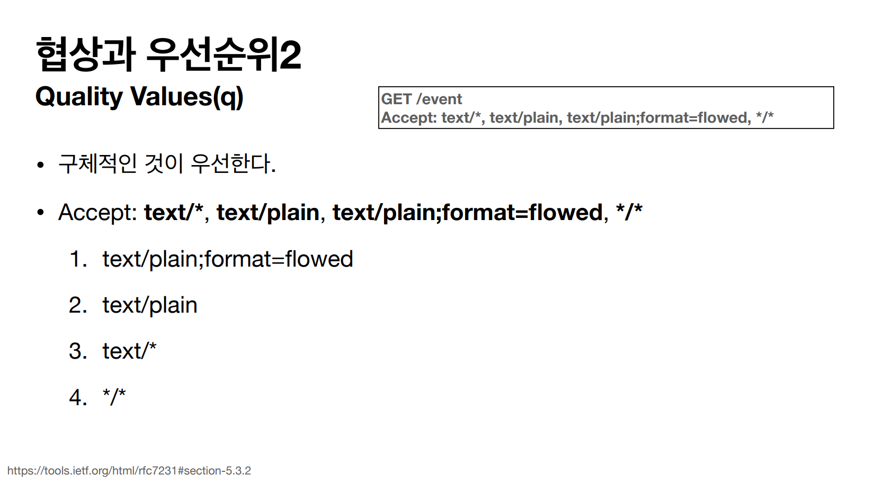

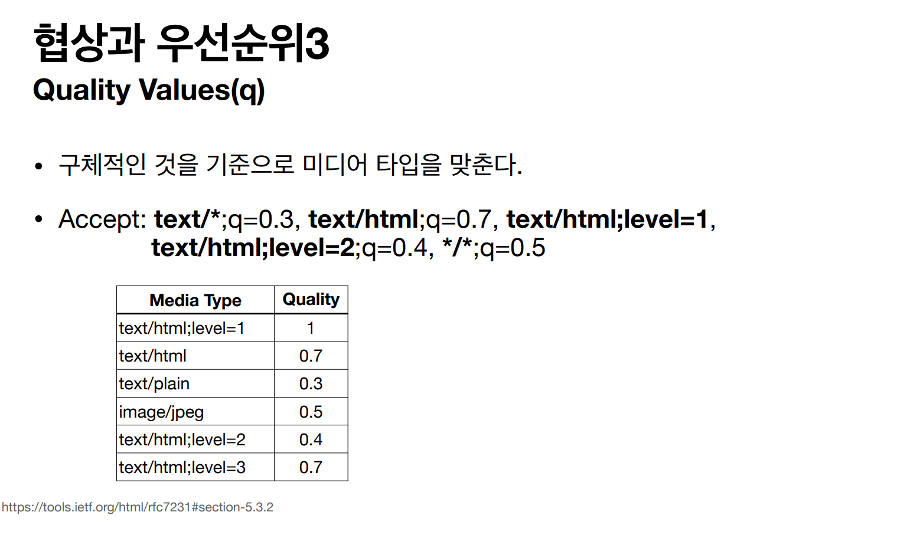

 

## 전송 방식
- 단순 전송
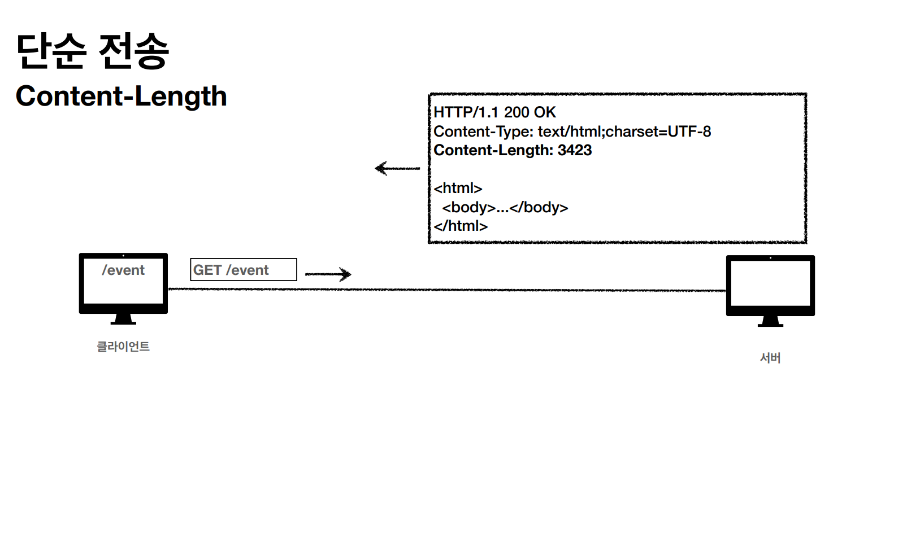
- 압축 전송
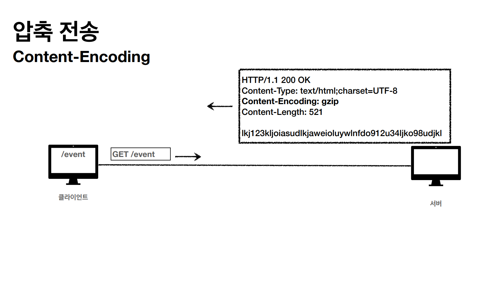
- 분할 전송(chunked : 덩어리 진)
  - Content-Length를 보내면 안된다.
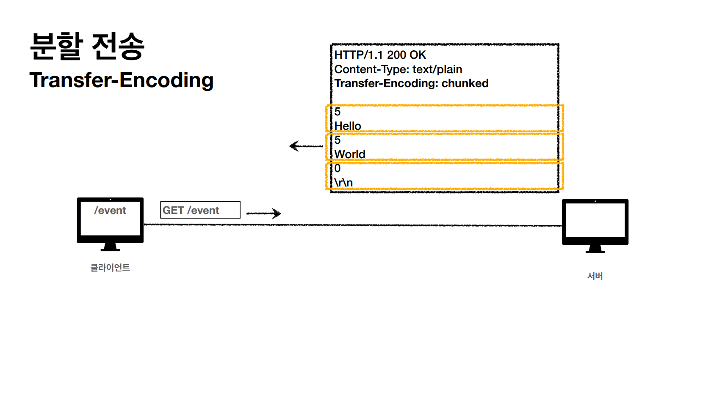
- 범위 전송
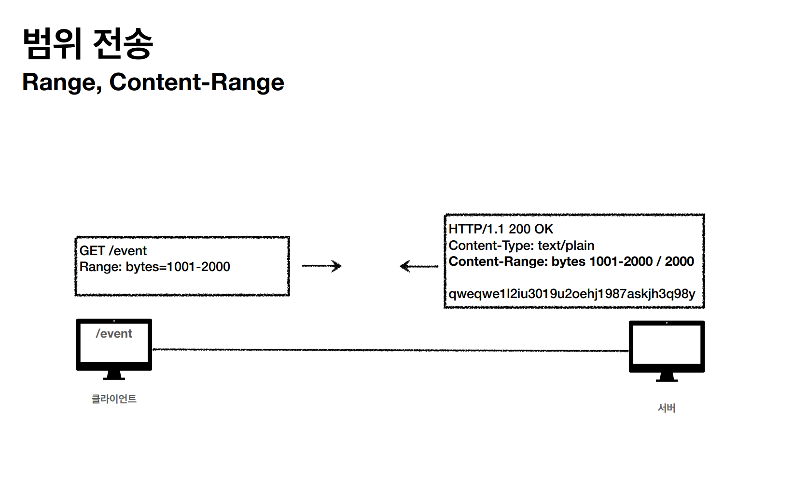

 

## 일반 정보
- From : 유저 에이전트의 이메일 정보
- Referer : 이전 웹 페이지 주소
  - A -> B로 이동하는 경우 B를 요청할 때 Referer : A를 포함해서 요청한다.
  - Referer를 사용해서 유입 경로 분석이 가능하다.
- User-Agent : 유저 애이전트 애플리케이션 정보
  - Mozilla/5.0 (Windows NT 10.0; Win64; x64) AppleWebKit/537.36 (KHTML, like Gecko) Chrome/120.0.0.0 Safari/537.36
  - 어떤 종류의 브라우저에서 장애가 발생하는지 파악 가능하다.(통계 정보)
- Server : 요청을 처리하는 ORIGIN 서버의 소프트웨어 정보(응답에서 사용)
- Date : 메시지가 발생한 날짜와 시간(응답에서 사용)

 

## 특별한 정보
- **Host** : 요청한 호스트 정보(도메인)
  - 요청에서 사용(**필수!**)
  - 하나의 IP 주소에 여러 도메인이 적용되어 있을 때 
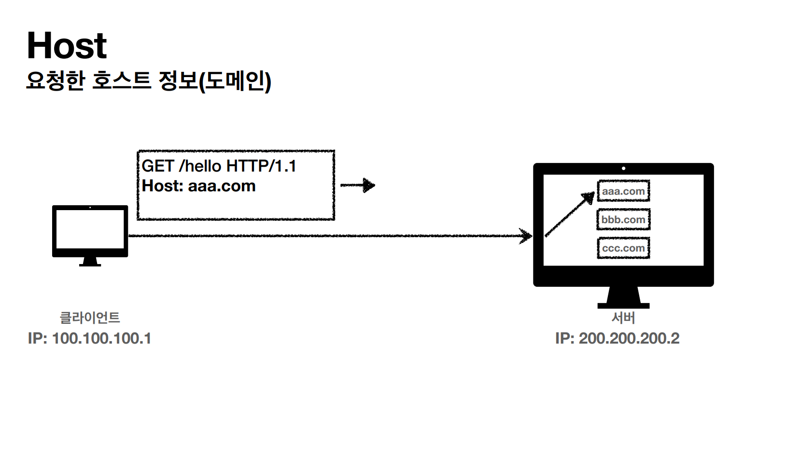

- Location : 페이지 리다이렉션
  - 3xx 응답 결과에 Location 헤더가 있으면 Location 위치로 자동 리다이렉트 된다.
- Allow : 허용 가능한 HTTP 메서드
  - 405(Method Not Allowed) 에서 응답에 포함해야 한다.
- Retry-After : 유저 에이전트가 다음 요청을 하기까지 기다려야 하는 시간
  - 503(Service Unavaliable) : 서비스가 언제까지 불능인지 알려줄 수 있다.
  - Retry-After: Fri, 31 Dec 1999 23:59:59 GMT (날짜 표기)
  - Retry-After: 120 (초단위 표기)

 

## 인증
- Authorization : 클라이언트 인증 정보를 서버에 전달한다.
- WWW-Authentication : 리소스 접근 시 필요한 인증 방법 정의
  - 401 Unauthorized 응답과 함께 사용한다.

 

## 쿠키
- Set-Cookie : 서버에서 클라이언트로 쿠키 전달(응답)
- Cookie : 클라이언트가 서버에서 받은 쿠키를 저장하고, HTTP 요청 시 서버로 전달

HTTP는 무상태(Stateless) 프로토콜이기 때문에 클라이언트와 서버는 서로 상태를 유지하지 않는다.

대안으로 모든 요청에 정보를 포함해서 요청을 하는 방법이 있는데 문제는 개발하기가 힘들어진다.

그래서 **쿠키**라는 것이 생겼다.

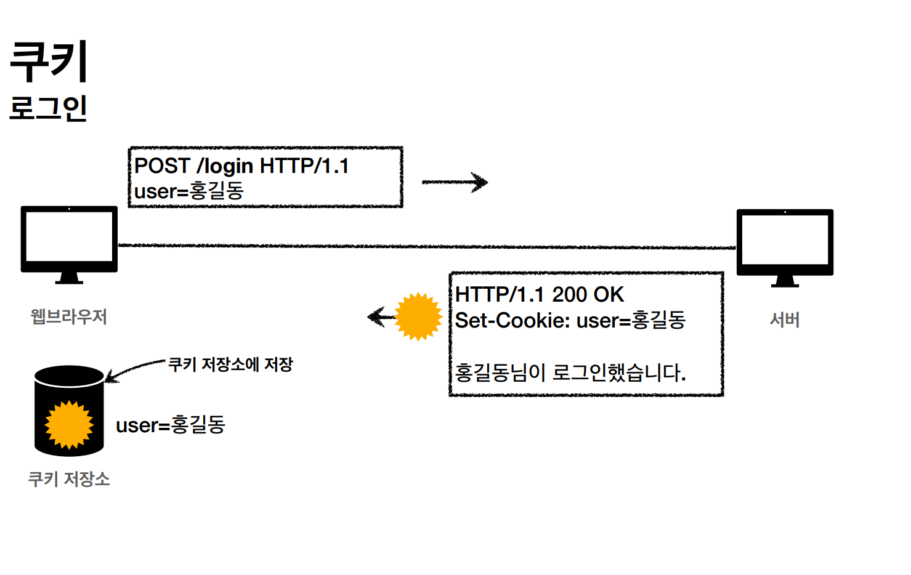

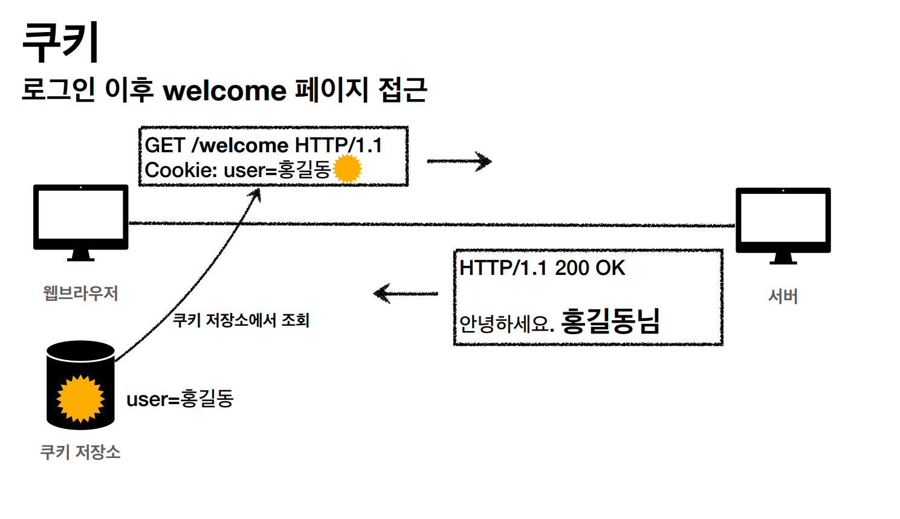

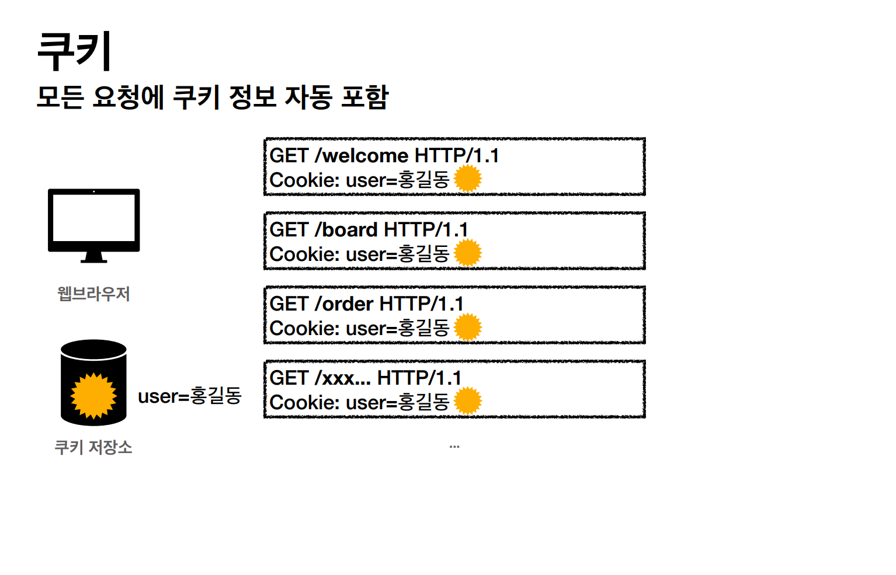

쿠키는 주로 사용자 로그인 세션 관리, 광고 정보 트래킹 등에 사용된다.

쿠키 정보는 항상 서버에 전송되기 때문에 네트워크 트래픽이 추가로 유발될 수 있다. 그래서 최소한의 정보만 사용해야 한다.(세션 id, 인증 토큰 등) 
서버에 전송하지 않고, 웹 브라우저 내부에 데이터를 저장하고 싶으면 웹 스토리지(localStorage, sessionStorage)에 저장한다.

**주민번호, 신용카드 번호 등 보안에 민감한 데이터는 절대 저장하면 안 된다**

### 쿠키 생명주기
- Set-Cookie : **expires**={만료일}
  - 만료일이 되면 쿠키가 삭제된다.
- Set-Cookie : **max-age**=3600 (3600초)
  - 0이나 음수를 지정하면 쿠키가 삭제된다.
- 세션 쿠키 : 만료 날짜를 생략하면 브라우저 종료시 까지만 유지
- 영속 쿠키 : 만료 날짜를 입력하면 해당 날짜까지 유지

### 쿠키 도메인
예를 들어 domain=example.org라고 도메인을 명시해주면 명새한 문서 기준 도메인 + 서브 도메인 포함 전송이 가능하다.

example.org는 물론, dev.example.org도 쿠키 접근이 가능하다.

도메인을 생략한다면 현재 문서 기준 도메인만 적용된다.

example.org에서 쿠키를 생성하고 도메인 지정을 생략하면 example.org 에서만 쿠키 접근이 가능하다.

### 쿠키 경로
이 경로를 포함한 하위 경로 페이지만 쿠키 접근이 가능하다.

일반적으로 path=/ 루트로 지정

### 쿠키 보안
- Secure
  - 쿠키는 원래 http, https를 구분하지 않고 전송한다.
  - Secure를 적용하면 https인 경우에만 전송한다.
- HttpOnly
  - XSS 공격 방지
  - 자바스크립트에서 접근 불가
  - HTTP 전송에만 사용
- SameSite
  - XSRF 공격 방지
  - 요청 도메인과 쿠키에 설정된 도메인이 같은 경우만 쿠키 전송
