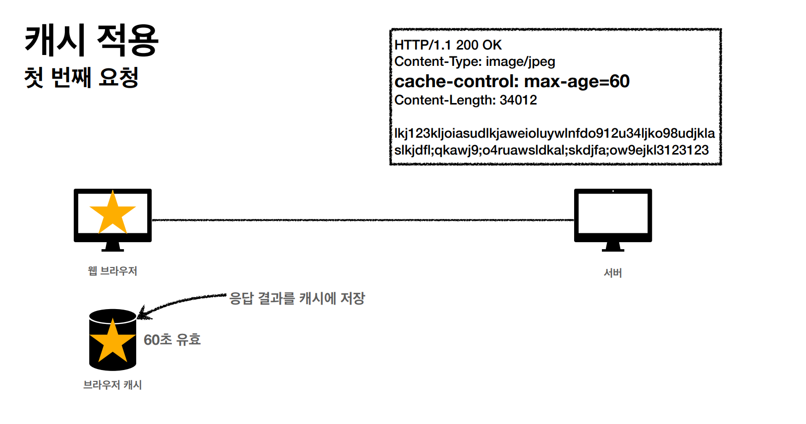
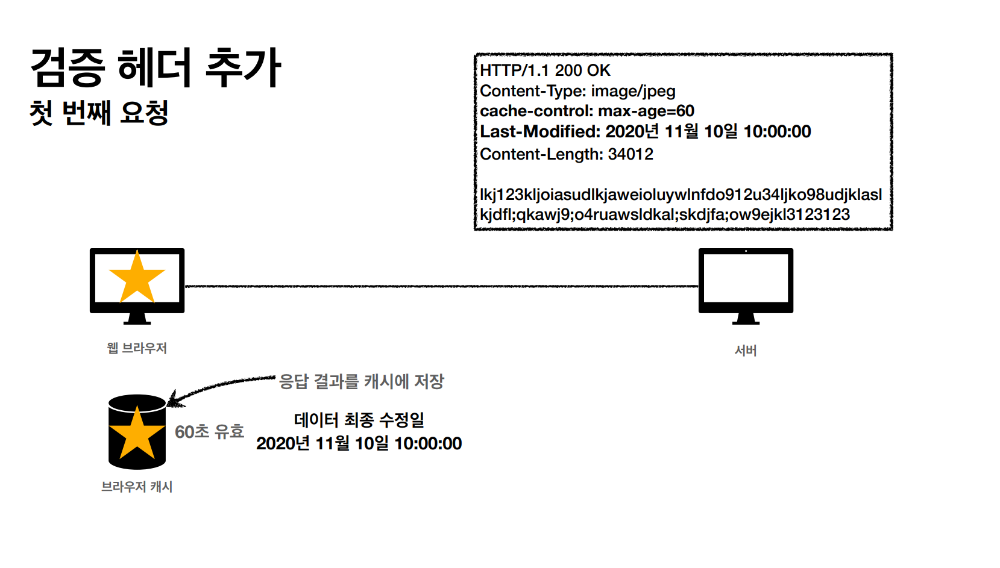
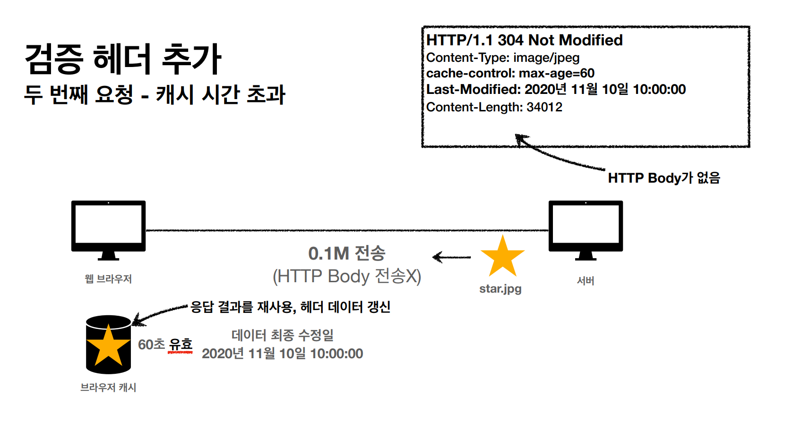
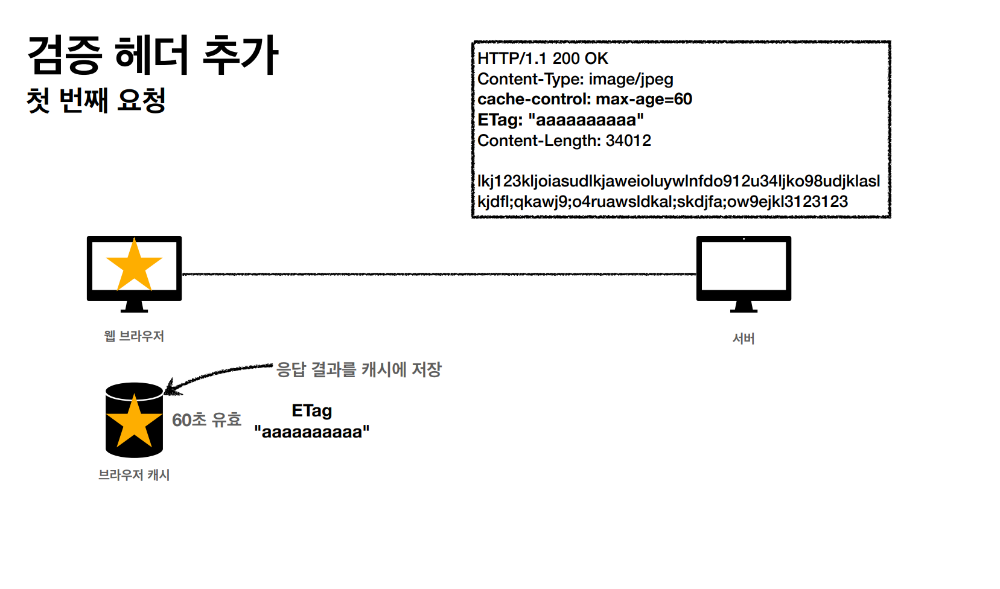
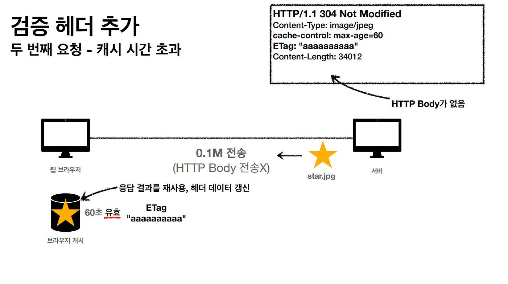
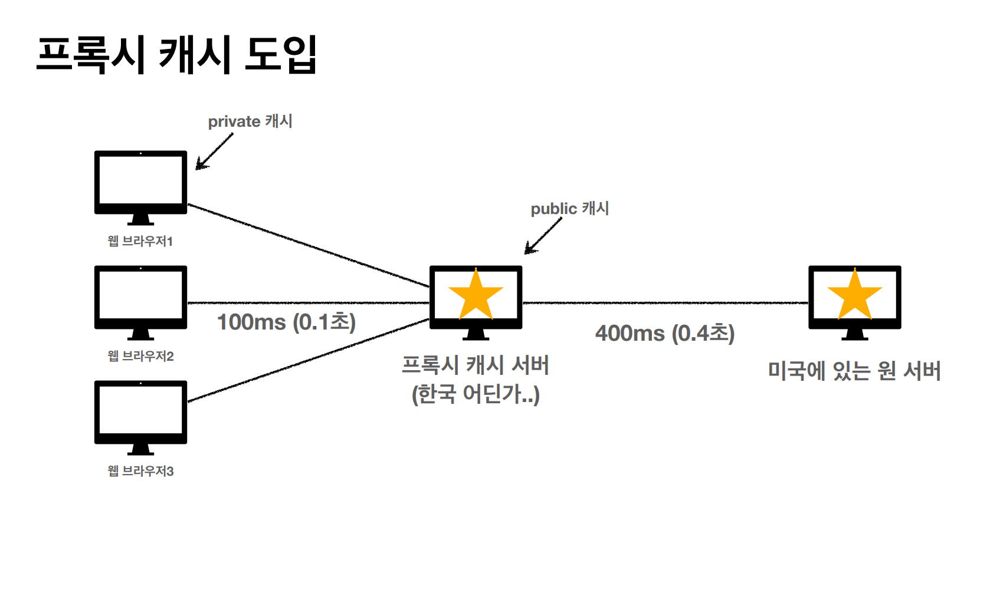
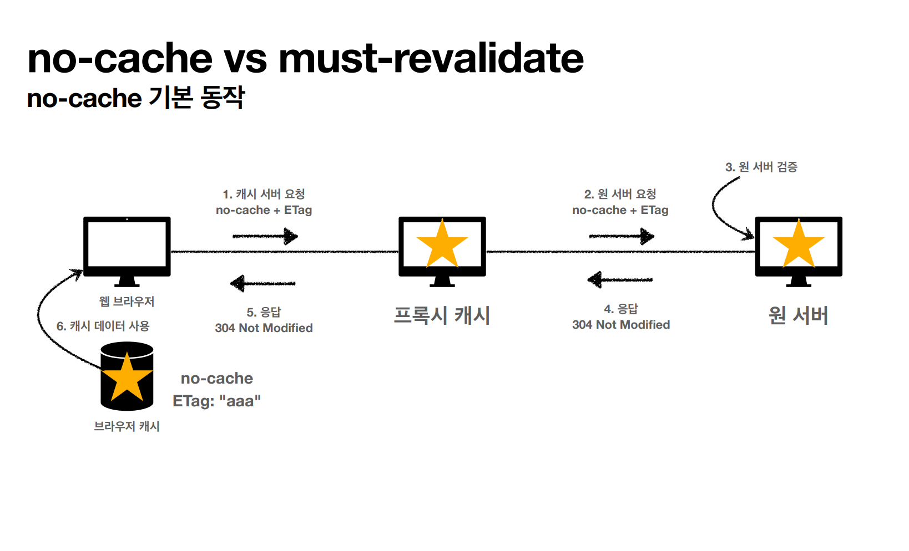
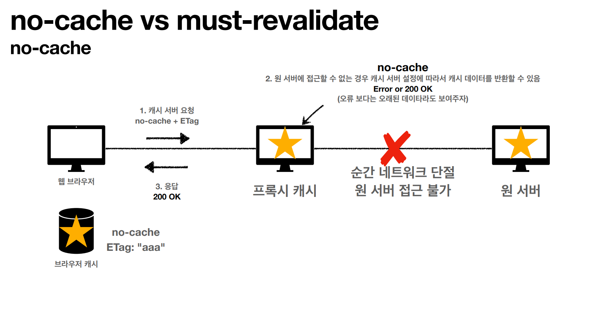
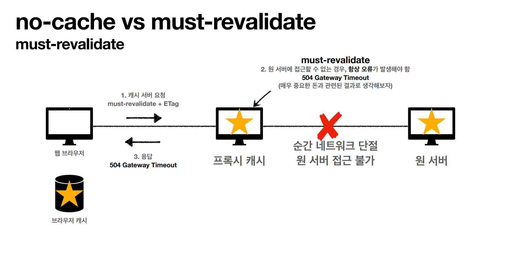

# HTTP 헤더 - Cache

**캐시**라는 것이 없다면 똑같은 데이터를 계속 네트워크를 통해서 다운로드를 받아야 하는데 이렇게 되면 브라우저 로딩 속도가 매우 느려져
안 좋은 UX를 경험하게 된다.

캐시를 적용하면 처음 요청 한 것만으로 캐시 정보를 사용해서 조회할 수 있기 때문에 빠른 브라우저 로딩 속도를 느낄 수 있게 된다.

그런데 설정해둔 캐시의 시간이 초과되면 다시 요청을 해야 한다. 그리고 서버는 다시 캐시 정보 설정을 하고 응답을 주고 캐시를 갱신해야 한다. 
이 때 다시 네트워크 다운로드가 발생하게 된다.

캐시 유효 시간이 초과해서 서버에 다시 요청하면 두 가지 상황이 있을 것이다.
1. 서버에서 기존 데이터가 변경됨.
2. 서버에서 기존 데이터가 변경되지 않음.

캐시 만료 후에도 2번과 같은 상황이라면 캐시 저장소에 있던 캐시를 재사용해도 문제가 없다. 이렇게 하려면 클라이언트의 데이터와 서버의 데이터가 같다는
사실을 확인할 수 있는 방법이 필요한데 **검증 헤더**가 이 때 사용된다.

 

## 검증 헤더
> 캐시 데이터와 서버 데이터가 같은지 검증하는 데이터
- Last-Modified
- ETag

### Last-Modified

서버에서 처음 응답을 할 때 캐시 정보와 함께 'Last-Modified'라는 헤더랑 같이 응답해 준다. 이 헤더에는 마지막으로 수정된 날짜가 들어있다. 

이후 캐시가 만료되어 재요청을 하면 'if-modified-since'라는 요청헤더에 마지막 수정일을 포함해서 요청을 하면 서버에서는 요청헤더에 있는 날짜를 보고 판단해서

이후 수정이 되지 않은 것이라면 304 Not Modified 상태코드와 함께 **HTTP Body 없이** 응답을 한다.

이러한 구조는 네트워크 다운로드는 발생하지만 훨씬 용량이 적은 헤더 정보만 다운로드 하고 클라이언트는 캐시에 저장되어 있는 데이터를 재활용 할 수 있다.

단점은 
- 1초 미만 단위로는 캐시 조정이 불가능하다.
- 날짜 기반의 로직을 사용해야 한다.
  - 데이터를 수정해서 날짜는 다르지만, 결국 같은 데이터를 수정해서 데이터 결과가 똑같은 경우 재요청시 다운로드가 일어나게 된다.
- 스페이스나 주석처럼 크게 영향이 없는 변경도 변경으로 인식하게 된다.

### ETag(Entity Tag)
> 캐시용 데이터에 임의의 고유한 버전 이름을 달아둔다.(예 - ETag: "v1.0)

데이터가 변경되면 이 이름을 바꿔서 변경한다.(Hash를 다시 생성)

단순하게 ETag만 보내서 같으면 유지하고 다르면 다시 받게 한다.

ETag를 포함해서 응답을 주고 클라이언트가 캐시 만료 후 요청을 할 때 'if-None-Match' 요청 헤더와 함께 요청을 하면 서버에서 ETag 정보로 데이터 변경 판단 후
응답을 해주게 된다.

이후 브라우저 캐시에서 내부적으로 캐시를 갱신하고 데이터를 재활용하게 된다.

**검증 헤더와 조건부 요청 헤더**
- 검증 헤더(Validator)
  - ETag
  - Last-Modified
- 조건부 요청 헤더
  - If-Match, If-None-Match : ETag 값 사용
  - If-Modified-Since, If-Unmodified-Since : Last-Modified 값 사용

 

## 캐시 제어 헤더
- Cache-Control : 캐시 제어
  - max-age : 캐시 유효 기간, 초 단위
  - no-cache : 데이터는 캐시해도 되지만, 항상 origin 서버에 검증하고 사용해야 한다.(프록시 서버와 원(origin)서버가 있다.)
  - no-store : 데이터에 민감한 정보가 있으므로 저장하면 안된다.(메모리에서 사용하고 최대한 빨리 삭제한다.)
- Pragma : 캐시 제어(하위 호환)
  - no-cache
- Expires : 캐시 유효 기간(하위 호환)
  - 캐시 만료일을 정확한 날짜로 지정
  - 더 유연한 Cache-Control: max-age를 권장한다.
  - Cache-Control: max-age와 함께 사용하면 expires는 무시된다.

 

## 프록시 캐시
> 원 서버에 직접 접근하는 것이 아닌 프록시 캐시 서버를 통해 데이터를 받는다.

- Cache-Control
  - public : 응답이 public 캬시에 저장되어도 된다.
  - private : 응답이 해당 사용자만을 위한 것이다. private 캐시에 저장해야 한다.(기본값)
  - s-maxage : 프록시 캐시에만 적용되는 max-age

 

## 캐시 무효화

Cache-Control에는 확실한 캐시 무효화 응답이 있다. - no-cache, no-store, must-revalidate

- no-cache : 위에 설명 있음
- no-store : 위에 설명 있음
- must-revalidate : 캐시 만료 후 최초 조회시 원 서버에 검증해야 한다.
  - 원 서버 접근 실패시 반드시 오류가 발생해야 한다. - 504 Gateway Timeout

no-cache는 항상 원 서버를 통해 검증해야 하기 때문에 프록시 캐시 서버는 건너뛰게 된다. 그런데 만약 알 수 없는 오류로 원 서버에 접근할 수 없게 되면
프록시 캐시 서버에서는 오류를 응답하기 보다는 예전 데이터라도 응답하는 방식이다.

하지만 must-revalidate일 때 같은 상황이라면 무조건 504 에러를 응답을 한다.

