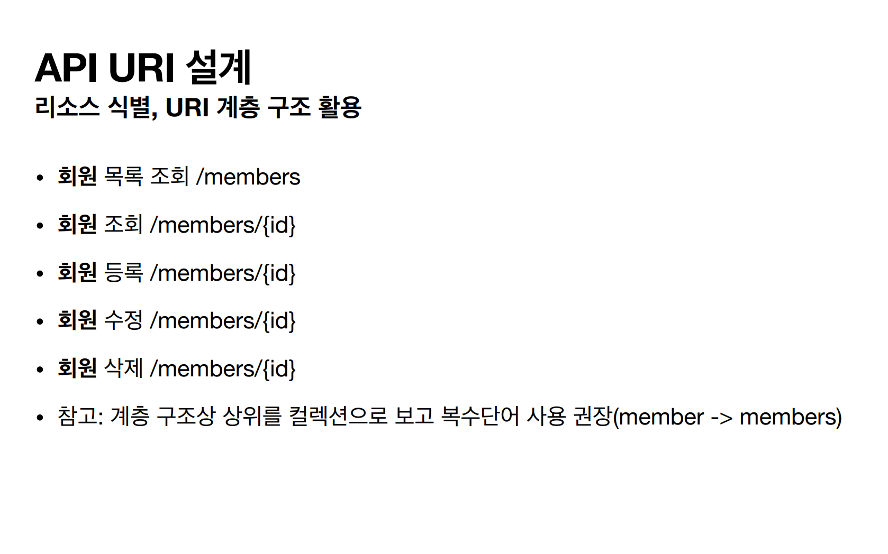
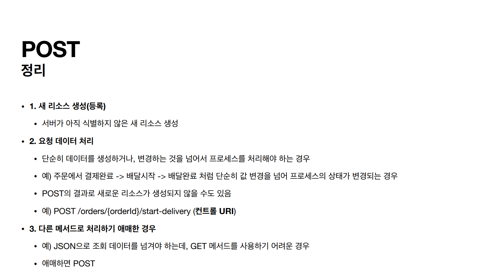
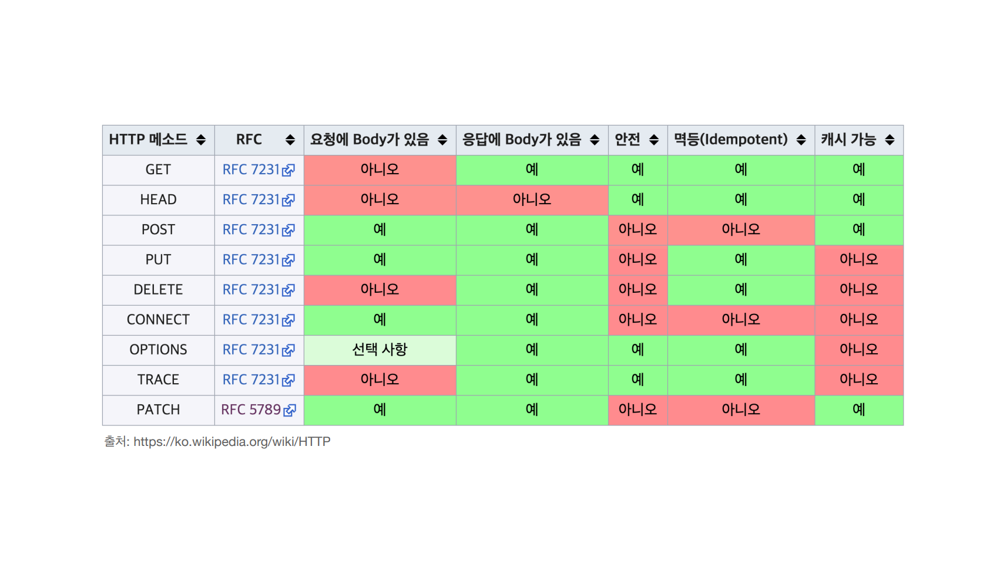
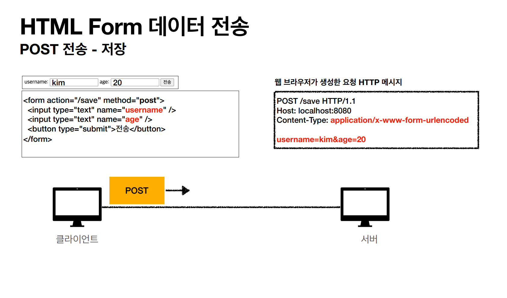
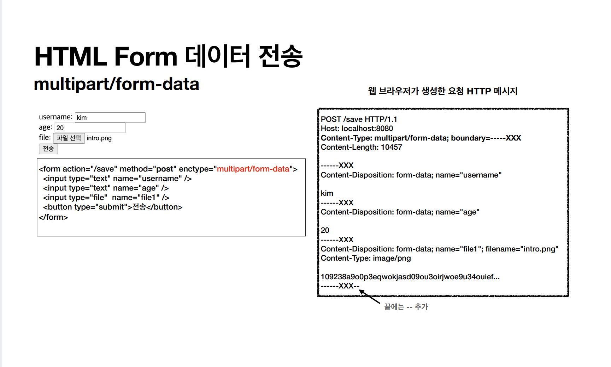

# HTTP Method

API URI를 설계할 때는 항상 **리소스 식별**이 가장 중요하다.

예를 들어 회원을 CRUD하는 API URI를 설계하면 바로 ``회원``이라는 리소스를 식별해야 한다.

이런 식으로 해서 리소스(명사)는 확실히 구분됐다. 하지만 어떤 URI가 CRUD의 각 작업을 하는지 구분이 안 된다.

이럴 때 HTTP Method를 통해 행위(동사)를 구분할 수 있다.

 

## HTTP 주요 메서드
- **GET** : 리소스 조회
- **POST** : 요청 데이터 처리, 주로 등록에 사용
- **PUT** : 리소스를 대체, 해당 리소스가 없으면 생성
- **PATCH** : 리소스 부분 변경
- **DELETE** : 리소스 삭제

### GET
> 서버에 전달하고 싶은 데이터는 쿼리 파라미터, 쿼리 스트링을 통해서 전달한다.
> 보통은 메시지 바디에 데이터를 넣지 않는다.

### POST
> 클라이언트는 메시지 바디를 통해 서버로 요청 데이터를 전달한다. 그리고 서버는 요청 데이터를 처리하는데 주로 신규 리소스를 등록하거나
> 프로세스 처리에 사용한다.

### PUT
> 리소스가 없으면 생성하고, 리소스가 있으면 완전히 덮어버려 대체 한다. POST와의 차이점은 클라이언트가 리소스 위치를 알고 URI를 지정한다.

``PUT``은 리소스가 있으면 완전히 덮어버려서 대체 하기 때문에 잘못 요청을 보내면 원하는 않는 결과를 얻을 수 있게 된다. 예를 들어 이름과 나이가 있는 필드에서
나이만 수정하겠다고 나이만 요청을 해버리면 이름 필드는 사라지고 나이만 등록될 수도 있는 것이다. 이럴 때는 ``PATCH``를 사용해야 한다.

### PATCH
> 리소스를 부분 변경한다.

### DELETE
> 리소스를 제거한다.

 

## HTTP 메서드 속성
- 안전(Safe Methods)
- 멱등(Idempotent Methods)
- 캐시가능(Cacheable Methods)

### 안전(Safe)
> 여러 번 호출해도 리소스 변경이 일어나지 않는다. 
> 주요 메서드 중에 GET을 제외하고는 안전하지 않다고 볼 수 있다.

### 멱등(Idempotent)
> 몇 번을 호출하든 결과가 똑같다. f(f(x)) = f(x)

- GET : 항상 같은 결과가 조회된다.(멱등하다)
- PUT : 결과를 대체하기 때문에 최종 결과는 같다.(멱등하다)
- DELETE : 삭제된 결과는 똑같다.(멱등하다)
- **POST** : 두 번 호출하면 같은 결제가 중복해서 발생할 수 있다.(멱등하지 않다!)

멱등하다를 판단할 수 있는 근거는 예를 들어 서버에 장애가 있어서 정상 응답을 주지 못했을 때, 클라이언트가 모르고 같은 요청을 다시 해도 되는가에 있다.

멱등은 외부 요인으로 중간에 리소스가 변경되는 것 까지는 고려하지 않는다.

### 캐시가능(Cacheable)
> 응답 결과 리소스를 클라이언트에서 캐시해서 사용해도 되는가

``GET``과 ``HEAD``정도만 캐시로 사용하고 ``POST``나 ``PATCH``는 구현이 쉽지 않다.

 

## 클라이언트에서 서버로 데이터 전송
주로 4가지 상황
- 정적 데이터 조회
  - 이미지, 정적 텍스트 문서
- 동적 데이터 조회
  - 검색, 게시판 목록에서 정렬 필터(검색어)
- HTML Form을 통한 데이터 전송
  - 회원 가입, 데이터 변경 등
- HTTP API를 통한 데이터 전송
  - 회원 가입, 데이터 변경
  - 서버 to 서버, 웹 클라이언트(Ajax) 등 

### 정적 데이터 조회
> GET을 사용하여 일반적으로 쿼리 파라미터 없이 리소스 경로로 단순하게 조회 가능하다.

### 동적 데이터 조회
> GET과 쿼리 파라미터를 사용하여 조회 조건을 줄여주는 필터와 조회 결과를 정렬하는 정렬 조건에 주로 사용한다.

### HTML Form 데이터 전송
> HTML Form 태그를 사용하여 데이터를 전송한다.(GET, POST만 지원)

``POST``는 HTTP가 자동으로 메시지 바디에 데이터를 넣어주지만 ``GET``은 쿼리 파라미터를 통해 전달하게 된다. 물론 ``GET``은 이러한 저장보다는 조회할 때 사용해야 한다.

- multipart/form-data
  - 파일과 함께 데이터를 전송할 때 쓰는 데이터 형식

### HTTP API 데이터 전송
- 서버 to 서버(백엔드 통신)
- 웹 클라이언트(HTML Form 전송 대신 JS를 통한 통신에 사용한다(Ajax))
- ``POST``, ``PUT``, ``PATCH`` : 메시지 바디를 통해 데이터를 전송
- ``GET`` : 조회, 쿼리 파라미터로 데이터를 전달
- Content-Type : ``application/json``을 거의 주로 사용한다.(TEXT, XML, JSON 등이 있다.)

 

## HTTP API 설계 예시

### POST 기반 등록
- 회원 목록 - /members -> GET
- 회원 등록 - /members -> POST
- 회원 조회 - /members/{id} -> GET
- 회원 수정 - /members/{id} -> PATCH, PUT, POST
- 회원 삭제 - /members/{id} -> DELETE

**POST 기반 신규 자원 등록 특징**
- 클라이언트는 등록될 리소스의 URI를 모른다.
- 서버가 새로 등록된 리소스 URI를 생성해서 응답해준다.
- 컬렉션(Collection)
  - 서버가 관리하는 리소스 디렉토리
  - 서버가 리소스의 URI를 생성하고 관리한다.
  - 여기서 컬렉션은 "/members"가 된다.

### PUT 기반 등록
- 파일 목록 - /files -> GET
- 파일 조회 - /files/{filename} -> GET
- 파일 등록 - /files/{filename} -> PUT
- 파일 삭제 - /files/{filename} -> DELETE
- 파일 대량 등록 - /files  -> POST

**PUT 기반 신규 자원 등록 특징**
- 클라이언트가 리소스 URI를 알고 있어야 한다.
- 클라이언트가 직접 리소스의 URI를 지정한다.
- 스토어(Store)
  - 클라이언트가 관리하는 리소스 저장소
  - 클라이언트가 리소스의 URI를 알고 관리한다.
  - 여기서 스토어는 "/files"가 된다.

**대부분은 POST 기반으로 신규 자원을 등록한다.**

### HTML Form을 사용
> GET과 POST만 지원하기 때문에 제약이 있다.

제약을 해결하기 위해 ``POST``에 "/new", "/edit", "/delete" 등 리소스 경로에 동사를 포함해서 설계하는 **컨트롤 URI**를 사용한다.