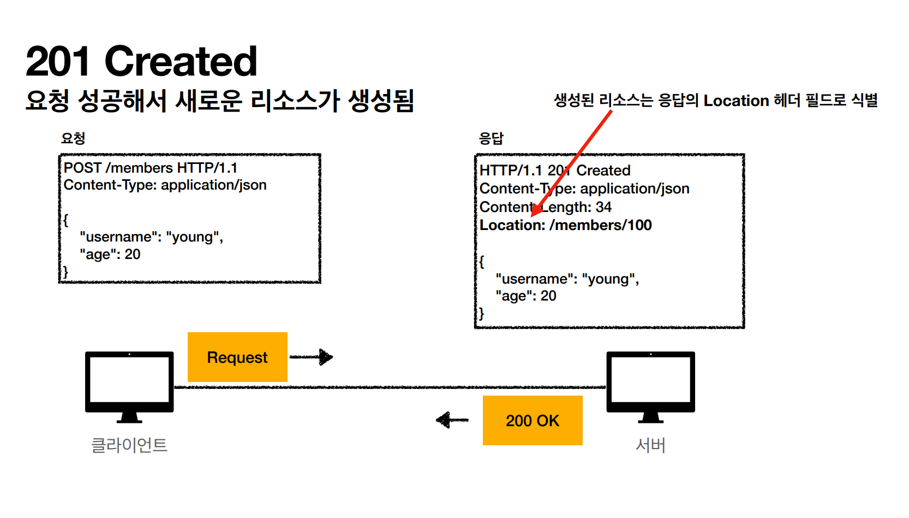
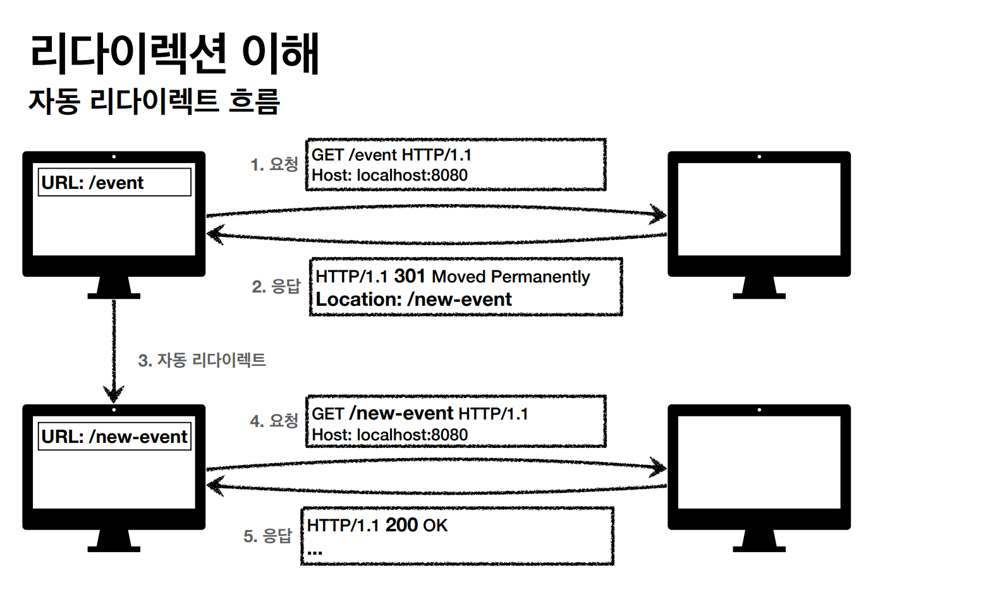
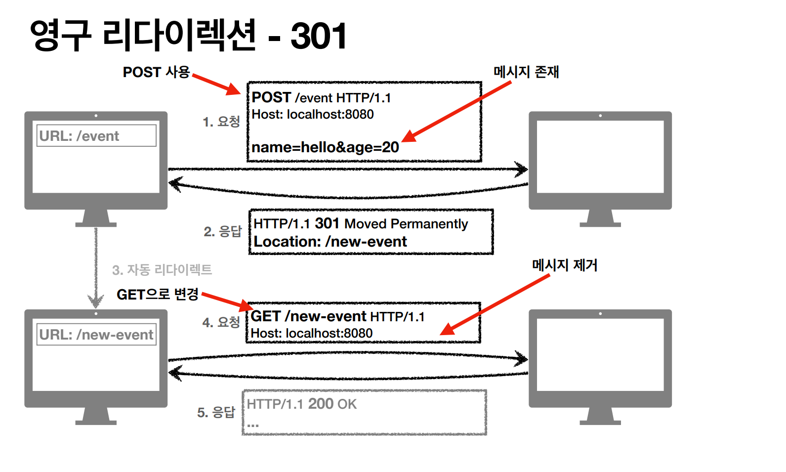
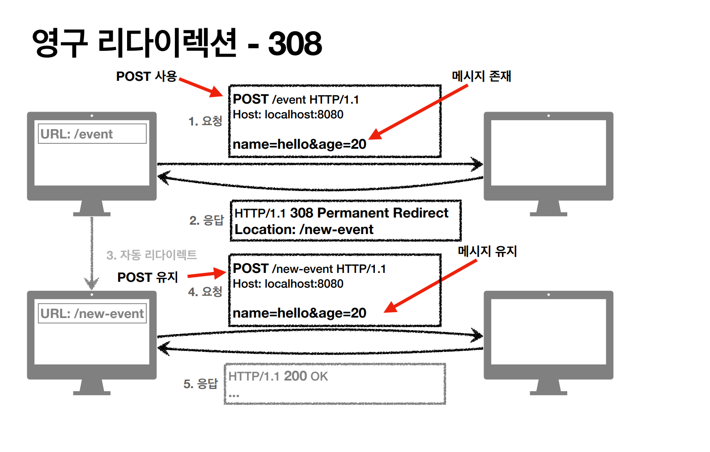
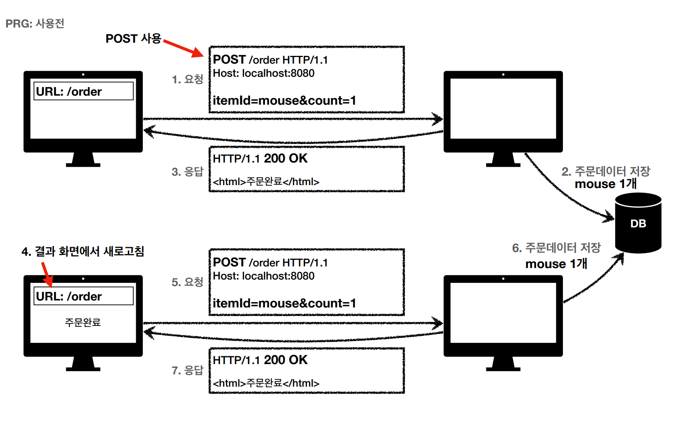
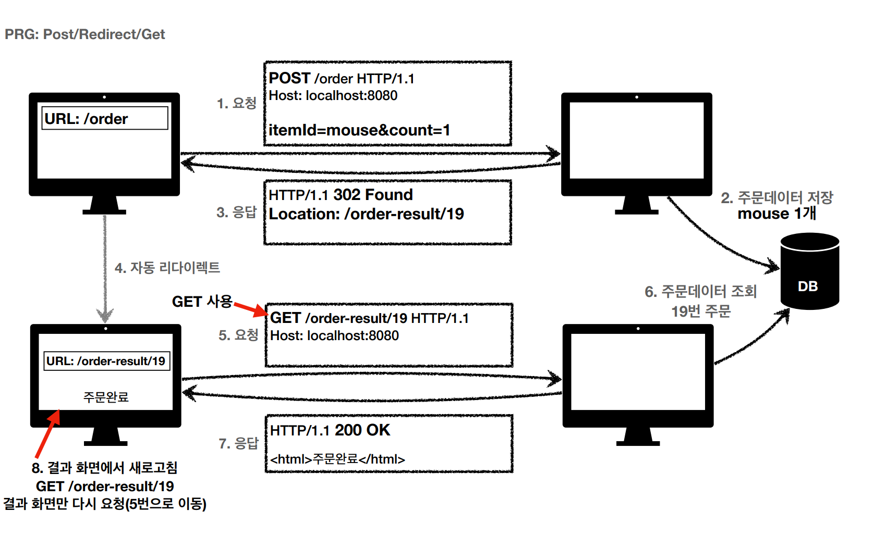

# HTTP 상태 코드
> 클라이언트가 보낸 요청의 처리 상태를 응답에서 알려주는 기능

- 1xx (Information) : 요청이 수신되어 처리 중(거의 사용되지 않음)
- 2xx (Successful) : 요청 정상 처리
- 3xx (Redirection) : 요청을 완료하려면 추가 행동이 필요
- 4xx (Client Error) : 클라이언트 오류, 잘못된 문법 등으로 서버가 요청을 수행할 수 없다.
- 5xx (Server Error) : 서버 오류, 서버가 정상 요청을 처리하지 못한다.

## 2xx - 성공
- 200 OK - 요청 성공
- 201 Created - 요청 성공해서 새로운 리소스가 생성된다.

- 202 Accepted - 요청이 접수는 되었으나 처리가 완료되지 않았다.(배치 처리 같은 곳에서 사용)
- 204 No Content - 서버가 요청을 성공적으로 수행했지만, 응답 페이로드 본문에 보낼 데이터가 없다.

 

## 3xx - 리다이렉션
> 리다이렉션(Redirection) : 웹 브라우저는 3xx 응답 결과에 Location 헤더가 있으면, Location 위치로 자동 이동된다.

> **영구 리다이렉션** : 특정 리소스의 URI가 영구적으로 이동
> **일시 리다이렉션** : 일시적인 변경(주문 완료 후 주문 내역 화면으로 이동(PRG))
> **특수 리다이렉션** : 결과 대신 캐시를 사용

- 300 - Multiple Choices(거의 사용하지 않음)
- 301 - Moved Permanently
- 302 - Found
- 303 - See Other
- 304 - Not Modified
- 307 - Temporary Redirect
- 308 - Permanent Redirect

### 영구 리다이렉션(301, 308)
- 리소스의 URI가 영구적으로 이동됐다.
- 301 Moved Permanently(주로 사용)
  - 리다이렉트시 요청 메서드가 GET으로 변하고, 본문이 제거될 수 있다.(MAY)

- 308 Permanent Redirect
  - 301과 기능은 같지만 요청 메서드가 유지된다.

### 일시 리다이렉션(302, 303, 307)
- 리소스의 URI가 일시적으로 변경됐다.
- 302 Found
  - 리다이렉트시 요청 메서드가 GET으로 변하고, 본문이 제거될 수 있다.(MAY)
- 303 See Other
  - 302와 기능은 같고 리다이렉트시 요청 메서드가 GET으로 변한다.
- 307 Temporary Redirect
  - 리다이렉트시 요청 메서드와 본문을 유지한다.(요청 메서드를 변경하면 안된다.(MUST NOT))

**PRG(Post/Redirect/Get)**
> POST로 주문 후에 웹 브라우저를 새로고침하면 재요청을 하기 때문에 중복 주문이 될 수 있다.

이 문제를 해결하기 위해서는 POST로 주문 후에 주문 결과 화면을 GET으로 리다이렉트 시켜야 한다. 그러면 새로고침해도 중복 주문이 아닌 결과 화면만
GET으로 다시 요청하게 된다.

### 기타 리다이렉션(300, 304)
- 300 Multiple Choices : 사용하지 않음
- 304 Not Modified
  - 캐시를 목적으로 사용한다.
  - 클라이언트에게 리소스가 수정되지 않았음을 알려주고 클라이언트는 로컬PC에 저장된 캐시를 재사용하게 된다.(캐시로 리다이렉트)
  - 304 응답은 로컬 캐시를 사용해야 하므로 응답에 메시지 바디를 포함하면 안 된다.

 

## 4xx - 클라이언트 오류
> 오류의 원인이 클라이언트에 있다. **클라이언트가 이미 잘못된 요청, 데이터를 보내고 있기 때문에 똑같은 재시도는 실패한다.**
- 400 Bad Request
  - 클라이언트가 잘못된 요청을 해서 서버가 요청을 처리할 수 없다.
- 401 Unauthorized
  - 클라이언트가 해당 리소스에 대한 **인증**이 필요하다.
  - 401 오류 발생 시 응답에 'www-Authenticate' 헤더와 함께 인증 방법을 설명해준다.
  - **인증(Authentication)** : 본인이 누구인지 확인하는 과정(로그인) 
  - **인가(Authorization)** : 권한을 부여하는 과정(인증이 있어야 인가가 있는 것이다.)
- 403 Forbidden
  - 인증 가격 증명은 있지만, 접근 권한이 불충분하다.(인가(권한)가 부족하다)
- 404 Not Found
  - 요청 리소스가 서버에 없다. 또는 클라이언트가 권한이 부족한 리소스에 접근할 때 해당 리소스를 숨기고 싶을 때 사용한다.

 

## 5xx - 서버 오류
> 오류의 원인이 서버에 있다. **서버에 문제가 있기 때문에 재시도 하면 성공할 수도 있다.**
- 500 Internal Server Error
  - 서버 내부 문제로 오류 발생
  - 애매하면 500 에러를 응답한다.
- 503 Service Unavaliable
  - 서버가 일시적인 과부하 또는 예정된 작업으로 잠시 요청을 처리할 수 없다.
  - Retry-After 헤더 필드로 얼마 뒤에 복구되는지 보낼 수도 있다.
