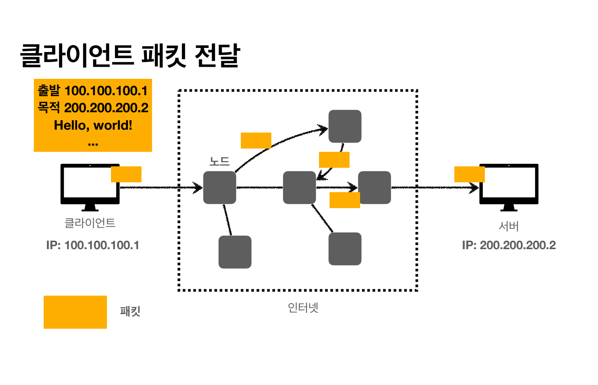
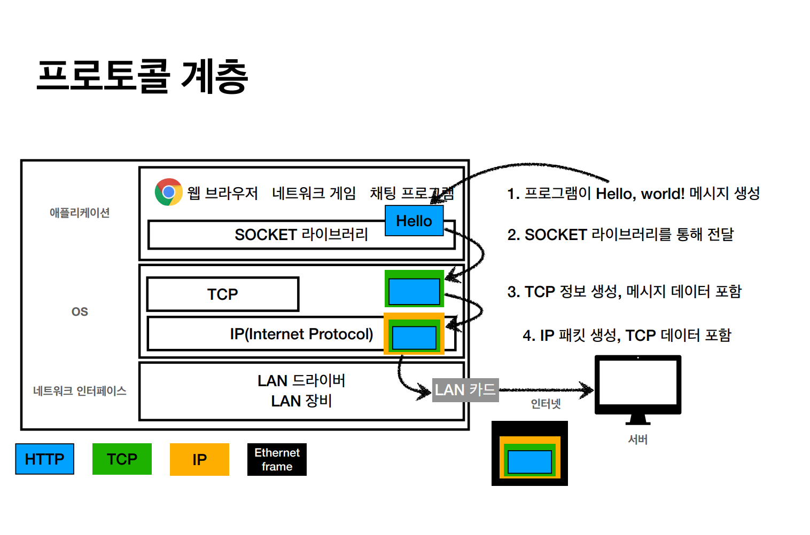
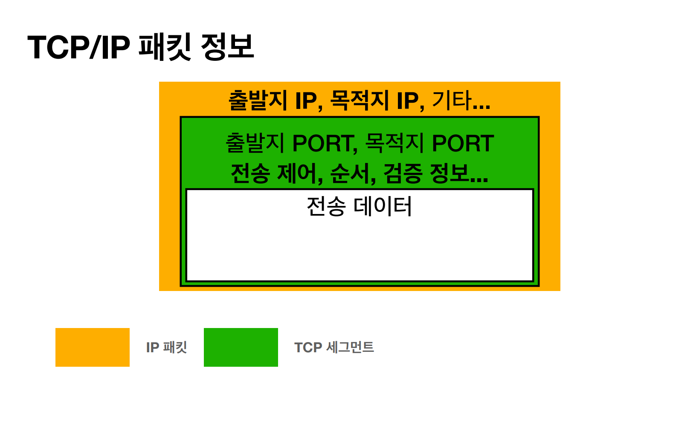
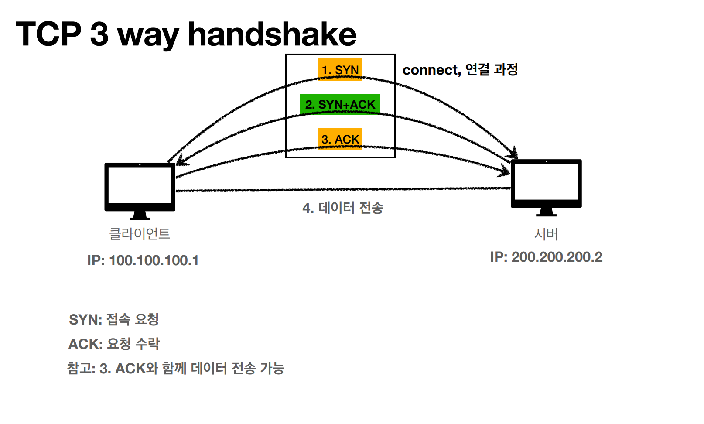
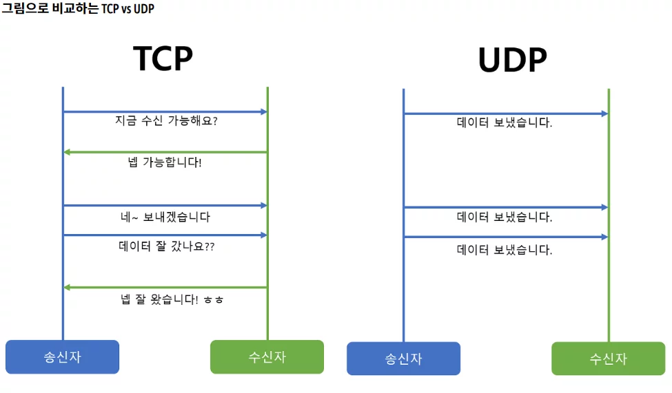
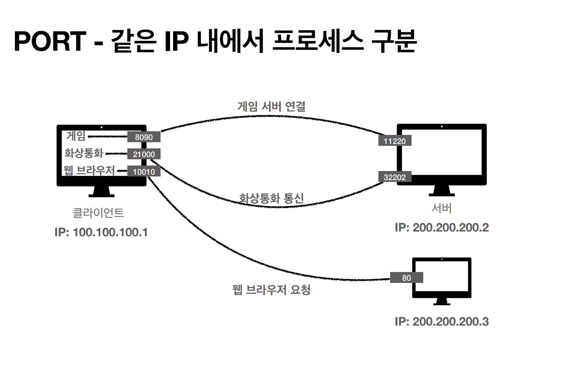

## IP - 인터넷 프로토콜

>**Internet Protocol** : 데이터 패킷이 네트워크를 통해 이동하고 올바른 대상에 도착할 수 있도록 데이터 패킷을 라우팅하고 주소를 지정하기 위한
> 프로토콜 또는 규칙의 집합이다.

즉 네트워크끼리 통신을 위해 정해둔 기준(식별자)이라고 할 수 있다.

IP의 역할
1. 지정한 IP 주소(IP Address)에 데이터를 전달
2. 패킷(Packet)이라는 통신 단위로 데이터를 전달

데이터를 전달할 때는 큰 데이터를 여러 작은 조각으로 나누어 전송하는데 각각의 작은 조각이 **패킷**이다.
패킷에는 송신 및 수신 IP, 기타 정보 등 여러 정보가 기록될 수 있다.

데이터가 지나가는 경로에는 인터넷 노드들이 연결리스트 마냥 각 노드가 다음 주소를 갖고 있는 구조이다. 노드들을 거치면서 도착 IP 주소에 갈 수 있는 
경로를 찾아서 가게 된다.

다만 이러한 IP에는 여러가지 한계가 있다.

1. 비연결성
   - 패킷이 받을 대상이 없거나 서비스 불능 상태여도 패킷은 전송이 된다.
2. 비신뢰성
   - 중간에 패킷이 사라지거나, 패킷이 순서대로 도착한다는 보장이 없다.
3. 프로그램 구분
   - 같은 IP를 사용하는 서버에서 통신하는 애플리케이션이 둘 이상이면 구분하기 어렵다.

이와 같은 한계점들을 해결하기 위해 IP에는 ``TCP와 UDP``라는 개념이 있다.

 

## TDP, UDP

> 애플리케이션(애플리케이션 계층)에서 데이터를 전달할 때에는 전송 계층인 TCP에서 TCP정보를 생성한 다음 인터넷 계층(IP)에서 IP 패킷을 생성한 다음
> 네트워크 인터페이스 계층을 통해 데이터가 전달된다.

TCP에는 port, 전송 제어, 순서 등 더 다양한 정보가 들어있어 IP의 문제점들을 해결해준다.

### TCP 특징
> 전송 제어 프로토콜(Transmission Control Protocol) 
> 신뢰할 수 있는 프로토콜이며, 현재는 대부분 TCP를 사용한다.

- 연결 지향 - TCP 3 way handshake(가상 연결)
- 데이터 전달 보증
- 순서 보장

데이터를 전송하기 전 클라이언트와 서버가 서로 3단계를 거쳐 접속 요청과 요청 수락을 함으로써 서로가 연결되고 데이터를 주고받을 수 있다는 것이 보장된다.

**중요한 것은 실제 물리적으로 연결된 것이 아닌 논리적으로 ``가상 연결``이 된 것이다.**

TCP는 데이터를 받으면 받는 쪽에서 받았다는 응답을 보내주기 때문에 데이터 전달을 보증해준다.

TCP는 전송을 받는 쪽에서 패킷 순서가 잘못됐다고 판단하면 순서가 잘못된 패킷부터 다시 보내라고 데이터를 보내는 쪽에게 요청을 하기 때문에 순서를 보장해준다.

### UDP 특징
> 사용자 데이터그램 프로토콜(User Datagram Protocol) 
> UDP는 TCP와 비교했을 때 기능이 거의 없다. 데이터 전달 및 순서가 보장되지 않지만 단순하고 빠르다.

### TCP와 UDP 차이

1. 연결 방식
    - TCP는 3 way handshake를 통해 연결을 하는 연결 지향적인 프로토콜이고, UDP는 연결을 하지 않는 비연결 지향적인 프로토콜이다.
2. 신뢰성
    - TCP는 데이터의 정확성과 순서를 보장하여 신뢰성이 높지만, UDP는 데이터의 손실이나 순서를 보장하지 않아 신뢰성이 낮다.
3. 흐름 제어
   - TCP는 흐름 제어를 통해 수신자의 처리 속도에 따라 데이터를 전송하는 속도를 조절하지만, UDP는 흐름 제어를 제공하지 않는다.
4. 오버헤드
   - TCP는 신뢰성을 보장하기 위해 많은 제어 정보를 포함하여 오버헤드가 크고, UDP는 간단한 정보만 가지고 있어 오버헤드가 작다.

 

## PORT
> 직역을 하면 항구라는 뜻으로, 네트워크 관점에서는 TCP나 UDP에서 애플리케이션이 상호구분을 위해서 사용하는 번호이다. IP 내애서 프로세스 구분을 하기 위해서
> 사용한다. 즉, 각 프로토콜의 데이터가 통하는 논리적 통로이다.

하나의 IP에서 여러 개의 애플리케이션과 통신하는 상황에서 **PORT**라는 개념을 사용한다.

``IP가 아파트라면 PORT는 동,호수``

PORT는 잘 알려진 포트(0 ~ 1023)는 사용하지 않는 것이 좋다.

- FTP - 20,21(TCP)
- SSH - 22(TCP)
- 텔넷 - 23(TCP)
- SMTP - 25(TCP)
- DNS - 53(TCP/UDP)
- DHCP - 67(UDP)
- HTTP - 80(TCP)
- HTTPS - 443(TCP)

 

## DNS
> 도메인 네임 시스템(Domain Name System)

IP는 외우기도 어렵고 변경될 수도 있고 직관적이지도 않으며 IP를 한 자리라도 잘못 입력하면 전혀 다른 사이트로 갈 위험도 있다.

그래서 IP주소를 도메인 이름으로 바꾸어 도메인 네임 서버에 저장을 시켜놓으면 도메인 네임 서버에서는 도메인 이름과 IP 주소를 서로 변환하는 역할을 해준다.

설정된 네임 서버로 DNS 요청이 들어오면, 전송된 도메인 이름을 DNS 정보가 모두 저장된 데이터베이스인 DNS 쿼리와 비교한 후, 해당 도메인에 맞는 IP 주소를 사용자에게 반환해준다.