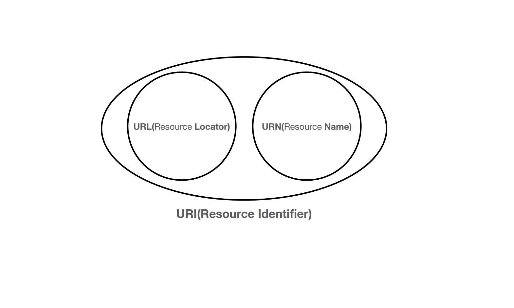
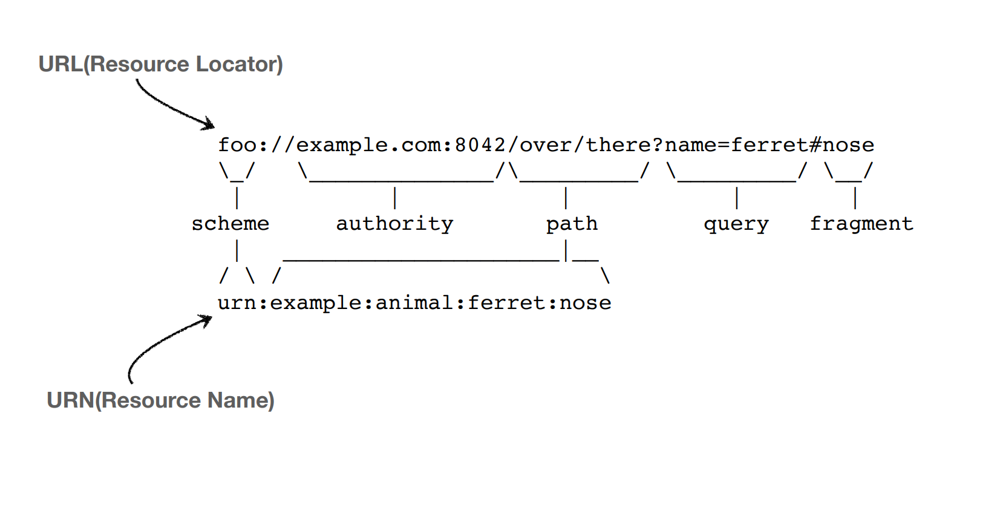
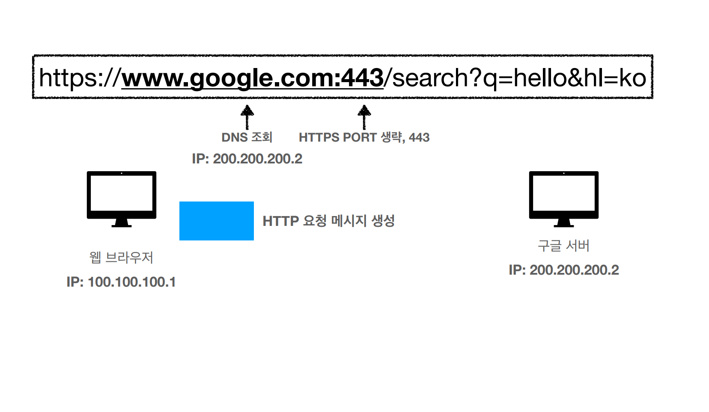
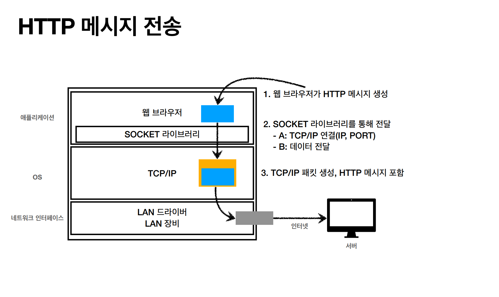
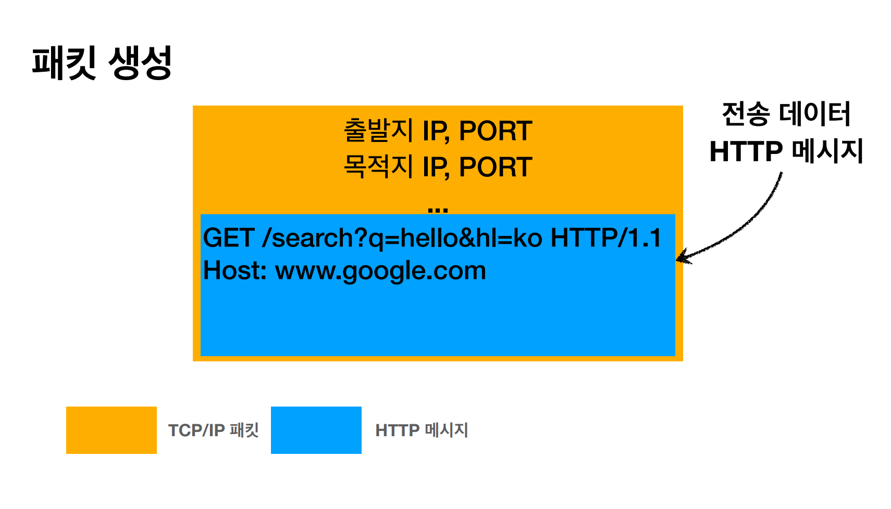

## URI
> Uniform Resource Identifier

- **U**niform : 리소스를 식별하는 통일된 방식
- **R**esource : 자원, URI로 식별할 수 있는 모든 것(제한 없음)
- **I**detifier : 다른 항목과 구분하는데 필요한 정보

URI와 비슷한 말인 URL과 URN이라는 것이 있는데 정확히는 URI안에 URL과 URN이 있는 것이다.

즉, URI는 위치(Locator)와 이름(Name)으로 분류될 수 있다.

 

## URL 문법

예를 들어 ``https://www.google.com:443/search?q=hello&hl=ko`` 라는 URL이 있으면 다음과 같이 구분할 수 있다. 
- 프로토콜(https)
- 호스트명(www.goole.com)
- 포트 번호(443)
- Path(/search)
- 쿼리 파라미터(q=hello&hl=ko)

scheme://[userinfo@]host[:port][/path][?query][#fragment]

### scheme
주로 어떤 방식으로 자원에 접근할 것인가 하는 약속 규칙인 프로토콜을 사용한다.(예 : http, https, ftp 등)

http는 80 포트, https는 443 포트를 주로 사용하며 포트는 생략 가능하다.

https는 http에 보안이 추가된 것이다.(Http Secure)

### userinfo
URL에 사용자 정보를 포함해서 인증할 때 사용하는데 지금은 거의 사용하지 않는다.

### host
호스트명, 도메인명 또는 IP 주소를 직접 사용 가능하다.

### port
접속 포트이며 일반적으로 생략해서 사용한다.

### path
리소스(자원) 경로, 계층적 구조로 되어 있다.

### query
``key=value`` 형태로 ``?``로 시작하고 ``&``로 분리하여 계속 추가해서 사용 가능하다.

보통은 ``query parameter`` 또는 ``query string``으로 불리는데 숫자를 입력해도 문자로 보내지기 때문에 query string이라고도 한다.

 

## 웹 브라우저 요청의 흐름

먼저 DNS에서 도메인 네임에 맞는 IP 주소를 조회해서 찾고 포트는 보통 생략하고 HTTP 요청 메시지를 생성한다.

그리고 프로토콜 4계층에서 socket 라이브러리에서 3 way handshake를 통해 서로 연결을 맺은 뒤 TCP/IP에서 패킷을 생성해서 데이터를 전달하게 된다.

이제 이 요청 패킷이 인터넷 노드들을 통해 서버에서 받으면 HTTP 메시지를 해석 후 요청에 맞는 HTTP 응답 메시지를 만들어서 클라이언트에서 요청 보낼 때랑 똑같이
응답 패킷을 만들어서 클라이언트에게 전달해준다. 그러면 클라이언트도 똑같이 응답 메시지를 확인하여 만약 HTML이 응답이 왔다면 화면에 렌더링이 되는 것이다.

