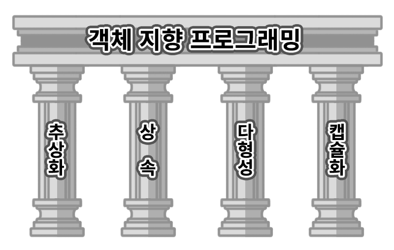

# OOP

## OOP(Object Oriented Programming)란?
> **객제 지향 프로그래밍**<br>
> 현실 세계에서 어떤 제품을 만들 때는 부품을 먼저 만들고, 이 부품들을 하나씩 조립해서 완성품을 만든다.<br>
> 소프트웨어를 개발할 때에도 부품에 해당하는 객체들을 먼저 만들고, 이 객체들을 하나씩 
> 조립해서 완성된 프로그램을 만드는 기법을 **객체 지향 프로그래밍**이라고 한다.

<br>

## 객체란?
> **객체(object)** 란 물리적으로 존재하거나 개념적인 것 중에서 다른 것과 식별 가능한 것을 말한다.
> 예를 들어 물리적으로 존재하는 자동차, 자전거, 책, 사람은 물론 개념적인 학과, 강의, 주문 등도 모두
> 객체가 될 수 있다.<br>
> 객체는 **속성**과 **동작**으로 구성된다. 사람은 이름, 나이 등의 ``속성``과 웃다, 걷다 등의 ``동작``이 있고
> 자동차는 색상, 모델 등의 ``속성``과 달리다, 멈추다 등의 ``동작``이 있다.<br> 
> 자바는 이러한 속성과 동작을 각각 **필드(field)** 와 **메소드(method)** 라고 부른다.

<br>

## OOP의 특징



> **객체 지향 프로그래밍**은 현실 세계를 프로그램으로 옮겨와 프로그래밍하는 것이기 때문에
> 현실 세계의 특징을 그대로 반영하고자 했다. 그래서 객체 지향 프로그래밍은 현실 세계의 특징을
> 프로그램에 반영하기 위해 **추상화, 캡슐화, 상속, 다형성** 이라는 특징을 가지고 있다.

<br>

### 1. 추상화(Abstraction)
> **추상화** 란 불필요한 정보는 숨기고 중요한 정보만을 표현함으로써 프로그램을 단순하게 만드는 것을 말한다.

예를 들어 자동차와 자전거가 있으면 각각 부품과 속도는 다르겠지만 하나의 **이동 수단**이라는 공통점을 가지고 있다.
모든 이동 수단은 기본적으로 전진과 후진을 할 수 있어야 한다. 이처럼 공통된 특징을 뽑아내는 것을 **추상화** 라고 한다.<br>
자바에서는 추상화를 위해 ``인터페이스(interface)`` 와 ``추상 클래스(abstract class)`` 를 제공한다.

[인터페이스와 추상 클래스의 차이](https://wildeveloperetrain.tistory.com/112)

**상속(추상 클래스)은 물려받는 것, 구현(인터페이스)은 장착하는 것**

이렇게 **역할과 구현을 분리하여** 설계하면 유연하고 변경이 용이한 프로그램을 만들 수 있다.<br>

<br>

### 2. 상속(Inheritance)
> **상속** 이란 어떤 클래스를 만들 때 다른 클래스의 기능을 물려받을 수 있게 만드는 것을 말한다.<br>

클래스들 간 공유하는 속성과 기능들을 반복적으로 정의할 필요 없이 한 번만 정의해두고 간편하게 재사용할 수 있어
**반복적은 코드를 최소화하고 공유하는 속성과 기능에 간편하게 접근하여** 사용할 수 있도록 한다.<br>

```java
public class 자동차 {
    Wheel wheel;
    Handle handle;
    Break Break;
    Engine engine;
    
    public void 전진(){
        System.out.println("전진");
    }
    public void 후진(){
        System.out.println("후진");
    }
}

public class 자전거 {
    Wheel wheel;
    Handle handle;
    Break Break;
    Pedal pedal;
    
    public void 전진(){
        System.out.println("전진");
    }
    public void 후진(){
        System.out.println("후진");
    }
}
```

자동차와 자전거는 같인 이동수단이지만 이동하는 방식이 달라 자동차는 엔진을 사용하고 자전거는 페달을 사용한다.
그 외 속성들은 동일하고 전진과 후진이라는 기능도 동일하다. 이처럼 공통된 속성과 기능을 뽑아서 부모 클래스를 만들고
이를 상속을 이용해 재정의를 해보자.

```java
public class 이동_수단{
    Wheel wheel;
    Handle handle;
    Break Break;
    
    public void 전진(){
        System.out.println("전진");
    }
    public void 후진(){
        System.out.println("후진");
    }
}

public class 자동차 extends 이동_수단{
    Engine engine;
}

public class 자전거 extends 이동_수단{
    Pedal pedal;
    
    @Override
    public void 전진(){
        System.out.println("자전거 전진");
    }
}

public class Main{
    public static void main(String[] args){
        자동차 car = new 자동차();
        자전거 bicycle = new 자전거();
        
        car.전진();
        bicycle.전진();
        /**
         * 출력 결과
         * 
         * 전진
         * 자전거 전진
         */
    }
}
```

자동차와 자전거 클래스의 공통적인 속성과 기능들을 추상화하여 이동_수단 클래스를 만들고 이를 상속받아
반복적으로 정의해야 하는 번거로움을 줄였다. 또한 공통적인 코드의 변경이 있는 경우 상위 클래스에서 한 번의 수정으로 
모든 클래스에 변경 사항이 반영될 수 있다.<br>
그리고 자전거 클래스에서 상위 클래스의 기능을 오버라이딩하여 재정의한 것 처럼 각 클래스의 맞게 기능을 수정할 수 있다.

<br>

### 3. 다형성(Polymorphism)
> 객체 지향 프로그래밍의 꽃이라고 할 수 있는 **다헝성**이란 어떤 객체의 속성이나 기능이 상황에 따라
> 여러 가지 형태를 가질 수 있는 성질을 의미한다.

더 구체적으로는 한 타입의 참조변수를 통해 여러 타입의 객체를 참조할 수 있도록 만든 것을 의미한다. 즉, 상위 클래스 타입의
참조변수로 하위 클래스의 객체를 참조할 수 있도록 하는 것이다.<br>

``상위 클래스 타입의 참조 변수로 그것과 관계있는 하위 클래스들을 참조할 수 있어야 한다.``

위 상속 부분 코드를 다형성 개념을 활용하여 수정해보자.

```java
public class 이동_수단{
    Wheel wheel;
    Handle handle;
    Break Break;
    
    public void 전진(){
        System.out.println("전진");
    }
    public void 후진(){
        System.out.println("후진");
    }
}

public class 자동차 extends 이동_수단{
    Engine engine;
}

public class 자전거 extends 이동_수단{
    Pedal pedal;
    
    @Override
    public void 전진(){
        System.out.println("자전거 전진");
    }
}

public class Main{
    public static void main(String[] args){
        // 기존
        이동_수단 car = new 자동차();
        이동_수단 bicycle = new 자전거();
        // 다형성을 활용한 객체 생성
        이동_수단 car2 = new 자동차();
        // 상위 클래스 타입의 객체 배열 생성
        이동_수단[] 이동_수단들 = new 이동_수단[3];
        이동_수단들[0] = new 자동차();
        이동_수단들[1] = new 자전거();

        for (이동_수단 이동_수단 : 이동_수단들) {
            System.out.println(이동_수단.getClass());
        }
        /**
         * 출력 결과
         * 
         * class 자동차
         * class 자전거
         */
    }
}
```
이동_수단들 배열에는 상속 관계에 있는 모든 하위 클래스들을 담아줄 수 있다. <br>
다형성에 또 다른 예로 **결합도**가 있다. 결합도는 한 클래스가 많은 클래스와 상호작용을 할수록 높아지는 경향을 의미한다.

```java
public class Driver{
    public void drive(자동차 car) {
        car.전진();
        car.후진();
    }
    public void drive(자전거 bicycle) {
        bicycle.전진();
        bicycle.후진();
    }
}

public class Main{
    public static void main(String[] args){
        Driver driver = new Driver();
        driver.drive(new 자동차());
        driver.drive(new 자전거());
        /**
         * 출력 결과
         * 
         * 전진
         * 후진
         * 자전거 전진
         * 자전거 후진
         */
    }
}
```

> 참고로 메소드의 이름이 같아도 매개변수의 타입이나 개수가 다르면 다른 메소드로 인식하는데 이를 **메소드 오버로딩** 이라고 한다.

Driver 클래스는 자동차와 자전거 클래스를 의존 하고 있는데 이처럼 한 클래스가 많은 클래스와 상호작용을 할수록
결합도가 높아지는 것을 볼 수 있다. 만약 자동차나 자전거 클래스가 수정되면 Driver 클래스도 수정해야 하고, 비행기나 오토바이 같은
새로운 클래스가 추가되면 Driver 클래스도 수정해야 한다. 이처럼 결합도가 높아지면 수정이 어려워지고 유지보수가 힘들어진다.
이를 다형성을 활용하여 수정해보자.

```java
public interface 이동_수단{
    public void 전진();
    public void 후진();
}

public class 자동차 implements 이동_수단{
    @Override
    public void 전진(){
        System.out.println("전진");
    }
    @Override
    public void 후진(){
        System.out.println("후진");
    }
}

public class 자전거 implements 이동_수단{
    @Override
    public void 전진(){
        System.out.println("자전거 전진");
    }
    @Override
    public void 후진(){
        System.out.println("자전거 후진");
    }
}

public class Driver{
    public void drive(이동_수단 vehicle) { // 매개변수로 인터페이스 타입을 전달
        vehicle.전진();
        vehicle.후진();
    }
}

public class Main{
    public static void main(String[] args){
        Driver driver = new Driver();
        driver.drive(new 자동차());
        driver.drive(new 자전거());
        /**
         * 출력 결과
         * 
         * 전진
         * 후진
         * 자전거 전진
         * 자전거 후진
         */
    }
}
```
이제 Driver 클래스는 이동_수단 인터페이스만 의존하고 있으므로 결합도가 낮아졌다. 따라서 Driver 클래스는 더 이상
각각의 클래스 내부의 변경이나 다른 객체가 새롭게 교체되는 것을 신경 쓰지 않아도 인터페이스에만 의존하여
수정이 있을 때마다 코드 변경을 하지 않아도 된다.

<br>

### 4. 캡슐화(Encapsulation)
> 클래스 안에 **서로 연관 있는 속성과 기능들을 하나의 캡슐로 만들어 데이터를 외부로부터 보호하는 것**을 말한다.


캡슐화를 하는 이유

- **데이터 보호(data protection)** : 외부로부터 클래스에 정의된 속성과 기능들을 보호
- **데이터 은닉(data hiding)** : 내부의 동작을 감추고 외부에는 필요한 부분만 노출

자바에서는 캡슐화를 구현하기 위해 **접근 제어자와 getter/setter 메소드** 를 제공한다.

#### 접근 제어자
> 클래스 또는 클래스의 내부의 멤버들에 사용되어 해당 클래스나 멤버들을 외부에서 접근하지 못하도록
> 접근을 제한하는 역할을 한다.

|접근 제어자|클래스 내|패키지 내|다른 패키지의 하위 클래스|패키지 외| 설명                            |
|--|--|--|--|--|-------------------------------|
|public|O|O|O|O| 제한 없음                         |
|protected|O|O|O|X| 동일 패키지이거나 다른 패키지의 자식 객체에서만 가능 |
|default|O|O|X|X| 동일 패키지 내에서만 가능              |
|private|O|X|X|X| 해당 클래스 내에서만 가능             |

#### getter/setter 메소드
> getter/setter 메소드는 private 으로 선언된 멤버 변수에 대해 접근, 수정할 수 있는 메소드를 말한다.

```java
public class Car{
    private String name;
    private int speed;
    
    public String getName(){
        return name;
    }
    public void setName(String name){
        this.name = name;
    }
    public int getSpeed(){
        return speed;
    }
    public void setSpeed(int speed){
        this.speed = speed;
    }
}
```

속성은 private 으로 선언하고 getter/setter 메소드를 통해 접근하도록 하여 외부에서 속성을 직접적으로
변경하지 못하도록 하고, 메소드를 통해 속성을 꺼내오고 변경할 수 있도록 한다.