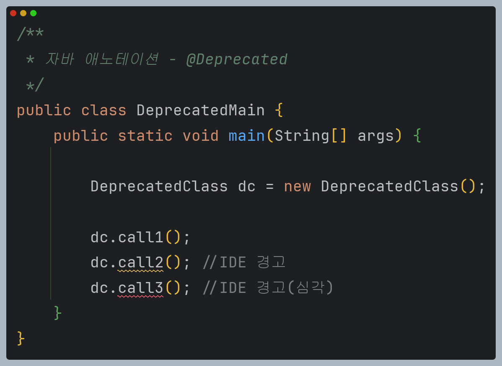

# 자바 - 애노테이션

---

### 애노테이션 예제 코드

```java
import java.lang.annotation.Retention;
import java.lang.annotation.RetentionPolicy;
/**
 * 애노테이션 예제
 */
@Retention(RetentionPolicy.RUNTIME)
public @interface SimpleMapping {
    String value();
}
```
```java
/**
 * 애노테이션 예제
 */
public class TestController {

    @SimpleMapping(value = "/")
    public void home() {
        System.out.println("TestController.home");
    }

    @SimpleMapping(value = "/site1")
    public void page1() {
        System.out.println("TestController.page1");
    }
}
```
> 애노테이션은 프로그램 코드가 아니다. 주석과 비슷하나 일반적인 주석이 아니고,
> 리플렉션 같은 기술로 실행 시점에 읽어서 활용할 수 있는 특별한 주석이다.
```java
import java.lang.reflect.Method;
/**
 * 애노테이션 예제
 */
public class TestControllerMain {

    public static void main(String[] args) {

        TestController testController = new TestController();

        Class<? extends TestController> aClass = testController.getClass();
        for (Method method : aClass.getDeclaredMethods()) {
            SimpleMapping simpleMapping = method.getAnnotation(SimpleMapping.class);

            if (simpleMapping != null) {
                System.out.println("[" + simpleMapping.value() + "] -> " + method);
            }
        }
    }
}
```
- 리플렉션이 제공하는 `getAnnotation()` 메서드를 사용하면 붙어있는 애노테이션을 찾을 수 있다.
- `Class`, `Method`, `Field`, `Constructor` 클래스는 자신에게 붙은 애노테이션을 찾을 수 있는
 `getAnnotation()` 메서드를 제공한다.
- `simpleMapping.value()`와 같이 찾은 애노테이션에 지정된 값을 조회할 수 있다.

```text
[/] -> public void annotation.mapping.TestController.home()
[/site1] -> public void annotation.mapping.TestController.page1()
```

애노테이션은 코드에 추가적인 정보를 주석처럼 제공한다. 하지만 일반 주석과 달리
애노테이션은 컴파일러나 런타임에서 해석될 수 있는 메타데이터를 제공한다.

---

## 애노테이션 정의

```java
import util.MyLogger;
import java.lang.annotation.Retention;
import java.lang.annotation.RetentionPolicy;
/**
 * 애노테이션 정의
 */
@Retention(RetentionPolicy.RUNTIME)
public @interface AnnoElement {
    String value();
    int count() default 0;
    String[] tags() default {};

    //MyLogger data(); //다른 타입은 적용 X
    Class<? extends MyLogger> annoData() default MyLogger.class;
}
```

애노테이션은 `@interface` 키워드로 정의하며, 속성을 가질 수 있는데 인터페이스와 비슷하게 정의한다.

**애노테이션 정의 규칙**
- **데이터 타입**
  - 기본 타입(`int`, `float`, `boolean` 등)
  - `String`
  - `Class`(메타데이터) 또는 인터페이스
  - `enum`
  - 다른 애노테이션 타입
  - 위 타입들의 배열
  - 위 타입 외에는 정의할 수 없다. 일반적인 클래스를 사용할 수 없다.
- **default 값**
  - 요소에 `default`값을 지정할 수 있다.
- **요소 이름**
  - 메서드 형태로 정의된다.
  - 괄호를 포함하되 매개변수는 없어야 한다.
- **반환 값**
  - `void`를 반환 타입으로 사용할 수 없다.
- **에외**
  - 예외를 선언할 수 없다.
- **특별한 요소 이름**
  - `value`라는 이름의 요소를 하나만 가질 경우, 애노테이션 사용 시 요소 이름을
    생략할 수 있다.

```java
/**
 * 애노테이션 사용
 */
@AnnoElement(value = "data", count = 10, tags = {"t1", "t2"})
public class ElementData1 { }
```
```java
import java.util.Arrays;
/**
 * 애노테이션 사용
 */
public class ElementData1Main {

    public static void main(String[] args) {

        Class<ElementData1> annoClass = ElementData1.class;
        AnnoElement annotation = annoClass.getAnnotation(AnnoElement.class);

        String value = annotation.value();
        int count = annotation.count();
        String[] tags = annotation.tags();

        System.out.println("value = " + value);
        System.out.println("count = " + count);
        System.out.println("tags = " + Arrays.toString(tags));
    }
}

```
```text
value = data
count = 10
tags = [t1, t2]
```

`count`와 `tags`는 `default`값이 있기 때문에 생략할 수 있다.
```java
@AnnoElement(value = "data", tags = "t1") //count 생략
public class ElementData2 { }
```
배열의 항목이 하나인 경우 `{}` 생략 가능하다.
```java
@AnnoElement("data") //count, tags 생략
public class ElementData3 { }
```
입력 요소가 하나인 경우 `value` 키워드 생략 가능하다.(`value` 키워드가 아니면 작동 안함)

---

## 메타 애노테이션

애노테이션을 정의하는 데 사용되는 애노테이션을 **메타 애노테이션**이라고 한다.

### @Retention

애노테이션의 생존 기간을 지정한다.

```java
package java.lang.annotation;

@Documented
@Retention(RetentionPolicy.RUNTIME)
@Target(ElementType.ANNOTATION_TYPE)
public @interface Retention {
    
    RetentionPolicy value();
}
```
```java
package java.lang.annotation;

public enum RetentionPolicy {
    SOURCE,
    CLASS,
    RUNTIME
}
```
- `SOURCE` : 소스 코드에만 남아있다. 컴파일 시점에 제거된다.
- `CLASS` : 컴파일 후 `class` 파일까지는 남아있지만 자바 실행 시점에 제거된다.(기본값)
- `RUNTIME` : 자바 실행 중에도 남아있다. 대부분은 이 설정을 사용한다.

### @Target

애노테이션을 적용할 수 있는 위치를 지정한다.

```java
package java.lang.annotation;

@Documented
@Retention(RetentionPolicy.RUNTIME)
@Target(ElementType.ANNOTATION_TYPE)
public @interface Target {
    ElementType[] value();
}
```
```java
package java.lang.annotation;

public enum ElementType {
    TYPE,
    FIELD,
    METHOD,
    PARAMETER,
    CONSTRUCTOR,
    LOCAL_VARIABLE,
    ANNOTATION_TYPE,
    PACKAGE,
    TYPE_PARAMETER,
    TYPE_USE,
    MODULE, //자바 9
    RECORD_COMPONENT; //자바 16
}
```
주로 `TYPE`, `FIELD`, `METHOD`를 사용한다.

### @Documented

자바 API 문서를 만들 때 해당 애노테이션이 함께 포함되는지 지정한다. 보통 함께 사용한다.

### @Inherited

자식 클래스가 애노테이션을 상속받을 수 있다.

### 애노테이션 적용 예시

```java
import java.lang.annotation.*;

@Retention(RetentionPolicy.RUNTIME)
@Target({ElementType.METHOD, ElementType.TYPE})
@Documented
public @interface AnnoMeta {
}
```
```java
@AnnoMeta //타입에 적용
public class MetaData {

//    @AnnoMeta //필드에 적용 - 컴파일 오류
    private String id;

    @AnnoMeta //메서드에 적용
    public void call() {
    }

    public static void main(String[] args) throws NoSuchMethodException {
        AnnoMeta typeAnno = MetaData.class.getAnnotation(AnnoMeta.class);
        System.out.println("typeAnno = " + typeAnno);

        AnnoMeta methodAnno = MetaData.class.getMethod("call").getAnnotation(AnnoMeta.class);
        System.out.println("methodAnno = " + methodAnno);
    }
}
```
```text
typeAnno = @annotation.basic.AnnoMeta()
methodAnno = @annotation.basic.AnnoMeta()
```

자바 언어는 컴파일 시점에 `@Target` 메타 애노테이션을 읽어서 지정한 위치가 맞는지 체크한다.

`@Retention(RetentionPolicy.RUNTIME)`을 `SOURCE`나 `CLASS`로 변경하면
애노테이션을 찾을 수 없는 것을 확인할 수 있다.
```text
typeAnno = null
methodAnno = null
```

---

## 애노테이션 상속

모든 애노테이션은 `java.lang.annotation.Annotation` 인터페이스를 묵시적으로 상속받는다.
이 인터페이스는 개발자가 직접 구현하거나 확장할 수 있는 것이 아니라, 자바 언어 자체에서
애노테이션을 위한 기반으로 사용된다.

```java
package java.lang.annotation;

public interface Annotation {
    boolean equals(Object obj);
    int hashCode();
    String toString();
    Class<? extends Annotation> annotationType();
}
```

모든 애노테이션은 오직 `Annotation` 인터페이스만 상속하며, 다른 애노테이션이나 인터페이스를
직접 상속할 수 없다. 애노테이션 사이에는 상속이라는 개념이 존재하지 않는다.

애노테이션을 정의할 때 `@Inherited` 메타 애노테이션을 붙이면, 애노테이션을 적용한 클래스의
자식도 해당 애노테이션을 부여받을 수 있다.

**단 이 기능은 클래스 상속에서만 가능하고, 인터페이스의 구현체에는 적용되지 않는다.**

```java
import java.lang.annotation.*;
/**
 * 애노테이션 상속
 */
@Inherited //클래스 상속 시 자식도 애노테이션 적용
@Retention(RetentionPolicy.RUNTIME)
public @interface InheritedAnnotation {
}
```
```java
import java.lang.annotation.*;
/**
 * 애노테이션 상속
 */
@Retention(RetentionPolicy.RUNTIME)
public @interface NoInheritedAnnotation {
}
```
```java
/**
 * 애노테이션 상속
 */
@InheritedAnnotation
@NoInheritedAnnotation
public class Parent {
}
```
```java
/**
 * 애노테이션 상속
 */
public class Child extends Parent{
}
```
```java
/**
 * 애노테이션 상속
 */
@InheritedAnnotation
@NoInheritedAnnotation
public interface TestInterface {
}
```
```java
/**
 * 애노테이션 상속
 */
public class TestInterfaceImpl implements TestInterface {
}
```
```java
import java.lang.annotation.Annotation;
/**
 * 애노테이션 상속
 */
public class InheritedMain {
    public static void main(String[] args) {
        print(Parent.class);
        print(Child.class);

        print(TestInterface.class);
        print(TestInterfaceImpl.class);
    }

    private static void print(Class<?> clazz) {
        System.out.println("class: " + clazz);

        for (Annotation annotation : clazz.getAnnotations()) {
            System.out.println(" - " + annotation.annotationType().getSimpleName());
        }
        System.out.println();
    }
}
```
```text
class: class annotation.basic.inherited.Parent
 - InheritedAnnotation
 - NoInheritedAnnotation

class: class annotation.basic.inherited.Child
 - InheritedAnnotation

class: interface annotation.basic.inherited.TestInterface
 - InheritedAnnotation
 - NoInheritedAnnotation

class: class annotation.basic.inherited.TestInterfaceImpl
```

### @Inherited가 클래스 상속에만 적용되는 이유

**1. 클래스 상속과 인터페이스 구현의 차이**
- 클래스 상속은 자식 클래스가 부모 클래스의 속성과 메서드를 상속받는 개념이다. 즉 자식 클래스는
  부모 클래스의 특성을 이어 받으므로, 부모 클래스에 정의된 애노테이션을 자식 클래스가
  자동으로 상속받을 수 있는 논리적 기반이 있다.
- 반면 인터페이스는 메서드의 시그니처만 정의할 뿐, 상태나 행위를 가지지 않기 때문에
  인터페이스의 구현체가 애노테이션을 상속한다는 개념이 잘 맞지 않는다.

**2. 인터페이스와 다중 구현, 다이아몬드 문제**
- 인터페이스는 다중 구현이 가능하다. 만약 인터페이스의 애노테이션을 구현 클래스에서
상속하게 되면 여러 인터페이스의 애노테이션 간의 충돌이나 모호한 상황이 발생할 수 있다.

---

## 애노테이션 활용

애노테이션을 활용하여 각종 클래스의 정보들을 검증하는 기능을 만들어보자.

```java
/**
 * 애노테이션 활용 - 일반적인 상황
 */
public class Team {

    private String name;
    private int memberCount;

    public Team(String name, int memberCount) {
        this.name = name;
        this.memberCount = memberCount;
    }

    /*getters*/
}
```
```java
/**
 * 애노테이션 활용 - 일반적인 상황
 */
public class User {

    private String name;
    private int age;

    public User(String name, int age) {
        this.name = name;
        this.age = age;
    }

    /*getters*/
}
```
```java
import static util.MyLogger.*;
/**
 * 애노테이션 활용 - 일반적인 상황
 */
public class ValidatorV1Main {

    public static void main(String[] args) {

        User user = new User("user1", 0);
        Team team = new Team("", 0);

        try {
            log("== user 검증 ==");
            validateUser(user);
        } catch (Exception e) {
            log(e);
        }

        try {
            log("== team 검증 ==");
            validateTeam(team);
        } catch (Exception e) {
            log(e);
        }
    }

    private static void validateUser(User user) {
        if (user.getName() == null || user.getName().isEmpty()) {
            throw new RuntimeException("이름이 비었습니다.");
        }

        if (user.getAge() < 1 || user.getAge() > 100) {
            throw new RuntimeException("나이는 1과 100 사이어야 합니다.");
        }
    }

    private static void validateTeam(Team team) {
        if (team.getName() == null || team.getName().isEmpty()) {
            throw new RuntimeException("이름이 비었습니다.");
        }

        if (team.getMemberCount() < 1 || team.getMemberCount() > 999) {
            throw new RuntimeException("회원 수는 1과 999 사이어야 합니다.");
        }
    }
}
```
```text
14:45:31.590 [     main] == user 검증 ==
14:45:31.592 [     main] java.lang.RuntimeException: 나이는 1과 100 사이어야 합니다.
14:45:31.593 [     main] == team 검증 ==
14:45:31.593 [     main] java.lang.RuntimeException: 이름이 비었습니다.
```

값이 비었는지 검증하는 부분과 숫자의 범위를 검증하는 두 가지 부분이 있다.
코드를 보면 비슷해 보이지만 `User`와 `Team`이 서로 완전히 다른 클래스이기 때문에
메서드 재사용이 어렵다. 각각의 필드 이름도 서로 다르고, 오류 메시지도 다르다. 또한
검증해야 할 값의 범위도 다르다.

이후에 다른 객체들도 검증해야 한다면 비슷한 검증 기능을 계속 추가해야 할 것이다.
애노테이션을 사용해서 이 문제를 해결해보자.

```java
import java.lang.annotation.*;
/**
 * 애노테이션 활용 - 검증기
 */
@Retention(RetentionPolicy.RUNTIME)
@Target(ElementType.FIELD)
public @interface NotEmpty {
    String message() default "값이 비어있습니다.";
}
```
```java
import java.lang.annotation.*;
/**
 * 애노테이션 활용 - 검증기
 */
@Retention(RetentionPolicy.RUNTIME)
@Target(ElementType.FIELD)
public @interface Range {
    int min();
    int max();
    String message() default "범위를 넘었습니다.";
}
```
```java
/**
 * 애노테이션 활용 - 검증기 애노테이션 적용
 */
public class Team {

    @NotEmpty(message = "이름이 비었습니다.")
    private String name;

    @Range(min = 1, max = 999, message = "회원 수는 1과 999 사이어야 합니다.")
    private int memberCount;
    //...
}
```
```java
/**
 * 애노테이션 활용 - 검증기 애노테이션 적용
 */
public class User {

    @NotEmpty(message = "이름이 비었습니다.")
    private String name;

    @Range(min = 1, max = 100, message = "나이는 1과 100 사이어야 합니다.")
    private int age;

    //...
}
```
```java
import java.lang.reflect.Field;
/**
 * 애노테이션 활용 - 검증기 애노테이션 적용
 */
public class Validator {

    public static void validate(Object obj) throws Exception {
        Field[] fields = obj.getClass().getDeclaredFields();

        for (Field field : fields) {
            field.setAccessible(true);

            //@NotEmpty
            if (field.isAnnotationPresent(NotEmpty.class)) {
                String value = (String) field.get(obj);
                NotEmpty annotation = field.getAnnotation(NotEmpty.class);

                if (value == null || value.isEmpty()) {
                    throw new RuntimeException(annotation.message());
                }
            }

            //@Range
            if (field.isAnnotationPresent(Range.class)) {
                long value = field.getLong(obj);
                Range annotation = field.getAnnotation(Range.class);

                if (value < annotation.min() || value > annotation.max()) {
                    throw new RuntimeException(annotation.message());
                }
            }
        }
    }
}
```
```java
import static util.MyLogger.log;
/**
 * 애노테이션 활용 - 검증기
 */
public class ValidatorV2Main {

    public static void main(String[] args) {

        User user = new User("user1", 0);
        Team team = new Team("", 0);

        try {
            log("== user 검증 ==");
            Validator.validate(user);
        } catch (Exception e) {
            log(e);
        }

        try {
            log("== team 검증 ==");
            Validator.validate(team);
        } catch (Exception e) {
            log(e);
        }
    }
}
```
```text
14:54:38.020 [     main] == user 검증 ==
14:54:38.049 [     main] java.lang.RuntimeException: 나이는 1과 100 사이어야 합니다.
14:54:38.049 [     main] == team 검증 ==
14:54:38.050 [     main] java.lang.RuntimeException: 이름이 비었습니다.
```

이제 클래스들이 서로 다르더라도 일관되고 재사용 가능한 검증 방식을 사용할 수 있게 되었다.

또한, 새로 추가되는 클래스나 필드에 대해서도 복잡한 로직을 별도로 구현할 필요 없이
적절한 애노테이션을 추가하는 것만으로 검증 로직을 쉽게 확장할 수 있다.

이처럼 애노테이션 기반 검증을 도입하면 코드의 가독성과 확장성이 크게 향상되며,
일관된 규칙을 유지할 수 있어 전체적은 품질 관리에도 도움이 된다.

자바 진영에서는 애노테이션 기반 검증 기능을 **Jakarta(Java) Bean Validation**이라는 이름으로 표준화했다.
다양한 검증 애노테이션과 기능이 있고 스프링 프레임워크, JPA 같은 기술들과도 함께 사용된다.

---

## 자바 기반 애노테이션

### @Override

메서드 재정의가 정확하게 잘 되었는지 컴파일러가 체크하는 데 사용한다.

```java
package java.lang;

import java.lang.annotation.*;

@Target(ElementType.METHOD)
@Retention(RetentionPolicy.SOURCE)
public @interface Override {
}
```
```java
/**
 * 자바 애노테이션 - @Override
 */
public class OverrideMain {

    static class A {
        public void call() {
            System.out.println("A.call");
        }
    }

    static class B extends A {

//        @Override //주석 풀면 컴파일 오류 발생
        public void callll() { //메서드 이름 오타
            System.out.println("B.call");
        }

    }

    public static void main(String[] args) {
        A a = new B();
        a.call(); //A.call
    }
}
```

### @Deprecated

더 이상 사용되지 않는다는 뜻으로, 이 애노테이션이 적용된 기능은 사용을 권장하지 않는다.
예를 들면 다음과 같은 이유이다.
- 해당 요소를 사용하면 오류가 발생할 가능성이 있다.
- 호환되지 않게 변경되거나 향후 버전에서 제거될 수 있다.
- 더 나은 최신 대체 요소로 대체되었다.
- 더 이상 사용되지 않는 기능이다.

```java
package java.lang;

import java.lang.annotation.*;

@Documented
@Retention(RetentionPolicy.RUNTIME)
@Target(value={CONSTRUCTOR, FIELD, LOCAL_VARIABLE, METHOD, PACKAGE, MODULE, PARAMETER, TYPE})
public @interface Deprecated {
    String since() default ""; //자바9
    boolean forRemoval() default false; //자바9
}
```
```java
/**
 * 자바 애노테이션 - @Deprecated
 */
public class DeprecatedClass {

    public void call1() {
        System.out.println("DeprecatedClass.call1");
    }

    @Deprecated
    public void call2() {
        System.out.println("DeprecatedClass.call2");
    }

    @Deprecated(since = "2.4", forRemoval = true)
    public void call3() {
        System.out.println("DeprecatedClass.call3");
    }
}
```
- `@Deprecated` : 더는 사용을 권장하지 않는 요소
  - `since` : 더 이상 사용하지 않게 된 버전 정보
  - `forRemoval` : 미래 버전에 코드가 제거될 예정


```text
DeprecatedClass.call1
DeprecatedClass.call2
DeprecatedClass.call3
```

컴파일 시점에 경고를 나타내지만, 프로그램은 작동한다.

### @SuppressWarnings

경고를 억제하는 애노테이션이다. 자바 컴파일러가 문제를 경고하지만, 개발자가 
해당 문제를 잘 알고 있기 때문에 더는 경고하지 말라고 지시하는 애노테이션이다.

```java
package java.lang;

import java.lang.annotation.*;

@Retention(RetentionPolicy.SOURCE)
public @interface SuppressWarnings {
    String[] value();
}
```
```java
import java.util.ArrayList;
import java.util.Date;
import java.util.List;
/**
 * 자바 애노테이션 - @SuppressWarnings
 */
public class SupressWarningCase {

    @SuppressWarnings("unused")
    public void unusedWarning() {
        //사용되지 않는 변수 경고 억제
        int unusedVariable = 10;
    }

    @SuppressWarnings("deprecation")
    public void deprecateMethod() {
        Date date = new Date();
        int date1 = date.getDate(); //getDate() : @Deprecated 설정 
    }

    @SuppressWarnings({"rawtypes", "unchecked"})
    public void uncheckedCast() {
        //제네릭 타입 캐스팅 경고 억제, raw type 사용 경고
        List list = new ArrayList();

        //제네릭 타입과 관련된 unchecked 경고
        List<String> stringList = (List<String>) list;
    }

    @SuppressWarnings("all")
    public void suppressAllWarning() {
        Date date = new Date();
        date.getDate();

        List list = new ArrayList();
        List<String> stringList = (List<String>) list;
    }
}
```

`@SuppressWarnings`에 사용되는 대표적인 값들
- **all** : 모든 경고를 억제
- **deprecation** : 사용이 권장되지 않는 코드를 사용할 때 발생하는 경고를 억제
- **unchecked** : 제네릭 타입과 관련된 `unchecked` 경고를 억제
- **serial** : `Serializable` 인터페이스를 구현할 때 `serialVersionUID` 필드를 선언하지 않은 경우
발생하는 경고를 억제
- **rawtypes** : 제네릭 타입이 명시되지 않은(`raw`) 타입을 사용할 때 발생하는 경고를 억제
- **unused** : 사용되지 않는 변수, 메서드, 필드 등을 선언했을 때 발생하는 경고를 억제

---

[이전 ↩️ - HTTP 서버 개발(with 리플렉션)]()

[메인 ⏫](https://github.com/genesis12345678/TIL/blob/main/Java/adv_1/Main.md)

[다음 ↪️ - HTTP 서버 개발(with 애노테이션)]()