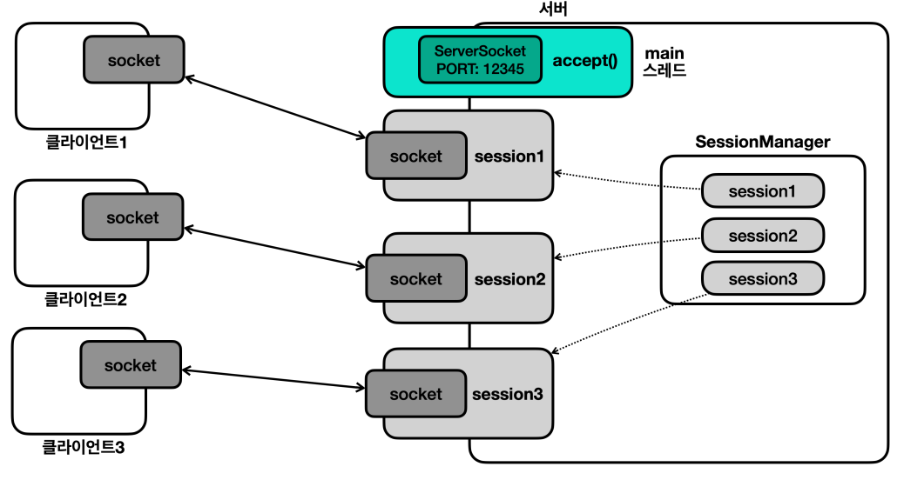
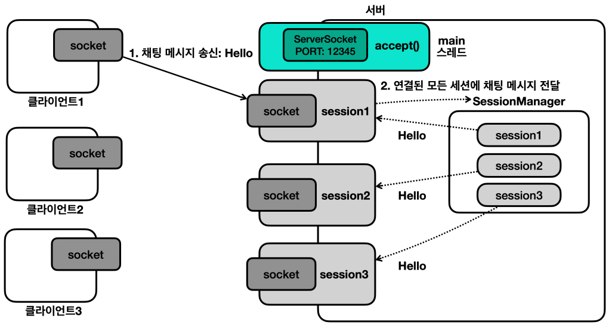
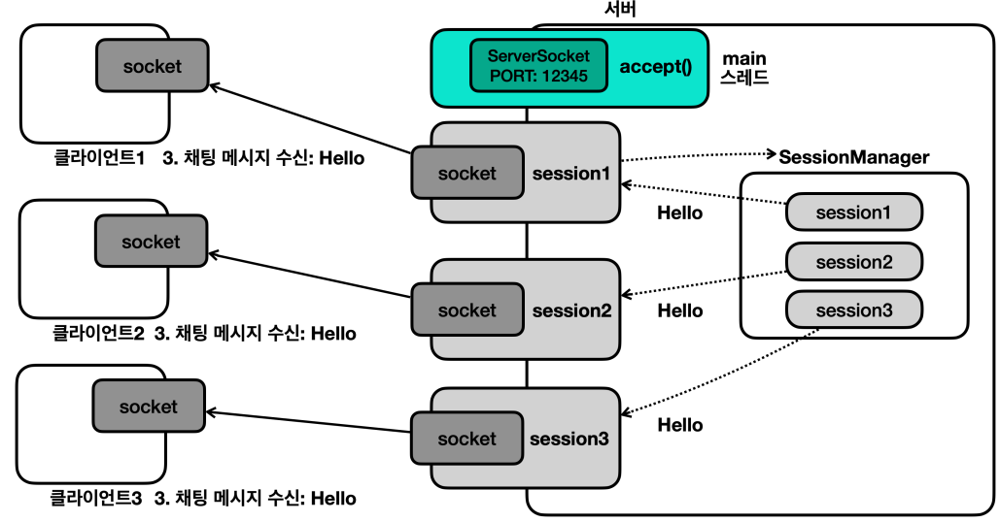
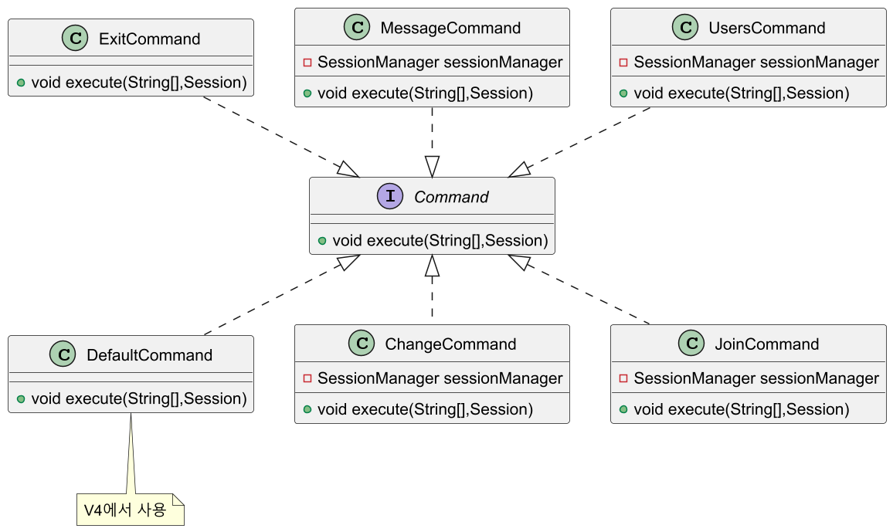

# 자바 - 채팅 프로그램

네트워크 프로그램을 응용해서 채팅 프로그램을 만들어보자.


---

## 클라이언트

채팅은 실시간으로 대화를 주고받아야 한다. 그런데 [기존에 작성한 네트워크 프로그램](https://github.com/genesis12345678/TIL/blob/main/Java/adv_1/network/program2.md)은
사용자의 콘솔 입력이 있을 때까지 무한정 대기하는 문제가 있다.

```java
System.out.print("전송 문자: ");
String message = sc.nextLine(); //블로킹

//서버에게 문자 보내기
output.writeUTF(message);
log("client -> server: " + message);
```

스레드는 사용자의 콘솔 입력을 대기하기 때문에 실시간으로 다른 사용자가 보낸
메시지를 콘솔에 출력할 수 없다.

콘솔의 입력을 기다리는 부분 외에도 서버로부터 메시지를 받는 코드도 블로킹이 된다.
```java
//서버로부터 문자 받기
String received = input.readUTF(); //블로킹
log("client <- server: " + received);
```

**따라서 사용자의 콘솔 입력과 서버로부터 메시지를 받는 부분을 별도의 스레드로 분리해야 한다.**


```java
import java.io.DataInputStream;
import java.io.IOException;

import static util.MyLogger.log;

/**
 * 채팅 프로그램(클라이언트) - ReadHandler
 * 서버로부터 오는 메시지를 콘솔에 출력하는 스레드
 */
public class ReadHandler implements Runnable {

    private final DataInputStream input;
    private final Client client;
    private boolean closed = false;

    public ReadHandler(DataInputStream input, Client client) {
        this.input = input;
        this.client = client;
    }

    @Override
    public void run() {
        try {
            while (true) {
                String received = input.readUTF();
                System.out.println(received);
            }
        } catch (IOException e) {
            log(e);
        } finally {
            client.close();
        }
    }

    public synchronized void close() {
        if (closed) return;

        //종료 로직 필요시 작성
        closed = true;
        log("readHandler 종료");
    }
}
```
- 서버의 메시지를 반복해서 받고, 콘솔에 출력하는 기능을 제공하는 스레드이다.
- 클라이언트 종료시 `ReadHandler`도 종료된다. 중복 종료를 막기 위해 동기화 코드(`synchronized`)와
플래그(`closed`)를 사용한다.
- `IOException` 예외가 발생하면 `client.close()`로 클라이언트를 종료하고 전체 자원을 정리한다.

```java
import java.io.DataOutputStream;
import java.io.IOException;
import java.util.NoSuchElementException;
import java.util.Scanner;

import static util.MyLogger.log;

/**
 * 채팅 프로그램(클라이언트) - WriteHandler
 * 사용자 콘솔의 입력을 받아서 서버로 메시지를 전송하는 스레드
 */
public class WriteHandler implements Runnable {

    private static final String DELIMITER = "|";

    private final DataOutputStream output;
    private final Client client;
    private boolean closed = false;

    public WriteHandler(DataOutputStream output, Client client) {
        this.output = output;
        this.client = client;
    }

    @Override
    public void run() {

        Scanner sc = new Scanner(System.in);

        try {
            String username = inputUsername(sc);

            output.writeUTF("/join" + DELIMITER + username);

            while (true) {
                String toSend = sc.nextLine(); //블로킹

                if (toSend.isEmpty()) continue;

                if (toSend.equals("/exit")) {
                    output.writeUTF(toSend);
                    break;
                }

                // "/"로 시작하면 명령어, 나머지는 일반 메시지
                if (toSend.startsWith("/")) {
                    output.writeUTF(toSend);
                } else {
                    output.writeUTF("/message" + DELIMITER + toSend);
                }
            }

        } catch (IOException | NoSuchElementException e) {
            log(e);
        } finally {
            client.close();
        }
    }

    private String inputUsername(Scanner sc) {
        System.out.println("이름을 입력하세요.");
        String username;

        //빈 이름을 입력하면 다시 입력 받도록 함
        do {
            username = sc.nextLine();
        } while (username.isEmpty());

        return username;
    }

    public synchronized void close() {

        if (closed) return;

        try {
            System.in.close(); //Scanner 입력 중지 (사용자의 입력을 닫음)
        } catch (IOException e) {
            log(e);
        }

        closed = true;
        log("writeHandler 종료");
    }
}
```
- `close()`를 호출하면 `System.in.close()`를 통해 사용자의 콘솔 입력을 닫는다.
- 이렇게 하면 `scanner.nextLine()` 코드에서 대기하는 스레드에 `NoSuchElementException` 예외가
발생하면서 대기 상태에서 빠져나올 수 있다.
- 서버가 연결을 끊은 경우에 클라이언트의 자원이 정리되는데 이때 유용하게 사용된다.
- `IOException` 예외가 발생하면 `client.close()`로 클라이언트를 종료하고 전체 자원을 정리한다.

```java
import java.io.DataInputStream;
import java.io.DataOutputStream;
import java.io.IOException;
import java.net.Socket;

import static network.tcp.SocketCloseUtil.*;
import static util.MyLogger.*;

/**
 * 채팅 프로그램(클라이언트) - Client
 * 클라이언트 전반을 관리하는 클래스
 */
public class Client {

    private final String host;
    private final int port;

    private Socket socket;
    private DataInputStream input;
    private DataOutputStream output;

    private ReadHandler readHandler;
    private WriteHandler writeHandler;
    private boolean closed = false;

    public Client(String host, int port) {
        this.host = host;
        this.port = port;
    }

    public void start() throws IOException {
        log("클라이언트 시작");

        this.socket = new Socket(host, port);
        this.input = new DataInputStream(socket.getInputStream());
        this.output = new DataOutputStream(socket.getOutputStream());
        this.readHandler = new ReadHandler(input, this);
        this.writeHandler = new WriteHandler(output, this);

        Thread readThread = new Thread(readHandler, "readHandler");
        Thread writeThread = new Thread(writeHandler, "writeHandler");
        readThread.start();
        writeThread.start();
    }

    public synchronized void close() {
        if (closed) return;

        writeHandler.close();
        readHandler.close();
        closeAll(socket, input, output);

        closed = true;
        log("연결 종료: " + socket);
    }
}
```
- 클라이언트 전반을 관리하는 클래스로, `Socket`, `ReadHandler`, `WriteHandler`를 모두 생성하고 관리한다.
- `close()` 메서드를 통해 전체 자원을 정리하는 기능도 제공한다.

```java
import java.io.IOException;

public class ClientMain {

    private static final int PORT = 12345;

    public static void main(String[] args) throws IOException {
        Client client = new Client("localhost", PORT);
        client.start();
    }
}
```

---

## 서버

채팅 프로그램은 한 명이 이야기하면 그 이야기를 모두가 들을 수 있어야 한다. 따라서
하나의 클라이언트가 보낸 메시지를 서버가 받은 다음, 서버에서 모든 클라이언트에게 메시지를 다시 전송해야 한다.

이렇게 하려면 서버에서 모든 세션을 관리해야 한다. 그렇게 해야 모든 세션에 메시지를 전달할 수 있다.







```java
import network.tcp.SocketCloseUtil;

import java.io.DataInputStream;
import java.io.DataOutputStream;
import java.io.IOException;
import java.net.Socket;

import static util.MyLogger.*;

/**
 * 채팅 프로그램(서버) - Session
 */
public class Session implements Runnable {

    private final Socket socket;
    private final DataInputStream input;
    private final DataOutputStream output;
    private final CommandManager commandManager;
    private final SessionManager sessionManager;

    private boolean closed = false;
    private String username; //클라이언트의 이름

    public Session(Socket socket, CommandManager commandManager, SessionManager sessionManager) throws IOException {
        this.socket = socket;
        this.input = new DataInputStream(socket.getInputStream());
        this.output = new DataOutputStream(socket.getOutputStream());
        this.commandManager = commandManager;
        this.sessionManager = sessionManager;

        //Session 생성 시점에 SessionManager에 session을 등록
        this.sessionManager.addSession(this);
    }

    @Override
    public void run() {
        try {
            while (true) {
                //클라이언트로부터 문자 받기
                String received = input.readUTF();
                log("client -> server: " + received);

                //메시지를 전체에게 보내기
                commandManager.execute(received, this);
            }

        } catch (IOException e) {
            log(e);
        } finally {
            sessionManager.remove(this);
            sessionManager.sendAll(username + "님이 퇴장했습니다.");
            close();
        }
    }

    public void send(String message) throws IOException {
        log("server -> client: " + message);
        output.writeUTF(message);
    }

    public void close() {
        if (closed) return;

        SocketCloseUtil.closeAll(socket, input, output);
        closed = true;
        log("연결 종료: " + socket);
    }

    public String getUsername() {
        return username;
    }

    public void setUsername(String username) {
        this.username = username;
    }
}
```
- `run()`에서 클라이언트로부터 메시지를 전송 받고, 전송 받은 메시지를
`commandManger.execute()`를 사용해서 실행한다.
- 예외가 발생하면 세션 매니저에서 세션을 제거하고, 나머지 클라이언트에게 퇴장 소식을
알린다. 그리고 자원을 정리한다.
- `send(message)`를 호출하면 해당 세션의 클라이언트에게 메시지를 보낸다.

```java
import java.io.IOException;
import java.util.ArrayList;
import java.util.List;
import java.util.Objects;

import static util.MyLogger.log;

/**
 * 채팅 프로그램(서버) - SessionManager
 */
public class SessionManager {

    private final List<Session> sessions = new ArrayList<>();

    public synchronized void addSession(Session session) {
        sessions.add(session);
    }

    public synchronized void remove(Session session) {
        sessions.remove(session);
    }

    /**
     * 모든 세션을 종료하고, 세션 관리자에서 제거
     */
    public synchronized void closeAll() {
        for (Session session : sessions) {
            session.close();
        }
        sessions.clear();
    }

    /**
     * 모든 세션에 메시지를 전달, 각 세션의 send()를 호출
     * @param message 클라이언트가 입력한 메시지
     */
    public synchronized void sendAll(String message) {
        for (Session session : sessions) {
            try {
                session.send(message);
            } catch (IOException e) {
                log(e);
            }
        }
    }

    /**
     * @return 모든 세션에 등록된 사용자의 이름
     */
    public synchronized List<String> getAllUsername() {
        return sessions.stream()
                       .map(Session::getUsername)
                       .filter(Objects::nonNull)
                       .toList();
    }
}
```

```java
import java.io.IOException;

/**
 * 채팅 프로그램(서버) - CommandManager
 * 클라이언트에게 전달받은 메시지를 처리하는 인터페이스
 */
public interface CommandManager {
    /**
     * @param totalMessage 클라이언트에게 전달 받은 메시지
     * @param session 현재 세션
     * @throws IOException
     */
    void execute(String totalMessage, Session session) throws IOException;
}
```

```java
import java.io.IOException;
import java.net.ServerSocket;
import java.net.Socket;

import static util.MyLogger.log;

/**
 * 채팅 프로그램(서버) - Server
 */
public class Server {

    private final int port;
    private final CommandManager commandManager;
    private final SessionManager sessionManager;

    private ServerSocket serverSocket;

    public Server(int port, CommandManager commandManager, SessionManager sessionManager) {
        this.port = port;
        this.commandManager = commandManager;
        this.sessionManager = sessionManager;
    }

    public void start() throws IOException {
        log("서버 시작: " + commandManager.getClass());
        serverSocket = new ServerSocket(port);
        log("서버 소켓 시작 - 리스닝 포트: " + port);

        addShutdownHook(); //셧다운 훅 등록
        running(); //프로그램 작동
    }

    private void addShutdownHook() {
        ShutdownHook target = new ShutdownHook(serverSocket, sessionManager);
        Runtime.getRuntime().addShutdownHook(new Thread(target, "shutdown"));
    }

    private void running() {
        try {
            while (true) {
                Socket socket = serverSocket.accept();//블로킹
                log("소켓 연결: " + socket);

                Session session = new Session(socket, commandManager, sessionManager);
                Thread thread = new Thread(session);
                thread.start();
            }
        } catch (IOException e) {
            log("서버 소켓 종료: " + e);
        }
    }

    static class ShutdownHook implements Runnable {

        private final ServerSocket serverSocket;
        private final SessionManager sessionManager;

        public ShutdownHook(ServerSocket serverSocket, SessionManager sessionManager) {
            this.serverSocket = serverSocket;
            this.sessionManager = sessionManager;
        }

        @Override
        public void run() {
            log("shutdownHook 실행");
            try {
                sessionManager.closeAll();
                serverSocket.close();

                Thread.sleep(1000); //자원 정리 대기
            } catch (Exception e) {
                e.printStackTrace();
                System.out.println("e = " + e);
            }
        }
    }
}
```

```java
import java.io.IOException;

public class ServerMain {

    private static final int PORT = 12345;

    public static void main(String[] args) throws IOException {
        SessionManager sessionManager = new SessionManager();

        //CommandManager 점진적으로 변경
//        CommandManager commandManager = new CommandManagerV1(sessionManager);
//        CommandManager commandManager = new CommandManagerV2(sessionManager);
//        CommandManager commandManager = new CommandManagerV3(sessionManager);
//        CommandManager commandManager = new CommandManagerV4(sessionManager);

        Server server = new Server(PORT, commandManager, sessionManager);
        server.start();
    }
}
```

### V1

```java
import java.io.IOException;
/**
 * 채팅 프로그램(서버) - CommandManager
 * @version 1
 */
public class CommandManagerV1 implements CommandManager {

    private final SessionManager sessionManager;

    public CommandManagerV1(SessionManager sessionManager) {
        this.sessionManager = sessionManager;
    }

    @Override
    public void execute(String totalMessage, Session session) throws IOException {

        if (totalMessage.startsWith("/exit")) {
            throw new IOException("exit");
        }

        sessionManager.sendAll(totalMessage);
    }
}
```

- 클라이언트에게 일반적인 메시지를 전달 받으면 모든 클라이언트에게 같은
메시지를 전달해야 한다.
- 단순히 `sessionManager.sendAll(message)`를 사용해서 해당 기능을 처리한다.
- `/exit`가 호출되면 `IOException` 예외를 던지고, 세션은 해당 예외를 잡아서 세션을 종료한다.

**실행 결과 - 서버**
```text
12:21:33.764 [     main] 서버 시작: class chat.server.CommandManagerV1
12:21:33.773 [     main] 서버 소켓 시작 - 리스닝 포트: 12345
12:21:51.344 [     main] 소켓 연결: Socket[addr=/127.0.0.1,port=60070,localport=12345]
12:22:56.844 [     main] 소켓 연결: Socket[addr=/127.0.0.1,port=60127,localport=12345]
12:23:07.593 [ Thread-0] client -> server: /join|client1
12:23:07.593 [ Thread-0] server -> client: /join|client1
12:23:07.593 [ Thread-0] server -> client: /join|client1
12:23:13.919 [ Thread-1] client -> server: /join|client2
12:23:13.919 [ Thread-1] server -> client: /join|client2
12:23:13.920 [ Thread-1] server -> client: /join|client2
12:23:26.190 [ Thread-0] client -> server: /message|hello
12:23:26.191 [ Thread-0] server -> client: /message|hello
12:23:26.191 [ Thread-0] server -> client: /message|hello
12:23:30.473 [ Thread-1] client -> server: /message|hihi
12:23:30.473 [ Thread-1] server -> client: /message|hihi
12:23:30.473 [ Thread-1] server -> client: /message|hihi
12:24:10.348 [ Thread-0] client -> server: /exit
12:24:10.349 [ Thread-0] java.io.IOException: exit
12:24:10.349 [ Thread-0] server -> client: null님이 퇴장했습니다.
12:24:10.350 [ Thread-0] 연결 종료: Socket[addr=/127.0.0.1,port=60070,localport=12345]
12:24:14.320 [ Thread-1] client -> server: /exit
12:24:14.321 [ Thread-1] java.io.IOException: exit
12:24:14.321 [ Thread-1] 연결 종료: Socket[addr=/127.0.0.1,port=60127,localport=12345]
12:25:43.994 [ shutdown] shutdownHook 실행
12:25:43.996 [     main] 서버 소켓 종료: java.net.SocketException: Socket closed
```
**실행 결과 - 클라이언트1**
```text
12:21:51.326 [     main] 클라이언트 시작
이름을 입력하세요.
client1
/join|client1
/join|client2
hello
/message|hello
/message|hihi
/exit
12:24:10.348 [writeHandler] writeHandler 종료
12:24:10.349 [writeHandler] readHandler 종료
12:24:10.350 [writeHandler] 연결 종료: Socket[addr=localhost/127.0.0.1,port=12345,localport=60070]
12:24:10.351 [readHandler] java.net.SocketException: Socket closed
```
**실행 결과 - 클라이언트2**
```text
12:22:56.828 [     main] 클라이언트 시작
이름을 입력하세요.
/join|client1
client2
/join|client2
/message|hello
hihi
/message|hihi
null님이 퇴장했습니다.
/exit
12:24:14.320 [writeHandler] writeHandler 종료
12:24:14.321 [writeHandler] readHandler 종료
12:24:14.322 [readHandler] java.io.EOFException
12:24:14.322 [writeHandler] 연결 종료: Socket[addr=localhost/127.0.0.1,port=12345,localport=60127]
```

### V2

```java
import java.io.IOException;
import java.util.List;

/**
 * 채팅 프로그램(서버) - CommandManager
 * @version 2
 */
public class CommandManagerV2 implements CommandManager {

    private static final String DELIMITER = "\\|";
    private static final String JOIN_COMMAND = "/join";
    private static final String MESSAGE_COMMAND = "/message";
    private static final String CHANGE_COMMAND = "/change";
    private static final String USERS_COMMAND = "/users";
    private static final String EXIT = "/exit";

    private final SessionManager sessionManager;

    public CommandManagerV2(SessionManager sessionManager) {
        this.sessionManager = sessionManager;
    }

    @Override
    public void execute(String totalMessage, Session session) throws IOException {

        /*메시지를 구분자("|")를 기준으로 split*/

        //입장
        if (totalMessage.startsWith(JOIN_COMMAND)) {
            String[] split = totalMessage.split(DELIMITER);
            String username = split[1];
            session.setUsername(username); //세션에 이름을 등록
            sessionManager.sendAll(username + "님이 입장했습니다."); //모든 사람들에게 입장을 알림
        }
        //메시지
        else if (totalMessage.startsWith(MESSAGE_COMMAND)) {
            //클라이언트 전체에게 문자 보내기
            String[] split = totalMessage.split(DELIMITER);
            String message = split[1];
            sessionManager.sendAll("[" + session.getUsername() + "] " + message); //"[이름] 메시지" 형식
        }
        //이름 변경
        else if (totalMessage.startsWith(CHANGE_COMMAND)) {
            String[] split = totalMessage.split(DELIMITER);
            String changeName = split[1];
            sessionManager.sendAll(session.getUsername() + "님이 " + changeName + "로 이름을 변경했습니다.");
            session.setUsername(changeName); //세션 사용자 이름 수정
        }
        //전체 사용자
        else if (totalMessage.startsWith(USERS_COMMAND)) {
            List<String> usernames = sessionManager.getAllUsername();

            StringBuilder message = new StringBuilder();

            message.append("전체 접속자 : ")
                   .append(usernames.size())
                   .append("\n");

            for (String username : usernames) {
                message.append(" - ")
                       .append(username)
                       .append("\n");
            }

            //현재 세션에게만 메시지 전달
            session.send(message.toString());
        }
        //종료
        else if (totalMessage.startsWith(EXIT)) {
            throw new IOException("exit");
        }
        else {
            session.send("처리할 수 없는 명령어입니다.");
        }
    }
}
```
**실행 결과 - 서버**
```text
12:55:16.093 [     main] 서버 시작: class chat.server.CommandManagerV2
12:55:16.099 [     main] 서버 소켓 시작 - 리스닝 포트: 12345
12:55:21.394 [     main] 소켓 연결: Socket[addr=/127.0.0.1,port=61550,localport=12345]
12:55:25.561 [     main] 소켓 연결: Socket[addr=/127.0.0.1,port=61561,localport=12345]
12:55:29.626 [ Thread-0] client -> server: /join|client1
12:55:29.627 [ Thread-0] server -> client: client1님이 입장했습니다.
12:55:29.627 [ Thread-0] server -> client: client1님이 입장했습니다.
12:55:35.009 [ Thread-1] client -> server: /join|client2
12:55:35.009 [ Thread-1] server -> client: client2님이 입장했습니다.
12:55:35.010 [ Thread-1] server -> client: client2님이 입장했습니다.
12:55:39.313 [ Thread-1] client -> server: /message|hello
12:55:39.314 [ Thread-1] server -> client: [client2] hello
12:55:39.314 [ Thread-1] server -> client: [client2] hello
12:55:50.678 [ Thread-0] client -> server: /change|newclient1
12:55:50.678 [ Thread-0] server -> client: client1님이 newclient1로 이름을 변경했습니다.
12:55:50.679 [ Thread-0] server -> client: client1님이 newclient1로 이름을 변경했습니다.
12:56:02.640 [ Thread-1] client -> server: /users
12:56:02.642 [ Thread-1] server -> client: 전체 접속자 : 2
 - newclient1
 - client2

12:56:44.634 [ Thread-0] client -> server: /exit
12:56:44.634 [ Thread-0] java.io.IOException: exit
12:56:44.635 [ Thread-0] server -> client: newclient1님이 퇴장했습니다.
12:56:44.636 [ Thread-0] 연결 종료: Socket[addr=/127.0.0.1,port=61550,localport=12345]
12:56:48.547 [ Thread-1] client -> server: /exit
12:56:48.548 [ Thread-1] java.io.IOException: exit
12:56:48.548 [ Thread-1] 연결 종료: Socket[addr=/127.0.0.1,port=61561,localport=12345]
12:56:59.207 [ shutdown] shutdownHook 실행
12:56:59.209 [     main] 서버 소켓 종료: java.net.SocketException: Socket closed
```
**실행 결과 - 클라이언트1**
```text
12:55:21.378 [     main] 클라이언트 시작
이름을 입력하세요.
client1
client1님이 입장했습니다.
client2님이 입장했습니다.
[client2] hello
/change|newclient1
client1님이 newclient1로 이름을 변경했습니다.
/exit
12:56:44.634 [writeHandler] writeHandler 종료
12:56:44.634 [writeHandler] readHandler 종료
12:56:44.637 [readHandler] java.net.SocketException: Socket closed
12:56:44.637 [writeHandler] 연결 종료: Socket[addr=localhost/127.0.0.1,port=12345,localport=61550]
```
**실행 결과 - 클라이언트2**
```text
12:55:25.544 [     main] 클라이언트 시작
이름을 입력하세요.
client1님이 입장했습니다.
client2
client2님이 입장했습니다.
hello
[client2] hello
client1님이 newclient1로 이름을 변경했습니다.
/users
전체 접속자 : 2
 - newclient1
 - client2

newclient1님이 퇴장했습니다.
/exit
12:56:48.547 [writeHandler] writeHandler 종료
12:56:48.548 [writeHandler] readHandler 종료
12:56:48.548 [readHandler] java.io.EOFException
12:56:48.549 [writeHandler] 연결 종료: Socket[addr=localhost/127.0.0.1,port=12345,localport=61561]
```

기본적인 채팅 요구사항은 모두 구현되었다. 

문제는 앞으로 새로운 기능이 추가될 때 발생한다. 기능이 추가되면 `CommandManager`에
새로운 `if`문이 계속 추가될 것이다. 새로운 기능이 추가되어도 기존 코드에
영향을 최소화하면서 기능을 추가할 수 있도록 리팩토링이 필요하다.

### V3

각각의 명령어를 하나의 `Command`로 보고 인터페이스와 구현체로 구분해보자.

(참고: [커맨드 패턴](https://github.com/genesis12345678/TIL/blob/main/Java/java8/designpattern/behavioral/command/Command.md))



```java
import java.io.IOException;
/**
 * 채팅 프로그램(서버) - Command
 * 각각의 명령어 하나를 처리하는 목적을 가짐
 */
public interface Command {
    void execute(String[] args, Session session) throws IOException;
}
```

```java
/**
 * 채팅 프로그램(서버) - JoinCommand
 */
public class JoinCommand implements Command {

    private final SessionManager sessionManager;

    public JoinCommand(SessionManager sessionManager) {
        this.sessionManager = sessionManager;
    }

    @Override
    public void execute(String[] args, Session session) {
        String username = args[1];
        session.setUsername(username);

        sessionManager.sendAll(username + "님이 입장했습니다.");
    }
}
```
```java
/**
 * 채팅 프로그램(서버) - ChangeCommand
 */
public class ChangeCommand implements Command {

    private final SessionManager sessionManager;

    public ChangeCommand(SessionManager sessionManager) {
        this.sessionManager = sessionManager;
    }

    @Override
    public void execute(String[] args, Session session) {
        String changeName = args[1];
        sessionManager.sendAll(session.getUsername() + "님이 " + changeName + "로 이름을 변경했습니다.");
        session.setUsername(changeName);
    }
}
```
```java
/**
 * 채팅 프로그램(서버) - MessageCommand
 */
public class MessageCommand implements Command {

    private final SessionManager sessionManager;

    public MessageCommand(SessionManager sessionManager) {
        this.sessionManager = sessionManager;
    }

    @Override
    public void execute(String[] args, Session session) {
        String message = args[1];
        sessionManager.sendAll("[" + session.getUsername() + "] " + message);
    }
}
```
```java
/**
 * 채팅 프로그램(서버) - UsersCommand
 */
public class UsersCommand implements Command {

    private final SessionManager sessionManager;

    public UsersCommand(SessionManager sessionManager) {
        this.sessionManager = sessionManager;
    }

    @Override
    public void execute(String[] args, Session session) throws IOException {
        List<String> usernames = sessionManager.getAllUsername();
        StringBuilder message = new StringBuilder();

        message.append("전체 접속자 : ")
               .append(usernames.size())
               .append("\n");

        for (String username : usernames) {
            message.append(" - ")
                   .append(username)
                   .append("\n");
        }

        session.send(message.toString());
    }
}
```
```java
/**
 * 채팅 프로그램(서버) - ExitCommand
 */
public class ExitCommand implements Command {

    @Override
    public void execute(String[] args, Session session) throws IOException {
        throw new IOException("exit");
    }
}
```
```java
import java.io.IOException;
import java.util.HashMap;
import java.util.Map;

/**
 * 채팅 프로그램(서버) - CommandManager
 * @version 3
 */
public class CommandManagerV3 implements CommandManager {

    private static final String DELIMITER = "\\|";
    private final Map<String, Command> commands = new HashMap<>();

    public CommandManagerV3(SessionManager sessionManager) {
        commands.put("/join", new JoinCommand(sessionManager));
        commands.put("/message", new MessageCommand(sessionManager));
        commands.put("/change", new ChangeCommand(sessionManager));
        commands.put("/users", new UsersCommand(sessionManager));
        commands.put("/exit", new ExitCommand());
    }

    @Override
    public void execute(String totalMessage, Session session) throws IOException {
        //CommandManager에서 split까지 수행
        String[] args = totalMessage.split(DELIMITER);

        String key = args[0];
        Command command = commands.get(key);

        if (command == null) {
            session.send("처리할 수 없는 명령어입니다: " + totalMessage);
            return;
        }

        command.execute(args, session);
    }
}
```

> **동시성 문제**
> 
> - 여러 스레드가 동시에 `commands`에 접근해서 데이터를 조회할 수 있다.
> - 하지만 `commands`는 데이터 초기화 이후에는 데이터를 전혀 변경하지 않는다.
> - 따라서 여러 스레드가 동시에 값을 조회해도 문제가 발생하지 않는다.
> - 만약 `commands`의 데이터를 중간에 변경할 수 있게 하려면 동시성 문제를 고민해야 한다.

### V4

이전 버전에서 `if(command == null)`을 처리하는 부분을 리팩토링 해보자.

```java
/**
 * 채팅 프로그램(서버) - DefaultCommand
 */
public class DefaultCommand implements Command {

    @Override
    public void execute(String[] args, Session session) throws IOException {
        session.send("처리할 수 없는 명령어입니다: " + Arrays.toString(args));
    }
}
```
```java
/**
 * 채팅 프로그램(서버) - CommandManager
 * @version 4
 */
public class CommandManagerV4 implements CommandManager {

    private static final String DELIMITER = "\\|";
    private final Map<String, Command> commands = new HashMap<>();
    private final Command defaultCommand = new DefaultCommand();

    public CommandManagerV4(SessionManager sessionManager) {
        commands.put("/join", new JoinCommand(sessionManager));
        commands.put("/message", new MessageCommand(sessionManager));
        commands.put("/change", new ChangeCommand(sessionManager));
        commands.put("/users", new UsersCommand(sessionManager));
        commands.put("/exit", new ExitCommand());
    }

    @Override
    public void execute(String totalMessage, Session session) throws IOException {
        String[] args = totalMessage.split(DELIMITER);

        String key = args[0];

        //NullObject Pattern
        Command command = commands.getOrDefault(key, defaultCommand);
        command.execute(args,session);
    }
}
```

이제 `null`을 받지 않고 항상 `Command` 객체를 받아서 처리할 수 있다.

> **Null Object Pattern**
> 
> - 위와 같이 `null`을 객체(Object)처럼 처리하는 방법을 말한다.
> - `null` 대신 사용할 수 있는 특별한 객체를 만들어 `null`로 인해 발생할 수 있는
>   예외 상황을 방지하고 코드의 간결성을 높이는 데 목적이 있다.
> - 이 패턴을 사용하면 `null` 값 대신 특정 동작을 하는 객체를 반환하게 되어 클라이언트 
>   코드에서 `null` 체크를 할 필요가 없어진다.
> - 불필요한 조건문을 줄이고 기본 동작을 정의하는 데 유용하다.

> **Command Pattern**
> 
> - **특징**
>   - 분리: 작업을 호출하는 객체와 작업을 수행하는 객체를 분리한다.
>   - 확장성: 기존 코드를 변경하지 않고 새로운 명령을 추가할 수 있다.
> - **장점**
>   - 새로운 커맨드를 쉽게 추가할 수 있다. 그리고 기존 코드를 대부분 변경할 필요가 없다.
>   - 작업을 호출하는 객체와 작업을 수행하는 객체가 분리되어 있다. 복잡한 `if`문을 제거할 수 있다.
>   - 각각의 기능이 명확하게 분리된다. 특정 기능을 수정해야 할 때 수정해야 하는 클래스가 명확해진다.
> - **단점**
>   - 코드의 복잡성이 증가한다. `Command` 인터페이스와 구현체들, `Command` 객체를 호출하고
>   관리하는 클래스 등 여러 클래스를 생성해야 한다.
>   - 단순한 `if`문 몇 개가 더 나은 설계일 수 있다.

---

[이전 ↩️ - 네트워크 예외](https://github.com/genesis12345678/TIL/blob/main/Java/adv_1/network/networkex.md)

[메인 ⏫](https://github.com/genesis12345678/TIL/blob/main/Java/adv_1/Main.md)

[다음 ↪️ - HTTP 서버 개발](https://github.com/genesis12345678/TIL/blob/main/Java/adv_1/was/server1.md)