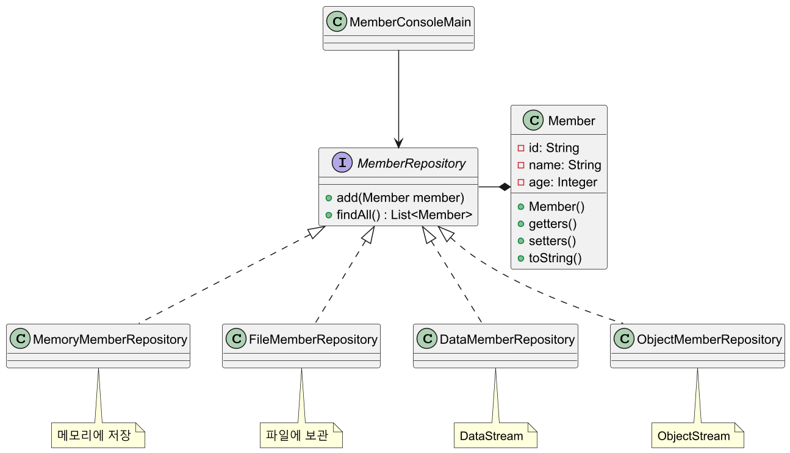

# 자바 - I/O 활용 예제

I/O를 사용해서 다양한 방법으로 회원 데이터를 관리하는 프로그램을 만들어보자.

기본적인 구조는 다음과 같다.



```java
public class Member {

    private String id;
    private String name;
    private Integer age;

    public Member(String id, String name, Integer age) {
        this.id = id;
        this.name = name;
        this.age = age;
    }

    /*getters and setters*/
    /*toString*/
}
```
```java
public interface MemberRepository {
    void add(Member member);
    List<Member> findAll();
}
```
```java
public class MemberConsoleMain {

    //구현체를 변경해가면서 사용
//    private static final MemberRepository repository = new MemoryMemberRepository();
//    private static final MemberRepository repository = new FileMemberRepository();
//    private static final MemberRepository repository = new DataMemberRepository();
//    private static final MemberRepository repository = new ObjectMemberRepository();

    public static void main(String[] args) {

        Scanner sc = new Scanner(System.in);

        while (true) {
            System.out.println("1.회원 등록 | 2.회원 목록 조회 | 3.종료");
            System.out.print("선택: ");

            int choice = sc.nextInt();
            sc.nextLine(); //newline 제거

            switch (choice) {
                case 1 -> registerMember(sc);
                case 2 -> displayMembers();
                case 3 -> {
                    System.out.println("프로그램을 종료합니다.");
                    return;
                }
                default -> System.out.println("잘못된 선택입니다. 다시 입력하세요.");
            }
        }
    }

    private static void registerMember(Scanner sc) {
        System.out.print("ID 입력: ");
        String id = sc.nextLine();

        System.out.print("Name 입력: ");
        String name = sc.nextLine();

        System.out.print("Age 입력: ");
        int age = sc.nextInt();
        sc.nextLine(); //newline 제거

        repository.add(new Member(id, name, age));
        System.out.println("회원이 성공적으로 등록되었습니다.");
    }

    private static void displayMembers() {
        List<Member> members = repository.findAll();
        System.out.println("회원 목록: ");

        members.forEach(System.out::println);
    }
}
```

**회원 등록**
```text
1.회원 등록 | 2.회원 목록 조회 | 3.종료
선택: 1
ID 입력: 1
Name 입력: 회원1
Age 입력: 20
회원이 성공적으로 등록되었습니다.
```
**목록 조회**
```text
1.회원 등록 | 2.회원 목록 조회 | 3.종료
선택: 2
회원 목록: 
Member{id='1', name='회원1', age=20}
Member{id='2', name='회원2', age=21}
```
**종료**
```text
1.회원 등록 | 2.회원 목록 조회 | 3.종료
선택: 3
프로그램을 종료합니다.
```

---

## V1 - 메모리

가장 단순한 방법인 메모리에 저장하고 관리하는 방법을 사용해보자.

```java
public class MemoryMemberRepository implements MemberRepository {

    private final List<Member> members = new ArrayList<>();

    @Override
    public void add(Member member) {
        members.add(member);
    }

    @Override
    public List<Member> findAll() {
        return new ArrayList<>(members);
    }
}
```

당연하게도 이 방식은 데이터를 메모리에 보관하기 때문에 프로그램을 종료하면
데이터가 사라지게 된다.

---

## V2 - 파일에 보관

데이터를 영구 보존하기 위해 다음과 같이 한 줄 단위로 파일에 저장해보자.

```text
id1, member1, 20
id2, member2, 30
```

문자를 다루므로 `Reader`, `Writer`를 사용하는 것이 편리하다. 그리고
한 줄 단위로 처리할 때는 `BufferedReader`가 유용하므로 `BufferedReader`와 `BuffereWriter`를 사용해보자.

```java
import static java.nio.charset.StandardCharsets.UTF_8;

public class FileMemberRepository implements MemberRepository {

    private static final String FILE_PATH = "temp/members-txt.dat";
    private static final String DELIMITER = ",";

    @Override
    public void add(Member member) {
        //try-with-resources
        //FileWriter 생성자에 boolean append를 true로 설정해 기존 파일에 데이터를 추가하도록 설정
        try (BufferedWriter bw = new BufferedWriter(new FileWriter(FILE_PATH, UTF_8, true))) {

            bw.write(member.getId() + DELIMITER + member.getName() + DELIMITER + member.getAge());
            bw.newLine(); //각 회원 구분을 위해 다음 줄로 이동

        } catch (IOException e) {
            throw new RuntimeException(e);
        }
    }

    @Override
    public List<Member> findAll() {

        List<Member> members = new ArrayList<>();

        try (BufferedReader br = new BufferedReader(new FileReader(FILE_PATH, UTF_8))) {

            String line;
            while ((line = br.readLine()) != null) {

                String[] memberData = line.split(DELIMITER);

                members.add(new Member(
                    memberData[0],
                    memberData[1],
                    Integer.valueOf(memberData[2])
                ));
            }

            return members;

        } catch (FileNotFoundException fe) {
            return List.of(); //빈 리스트 반환
        } catch (IOException e) {
            throw new RuntimeException(e);
        }
    }
}
```

`Member` 클래스는 `String` 외에도 `Integer` 타입을 사용하는데, 모든 데이터를
문자로 변경해서 저장하는 부분이 아쉽다. 그래서 `age`의 경우 `Integer.valueOf()`를 사용해야 한다.

그리고 각 필드(`id`, `name`, `age`)를 구분하기 위해 구분자(`DELIMITER`)를 넣어서 저장하고, 조회할 때도
구분자를 사용해서 각 필드를 구분하는 것도 아쉽다.

---

## V3 - DataStream

`DataOutputStream`, `DataInputStream`은 자바의 데이터 타입을 그대로 사용할 수 있다.
따라서 자바의 타입을 그대로 사용하면서 파일에 데이터를 저장하고 불러올 수 있고, 구분자도
사용하지 않아도 된다.

```java
public class DataMemberRepository implements MemberRepository {

    private static final String FILE_PATH = "temp/members-data.dat";

    @Override
    public void add(Member member) {

        try (DataOutputStream dos = new DataOutputStream(new FileOutputStream(FILE_PATH, true))) {
            
           //필드의 타입에 맞는 메서드 호출
           dos.writeUTF(member.getId());
           dos.writeUTF(member.getName());
           dos.writeInt(member.getAge());

        } catch (IOException e) {
            throw new RuntimeException(e);
        }
    }

    @Override
    public List<Member> findAll() {

        List<Member> members = new ArrayList<>();

        try (DataInputStream dis = new DataInputStream(new FileInputStream(FILE_PATH))) {

            while (dis.available() > 0) {
                //필드의 각 타입에 맞는 메서드 호출
                members.add(new Member(
                    dis.readUTF(),
                    dis.readUTF(),
                    dis.readInt()
                ));
            }

            return members;

        } catch (FileNotFoundException e) {
            return List.of(); //빈 리스트 반환
        } catch (IOException e) {
            throw new RuntimeException(e);
        }
    }
}
```

> **DataStream 원리**
> 
> `DataStream`은 어떤 원리로 구분자나 한 줄 라인 없이 데이터를 저장하고
> 조회할 수 있는 것일까?
> 
> - `writeUTF()` 메서드는 UTF-8 형식으로 문자를 저장하는데, 저장할 때 2byte를
> 추가로 사용해서 앞에 글자의 길이를 저장해둔다.(65,535 길이까지만 사용 가능)
> - 따라서 `readUTF()`로 읽어들일 때 먼저 앞의 2byte로 글자의 길이를 확인하고
> 해당 길이만큼 글자를 읽어들인다.
> - 그리고 `writeInt()`와 `readInt()`같은 경우 자바의 `int`는 4byte를 사용하기 때문에
> 4byte를 사용해서 파일을 저장하고, 읽을 때도 4byte를 읽어서 복원한다.

`DataStream` 덕분에 데이터를 더 편리하게 저장할 수 있었다. 하지만 한 가지 아쉬운 점은
필드 하나하나를 다 조회해서 각 타입에 맞도록 따로따로 저장하는 것이다.
이것은 객체를 저장한다기 보다는 데이터를 하나하나 분류해서 따로 저장한 것이다.

자바 컬렉션에 저장하는 것처럼 편리하게 객체를 저장할 수 있는 방법은 없을까?

---

## V4 - ObjectStream

`Member` 인스턴스도 생각해보면 메모리 어딘가에 보관되어 있다. 이렇게 메모리에
보관되어 있는 객체를 읽어서 파일에 저장하기만 하면 간단하게 인스턴스를 저장할 수 있을 것 같다.

`ObjectStream`을 사용하면 이렇게 메모리에 보관되어 있는 인스턴스를 파일에 편리하게 저장할 수 있다.

**객체 직렬화**

자바 객체 직렬화(Serialization)는 메모리에 있는 객체 인스턴스를 바이트 스트림으로 변환하여
파일에 저장하거나 네트워크를 통해 전송할 수 있도록 하는 기능이다.
이 과정에서 객체의 상태를 유지하여 나중에 역직렬화(Deserialization)를 통해 
원래의 객체로 복원할 수 있다.

객체 직렬화를 사용하려면 직렬화하려는 클래스는 반드시 `Serializable` 인터페이스르 구현해야 한다.

```java
package java.io;

public interface Serializable {
}
```

이 인터페이스는 아무런 기능이 없고, 단지 직렬화 가능한 클래스라는 것을 표시하기 위한
마커 인터페이스이다.

```java
import java.io.Serializable;

public class Member implements Serializable { ... }
```

만약 해당 인터페이스가 없는 객체를 직렬화하면 `java.io.NotSerializableException` 예외가 발생한다.

```java
public class ObjectMemberRepository implements MemberRepository {

    private static final String FILE_PATH = "temp/members-obj.dat";

    @Override
    public void add(Member member) {

        List<Member> members = findAll();
        members.add(member);

        try (ObjectOutputStream oos = new ObjectOutputStream(new FileOutputStream(FILE_PATH))) {

            oos.writeObject(members);

        } catch (IOException e) {
            throw new RuntimeException(e);
        }
    }

    @Override
    public List<Member> findAll() {

        try (ObjectInputStream ois = new ObjectInputStream(new FileInputStream(FILE_PATH))) {

            Object findObj = ois.readObject();

            return (List<Member>) findObj;

        } catch (FileNotFoundException e) {
            return new ArrayList<>();
            //빈 리스트 반환
            //add()에서 해당 리스트에 데이터를 추가해야 하기 때문에 List.of() 불변 리스트를 반환하면 오류 발생
        } catch (IOException | ClassNotFoundException e) {
            throw new RuntimeException(e);
        }
    }
}
```

- `ObjectOutputStream`을 사용하면 객체 인스턴스를 직렬화해서 byte로 변경할 수 있다.
- 여기서는 `Member` 객체 하나가 아니라 `Member` 목록 전체를 파일에 저장해야 하므로
컬렉션을 직렬화해야 한다.
- `writeObject()`를 호출하면 컬렉션과 그 안에 포함된 객체 인스턴스를 모두 직렬화해서
byte로 변경한다. 그리고 `FileOutputStream`에 결과를 출력한다.
- 참고로 `ArrayList`도 `Serializable`을 구현하고 있다.
- `ObjectInputStream`을 사용하면 byte를 역직렬화해서 객체 인스턴스로 만들 수 있다.
- `readObject()`를 사용하면 역직렬화가 되며, 반환 타입이 `Object`이므로
캐스팅해서 사용해야 한다.

객체 직렬화 덕분에 객체를 편리하게 저장할 수 있었다. 그러나 현재는 대안 기술이
등장하면서 **객체 직렬화를 거의 사용하지 않는다.**

> **XML, JSON**
> 
> `Member` 객체와 같은 구조화된 데이터를 컴퓨터 간에 서로 주고 받을 때 사용하는
> 데이터 형식이 어떻게 발전해왔는지 알아보자.
> 
> 먼저 객체 직렬화는 버전 관리의 어려움, 플랫폼 종속성, 성능 이슈, 
> 유연성 부족, 크기 효율성 등 여러가지 한계가 있어 잘 사용하지 않는다.
> 
> 플랫폼 종속성 문제를 해결하기 위해 2000년대 초반에 **XML**이라는 기술이 인기를 끌었다.
> XML은 유연하고 강력했지만, **복잡성**과 **무거움**이라는 문제가 있었다. 태그를 포함한
> XML 문서의 크기가 커서 네트워크 전송 비용도 증가했다.
> 
> ```xml
> <member>
>     <id>id1</id>
>     <name>name1</name>
>     <age>20</age>
> </member>
> ```
> 
> 이후 생겨난 JSON은 가볍고 간결하며, 자바스크립트와의 자연스러운 호환성 덕분에
> 웹 개발자들 사이에서 빠르게 확산되었다. 2000년대 후반, 웹 API와 RESTful 서비스가
> 대중화되면서 JSON은 표준 데이터 교환 포맷으로 자리 잡았다.
> 
> ```json
> {
>   "member":
>   {
>     "id": "id1",
>     "name": "name1",
>     "age": 20
>   }
> }
> ```
> 
> **현재는 웹 환경에서 데이터를 교환할 때 JSON이 사실상 표준 기술이다.**

---

[이전 ↩️ - 기타 스트림]()

[메인 ⏫](https://github.com/genesis12345678/TIL/blob/main/Java/adv_1/Main.md)

[다음 ↪️ - ]()