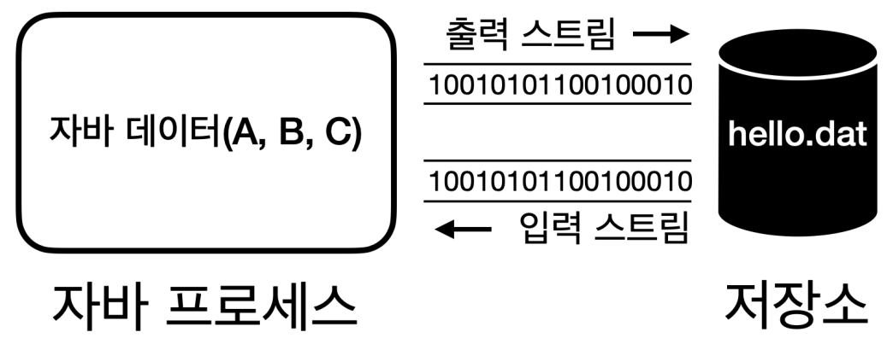

# 자바 - I/O

## 스트림



데이터는 키보드를 통해 입력될 수도 있고, 파일 또는 프로그램으로부터 입력될 수도 있다.
반대로 데이터는 모니터로 출력될 수도 있고, 파일에 저장되거나 다른 프로그램으로 전송될 수 있다.
이것을 **데이터 입출력**이라고 한다.

자바는 입력 스트림과 출력 스트림을 통해 데이터를 입출력한다. **스트림**은 단방향으로 데이터가
흐르는 것을 말한다.

프로그램을 기준으로 데이터가 들어오면 **입력 스트림**, 데이터가 나가면 **출력 스트림**이 된다.
프로그램이 다른 프로그램과 데이터를 교환하려면 양쪽 모두 입력 스트림과 출력 스트림이 필요하다.

---

## 스트림 예제 - 1

```java
import java.io.FileInputStream;
import java.io.FileOutputStream;
import java.io.IOException;

public class StreamStartMain1 {
    public static void main(String[] args) throws IOException {

        String fileName = "temp/hello.dat";

        FileOutputStream fos = new FileOutputStream(fileName);
        //FileOutputStream fos = new FileOutputStream(fileName, true); 
        //생성자에 boolean append를 true로 하면 기존 파일의 끝에 이어서 데이터 입력(default false)

        fos.write(65);
        fos.write(66);
        fos.write(67);

        fos.close();

        FileInputStream fis = new FileInputStream(fileName);

        System.out.println(fis.read());
        System.out.println(fis.read());
        System.out.println(fis.read());
        System.out.println(fis.read());

        fis.close();
    }
}
```

- `new FileOutputStream()`
  - 파일에 데이터를 출력하는 스트림
  - 파일이 없으면 파일을 자동으로 만들고, 데이터를 해당 파일에 저장한다.
  - 생성자에서 주어진 파일을 생성할 수 없으면 `IOException`을 발생시킨다.
    - `write()`와 `close()` 메서드도 `IOException`이 발생할 수 있다.
  - 폴더를 만들지는 않기 때문에 폴더는 미리 만들어두어야 한다.
- `write()`
  - byte 단위로 값을 출력한다.
- `new FileInputStream()`
  - 파일에서 데이터를 읽어오는 스트림
- `read()`
  - 파일에서 데이터를 byte 단위로 하나씩 읽어온다.
  - 파일의 끝(EOF, End of File)에 도달해서 더 읽을 내용이 없다면 -1을 반환한다.
- `close()`
  - 파일에 접근하는 것은 자바 입장에서 외부 자원을 사용하는 것이다.
  - 자바에서 내부 객체는 자동으로 GC가 되지만 외부 자원은 사용 후 반드시 닫아주어야 한다.

**실행 결과 - 콘솔**
```text
65
66
67
-1
```

**실행 결과 - 파일(temp/hello.dat)**

```text
ABC
```

파일의 데이터를 읽을 때 파일의 끝까지 읽어야 할 때 다음과 같이 반복문을 사용하면 된다.

```java
import java.io.FileInputStream;
import java.io.FileOutputStream;
import java.io.IOException;

public class StreamStartMain2 {
    public static void main(String[] args) throws IOException {

        String fileName = "temp/hello.dat";

        FileOutputStream fos = new FileOutputStream(fileName);

        fos.write(65);
        fos.write(66);
        fos.write(67);

        fos.close();

        FileInputStream fis = new FileInputStream(fileName);

        int data;
        while ((data = fis.read()) != -1) {
            System.out.println(data);
        }

        fis.close();
    }
}
```

---

## 스트림 예제 - 2

byte를 하나씩 다루는 것이 아니라 `byte[]`를 사용해서 데이터를 원하는 크기만큼 저장하고
읽는 방법을 알아보자.

```java
import java.io.FileInputStream;
import java.io.FileOutputStream;
import java.io.IOException;
import java.util.Arrays;

public class StreamStartMain3 {
    public static void main(String[] args) throws IOException {

        String fileName = "temp/hello.dat";

        FileOutputStream fos = new FileOutputStream(fileName);

        byte[] input = {65, 66, 67};
        fos.write(input);

        fos.close();

        FileInputStream fis = new FileInputStream(fileName);

        byte[] buffer = new byte[10];
        int readCount = fis.read(buffer, 0, buffer.length); //buffer, offset, length

        System.out.println("readCount = " + readCount);
        //readCount = 3
        System.out.println("buffer = " + Arrays.toString(buffer));
        //buffer = [65, 66, 67, 0, 0, 0, 0, 0, 0, 0]

        fis.close();
    }
}
```

- `write(byte[])`
  - `byte[]`에 원하는 데이터를 담고 전달하면 해당 데이터를 한 번에 출력할 수 있다.
- `read(byte[], offset, length)`
  - `byte[]`를 미리 만들어두고, 만들어둔 `byte[]`에 한 번에 데이터를 읽어올 수 있다.
  - `byte[]` : 데이터가 읽혀지는 버퍼
  - `offset` : 데이터가 기록되는 `byte[]`의 인덱스 시작 위치
  - `length` : 읽어올 byte의 최대 길이
  - 반환 값 : 버퍼에 읽은 총 byte 수
  - `offset`과 `length`를 생략하면 `offset=0`, `length=byte[].length`를 가진다.

모든 byte를 한 번에 읽으려면 다음과 같이 하면 된다.


```java
import java.io.FileInputStream;
import java.io.FileOutputStream;
import java.io.IOException;
import java.util.Arrays;

public class StreamStartMain4 {
    public static void main(String[] args) throws IOException {

        String fileName = "temp/hello.dat";

        FileOutputStream fos = new FileOutputStream(fileName);

        byte[] input = {65, 66, 67};
        fos.write(input);

        fos.close();

        FileInputStream fis = new FileInputStream(fileName);

        byte[] readAllBytes = fis.readAllBytes();
        System.out.println("buffer = " + Arrays.toString(readAllBytes));
        //buffer = [65, 66, 67]

        fis.close();
    }
}
```

- `readAllBytes()`를 사용하면 스트림이 끝날 때까지(파일의 끝에 도달할 때까지)
모든 데이터를 한 번에 읽어올 수 있다.

### 부분으로 나누어 읽기 vs 전체 읽기

- `read(byte[], offset, length)`
  - 스트림의 내용을 부분적으로 읽거나, 읽은 내용을 처리하면서 스트림을 계속해서 읽어야 할 경우에 적합하다.
  - 메모리 사용량을 제어할 수 있다.
  - 예를 들어 100M의 파일을 1M 단위로 나누어 읽고 처리하는 방식을 사용하면 한 번에 최대
    1M의 메모리만 사용한다.
- `readAllBytes()`
  - 한 번의 호출로 모든 데이터를 읽을 수 잇어 편리하다.
  - 작은 파일이나 메모리에 모든 내용을 올려서 처리해야 하는 경우에 적합하다.
  - 메모리 사용량을 제어할 수 없다.
  - 큰 파일의 경우 `OutOfMemoryError`가 발생할 수 있다.

---

[이전 ↩️ - 문자 인코딩 예제]()

[메인 ⏫](https://github.com/genesis12345678/TIL/blob/main/Java/adv_1/Main.md)

[다음 ↪️ - InputStream, OutputStream]()