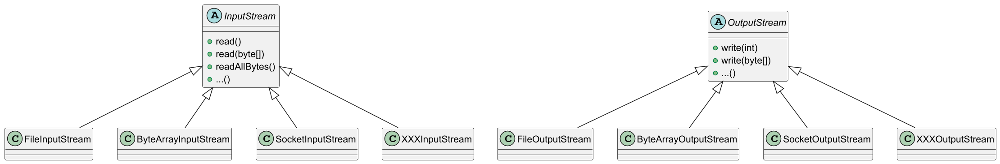
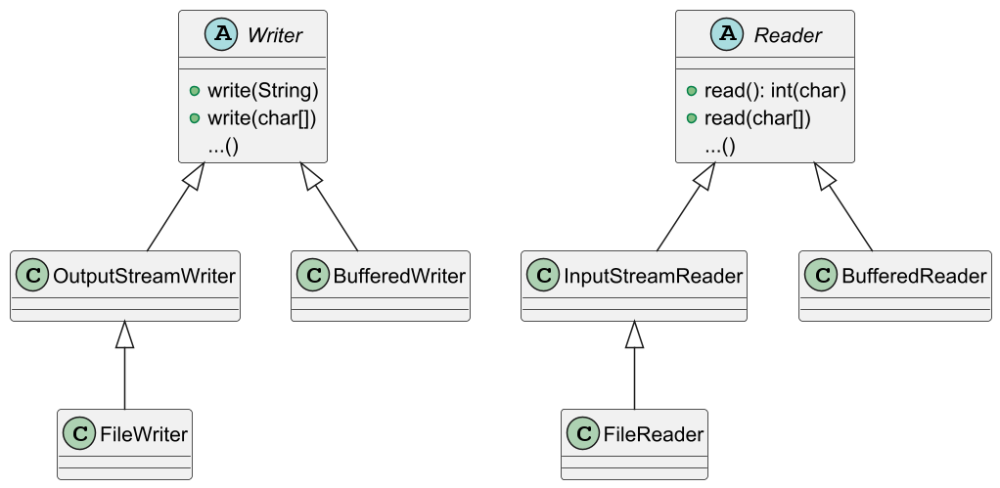

# 자바 - 문자 다루기

스트림의 모든 데이터는 `byte` 단위를 사용하기 때문에 `byte`가 아닌 문자를
스트림에 직접 전달할 수는 없다. `String` 문자열을 스트림을 통해 파일에 저장하려면
`String`을 `byte`로 변환한 다음에 저장해야 한다.

```java
public abstract class TextConst {
    public static final String FILE_NAME = "temp/hello.txt";
}
```

___

## V1

```java
import java.io.FileInputStream;
import java.io.FileOutputStream;
import java.io.IOException;
import java.util.Arrays;

import static io.text.TextConst.FILE_NAME;
import static java.nio.charset.StandardCharsets.UTF_8;

public class ReaderWriterMainV1 {
    public static void main(String[] args) throws IOException {

        String writeString = "ABC";

        //String -> byte UTF-8 인코딩
        byte[] writeBytes = writeString.getBytes(UTF_8);

        System.out.println("writeString = " + writeString);
        System.out.println("writeBytes = " + Arrays.toString(writeBytes));

        //파일에 쓰기
        FileOutputStream fos = new FileOutputStream(FILE_NAME);
        fos.write(writeBytes);
        fos.close();

        //파일에서 읽기
        FileInputStream fis = new FileInputStream(FILE_NAME);
        byte[] readBytes = fis.readAllBytes();
        fis.close();

        //byte -> String UTF-8 디코딩
        String readString = new String(readBytes, UTF_8);

        System.out.println("readBytes = " + Arrays.toString(readBytes));
        System.out.println("readString = " + readString);
    }
}
```

```text
writeString = ABC
writeBytes = [65, 66, 67]
readBytes = [65, 66, 67]
readString = ABC
```

- `String`을 `byte`로 변환할 때는 `getBytes(charset)`을 사용하면 된다.
- 이때 문자를 `byte` 숫자로 변경해야 하기 때문에 반드시 **문자 집합**을 지정해야 한다.
- 반대로 `String` 객체를 생성할 때 읽어들인 `byte[]`과 디코딩할 문자 집합을 전달하면 된다.
- 그러면 `byte[]`를 `String` 문자로 다시 복원할 수 있다.

여기서 핵심은 스트림은 `byte`만 사용할 수 있으므로 `String`과 같은 문자는 직접 전달할 수
없다는 점이다. 그래서 개발자가 직접 번거롭게 변환 과정을 호출해주어야 한다.

---

## V2

- `OutputStreamWriter` : 스트림에 `byte` 대신에 문자를 저장할 수 있게 지원한다.
- `InputStreamReader` : 스트림에 `byte` 대신에 문자를 읽을 수 있게 지원한다.

```java
import java.io.FileInputStream;
import java.io.FileOutputStream;
import java.io.IOException;
import java.io.InputStreamReader;
import java.io.OutputStreamWriter;
import java.nio.charset.StandardCharsets;
import java.util.Arrays;

import static io.text.TextConst.FILE_NAME;
import static java.nio.charset.StandardCharsets.UTF_8;

public class ReaderWriterMainV2 {
    public static void main(String[] args) throws IOException {

        String writeString = "ABC";
        System.out.println("writeString = " + writeString);

        //파일에 쓰기
        FileOutputStream fos = new FileOutputStream(FILE_NAME);
        OutputStreamWriter osw = new OutputStreamWriter(fos, UTF_8);

        osw.write(writeString);

        osw.close();

        //파일에서 읽기
        FileInputStream fis = new FileInputStream(FILE_NAME);
        InputStreamReader isr = new InputStreamReader(fis, UTF_8);

        StringBuilder content = new StringBuilder();

        int ch;
        while ((ch = isr.read()) != -1) {
            content.append((char) ch);
        }

        isr.close();

        System.out.println("content = " + content);
    }
}
```

```text
writeString = ABC
content = ABC
```

**OutputStreamWriter**

- `OutputStreamWriter`는 문자를 입력 받고, 받은 문자를 인코딩해서 `byte[]`로 변환한다.
- `OutputStreamWriter`는 변환한 `byte[]`를 전달할 `OutputStream`과 인코딩 문자 집합에 대한
정보가 필요하다. 따라서 두 정보를 생성자를 통해 전달해야 한다.

**InputStreamReader**

- 데이터를 읽을 때는 `read()`를 제공하는데, 여기서는 문자 하나인 `char`로 데이터를 받게 된다. 
그런데 실제 반환 타입은 `int` 이므로 `char`로 캐스팅해서 사용하면 된다.
- 자바의 `char`는 파일의 끝인 `-1`을 표현할 수 없으므로 대신 `int`를 반환한다.

최상위 부모인 `OutputStream`의 경우 `write()`는 `byte` 단위로 입력하도록 되어있다.
그런데 `OutputStreamWriter`의 `write()`는 `byte`가 아니라 `String`이나 `char`를 사용한다.
어떻게 된 것일까?

---

## V3

자바는 `byte`를 다루는 I/O 클래스와 문자를 다루는 I/O 클래스 둘로 나누어두었다.

**byte를 다루는 클래스**



**문자를 다루는 클래스**



- byte를 다루는 클래스는 `OutputStream`, `InputStream`의 자식이다.
  - 부모 클래스의 기본 기능도 `byte` 단위를 다룬다.
  - 클래스 이름 마지막에 보통 `OutputStream`, `InputStream`이 붙어있다.
- 문자를 다루는 클래스는 `Writer`, `Reader`의 자식이다.
    - 부모 클래스의 기본 기능은 `String`, `char` 같은 문자를 다룬다.
    - 클래스 이름 마지막에 보통 `Writer`, `Reader`가 붙어있다.

`V2`에서 사용한 `OutputStreamWriter`는 문자를 다루는 `Writer` 클래스의 자식이다. `OutputStreamWriter`는
문자를 받아서 `byte`로 변경한 다음에 `byte`를 다루는 `OutputStream`으로 데이터를 전달한 것이다.

**여기서 중요한 점은 모든 데이터는 `byte` 단위(숫자)로 저장된다는 점이다.** 따라서 `Writer`가 아무리 문자를
다룬다고 해도 문자를 바로 저장할 수는 없다. 이 클래스에 문자를 전달하면 결과적으로 내부에서는 지정된 문자 
집합을 사용해서 문자를 `byte`로 인코딩해서 저장한다.

이번에는 `FileWriter`와 `FileReader`를 사용해보자.

```java
import java.io.FileReader;
import java.io.FileWriter;
import java.io.IOException;

import static io.text.TextConst.FILE_NAME;
import static java.nio.charset.StandardCharsets.UTF_8;

public class ReaderWriterMainV3 {
    public static void main(String[] args) throws IOException {

        String writeString = "ABC";
        System.out.println("writeString = " + writeString);

        //파일에 쓰기
        FileWriter fw = new FileWriter(FILE_NAME, UTF_8);

        fw.write(writeString);
        fw.close();

        //파일에서 읽기
        StringBuilder content = new StringBuilder();

        FileReader fr = new FileReader(FILE_NAME, UTF_8);

        int ch;
        while ((ch = fr.read()) != -1) {
            content.append((char) ch);
        }

        fr.close();

        System.out.println("content = " + content);
    }
}
```

```text
writeString = ABC
content = ABC
```

`FileWriter`는 내부에서 스스로 `FileOutputStream`을 하나 생성해서 사용한다.

> `FileWriter`는 내부에서 `FileOutputStream`을 직접 생성하는 부가 기능만 제공한다.
> 
> ```java
> package java.io;
> 
> import java.nio.charset.Charset;
> 
> public class FileWriter extends OutputStreamWriter {
> 
>     public FileWriter(String fileName) throws IOException {
>         super(new FileOutputStream(fileName));
>     }
> 
>     public FileWriter(String fileName, boolean append) throws IOException {
>         super(new FileOutputStream(fileName, append));
>     }
> 
>     public FileWriter(File file) throws IOException {
>         super(new FileOutputStream(file));
>     }
> 
>     public FileWriter(File file, boolean append) throws IOException {
>         super(new FileOutputStream(file, append));
>     }
> 
>     public FileWriter(FileDescriptor fd) {
>         super(new FileOutputStream(fd));
>     }
>     
>     public FileWriter(String fileName, Charset charset) throws IOException {
>         super(new FileOutputStream(fileName), charset);
>     }
> 
>     public FileWriter(String fileName, Charset charset, boolean append) throws IOException {
>         super(new FileOutputStream(fileName, append), charset);
>     }
> 
>     public FileWriter(File file, Charset charset) throws IOException {
>         super(new FileOutputStream(file), charset);
>     }
> 
>     public FileWriter(File file, Charset charset, boolean append) throws IOException {
>         super(new FileOutputStream(file, append), charset);
>     }
> }
> ```

- `write(String)` 메서드를 사용하면 문자를 파일에 직접 쓸 수 있다.(실제로 그런 것은 아니다.)
- 이렇게 문자를 쓰면 `FileWriter` 내부에서는 인코딩 셋을 사용해서 문자를 `byte`로 변경하고 
`FileOutputStream`을 사용해서 파일에 저장한다.
- 개발자가 느끼기에는 문자를 직접 파일에 쓰는 것처럼 느껴지지만, 실제로는 내부에서 
문자를 `byte`로 변환한다.
- `FileReader`도 `FileWriter`와 같은 방식으로 작동한다. `FileReader`는 내부에서 `FileInputStream`을
생성해서 사용한다.

`Writer`, `Reader` 클래스를 사용하면 바이트 변환 없이 문자를 직접 다룰 수 있어서 편리하다.
**하지만 잊지 말아야 하는 것은 실제로는 내부에서 바이트로 변환해서 저장하다는 것이다.
모든 데이터는 문자를 직접 저장할 수 없고, 바이트 단위로 다룬다. 그리고 문자를 바이트로 변경하려면
항상 문자 집합(인코딩 셋)이 필요하다.** (만약 문자 집합을 생략하면 시스템 기본 문자 집합이 사용된다.)

---

## V4

`BufferedOutputStream`, `BufferedInputStream`과 같이 `Reader`, `Writer`에도 버퍼 보조 기능을
제공하는 `BufferedReader`, `BufferedWriter` 클래스가 있다.

그리고 문자를 다룰 때 한 줄(라인) 단위로 다룰 때가 많은데, `BufferedReader`는 한 줄
단위로 문자를 읽는 기능도 추가로 제공한다.

```java
import java.io.BufferedReader;
import java.io.BufferedWriter;
import java.io.FileReader;
import java.io.FileWriter;
import java.io.IOException;

import static io.text.TextConst.FILE_NAME;
import static java.nio.charset.StandardCharsets.UTF_8;

public class ReaderWriterMainV4 {

    private static final int BUFFER_SIZE = 8192;

    public static void main(String[] args) throws IOException {

        String writeString = "ABC\n가나다";
        System.out.println("=== writeString ===");
        System.out.println(writeString);

        //파일에 쓰기
        FileWriter fw = new FileWriter(FILE_NAME, UTF_8);
        BufferedWriter bw = new BufferedWriter(fw, BUFFER_SIZE);

        bw.write(writeString);

        bw.close();

        //파일에서 읽기
        FileReader fr = new FileReader(FILE_NAME, UTF_8);
        BufferedReader br = new BufferedReader(fr, BUFFER_SIZE);

        StringBuilder content = new StringBuilder();

        String line;
        while ((line = br.readLine()) != null) {
            content.append(line).append("\n");
        }

        br.close();

        System.out.println("=== Read String ===");
        System.out.println(content);
    }
}
```

```text
=== writeString ===
ABC
가나다
=== Read String ===
ABC
가나다
```

- `br.readLine()`
  - 한 줄 단위로 문자를 읽고 `String`을 반환한다.
  - 파일의 끝(EOF)에 도달하면 `null`을 반환한다.

---

[이전 ↩️ - 파일 입출력 성능 최적화](https://github.com/genesis12345678/TIL/blob/main/Java/adv_1/io/perform.md)

[메인 ⏫](https://github.com/genesis12345678/TIL/blob/main/Java/adv_1/Main.md)

[다음 ↪️ - 기타 스트림](https://github.com/genesis12345678/TIL/blob/main/Java/adv_1/io/etcstream.md)