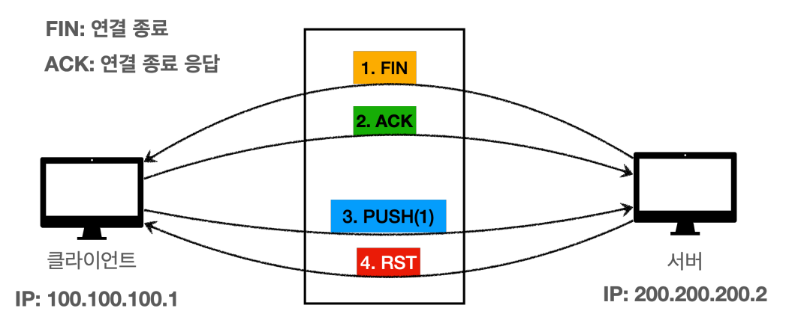

# 자바 - 네트워크 예외

네트워크 연결 시 발생할 수 있는 예외들을 알아보자.

---

## 연결 예외

```java
import java.io.IOException;
import java.net.ConnectException;
import java.net.Socket;
import java.net.UnknownHostException;

/**
 * 네트워크 예외 - 연결 예외
 */
public class ConnectMain {

    public static void main(String[] args) throws IOException {
        unknownHostEx1();
        unknownHostEx2();
        connectionRefused();
    }

    /**
     * java.net.UnknownHostException: 999.999.999.999
     * ...
     */
    private static void unknownHostEx1() throws IOException {
        try {
            Socket socket = new Socket("999.999.999.999", 80);
        } catch (UnknownHostException e) {
            e.printStackTrace();
        }
    }

    /**
     * java.net.UnknownHostException: google.gogo
     * ...
     */
    private static void unknownHostEx2() throws IOException {
        try {
            Socket socket = new Socket("google.gogo", 80);
        } catch (UnknownHostException e) {
            e.printStackTrace();
        }
    }

    /**
     * java.net.ConnectException: Connection refused: connect
     * ...
     */
    private static void connectionRefused() throws IOException {
        try {
            Socket socket = new Socket("localhost", 45678);
        } catch (ConnectException e) {
            e.printStackTrace();
        }
    }
}
```

- `java.net.UnknownHostException`
  - 호스트를 알 수 없음
- `java.net.ConnectException: Connection refused`
  - 연결이 거절됨
  - 연결이 거절되었다는 것은 우선 네트워크를 통해 해당 IP의 서버 컴퓨터에 접속은 했다는 뜻이다.
  - 그런데 해당 서버 컴퓨터가 해당 포트("45678")을 사용하지 않기 때문에 TCP 연결을 거절한다.
  - IP에 해당하는 서버는 켜져있지만, 사용하는 PORT가 없을 때 주로 발생한다.
  - 네트워크 방화벽 등에서 무단 연결로 인지하고 연결을 막을 때도 발생한다.
  - 서버 컴퓨터의 OS는 이때 `TCP RST(Reset)`라는 패킷을 보내서 연결을 거절한다.
  - 클라이언트가 연결 시도 중에 **RST 패킷**을 받으면 이 예외가 발생한다.
    - **TCP RST 패킷**을 받으면 TCP 연결에 문제가 있다는 뜻이다. 이 패킷을 받은 대상은
        바로 연결을 해제해야 한다.

---

## 타임아웃

### TCP 연결 타임아웃

네트워크 연결을 시도해서 서버 IP에 연결 패킷을 전달했지만 응답이 없는 경우 어떻게 될까?

```java
import java.io.IOException;
import java.net.ConnectException;
import java.net.Socket;

/**
 * TCP 연결 타임아웃 - OS 기본
 */
public class ConnectionTimeoutMain1 {

    public static void main(String[] args) throws IOException {
        long start = System.currentTimeMillis();

        try {
            Socket socket = new Socket("192.168.1.250", 45678);
        } catch (ConnectException e) {
            e.printStackTrace();
        }

        long end = System.currentTimeMillis();

        System.out.println("end = " + (end - start) + "ms");
    }
}
```
```text
java.net.ConnectException: Connection timed out: connect
...
end = 21046ms
```

- `192.168.1.250`은 사설 IP 대역(주로 공유기에서 사용하는 IP 대역)이다.
- 해당 IP로 연결 패킷을 보내지만 IP를 사용하는 서버가 없으므로 TCP 응답이 오지 않는다.
- 또는 해당 IP로 연결 패킷을 보내지만 해당 서버가 너무 바쁘거나 문제가 있어서 연결 응답 패킷을
보내지 못하는 경우도 있다.
- 그렇다면 이때 무한정 기다려야 할까?

TCP 연결을 시도했는데 연결 응답이 없다면 OS에는 연결 대기 타임아웃이 설정되어 있다.(`Windows` 약 21초)
해당 시간이 지나면 예외가 발생한다.

TCP 연결을 클라이언트가 오래 대기하는 것은 좋은 방법이 아니므로, 연결이 안되면
고객에게 빠르게 현재 연결에 문제가 있다고 알려주어야 한다.

TCP 연결 타임아웃을 직접 설정해보자.

```java
import java.io.IOException;
import java.net.ConnectException;
import java.net.InetSocketAddress;
import java.net.Socket;
import java.net.SocketTimeoutException;

/**
 * TCP 연결 타임아웃 - 직접 설정
 */
public class ConnectionTimeoutMain2 {

    public static void main(String[] args) throws IOException {
        long start = System.currentTimeMillis();

        try {
            Socket socket = new Socket();        /*hostname*/   /*port*/ /*timeout*/
            socket.connect(new InetSocketAddress("192.168.1.250", 45678), 1000);
        } catch (SocketTimeoutException e) {
            e.printStackTrace();
        }

        long end = System.currentTimeMillis();

        System.out.println("end = " + (end - start) + "ms");
    }
}
```
```text
java.net.SocketTimeoutException: Connect timed out
...
end = 1009ms
```

- `Socket` 객체를 생성할 때 인자로 `IP`와 `PORT`를 모두 전달하면 생성자에서 바로 TCP 연결을 시도한다.
- `IP`와 `PORT`를 모두 빼고 객체를 생성하면 객체만 생성되고 아직 연결은 시도하지 않는다.
- 추가적으로 필요한 설정을 더 한 다음에 `socket.connect()`를 호출하면 그때 TCP 연결을 시도한다.
- 이 방식으로 추가적은 설정을 더 할 수 있는데, 대표적으로 타임아웃을 설정할 수 있다.
- `InetSocketAddress`는 `SocketAddress`의 자식으로, `IP`와 `PORT` 기반의 주소를 객체로 제공한다.
- 타임아웃 시간이 지나도 연결이 되지 않으면 예외가 발생한다.

### TCP 소켓 타임아웃

타임아웃 중에는 "소켓 타임아웃" 또는 "read 타임아웃" 이라는 또 다른 중요한 타임아웃이 있다.

연결 타임아웃은 TCP 연결과 관련이 있다. 그러면 연결이 잘 된 이후에 클라이언트가
서버에 어떤 요청을 했을 때, 서버가 계속해서 응답을 주지 않는다면 무한정 기다려야 할까?

이런 경우에 사용하는 것이 **소켓 타임아웃(read 타임아웃)** 이다.

```java
import java.io.IOException;
import java.net.ServerSocket;
import java.net.Socket;

/**
 * TCP 소켓 타임아웃(서버)
 */
public class SoTimeoutServer {
    public static void main(String[] args) throws IOException, InterruptedException {

        ServerSocket serverSocket = new ServerSocket(12345);
        Socket socket = serverSocket.accept();

        Thread.sleep(1_000_000); //응답이 오래 걸린다고 가정
    }
}
```
```java
import java.io.IOException;
import java.io.InputStream;
import java.net.Socket;

/**
 * TCP 소켓 타임아웃(클라이언트)
 */
public class SoTimeoutClient {
    public static void main(String[] args) throws IOException {

        Socket socket = new Socket("localhost", 12345);
        InputStream input = socket.getInputStream();

        try {
            socket.setSoTimeout(3000); //타임아웃 시간 설정
            int read = input.read();   //기본은 무한 대기
        } catch (Exception e) {
            e.printStackTrace();
        }

        socket.close();
    }
}
```
```text
java.net.SocketTimeoutException: Read timed out
...
```

`socket.setSoTimeout()`으로 밀리초 단위의 타임아웃 시간을 설정할 수 있다.
위 코드에서는 3초가 지나면 예외가 발생한다. 만약 타임아웃 시간을 설정하지 않으면
`read()`는 응답이 올 때까지 무한 대기한다.

---

## 정상 종료

TCP 연결을 종료하려면 서로 `FIN` 메시지를 보내야 한다.

`socket.close()`를 호출하면 TCP에서 종료의 의미인 `FIN` 패킷을 상대방에게 전달한다.
`FIN` 패킷을 받으면 상대방도 `socket.close()`를 호출해서 `FIN` 패킷을 상대방에게 전달해야 한다.

```java
import java.io.IOException;
import java.net.ServerSocket;
import java.net.Socket;

import static util.MyLogger.log;

/**
 * 정상 종료(서버)
 */
public class NormalCloseServer {

    public static void main(String[] args) throws IOException, InterruptedException {
        ServerSocket serverSocket = new ServerSocket(12345);
        Socket socket = serverSocket.accept();

        log("소켓 연결: " + socket);

        Thread.sleep(1000);
        socket.close(); //서버에서 1초 대기 후 바로 종료(FIN 패킷 전달)

        log("소켓 종료");
    }
}
```
```java
import java.io.BufferedReader;
import java.io.DataInputStream;
import java.io.EOFException;
import java.io.IOException;
import java.io.InputStream;
import java.io.InputStreamReader;
import java.net.Socket;

import static util.MyLogger.log;

/**
 * 정상 종료(클라이언트)
 */
public class NormalCloseClient {

    public static void main(String[] args) throws IOException {
        Socket socket = new Socket("localhost", 12345);
        log("소켓 연결: " + socket);
        InputStream input = socket.getInputStream();

        //서버가 FIN 패킷을 보냈음을 다양한 스트림으로 확인
        readByInputStream(input, socket);
        readByBufferedReader(input, socket);
        readByDataInputStream(input, socket);

        log("연결 종료: " + socket.isClosed());
    }

    private static void readByInputStream(InputStream input, Socket socket) throws IOException {
        int read = input.read();
        log("read = " + read);

        if (read == -1) {
            input.close();
            socket.close();
        }
    }

    private static void readByBufferedReader(InputStream input, Socket socket) throws IOException {
        BufferedReader br = new BufferedReader(new InputStreamReader(input));
        String readString = br.readLine();
        log("readString = " + readString);

        if (readString == null) {
            input.close();
            socket.close();
        }
    }

    private static void readByDataInputStream(InputStream input, Socket socket) throws IOException {
        DataInputStream dis = new DataInputStream(input);

        try {
            dis.readUTF();
        } catch (EOFException e) {
            log(e);
        } finally {
            dis.close();
            socket.close();
        }
    }
}
```
```text
16:42:49.949 [     main] 소켓 연결: Socket[addr=localhost/127.0.0.1,port=12345,localport=54449]
16:42:50.950 [     main] read = -1
16:42:50.951 [     main] readString = null
16:42:50.951 [     main] java.io.EOFException
16:42:50.952 [     main] 연결 종료: true
```

- 클라이언트는 서버의 메시지를 3가지 방법으로 읽는다.
  - `read()` : 1byte 단위로 읽는다.
  - `readLine()` : 라인 단위 `String`으로 읽는다.
  - `readUTF()` : `DataInputStream`을 통해 `String` 단위로 읽는다.

**전체 과정은 다음과 같다.**

- 클라이언트가 서버에 접속한다.
- 클라이언트는 `input.read()`로 서버의 데이터를 읽기 위해 대기한다.
- 서버는 1초 뒤에 연결을 종료한다. 서버에서 `socket.close()`를 호출하면 클라이언트에 `FIN` 패킷을 보낸다.
- 클라이언트는 `FIN` 패킷을 받는다.
- 서버가 소켓을 종료했다는 의미이므로 클라이언트는 더는 읽을 데이터가 없다.
- `FIN` 패킷을 받은 클라이언트의 소켓은 더는 서버를 통해 읽을 데이터가 없다는 의미의 값(EOF)을 반환한다.
  - 여기서 상황에 따라 EOF를 해석하는 방법이 다르다.
  - `-1`, `null`, `EOFExeption` 등

여기서 중요한 점은 EOF가 발생하면 상대방이 `FIN` 메시지를 보내면서 소켓 연결을 끊었다는 뜻이다.
이 경우 소켓에 다른 작업을 하면 안 되고, `FIN` 메시지를 받은 클라이언트도 `close()`를 호출해서
상대방에게 `FIN` 메시지를 보내고 소켓 연결을 끊어야 한다. 이렇게 하면 서로 `FIN` 메시지를
주고 받으면서 TCP 연결이 정상 종료된다.

---

## 강제 종료

TCP 연결 중에 문제가 발생하면 `RST`라는 패킷이 발생한다. 이 경우 연결을 즉시 종료해야 한다.

```java
import java.io.IOException;
import java.net.ServerSocket;
import java.net.Socket;

import static util.MyLogger.log;

/**
 * 강제 종료(서버)
 */
public class ResetCloseServer {
    public static void main(String[] args) throws IOException {

        ServerSocket serverSocket = new ServerSocket(12345);
        Socket socket = serverSocket.accept();
        log("소켓 연결: " + socket);

        //소켓이 연결되면 바로 연결을 종료
        socket.close();
        serverSocket.close();
        log("소켓 종료");
    }
}
```
```java
import java.io.IOException;
import java.io.InputStream;
import java.io.OutputStream;
import java.net.Socket;
import java.net.SocketException;

import static util.MyLogger.log;

/**
 * 강제 종료(클라이언트)
 */
public class ResetCloseClient {
    public static void main(String[] args) throws IOException, InterruptedException {

        Socket socket = new Socket("localhost", 12345);
        log("소켓 연결: " + socket);
        InputStream input = socket.getInputStream();
        OutputStream output = socket.getOutputStream();

        //client <- server: FIN
        Thread.sleep(1000); //서버가 close() 호출할 때까지 잠시 대기

        //client -> server: PUSH[1]
        //서버에서 연결을 종료했는데 메시지를 전달
        output.write(1);

        //client <- server: RST
        Thread.sleep(1000); //RST 메시지 전송 대기

        try {
            int read = input.read();
            System.out.println("read = " + read);
        } catch (SocketException e) {
            e.printStackTrace();
        }

        try {
            output.write(1);
        } catch (SocketException e) {
            e.printStackTrace();
        }
    }
}
```
```text
java.net.SocketException: 현재 연결은 사용자의 호스트 시스템의 소프트웨어의 의해 중단되었습니다
...
java.net.SocketException: 현재 연결은 사용자의 호스트 시스템의 소프트웨어의 의해 중단되었습니다
...
```



- 서버에서 종료를 위해 `socket.close()`를 호출해 클라이언트에 `FIN` 패킷을 전달한다.
- 클라이언트는 `FIN` 패킷을 받는다. (OS에서 `FIN`에 대한 `ACK` 패킷을 전달)
- 클라이언트는 `output.write()`로 서버에 메시지를 전달한다. 데이터를 전송하는 `PUSH` 패킷이 서버에 전달된다.
- 서버는 이미 `FIN`으로 종료를 요청했는데, `PUSH` 패킷으로 데이터가 전송되었다.
    서버가 기대하는 값은 `FIN` 패킷이다.
- 서버는 TCP 연결에 문제가 있다고 판단하고 즉각 연결을 종료하라는 `RST` 패킷을 클라이언트에 전송한다.

`RST` 패킷이 도착했다는 것은 현재 TCP 연결에 심각한 문제가 있으므로 해당 연결을
더는 사용하면 안 된다는 의미이다.

`RST` 패킷이 도착하면 자바는 `read()`와 `write()`로 메시지를 읽거나 전송할 때 예외를 던진다.

> 자기 자신의 소켓을 닫은 이후에 `read()`, `write()`를 호출하면 `java.net.SocketException` 예외가 발생한다.

> - 네트워크에서 이런 예외를 다 따로따로 이해하고 구현해야 할까? 어떤 문제가 언제 발생할지 다 구분해서 처리하기는 어렵다.
> - 따라서 기본적으로 정상 종료, 강제 종료 모두 자원을 정리하고 닫도록 설계하면 된다.
> - 예를 들어 `SocketException`, `EOFException` 모두 `IOException`의 자식이다. 따라서 `IOException`이 발생하면
>   자원을 정리하면 된다. 만약 더 자세히 분류해야 한다면 그때 예외를 구분해서 처리하면 된다.

---

[이전 ↩️ - 네트워크 프로그램 자원 정리](https://github.com/genesis12345678/TIL/blob/main/Java/adv_1/network/program2.md)

[메인 ⏫](https://github.com/genesis12345678/TIL/blob/main/Java/adv_1/Main.md)

[다음 ↪️ - ]()