# 자바 - 네트워크 프로그램 예제

간단하게 클라이언트가 "Hello"를 서버에 전달하면 서버는 클라이언트 요청에
" World!"라는 단어를 더해서 "Hello World!"를 클라이언트에 응답하는 프로그램을 만들어보자.

TCP/IP 네트워킹으로 작성하며, 다음은 공통으로 사용될 로깅 유틸 클래스이다.

```java
import java.time.LocalTime;
import java.time.format.DateTimeFormatter;

public abstract class MyLogger {

    private static final DateTimeFormatter formatter = DateTimeFormatter.ofPattern("HH:mm:ss.SSS");

    public static void log(Object obj) {

        String time = LocalTime.now().format(formatter);

        System.out.printf(
            "%s [%9s] %s\n", time, Thread.currentThread().getName(), obj
        );
    }
}
```

---

## V1

```java
import java.io.DataInputStream;
import java.io.DataOutputStream;
import java.io.IOException;
import java.net.Socket;

import static util.MyLogger.*;

/**
 * TCP/IP 네트워킹 클라이언트 - V1
 */
public class ClientV1 {

    private static final int PORT = 12345;

    public static void main(String[] args) throws IOException {

        log("클라이언트 시작");

        Socket socket = new Socket("localhost", PORT);
        DataInputStream input = new DataInputStream(socket.getInputStream());
        DataOutputStream output = new DataOutputStream(socket.getOutputStream());
        log("소켓 연결: " + socket);

        //서버에게 문자 보내기
        String message = "Hello";
        output.writeUTF(message);
        log("client -> server: " + message);

        //서버로부터 문자 받기
        String received = input.readUTF();
        log("client <- server: " + received);

        //자원 정리
        input.close();
        output.close();
        socket.close();
        log("연결 종료: " + socket);
    }
}
```
```java
import java.io.DataInputStream;
import java.io.DataOutputStream;
import java.io.IOException;
import java.net.ServerSocket;
import java.net.Socket;

import static util.MyLogger.log;

/**
 * TCP/IP 네트워킹 서버 - V1
 */
public class ServerV1 {

    private static final int PORT = 12345;

    public static void main(String[] args) throws IOException {

        log("서버 시작");

        ServerSocket serverSocket = new ServerSocket(PORT);

        log("서버 소켓 시작 - 리스닝 포트: " + PORT);
        Socket socket = serverSocket.accept();
        log("소켓 연결: " + socket);

        DataInputStream input = new DataInputStream(socket.getInputStream());
        DataOutputStream output = new DataOutputStream(socket.getOutputStream());

        //클라이언트로부터 문자 받기
        String received = input.readUTF();
        log("client -> server: " + received);

        //클라이언트에게 문자 보내기
        String message = received + " World!";
        output.writeUTF(message);
        log("client <- server: " + message);

        //자원 정리
        input.close();
        output.close();
        socket.close();
        serverSocket.close();

        log("연결 종료: " + socket);
    }
}
```

먼저 서버를 실행하면 다음과 같다.
```text
17:57:30.876 [     main] 서버 시작
17:57:30.879 [     main] 서버 소켓 시작 - 리스닝 포트: 12345
```

그리고 클라이언트를 실행하면 다음과 같이 통신이 수행된다.
```text
17:57:48.435 [     main] 클라이언트 시작
17:57:48.472 [     main] 소켓 연결: Socket[addr=localhost/127.0.0.1,port=12345,localport=54709]
17:57:48.473 [     main] client -> server: Hello
17:57:48.474 [     main] client <- server: Hello World!
17:57:48.475 [     main] 연결 종료: Socket[addr=localhost/127.0.0.1,port=12345,localport=54709]
```
> 클라이언트의 localport는 랜덤으로 생성된다.
```text
17:57:30.876 [     main] 서버 시작
17:57:30.879 [     main] 서버 소켓 시작 - 리스닝 포트: 12345
17:57:48.470 [     main] 소켓 연결: Socket[addr=/127.0.0.1,port=54709,localport=12345]
17:57:48.473 [     main] client -> server: Hello
17:57:48.473 [     main] client <- server: Hello World!
17:57:48.474 [     main] 연결 종료: Socket[addr=/127.0.0.1,port=54709,localport=12345]
```

- `localhost`는 현재 사용 중인 컴퓨터 자체를 가리키는 특별한 호스트 이름이다.
- `localhost`는 "127.0.0.1"이라는 IP 주소로 매핑되며, "127.0.0.1"은 IP 주소 체계에서
루프백 주소로 지정된 특별한 IP 주소이다. 이 주소는 컴퓨터가 스스로를 가리킬 때 사용되며,
`localhost`와 동일하게 취급된다.
- "127.0.0.1"은 컴퓨터가 네트워크 인터페이스를 통해 외부로 나가지 않고, 자신에게 직접
네트워크 패킷을 보낼 수 있도록 한다.

**코드를 분석해보자.**

TCP/IP 통신에서는 통신할 대상 서버를 찾을 때 호스트 이름이 아니라 IP 주소가 필요하다.
먼저 호스트 이름으로 IP를 어떻게 찾는지 알아보자.

```java
import java.net.InetAddress;
import java.net.UnknownHostException;

public class InetAddressMain {
    public static void main(String[] args) throws UnknownHostException {

        InetAddress localhost = InetAddress.getByName("localhost");
        System.out.println(localhost);

        InetAddress google = InetAddress.getByName("google.com");
        System.out.println(google);
    }
}
```
```text
localhost/127.0.0.1
google.com/142.250.206.238
```

- 자바의 `InetAddress` 클래스를 사용하면 호스트 이름으로 대상 IP를 찾을 수 있다.
- 찾는 과정은 다음과 같다.
  1. 자바는 `InetAddress.getByName("호스트명")` 메서드로 해당하는 IP 주소를 조회한다.
  2. 이 과정에서 시스템의 호스트 파일을 먼저 확인한다.(`\etc\hosts`)
  3. 호스트 파일에 정의되어 있지 않다면, DNS 서버에 요청해서 IP 주소를 얻는다.

### 클라이언트 코드

**클라이언트와 서버의 연결은 `Socket`을 사용한다.**
```java
//PORT=12345
Socket socket = new Socket("localhost", PORT);
```

- `localhost`를 통해 자신의 컴퓨터에 있는 12345 포트에 TCP 접속을 시도한다.
  - `localhost`는 IP가 아니므로 해당하는 IP를 먼저 찾는다.(내부에서 `InetAddress`를 사용)
  - `localhost`는 "127.0.0.1"이라는 IP에 매핑되어 있다.
  - "127.0.0.1:12345"에 TCP 접속을 시도한다.
- 연결이 성공적으로 완료되면 `Socket` 객체를 생성한다.
- `Socket`은 서버와 연결되어 있는 **연결점**이며, `Socket` 객체를 통해서 서버와 통신할 수 있다.

**클라이언트와 서버 간의 데이터 통신은 `Socket`이 제공하는 스트림을 사용한다.**

```java
DataInputStream input = new DataInputStream(socket.getInputStream());
DataOutputStream output = new DataOutputStream(socket.getOutputStream());
```

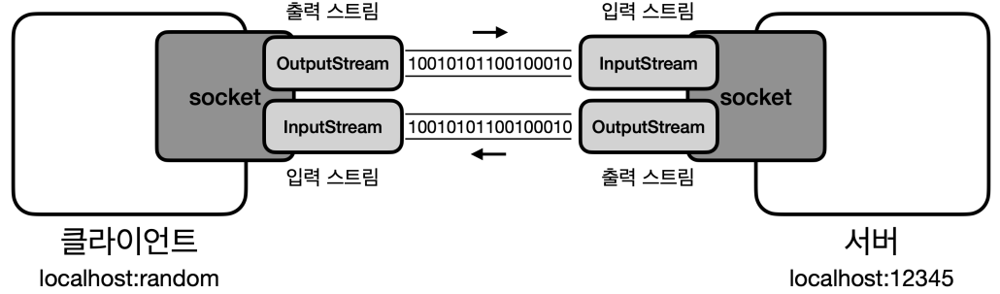

- `Socket`은 서버와 데이터를 주고 받기 위한 스트림을 제공한다.
- `InputStream` : 서버에서 전달한 데이터를 클라이언트가 받을 때 사용
- `OutputStream` : 클라이언트에서 서버에 데이터를 전달할 때 사용
- `InputStream`, `OutputStream`은 모든 데이터를 byte로 변환해서 전달해야 하기 때문에 번거롭다.
그래서 `DataInputStream`, `DataOutputStream`과 같은 보조 스트림과 같이 사용한다.

**사용한 자원은 반드시 정리해야 한다.**
```java
//자원 정리
input.close();
output.close();
socket.close();
log("연결 종료: " + socket);
```

### 서버 코드

서버는 특정 포트를 열어두어야 한다. 그래야 클라이언트가 해당 포트를 지정해서
접속할 수 있다.

```java
ServerSocket serverSocket = new ServerSocket(PORT);
```

- 서버는 `ServerSocket`이라는 특별한 소켓을 사용한다.
- 지정한 포트를 사용해서 서버 소켓을 생성하면, 클라이언트는 해당 포트로
서버에 연결할 수 있다.

**클라이언트와 서버의 연결 과정은 다음과 같다.**

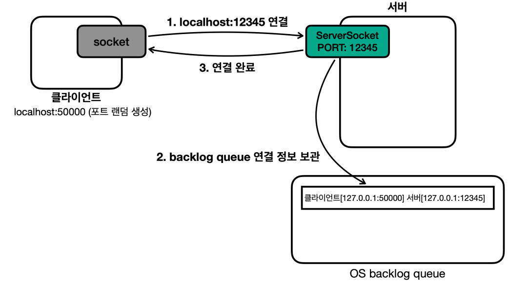

- 서버가 "12345" 포트로 서버 소켓을 열어둔다. 클라이언트는 이제 12345 포트로 서버에 접속할 수 있다.
- 클라이언트가 "12345" 포트에 연결을 시도한다.
- 이때 OS 계층에서 TCP 3-way handshake가 발생하고, TCP 연결이 완료된다.
- TCP 연결이 완료되면 서버는 `OS backlog queue`라는 곳에 클라이언트와 서버의
TCP 연결 정보를 보관한다.
  - 이 연결 정보에는 클라이언트와 서버의 IP, PORT 정보가 모두 들어있다.

TCP 연결 시에는 클라이언트와 서버 모두 IP, PORT 정보가 필요하다. 그런데 클라이언트의 경우
클라이언트 자신의 포트를 지정한 적이 없다.

서버의 경우 포트가 명확하게 지정되어 있어야 한다. 그래야 클라이언트에서 서버에
어떤 포트에 접속할지 알 수 있다. 반면에 서버에 접속하는 클라이언트의 경우에는 자신의
포트가 명확하게 지정되어 있지 않아도 된다. 클라이언트는 보통 포트를 생략하는데, 생략할 경우
클라이언트 PC에 남아있는 포트 중 하나가 랜덤으로 할당된다. (클라이언트의 포트도 명시적으로
할당할 수는 있다, 하지만 잘 사용하지 않는다.)

```java
Socket socket = serverSocket.accept();
```

- **서버 소켓은 단지 클라이언트와 서버의 TCP 연결만 지원하는 특별한 소켓이다.**
- 실제 클라이언트와 서버가 정보를 주고 받으려면 `Socket` 객체가 필요하다.
- `accpet()` 메서드를 호출하면 TCP 연결 정보를 기반으로 `Socket` 객체를 만들어서 반환한다.

`accept()` 호출 과정은 다음과 같다.

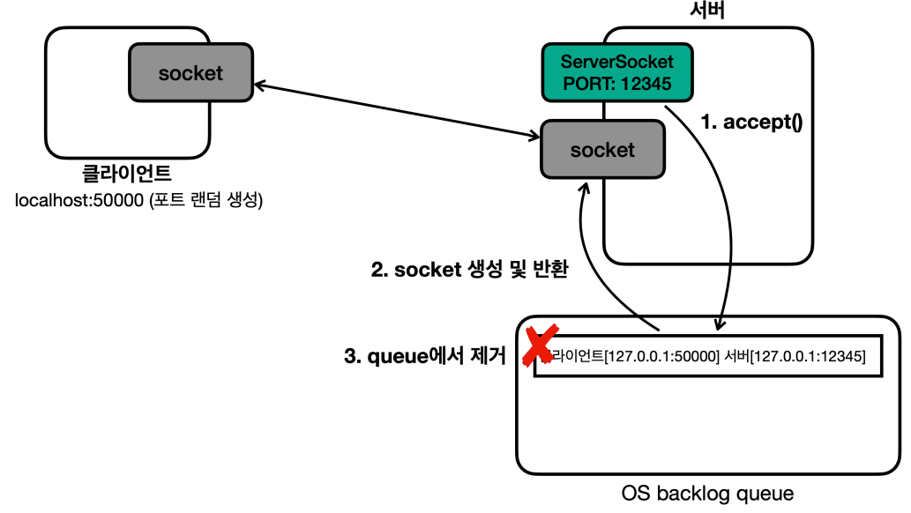

- `accept()`를 호출하면 `backlog queue`에서 TCP 연결 정보를 조회한다.
  - **만약 TCP 연결 정보가 없다면, 연결 정보가 생성될 때까지 대기한다.(블로킹)**
- 해당 정보를 기반으로 `Socket` 객체를 생성한다.
- 사용한 TCP 연결 정보는 `backlog queue`에서 제거된다.
- 클라이언트와 서버의 `Socket`은 TCP 연결되어 있고, 스트림을 통해 메시지를 주고받을 수 있다.

```java
DataInputStream input = new DataInputStream(socket.getInputStream());
DataOutputStream output = new DataOutputStream(socket.getOutputStream());
```

클라이언트의 `Output`은 서버의 `Input`이고, 반대로 서버의 `Output`은
클라이언트의 `Input`이다.

**사용한 자원은 반드시 정리해야 한다.**
```java
//자원 정리
input.close();
output.close();
socket.close();
serverSocket.close();
log("연결 종료: " + socket);
```

---

## V2

이제 메시지를 계속 주고 받고 원할 때 종료할 수 있도록 만들어보자.

```java
/**
 * TCP/IP 네트워킹 클라이언트 - V2
 */
public class ClientV2 {

    private static final int PORT = 12345;

    public static void main(String[] args) throws IOException {

        log("클라이언트 시작");

        Socket socket = new Socket("localhost", PORT);

        DataInputStream input = new DataInputStream(socket.getInputStream());
        DataOutputStream output = new DataOutputStream(socket.getOutputStream());
        log("소켓 연결: " + socket);

        Scanner sc = new Scanner(System.in);

        while (true) {
            System.out.print("전송 문자: ");
            String message = sc.nextLine();

            //서버에게 문자 보내기
            output.writeUTF(message);
            log("client -> server: " + message);

            if (message.equals("exit")) {
                break;
            }

            //서버로부터 문자 받기
            String received = input.readUTF();
            log("client <- server: " + received);
        }

        //자원 정리
        log("연결 종료: " + socket);
        input.close();
        output.close();
        socket.close();
    }
}
```
```java
import java.io.DataInputStream;
import java.io.DataOutputStream;
import java.io.IOException;
import java.net.ServerSocket;
import java.net.Socket;

import static util.MyLogger.log;

/**
 * TCP/IP 네트워킹 서버 - V2
 */
public class ServerV2 {

    private static final int PORT = 12345;

    public static void main(String[] args) throws IOException {

        log("서버 시작");

        ServerSocket serverSocket = new ServerSocket(PORT);

        log("서버 소켓 시작 - 리스닝 포트: " + PORT);
        Socket socket = serverSocket.accept();
        log("소켓 연결: " + socket);

        DataInputStream input = new DataInputStream(socket.getInputStream());
        DataOutputStream output = new DataOutputStream(socket.getOutputStream());

        while (true) {

            //클라이언트로부터 문자 받기
            String received = input.readUTF();
            log("client -> server: " + received);

            if (received.equals("exit")) {
                break;
            }

            //클라이언트에게 문자 보내기
            String message = received + " World!";
            output.writeUTF(message);
            log("client <- server: " + message);
        }

        //자원 정리
        log("연결 종료: " + socket);
        input.close();
        output.close();
        socket.close();
        serverSocket.close();
    }
}
```

```text
20:25:27.591 [     main] 클라이언트 시작
20:25:27.608 [     main] 소켓 연결: Socket[addr=localhost/127.0.0.1,port=12345,localport=63702]
전송 문자: hello
20:25:33.515 [     main] client -> server: hello
20:25:33.516 [     main] client <- server: hello World!
전송 문자: Network
20:25:37.742 [     main] client -> server: Network
20:25:37.743 [     main] client <- server: Network World!
전송 문자: exit
20:25:41.149 [     main] client -> server: exit
20:25:41.150 [     main] 연결 종료: Socket[addr=localhost/127.0.0.1,port=12345,localport=63702]
```
```text
20:22:30.807 [     main] 서버 시작
20:22:30.810 [     main] 서버 소켓 시작 - 리스닝 포트: 12345
20:25:27.608 [     main] 소켓 연결: Socket[addr=/127.0.0.1,port=63702,localport=12345]
20:25:33.515 [     main] client -> server: hello
20:25:33.516 [     main] client <- server: hello World!
20:25:37.742 [     main] client -> server: Network
20:25:37.743 [     main] client <- server: Network World!
20:25:41.149 [     main] client -> server: exit
20:25:41.149 [     main] 연결 종료: Socket[addr=/127.0.0.1,port=63702,localport=12345]
```

> **같은 클라이언트 동시에 실행하기**
> 
> 서버는 여러 클라이언트의 연결을 처리할 수 있어야 한다. IntelliJ에서 같은 
> `main()` 메서드를 실행하려면 설정이 필요하다.
> 
> 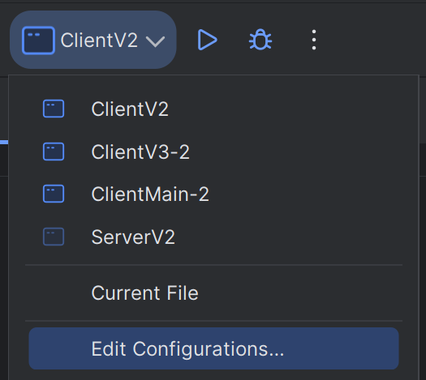
> 
> 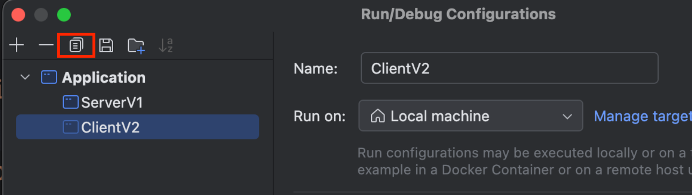

그런데 새로운 클라이언트가 접속하면 정상 수행되지 않는다. 처음 접속한 클라이언트만 
작동하고 중간에 새로 연결한 클라이언트는 소켓 연결은 되지만 서버로부터 아무런
응답이 오지 않는다.

```text
20:31:30.552 [     main] 클라이언트 시작
20:31:30.569 [     main] 소켓 연결: Socket[addr=localhost/127.0.0.1,port=12345,localport=63994]
전송 문자: hello2
20:31:41.007 [     main] client -> server: hello2
```

**왜 이런 것일까? 이번에는 여러 클라이언트가 접속하는 상황일 때를 분석해보자.**

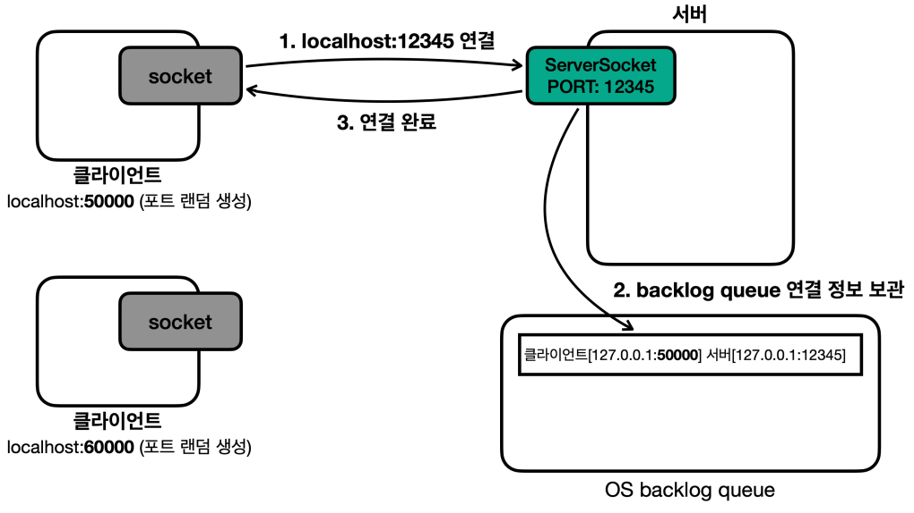

- 서버는 "12345" 서버 소켓을 열어둔다.
- 50000번 랜덤 포트를 사용하는 클라이언트가 먼저 "12345" 포트의 서버에 접속을 시도한다.
- 이때 OS 계층에서 TCP 3-way handshake가 발생하고, TCP 연결이 완료된다.
- TCP 연결이 완료되면 서버는 `OS backlog queue`라는 곳에 클라이언트와
서버의 TCP 연결 정보를 보관한다.

여기서 중요한 점은, 이 시점에 TCP 3-way handshake가 완료되었기 때문에 클라이언트와
서버의 TCP 연결은 이미 완료되었고, 클라이언트의 소켓 객체도 정상 생성된다. (이 시점에
서버의 소켓 객체(서버 소켓 X)는 생성되지 않았다.)

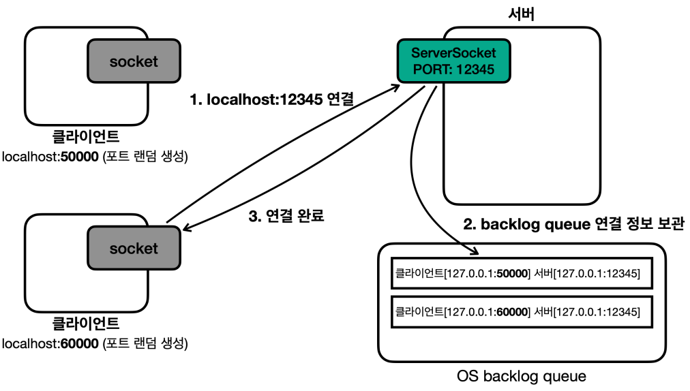

- 이번에는 60000번 랜덤 포트를 사용하는 클라이언트가 "12345" 포트의 서버에
접속을 시도하고 연결을 완료한다.
- 50000번, 60000번 클라이언트 모두 서버와 연결이 완료되었고, 클라이언트의 소켓도
정상 생성된다.

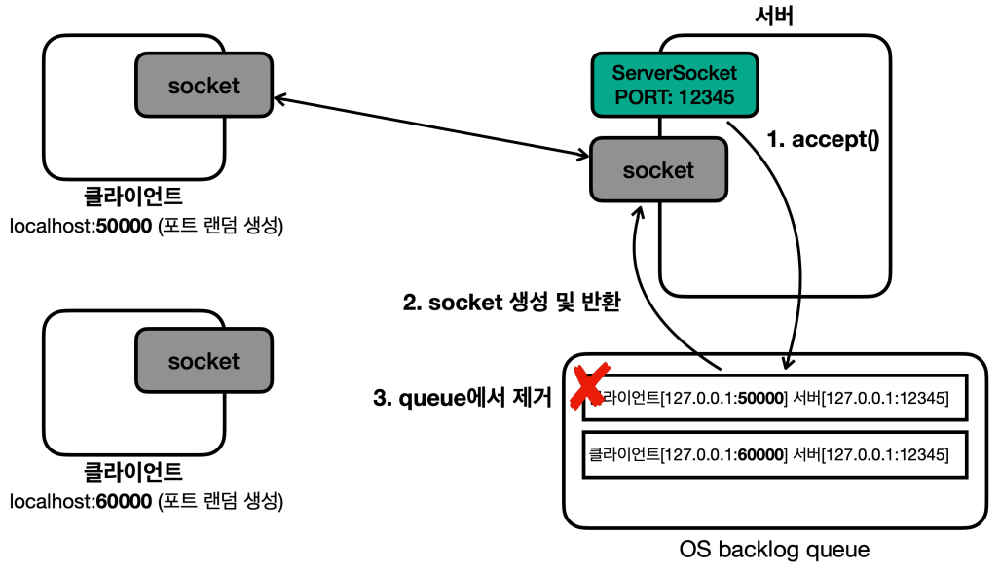

- 서버가 클라이언트와 데이터를 주고 받으려면 소켓을 획득해야 한다.
- `accept()` 메서드를 호출하면 `backlog queue`의 정보를 기반으로 소켓 객체를 하나 생성한다.
- 큐이므로 순서대로 데이터를 꺼낸다. 처음 50000번 클라이언트의 접속 정보를 기반으로
서버에 소켓이 하나 생성된다.
- 50000번 클라이언트와 서버는 소켓의 스트림을 통해 서로 데이터를 주고 받을 수 있다.
- 60000번 클라이언트도 서버와 TCP 연결이 되었기 때문에 서버로 메시지를 보낼 수 있다.
  - 아직 서버에 소켓 객체가 없더라도 메시지는 보낼 수 있다. TCP 연결은 이미 완료되었다.

**여기서 잠깐 다음 그림을 확인해보자.**

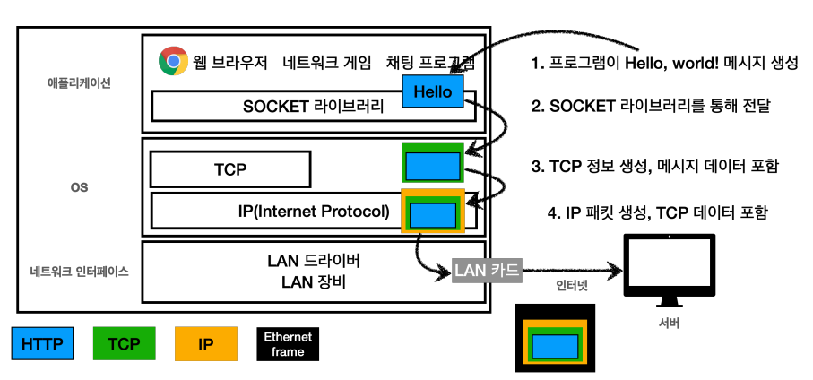

소켓을 통해 스트림으로 메시지를 주고 받는다는 것은 사실 이러한 과정을 거친다.
자바 애플리케이션은 소켓 객체의 스트림을 통해 데이터를 주고 받는다. 과정은 다음과 같다.

- 클라이언트 : 애플리케이션 **→ OS TCP 송신 버퍼 →** 클라이언트 네트워크 카드
- 서버 : 서버 네트워크 카드 **→ OS TCP 송신 버퍼 →** 애플리케이션

여기서 60000번 클라이언트가 보낸 메시지는 서버 애플리케이션에서 아직 읽지 않았기 때문에
**서버 OS의 TCP 수신 버퍼에서 대기하게 된다.**

**여기서 핵심은 소켓 객체 없이 서버 소켓만으로도 TCP 연결은 완료된다는 것이다.**
(서버 소켓은 연결만 담당한다.) 하지만 연결 이후에 서로 메시지를 주고 받으려면 소켓 객체가 필요하다.

`accept()`는 이미 연결된 TCP 연결 정보를 기반으로 서버 측에 소켓 객체를 생성한다.
그리고 이 소켓 객체가 있어야 스트림을 사용해서 메시지를 주고 받을 수 있다.

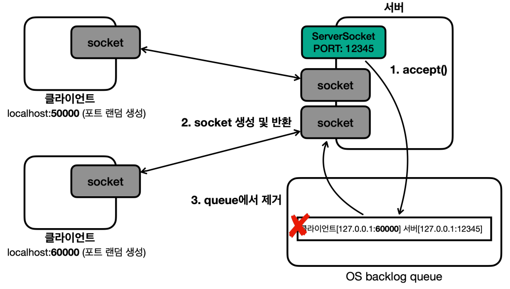

이렇게 소켓을 연결하면 소켓의 스트림을 통해 OS TCP 수신 버퍼에 있는 메시지를 읽고 쓸 수 있다.

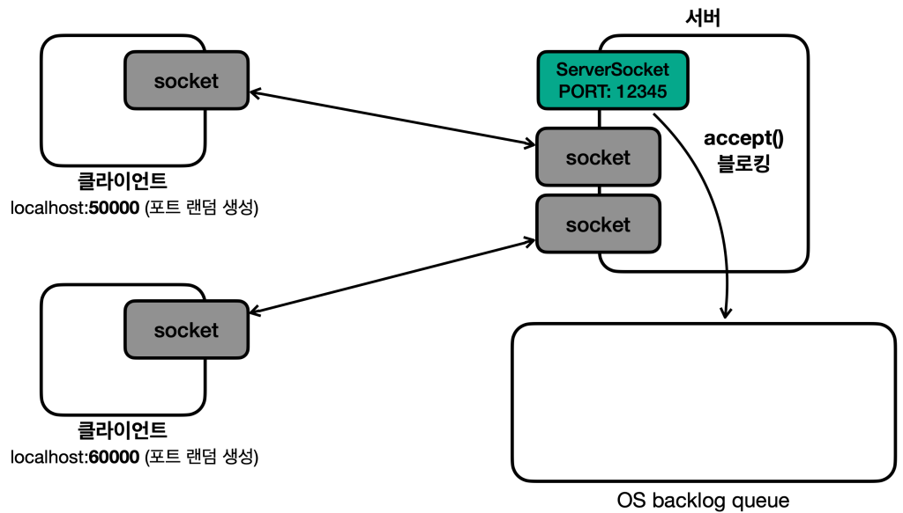

`accept()` 메서드는 `backlog queue`에 새로운 연결 정보가 도착할 때까지 블로킹 상태로
대기한다. 새로운 연결 정보가 오지 않으면 계속 대기하는 블로킹 메서드이다.

**결론적으로 둘 이상의 클라이언트가 작동하지 않는 이유는 다음과 같다.**

- **새로운 클라이언트가 접속했을 때 서버의 `main` 스레드는 `accept()` 메서드를 절대로 호출할 수 없다.**
왜냐하면 `while` 문으로 기존 클라이언트와 메시지를 주고 받는 부분만 반복하기 때문이다.
- `accept()`를 호출해야 소켓 객체를 생성하고 클라이언트와 메시지를 주고 받을 수 있다.

**결국 2개의 블로킹 작업으로 인해 별도의 스레드가 필요한 것이다.**
여기서 2개의 블로킹 작업은 `accept()`와 `readXxx()`이다.
`accept()`는 클라이언트와 서버의 연결을 처리하기 위해 대기하고,
`readXxx()`는 클라이언트의 메시지를 받아서 처리하기 위해 대기한다.

**각각의 블로킹 작업은 별도의 스레드에서 처리해야 한다. 그렇지 않으면 다른
블로킹 메서드 때문에 계속 대기할 수 있다.**

---

## V3

이번에는 여러 클라이언트가 동시에 접속할 수 있도록 해보자. 구조는 다음과 같다.

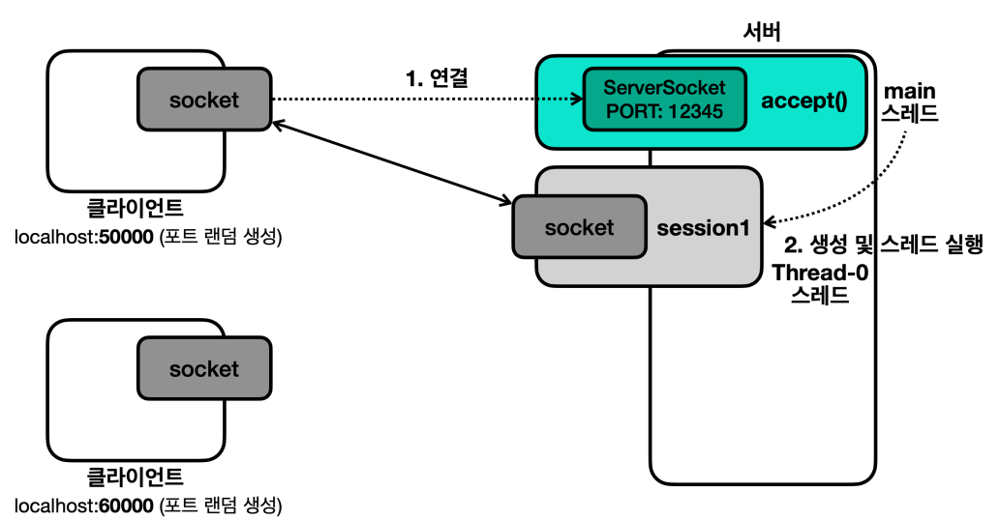

- 서버의 `main` 스레드는 서버 소켓을 생성하고, 서버 소켓의 `accept()`를 반복해서 호출해야 한다.
- 클라이언트가 서버에 접속하면 서버 소켓의 `accept()` 메서드가 `Socket`을 반환한다.
- `main` 스레드는 이 정보를 기반으로 `Session` 이라는 별도의 객체(스레드)를 만들고, 새로운 스레드에서
이 객체를 실행한다.
- `Session` 객체와 `Thread-0`은 연결된 클라이언트와 메시지를 주고 받는다.

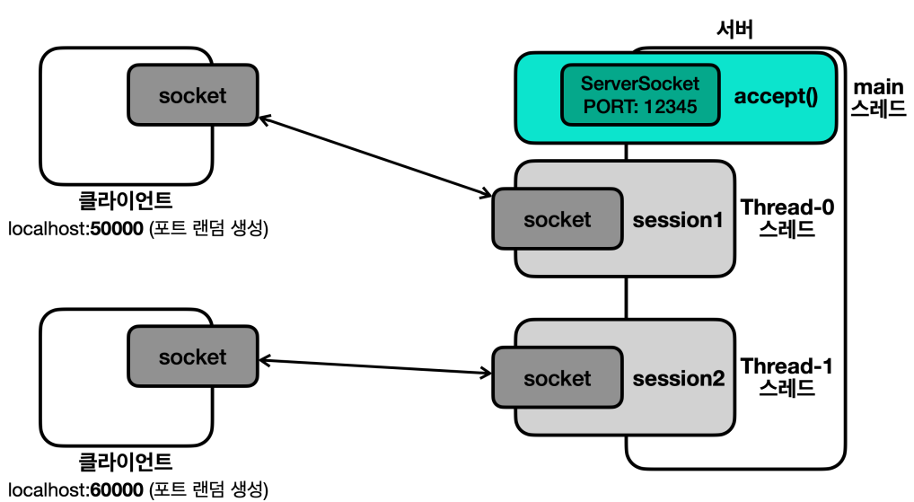

- 새로운 TCP 연결이 발생하면 `main` 스레드에서 새로운 `Session` 객체를
별도의 스레드에서 실행한다. 이 과정을 반복하는 것이다.

**정리하면 `main` 스레드와 `Session` 담당 스레드로 역할을 분리한 것이다.**

**`main` 스레드**는 새로운 연결이 있을 때마다 `Session` 객체와 별도의 스레드를 생성하고,
별도의 스레드가 `Session` 객체를 실행하도록 한다.
**`Session` 담당 스레드**는 자신의 소켓이 연결된 클라이언트와 메시지를 반복해서
주고 받는 역할을 담당한다.

```java
import java.io.DataInputStream;
import java.io.DataOutputStream;
import java.io.IOException;
import java.net.Socket;
import java.util.Scanner;

import static util.MyLogger.log;

/**
 * TCP/IP 네트워킹 클라이언트 - V3
 */
public class ClientV3 {

    private static final int PORT = 12345;

    public static void main(String[] args) throws IOException {

        log("클라이언트 시작");

        Socket socket = new Socket("localhost", PORT);

        DataInputStream input = new DataInputStream(socket.getInputStream());
        DataOutputStream output = new DataOutputStream(socket.getOutputStream());
        log("소켓 연결: " + socket);

        Scanner sc = new Scanner(System.in);
        while (true) {
            System.out.print("전송 문자: ");
            String message = sc.nextLine();

            //서버에게 문자 보내기
            output.writeUTF(message);
            log("client -> server: " + message);

            if (message.equals("exit")) {
                break;
            }

            //서버로부터 문자 받기
            String received = input.readUTF();
            log("client <- server: " + received);
        }

        //자원 정리
        log("연결 종료: " + socket);
        input.close();
        output.close();
        socket.close();
    }
}
```
```java
import java.io.DataInputStream;
import java.io.DataOutputStream;
import java.io.IOException;
import java.net.Socket;

import static util.MyLogger.log;

/**
 * TCP/IP 네트워킹 세션 스레드 - V3
 */
public class SessionV3 implements Runnable {

    private final Socket socket;

    public SessionV3(Socket socket) {
        this.socket = socket;
    }

    @Override
    public void run() {
        try {
            DataInputStream input = new DataInputStream(socket.getInputStream());
            DataOutputStream output = new DataOutputStream(socket.getOutputStream());

            while (true) {

                //클라이언트로부터 문자 받기
                String received = input.readUTF();
                log("client -> server: " + received);

                if (received.equals("exit")) {
                    break;
                }

                //클라이언트에게 문자 보내기
                String message = received + " World!";
                output.writeUTF(message);
                log("client <- server: " + message);
            }

            //자원 정리
            log("연결 종료: " + socket);
            input.close();
            output.close();
            socket.close();

        } catch (IOException e) {
            throw new RuntimeException(e);
        }
    }
}
```
`Session`의 목적은 소켓이 연결된 클라이언트와 메시지를 반복해서 주고 받는 것이다.
```java
import java.io.IOException;
import java.net.ServerSocket;
import java.net.Socket;

import static util.MyLogger.log;

/**
 * TCP/IP 네트워킹 서버 - V3
 */
public class ServerV3 {

    private static final int PORT = 12345;

    public static void main(String[] args) throws IOException {

        log("서버 시작");

        ServerSocket serverSocket = new ServerSocket(PORT);

        log("서버 소켓 시작 - 리스닝 포트: " + PORT);

        while (true) {
            Socket socket = serverSocket.accept(); //블로킹
            log("소켓 연결: " + socket);

            SessionV3 session = new SessionV3(socket);
            Thread thread = new Thread(session); //스레드 생성

            thread.start();
        }
    }
}
```
- `main` 스레드는 서버 소켓을 생성하고, `accept()`를 호출해서 연결을 대기한다.
- 새로운 연결이 추가될 때마다 `Session` 객체를 생성하고 별도의 스레드에서
`Session` 객체를 실행하는 과정을 반복한다.

```text
11:22:21.977 [     main] 서버 시작
11:22:21.981 [     main] 서버 소켓 시작 - 리스닝 포트: 12345
11:22:29.361 [     main] 소켓 연결: Socket[addr=/127.0.0.1,port=55858,localport=12345]
11:22:47.894 [     main] 소켓 연결: Socket[addr=/127.0.0.1,port=55880,localport=12345]
11:22:58.861 [ Thread-0] client -> server: hello1
11:22:58.862 [ Thread-0] client <- server: hello1 World!
11:23:04.153 [ Thread-1] client -> server: hello2
11:23:04.153 [ Thread-1] client <- server: hello2 World!
```

서버 소켓을 통해 소켓을 연결하는 부분과 각 클라이언트와 메시지를 주고 받는 부분을 
별도의 스레드로 나누었다. 즉 **블로킹 되는 부분을 별도의 스레드로 나누어** 문제를 해결했다.

**그런데 여기서 문제가 하나 있다. 서버와 연결된 클라이언트에서 `exit`를 입력해 정상적으로
종료하는 것이 아닌 IDE의 `Stop` 버튼으로 강제 종료를 하면 다음 예외가 발생한다.**

```text
Exception in thread "Thread-0" java.lang.RuntimeException: java.net.SocketException: Connection reset
```

클라이언트의 연결을 직접 종료하면 클라이언트 프로세스가 종료되면서 클라이언트와 서버의
TCP 연결도 함께 종료된다. 이때 서버에서 `readUTF()`로 메시지를 읽으려고 할때 예외가 발생한다.

**여기서 심각한 문제는 이렇게 예외가 발생해버리면 서버에서 자원 정리 코드를 호출하지
못한다는 점이다.** 자바 객체는 GC가 되지만 자바 외부의 자원은 자동으로 GC가 되는 게 아니다.
따라서 반드시 정리를 해주어야 한다.

---

[이전 ↩️ - File, Files]()

[메인 ⏫](https://github.com/genesis12345678/TIL/blob/main/Java/adv_1/Main.md)

[다음 ↪️ - 자원 정리 이해]()