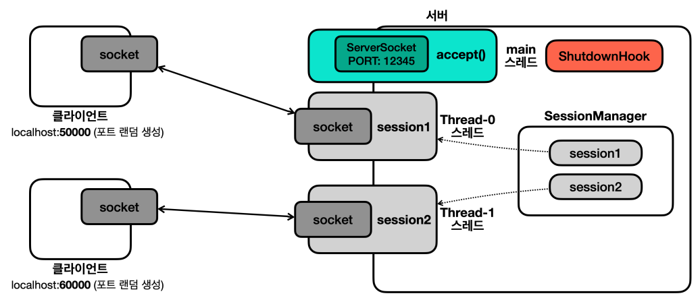

# 자바 - 네트워크 프로그램 자원 정리

이제 자원 정리를 [네트워크 프로그램]()에 도입해서, 안전하게 자원을 정리하도록 해보자.
참고로 항상 `try-with-resources`를 사용할 수 있는 것은 아니다. `finally`에서
직접 자원을 정리해야 하는 경우도 많다.

다음은 소켓과 스트림을 종료하기 위한 유틸 클래스이다.

```java
import java.io.IOException;
import java.io.InputStream;
import java.io.OutputStream;
import java.net.Socket;

import static util.MyLogger.log;

public abstract class SocketCloseUtil {

    public static void closeAll(Socket socket, InputStream input, OutputStream output) {
        close(input);
        close(output);
        close(socket);
    }

    public static void close(InputStream input) {
        if (input != null) {
            try {
                input.close();
            } catch (IOException e) {
                log(e.getMessage());
            }
        }
    }

    public static void close(OutputStream output) {
        if (output != null) {
            try {
                output.close();
            } catch (IOException e) {
                log(e.getMessage());
            }
        }
    }

    public static void close(Socket socket) {
        if (socket != null) {
            try {
                socket.close();
            } catch (IOException e) {
                log(e.getMessage());
            }
        }
    }
}
```

- 자원 정리 과정에서 문제가 발생해도 코드에서 직접 대응할 수 있는 부분은 거의 없다.
이 경우 간단히 로그를 남겨서 개발자가 인지할 수 있는 정도면 충분하다.
- 각각의 예외를 잡아서 처리했기 때문에 예외가 발생해도 다음 자원을 닫을 수 있다.
- `Socket`을 기반으로 `InputStream`과 `OutputStream`을 생성하기 때문에 닫는 순서를
반대로 해야 한다.
- `InputStream`, `OutputStream`의 닫는 순서는 상관 없다.

---

## V4

```java
import java.io.DataInputStream;
import java.io.DataOutputStream;
import java.io.IOException;
import java.net.Socket;
import java.util.Scanner;

import static network.tcp.SocketCloseUtil.closeAll;
import static util.MyLogger.log;

/**
 * TCP/IP 네트워킹 클라이언트 - V4
 */
public class ClientV4 {

    private static final int PORT = 12345;

    public static void main(String[] args) throws IOException {

        log("클라이언트 시작");

        //finally 블록에서 변수에 접근해야 한다. 따라서 try 블록 안에서 선언할 수 없다.
        Socket socket = null;
        DataInputStream input = null;
        DataOutputStream output = null;

        try {
            socket = new Socket("localhost", PORT);
            input = new DataInputStream(socket.getInputStream());
            output = new DataOutputStream(socket.getOutputStream());

            log("소켓 연결: " + socket);

            Scanner sc = new Scanner(System.in);
            
            while (true) {
                System.out.print("전송 문자: ");
                String message = sc.nextLine();

                //서버에게 문자 보내기
                output.writeUTF(message);
                log("client -> server: " + message);

                if (message.equals("exit")) {
                    break;
                }

                //서버로부터 문자 받기
                String received = input.readUTF();
                log("client <- server: " + received);
            }
        } catch (IOException e) {
            log(e);
        } finally {
            //자원 정리
            closeAll(socket, input, output);
            log("연결 종료: " + socket);
        }
    }
}
```
```java
import java.io.DataInputStream;
import java.io.DataOutputStream;
import java.io.IOException;
import java.net.Socket;

import static network.tcp.SocketCloseUtil.closeAll;
import static util.MyLogger.log;

/**
 * TCP/IP 네트워킹 세션 스레드 - V4
 */
public class SessionV4 implements Runnable {

    private final Socket socket;

    public SessionV4(Socket socket) {
        this.socket = socket;
    }

    @Override
    public void run() {

        //finally 블록에서 변수에 접근해야 한다. 따라서 try 블록 안에서 선언할 수 없다.
        DataInputStream input = null;
        DataOutputStream output = null;

        try {
            input = new DataInputStream(socket.getInputStream());
            output = new DataOutputStream(socket.getOutputStream());

            while (true) {

                //클라이언트로부터 문자 받기
                String received = input.readUTF();
                log("client -> server: " + received);

                if (received.equals("exit")) {
                    break;
                }

                //클라이언트에게 문자 보내기
                String message = received + " World!";
                output.writeUTF(message);
                log("client <- server: " + message);
            }

        } catch (IOException e) {
            log(e);
        } finally {
            //자원 정리
            closeAll(socket, input, output);
            log("연결 종료: " + socket);
        }
    }
}
```
```java
import java.io.IOException;
import java.net.ServerSocket;
import java.net.Socket;

import static util.MyLogger.log;

/**
 * TCP/IP 네트워킹 서버 - V4
 */
public class ServerV4 {

    private static final int PORT = 12345;

    public static void main(String[] args) throws IOException {

        log("서버 시작");

        ServerSocket serverSocket = new ServerSocket(PORT);

        log("서버 소켓 시작 - 리스닝 포트: " + PORT);

        while (true) {
            Socket socket = serverSocket.accept(); //블로킹
            log("소켓 연결: " + socket);

            SessionV4 session = new SessionV4(socket);
            Thread thread = new Thread(session);
            thread.start();
        }
    }
}
```

클라이언트 강제 종료 시 서버의 로그
```text
13:06:24.118 [     main] 서버 시작
13:06:24.121 [     main] 서버 소켓 시작 - 리스닝 포트: 12345
13:06:26.884 [     main] 소켓 연결: Socket[addr=/127.0.0.1,port=60669,localport=12345]
13:06:29.231 [ Thread-0] java.net.SocketException: Connection reset
13:06:29.233 [ Thread-0] 연결 종료: Socket[addr=/127.0.0.1,port=60669,localport=12345]
```

- 기존에는 클라이언트를 강제 종료하면 서버의 `Session`에 예외가 발생하면서
자원을 제대로 정리하지 못했다.
- 이번에는 서버에 접속한 클라이언트를 강제 종료해도 서버의 `Session`이 "연결 종료" 메시지를
남기면서 자원을 잘 정리하는 것을 확인할 수 있다.

---

## V5

이번에는 자원 정리에 `try-with-resources`를 적용해보자.

```java
import java.io.DataInputStream;
import java.io.DataOutputStream;
import java.io.IOException;
import java.net.Socket;
import java.util.Scanner;

import static util.MyLogger.log;

/**
 * TCP/IP 네트워킹 클라이언트 - V5
 */
public class ClientV5 {

    private static final int PORT = 12345;

    public static void main(String[] args) throws IOException {

        log("클라이언트 시작");

        try (Socket socket = new Socket("localhost", PORT);
             DataInputStream input = new DataInputStream(socket.getInputStream());
             DataOutputStream output = new DataOutputStream(socket.getOutputStream())) {

            log("소켓 연결: " + socket);

            Scanner sc = new Scanner(System.in);
            
            while (true) {
                System.out.print("전송 문자: ");
                String message = sc.nextLine();

                //서버에게 문자 보내기
                output.writeUTF(message);
                log("client -> server: " + message);

                if (message.equals("exit")) {
                    break;
                }

                //서버로부터 문자 받기
                String received = input.readUTF();
                log("client <- server: " + received);
            }
        } catch (IOException e) {
            log(e);
        }
    }
}
```
`OutputStream`, `InputStream`, `Socket` 모두 `AutoCloseable`을 구현하고 있다.
```java
import java.io.DataInputStream;
import java.io.DataOutputStream;
import java.io.IOException;
import java.net.Socket;

import static network.tcp.SocketCloseUtil.closeAll;
import static util.MyLogger.log;

/**
 * TCP/IP 네트워킹 세션 스레드 - V5
 */
public class SessionV5 implements Runnable {

    private final Socket socket;

    public SessionV5(Socket socket) {
        this.socket = socket;
    }

    @Override
    public void run() {

        try (socket; //외부에서 받아오는 객체이다. 이 경우 객체의 참조를 넣으면 된다.
             DataInputStream input = new DataInputStream(socket.getInputStream());
             DataOutputStream output = new DataOutputStream(socket.getOutputStream())) {

            while (true) {

                //클라이언트로부터 문자 받기
                String received = input.readUTF();
                log("client -> server: " + received);

                if (received.equals("exit")) {
                    break;
                }

                //클라이언트에게 문자 보내기
                String message = received + " World!";
                output.writeUTF(message);
                log("client <- server: " + message);
            }

        } catch (IOException e) {
            log(e);
        }

        //소켓의 close()가 호출되었는지 확인
        log("연결 종료: " + socket + " isClosed: " + socket.isClosed());
    }
}
```
```java
import java.io.IOException;
import java.net.ServerSocket;
import java.net.Socket;

import static util.MyLogger.log;

/**
 * TCP/IP 네트워킹 서버 - V5
 */
public class ServerV5 {

    private static final int PORT = 12345;

    public static void main(String[] args) throws IOException {

        log("서버 시작");

        ServerSocket serverSocket = new ServerSocket(PORT);

        log("서버 소켓 시작 - 리스닝 포트: " + PORT);

        while (true) {
            Socket socket = serverSocket.accept(); //블로킹
            log("소켓 연결: " + socket);

            SessionV5 session = new SessionV5(socket);
            Thread thread = new Thread(session);
            thread.start();
        }
    }
}
```
```text
13:15:17.037 [     main] 서버 시작
13:15:17.040 [     main] 서버 소켓 시작 - 리스닝 포트: 12345
13:15:20.580 [     main] 소켓 연결: Socket[addr=/127.0.0.1,port=61111,localport=12345]
13:15:23.829 [ Thread-0] java.net.SocketException: Connection reset
13:15:23.832 [ Thread-0] 연결 종료: Socket[addr=/127.0.0.1,port=61111,localport=12345] isClosed: true
```

---

## V6

이번에는 서버를 종료할 때 서버 소켓과 연결된 모든 소켓 자원을 다 반납하고 
서버를 안정적으로 종료해보자. 서버를 종료하려면 서버에 종료라는 신호를 전달해야 한다.
예를 들어서 서버도 콘솔 창을 통해서 입력을 받도록 만들고 "종료" 메시지를 입력하면
모든 자원을 정리하면서 서버가 종료되도록 하면 된다. 하지만 보통 서버에서 콘솔 입력은
잘 하지 않으므로 서버를 직접 종료하면서 자원도 함께 정리해보자.

자바는 프로세스가 종료될 때 자원 정리나 로그 기록과 같은 종료 작업을 마무리 할 수 있는
**셧다운 훅(Shutdown Hook)** 이라는 기능을 지원한다.

프로세스 종료는 크게 2가지로 분류할 수 있다.
1. 정상 종료
- 모든 non 데몬 스레드의 실행 완료로 자바 프로세스 정상 종료
- 사용자가 `Ctrl+C`를 눌러서 프로그램을 중단
- `kill` 명령 전달(`kill -9` 제외)
- IDE의 `Stop` 버튼
2. 강제 종료
- 운영체제에서 프로세스를 더 이상 유지할 수 없다고 판단할 때 사용
- `kill -9`(리눅스/유닉스)나 `taskkill /F`(Windows)

정상 종료의 경우에는 셧다운 훅이 작동해서 프로세스 종료 전에 필요한 후 처리를 할 수 있다.
반면 강제 종료의 경우에는 셧다운 훅이 작동하지 않는다.

```java
import java.io.DataInputStream;
import java.io.DataOutputStream;
import java.io.IOException;
import java.net.Socket;
import java.util.Scanner;

import static util.MyLogger.log;

/**
 * TCP/IP 네트워킹 클라이언트 - V6
 */
public class ClientV6 {

    private static final int PORT = 12345;

    public static void main(String[] args) throws IOException {

        log("클라이언트 시작");

        try (Socket socket = new Socket("localhost", PORT);
             DataInputStream input = new DataInputStream(socket.getInputStream());
             DataOutputStream output = new DataOutputStream(socket.getOutputStream())) {

            log("소켓 연결: " + socket);

            Scanner sc = new Scanner(System.in);
            while (true) {
                System.out.print("전송 문자: ");
                String message = sc.nextLine();

                //서버에게 문자 보내기
                output.writeUTF(message);
                log("client -> server: " + message);

                if (message.equals("exit")) {
                    break;
                }

                //서버로부터 문자 받기
                String received = input.readUTF();
                log("client <- server: " + received);
            }
        } catch (IOException e) {
            log(e);
        }
    }
}
```
```java
import java.util.ArrayList;
import java.util.List;

/**
 * TCP/IP 네트워킹 세션 매니저 - V6
 * 동시성 처리 필요
 */
public class SessionManagerV6 {

    private final List<SessionV6> sessions = new ArrayList<>();

    /**
     * 세션이 새로 만들어지는 경우 세션 매니저에 세션을 추가
     * @param session 클라이언트의 새로운 연결
     */
    public synchronized void addSession(SessionV6 session) {
        sessions.add(session);
    }

    /**
     * 클라이언트의 연결이 끊어지면 세션도 함께 정리, 세션 매니저에서 세션을 제거
     * @param session 끊어질 클라이언트의 연결
     */
    public synchronized void remove(SessionV6 session) {
        sessions.remove(session);
    }

    /**
     * 서버를 종료할 때 사용하는 세션들을 모두 닫고 정리
     */
    public synchronized void closeAll() {
        for (SessionV6 session : sessions) {
            session.close();
        }
        sessions.clear();
    }
}
```



- 서버는 세션을 관리하는 세션 매니저가 필요하다.
- 각 세션은 소켓과 연결 스트림을 가지고 있다. 따라서 서버를 종료할 때 사용하는 세션들도
함께 종료해야 한다.
- 모든 세션들을 찾아서 종료하기 위해 생성한 세션을 보관하고 관리할 객체가 필요하다.
- `SessionManager`가 이 역할을 수행한다.
- `SessionManager`에는 여러 스레드에서 접근할 수 있다. 예를 들어 `closeAll()`로 자원을
정리하는 중에 `add()`나 `remove()`가 호출될 수 있는 것이다.

```java
import java.io.DataInputStream;
import java.io.DataOutputStream;
import java.io.IOException;
import java.net.Socket;

import static network.tcp.SocketCloseUtil.closeAll;
import static util.MyLogger.log;

/**
 * TCP/IP 네트워킹 세션 스레드 - V6
 */
public class SessionV6 implements Runnable {

    private final Socket socket;
    private final DataInputStream input;
    private final DataOutputStream output;
    private final SessionManagerV6 sessionManager;
    private boolean closed = false;

    public SessionV6(Socket socket, SessionManagerV6 sessionManager) throws IOException {
        this.socket = socket;
        this.input = new DataInputStream(socket.getInputStream());
        this.output = new DataOutputStream(socket.getOutputStream());
        this.sessionManager = sessionManager;
        this.sessionManager.addSession(this); //세션을 생성하면서 세션 매니저에 등록
    }

    @Override
    public void run() {

        try {
            while (true) {

                //클라이언트로부터 문자 받기
                String received = input.readUTF();
                log("client -> server: " + received);

                if (received.equals("exit")) {
                    break;
                }

                //클라이언트에게 문자 보내기
                String message = received + " World!";
                output.writeUTF(message);
                log("client <- server: " + message);
            }

        } catch (IOException e) {
            log(e);
        } finally {
            //세션 종료 시 세션 매니저에서 제거하고 세션에서 사용 중이던 자원 정리
            sessionManager.remove(this);
            close();
        }
    }

    //세션 종료 시, 서버 종료 시 동시에 호출될 수 있다.
    public synchronized void close() {

        if (closed) return;

        closeAll(socket, input, output);
        closed = true;
        log("연결 종료: " + socket);
    }
}
```

- `Session`은 이제 `try-with-resources`를 사용할 수 없다. 서버를 종료하는 시점에도
`Session`의 자원을 정리해야 하기 때문이다.
- **`try-with-resources`는 사용과 해제를 함께 묶어서 처리할 때 사용한다.**
  - `try-with-resources`는 `try` 선언부에서 사용한 자원을 `try`가 끝나는 시점에 정리한다.
  - 따라서 `try`에서 자원의 선언과 자원 정리를 묶어서 처리할 때 사용할 수 있다.
  - 하지만 지금은 서버를 종료하는 시점에도 `Session`이 사용하는 자원을 정리해야 한다. 서버를
    종료하는 시점에 자원을 정리하는 것은 `Session` 안에 있는 `try-with-resources`를 통해
    처리할 수 없다.
- 또한 자원을 정리하는 `close()` 메서드는 두 곳에서 호출될 수 있다.
  - 클라이언트와 연결이 종료되었을 때(`exit` 또는 예외 발생)
  - 서버를 종료할 때
- 따라서 `close()`가 다른 스레드에서 동시에 중복 호출될 가능성이 있다. 
- 이런 문제를 막기 위해 `synchronized` 키워드를 사용했으며, 자원 정리 코드가 중복 호출
되는 것을 막기 위해 `closed` 변수를 플래그로 사용했다.

```java
import java.io.IOException;
import java.net.ServerSocket;
import java.net.Socket;

import static util.MyLogger.log;

/**
 * TCP/IP 네트워킹 서버 - V6
 */
public class ServerV6 {

    private static final int PORT = 12345;

    public static void main(String[] args) throws IOException {

        log("서버 시작");
        SessionManagerV6 sessionManager = new SessionManagerV6();
        ServerSocket serverSocket = new ServerSocket(PORT);
        log("서버 소켓 시작 - 리스닝 포트: " + PORT);

        //Shutdown hook 등록
        ShutdownHook shutdownHook = new ShutdownHook(serverSocket, sessionManager);
        Runtime.getRuntime().addShutdownHook(new Thread(shutdownHook, "shutdown"));

        try {
            while (true) {
                Socket socket = serverSocket.accept(); //블로킹
                log("소켓 연결: " + socket);

                SessionV6 session = new SessionV6(socket, sessionManager);
                Thread thread = new Thread(session);
                thread.start();
            }
        } catch (IOException e) {
            log("서버 소켓 종료: " + e);
        }
    }

    static class ShutdownHook implements Runnable {

        private final ServerSocket serverSocket;
        private final SessionManagerV6 sessionManager;

        public ShutdownHook(ServerSocket serverSocket, SessionManagerV6 sessionManager) {
            this.serverSocket = serverSocket;
            this.sessionManager = sessionManager;
        }

        @Override
        public void run() {
            log("shutdownHook 실행");
            try {
                sessionManager.closeAll();
                serverSocket.close();

                Thread.sleep(1000); //자원 정리 대기
            } catch (Exception e) {
                e.printStackTrace();
                System.out.println("e = " + e);
            }
        }
    }
}
```

- `Runtime.getRuntime().addShutdownHook()`을 사용하여 자바 종료 시 호출되는
셧다운 훅을 등록할 수 있다. 여기에 셧다운이 발생했을 때 처리할 작업과 스레드를 등록하면 된다.


- 셧다운 훅이 실행될 때 모든 자원을 정리한다.
- `SessionManager`의 `closeAll()`을 호출하여 모든 세션이 사용하는 자원(`Socket`, `InputStream`, `OutputStream`)을 정리한다.
- `ServerSocket`의 `close()`를 호출하여 서버 소켓을 닫는다.
- **중간에 자원 정리를 대기하는 이유**
  - 보통 모든 non 데몬 스레드의 실행이 완료되면 자바 프로세스가 정상 종료되지만,
  `Ctrl+C`, `kill` 명령어, `Stop` 버튼과 같은 종료도 있다.
  - 이런 경우에는 non 데몬 스레드의 종료 여부와 관계없이 자바 프로세스가 종료된다.
  - 단 셧다운 훅의 실행이 끝날 때 까지는 기다려준다.
  - 즉 셧다운 훅의 실행이 끝나면 non 데몬 스레드의 실행 여부와 상관 없이
    자바 프로세스는 종료된다.
  - 따라서 다른 스레드가 자원을 정리하거나 필요한 로그를 남길 수 있도록 셧다운 훅의 
    실행을 잠시 대기한다.

```text
15:22:32.203 [     main] 서버 시작
15:22:32.207 [     main] 서버 소켓 시작 - 리스닝 포트: 12345
15:22:36.308 [     main] 소켓 연결: Socket[addr=/127.0.0.1,port=50865,localport=12345]
15:22:40.978 [ shutdown] shutdownHook 실행
15:22:40.981 [ shutdown] 연결 종료: Socket[addr=/127.0.0.1,port=50865,localport=12345]
15:22:40.981 [     main] 서버 소켓 종료: java.net.SocketException: Socket closed
15:22:40.981 [ Thread-0] java.net.SocketException: Socket closed
```

- 서버를 종료하면 `shutdown` 스레드가 `shutdownHook`을 실행하고, 세션의 `Socket`의
연결을 `close()`로 닫는다.
  - `[ Thread-0] java.net.SocketException: Socket closed`
  - `Session`의 `input.readUTF()`에서 입력을 대기하는 `Thread-0` 스레드는
    `SocketException` 예외를 받고 종료된다. (이 예외는 자신의 소켓을 닫았을 때 발생한다.)
- `shutdown` 스레드는 서버 소켓을 `close()`로 닫는다.
  - `[     main] 서버 소켓 종료: java.net.SocketException: Socket closed`
  - `accept()`에서 대기하고 있는 `main` 스레드는 `SocketException` 예외를 받고 종료된다.

---

[이전 ↩️ - 자원 정리 이해]()

[메인 ⏫](https://github.com/genesis12345678/TIL/blob/main/Java/adv_1/Main.md)

[다음 ↪️ - 네트워크 예외]()