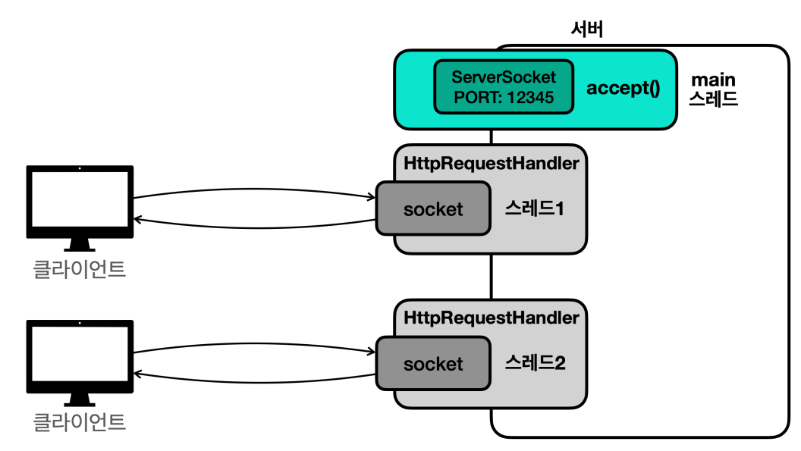
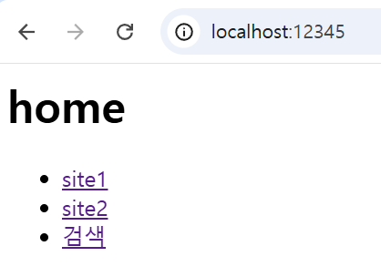
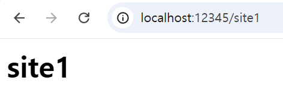
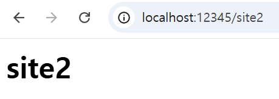
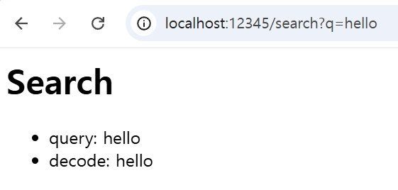
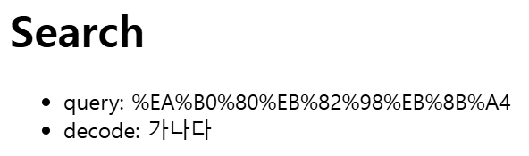
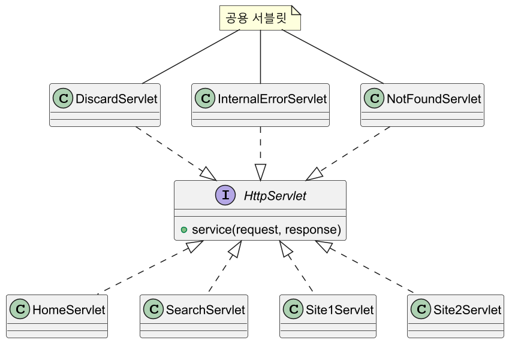

# 자바 - HTTP 서버 개발

## V1

간단하게 웹 브라우저에 다음 HTML을 응답하는 HTTP 서버를 직접 만들어보자.
```html
<h1>Hello World</h1>
```

```java
import java.io.BufferedReader;
import java.io.IOException;
import java.io.InputStreamReader;
import java.io.PrintWriter;
import java.net.ServerSocket;
import java.net.Socket;

import static java.nio.charset.StandardCharsets.UTF_8;
import static util.MyLogger.log;

/**
 * HTTP 서버 개발
 * @version 1
 */
public class HttpServerV1 {

    private final int port;

    public HttpServerV1(int port) {
        this.port = port;
    }

    public void start() throws IOException {
        ServerSocket serverSocket = new ServerSocket(port);
        log("서버 시작 port: " + port);

        while (true) {
            Socket socket = serverSocket.accept();
            process(socket);
        }
    }

    private void process(Socket socket) throws IOException {

        try (socket;
             BufferedReader reader = new BufferedReader(new InputStreamReader(socket.getInputStream(), UTF_8));
             PrintWriter writer = new PrintWriter(socket.getOutputStream(), false, UTF_8)) { //autoFlush=false

            //HTTP 요청을 String으로 반환
            String requestString = requestToString(reader);

            if (requestString.contains("/favicon.ico")) {
                log("favicon 요청");
                return;
            }

            log("HTTP 요청 정보 출력");
            System.out.println(requestString);

            log("HTTP 응답 생성중...");
            sleep(5000); //서버 처리 시간 가정
            responseToClient(writer);
            log("HTTP 응답 전달 완료");
        }
    }

    private String requestToString(BufferedReader reader) throws IOException {

        StringBuilder sb = new StringBuilder();
        String line;

        while ((line = reader.readLine()) != null) {

            //줄바꿈, HTTP 헤더의 마지막으로 인식
            //빈 라인 이후에는 메시지 바디가 나온다.
            if (line.isEmpty()) break;

            sb.append(line)
              .append("\n");
        }

        return sb.toString();
    }

    private void responseToClient(PrintWriter writer) {

        //웹 브라우저에 전달하는 내용
        String body = "<h1>Hello World</h1>";
        int length = body.getBytes(UTF_8).length;

        StringBuilder sb = new StringBuilder();
        // \r\n = 줄바꿈 처리
        sb.append("HTTP/1.1 200 OK\r\n")
          .append("Content-Type: text/html\r\n")
          .append("Content-Length: ").append(length).append("\r\n")
          .append("\r\n") //header, body 구분 라인
          .append(body);

        log("HTTP 응답 정보 출력");
        System.out.println(sb);

        writer.println(sb);
        writer.flush();
    }

    private void sleep(int millis) {
        try {
            Thread.sleep(millis);
        } catch (InterruptedException e) {
            throw new RuntimeException(e);
        }
    }
}
```

- HTTP 메시지의 주요 내용들을 문자로 읽고 쓴다.
- 보조 스트림으로 `BufferedReader`와 `PrintWriter`를 사용한다.
  - 스트림을 `Reader`, `Writer`로 변경할 때는 항상 인코딩을 확인해야 한다.
- `new PrintWriter()` 생성자 두 번째 인자로 `autoFlush` 여부를 받는다.
  - `true`면 `println()`으로 출력할 때마다 자동으로 플러시된다. 첫 내용을 빠르게
    전송할 수 있지만 네트워크 전송이 자주 발생한다.
  - `false`면 `flush()`를 직접 호출해주어야 데이터를 전송한다. 데이터를 모아서 전송하므로
    네트워크 전송 횟수를 효과적으로 줄일 수 있다. 한 패킷에 많은 양의 데이터를
    담아서 전송할 수 있다.

```java
import java.io.IOException;

public class ServerMainV1 {
    public static final int PORT = 12345;
    
    public static void main(String[] args) throws IOException {
        HttpServerV1 server = new HttpServerV1(PORT);
        server.start();
    }
}
```
```text
15:01:21.773 [     main] 서버 시작 port: 12345
15:01:26.999 [     main] HTTP 요청 정보 출력
GET / HTTP/1.1
Host: localhost:12345
Connection: keep-alive
sec-ch-ua: "Not A(Brand";v="8", "Chromium";v="132", "Google Chrome";v="132"
sec-ch-ua-mobile: ?0
sec-ch-ua-platform: "Windows"
Upgrade-Insecure-Requests: 1
User-Agent: Mozilla/5.0 (Windows NT 10.0; Win64; x64) AppleWebKit/537.36 (KHTML, like Gecko) Chrome/132.0.0.0 Safari/537.36
Sec-Purpose: prefetch;prerender
Purpose: prefetch
Accept: text/html,application/xhtml+xml,application/xml;q=0.9,image/avif,image/webp,image/apng,*/*;q=0.8,application/signed-exchange;v=b3;q=0.7
Sec-Fetch-Site: none
Sec-Fetch-Mode: navigate
Sec-Fetch-User: ?1
Sec-Fetch-Dest: document
Accept-Encoding: gzip, deflate, br, zstd
Accept-Language: ko,en-US;q=0.9,en;q=0.8,ko-KR;q=0.7
Cookie: Idea-52a55763=ae459913-83f5-4a79-976e-c1b95061b327

15:01:26.999 [     main] HTTP 응답 생성중...
15:01:32.000 [     main] HTTP 응답 정보 출력
HTTP/1.1 200 OK
Content-Type: text/html
Content-Length: 20

<h1>Hello World</h1>
15:01:32.000 [     main] HTTP 응답 전달 완료
15:01:32.489 [     main] favicon 요청
```
    
`http://localhost:12345`를 요청하면 웹 브라우저가 HTTP 요청 메시지를 만들어서 서버에 전달한다.

현재 서버는 한 번에 하나의 요청만 처리할 수 있다는 문제가 있다. 서버는 동시에
수 많은 사용자의 요청을 처리할 수 있어야 한다.

서로 다른 웹 브라우저 2개를 열어서 동시에 `http://localhost:12345`를 요청하면
첫 번째 요청이 모두 처리되고 나서 두 번째 요청이 처리된다.

하나의 메인 스레드에서 `serverSocket.accept()`에서 블로킹이 되기 때문이다.
```java
public void start() throws IOException {
    ServerSocket serverSocket = new ServerSocket(port);
    log("서버 시작 port: " + port);
    while (true) {
        Socket socket = serverSocket.accept(); //블로킹
        process(socket);
    }
}
```

---

## V2

스레드를 사용해서 동시에 여러 요청을 처리할 수 있도록 해보자.



```java
import java.io.BufferedReader;
import java.io.IOException;
import java.io.InputStreamReader;
import java.io.PrintWriter;
import java.net.Socket;

import static java.nio.charset.StandardCharsets.UTF_8;
import static util.MyLogger.log;

/**
 * HTTP 서버 개발
 * @version 2
 */
public class HttpRequestHandlerV2 implements Runnable {

    private final Socket socket;

    public HttpRequestHandlerV2(Socket socket) {
        this.socket = socket;
    }

    @Override
    public void run() {
        try {
            process();
        } catch (Exception e) {
            log(e);
        }
    }

    private void process() throws IOException {

        try (socket;
             BufferedReader reader = new BufferedReader(new InputStreamReader(socket.getInputStream(), UTF_8));
             PrintWriter writer = new PrintWriter(socket.getOutputStream(), false, UTF_8)) {

            String requestString = requestToString(reader);

            if (requestString.contains("/favicon.ico")) {
                log("favicon 요청");
                return;
            }

            log("HTTP 요청 정보 출력");
            System.out.println(requestString);

            log("HTTP 응답 생성중...");
            sleep(5000);
            responseToClient(writer);

            log("HTTP 응답 전달 완료");
        }
    }

    private String requestToString(BufferedReader reader) throws IOException {

        StringBuilder sb = new StringBuilder();
        String line;

        while ((line = reader.readLine()) != null) {

            if (line.isEmpty()) break;

            sb.append(line)
              .append("\n");
        }

        return sb.toString();
    }

    private void responseToClient(PrintWriter writer) {
        
        //웹 브라우저에 전달하는 내용
        String body = "<h1>Hello World</h1>";
        int length = body.getBytes(UTF_8).length;

        StringBuilder sb = new StringBuilder();

        sb.append("HTTP/1.1 200 OK\r\n")
          .append("Content-Type: text/html\r\n")
          .append("Content-Length: ").append(length).append("\r\n")
          .append("\r\n") //header, body 구분 라인
          .append(body);

        log("HTTP 응답 정보 출력");
        System.out.println(sb);

        writer.println(sb);
        writer.flush();
    }

    private void sleep(int millis) {
        try {
            Thread.sleep(millis);
        } catch (InterruptedException e) {
            throw new RuntimeException(e);
        }
    }
}
```
동시에 요청한 수 만큼 별도의 스레드에서 `HttpRequestHandler`가 수행된다.
```java
import java.io.IOException;
import java.net.ServerSocket;
import java.net.Socket;
import java.util.concurrent.ExecutorService;
import java.util.concurrent.Executors;

import static util.MyLogger.log;

/**
 * HTTP 서버 개발
 * @version 2
 */
public class HttpServerV2 {

    //최대 10개의 요청을 동시에 처리할 수 있는 스레드 풀 사용
    private final ExecutorService es = Executors.newFixedThreadPool(10);
    private final int port;

    public HttpServerV2(int port) {
        this.port = port;
    }

    public void start() throws IOException {

        ServerSocket serverSocket = new ServerSocket(port);
        log("서버 시작 port: " + port);

        while (true) {
            Socket socket = serverSocket.accept();
            es.submit(new HttpRequestHandlerV2(socket)); //작업 제출
        }
    }
}
```
```java
import java.io.IOException;
/**
 * HTTP 서버 개발
 * @version 2
 */
public class ServerMainV2 {

    public static final int PORT = 12345;

    public static void main(String[] args) throws IOException {

        HttpServerV2 server = new HttpServerV2(PORT);
        server.start();
    }
}
```

---

## V3

HTTP 서버들은 URL 경로를 사용해서 각각의 기능을 제공한다.
URL에 따른 다양한 기능을 제공하는 서버를 만들어보자.

```java
import java.io.BufferedReader;
import java.io.IOException;
import java.io.InputStreamReader;
import java.io.PrintWriter;
import java.net.Socket;
import java.net.URLDecoder;
import java.nio.charset.StandardCharsets;

import static java.nio.charset.StandardCharsets.UTF_8;
import static util.MyLogger.log;
/**
 * HTTP 서버 개발
 * @version 3
 */
public class HttpRequestHandlerV3 implements Runnable {

    private final Socket socket;

    public HttpRequestHandlerV3(Socket socket) {
        this.socket = socket;
    }

    @Override
    public void run() {
        try {
            process();
        } catch (Exception e) {
            log(e);
        }
    }

    private void process() throws IOException {
        try (socket;
             BufferedReader reader = new BufferedReader(new InputStreamReader(socket.getInputStream(), UTF_8));
             PrintWriter writer = new PrintWriter(socket.getOutputStream(), false, UTF_8)) {

            String requestString = requestToString(reader);

            if (requestString.contains("/favicon.ico")) {
                log("favicon 요청");
                return;
            }

            log("HTTP 요청 정보 출력");
            System.out.println(requestString);

            log("HTTP 응답 생성중...");

            if (requestString.startsWith("GET /site1")) site1(writer);
            else if (requestString.startsWith("GET /site2")) site2(writer);
            else if (requestString.startsWith("GET /search")) search(writer, requestString);
            else if (requestString.startsWith("GET / ")) home(writer);
            else notFound(writer);

            log("HTTP 응답 전달 완료");
        }
    }

    private void site1(PrintWriter writer) {
        writer.println("HTTP/1.1 200 OK");
        writer.println("Content-Type: text/html; charset=UTF-8");
        writer.println();
        writer.println("<h1>site1</h1>");

        writer.flush();
    }

    private void site2(PrintWriter writer) {
        writer.println("HTTP/1.1 200 OK");
        writer.println("Content-Type: text/html; charset=UTF-8");
        writer.println();
        writer.println("<h1>site2</h1>");

        writer.flush();
    }

    private void search(PrintWriter writer, String requestString) {
        // requestString = GET /search?q=hello HTTP/1.1
        int startIndex = requestString.indexOf("q=");
        int endIndex = requestString.indexOf(" ", startIndex + 2);

        //hello
        String query = requestString.substring(startIndex + 2, endIndex);
        String decode = URLDecoder.decode(query, UTF_8);

        writer.println("HTTP/1.1 200 OK");
        writer.println("Content-Type: text/html; charset=UTF-8");
        writer.println();
        writer.println("<h1>Search</h1>");
        writer.println("<ul>");
        writer.println("<li>query: " + query + "</li>");
        writer.println("<li>decode: " + decode + "</li>");
        writer.println("</ul>");

        writer.flush();
    }

    private void home(PrintWriter writer) {
        writer.println("HTTP/1.1 200 OK");
        writer.println("Content-Type: text/html; charset=UTF-8");
        writer.println();
        writer.println("<h1>home</h1>");
        writer.println("<ul>");
        writer.println("<li><a href='/site1'>site1</a></li>");
        writer.println("<li><a href='/site2'>site2</a></li>");
        writer.println("<li><a href='/search?q=hello'>검색</a></li>");
        writer.println("</ul>");

        writer.flush();
    }

    private void notFound(PrintWriter writer) {
        writer.println("HTTP/1.1 404 Not Found");
        writer.println("Content-Type: text/html; charset=UTF-8");
        writer.println();
        writer.println("<h1>404 페이지를 찾을 수 없습니다.</h1>");

        writer.flush();
    }

    private String requestToString(BufferedReader reader) throws IOException {

        StringBuilder sb = new StringBuilder();
        String line;

        while ((line = reader.readLine()) != null) {

            if (line.isEmpty()) break;

            sb.append(line)
              .append("\n");
        }

        return sb.toString();
    }
}
```
```java
import java.io.IOException;
import java.net.ServerSocket;
import java.net.Socket;
import java.util.concurrent.ExecutorService;
import java.util.concurrent.Executors;

import static util.MyLogger.log;
/**
 * HTTP 서버 개발
 * @version 3
 */
public class HttpServerV3 {

    private final ExecutorService es = Executors.newFixedThreadPool(10);
    private final int port;

    public HttpServerV3(int port) {
        this.port = port;
    }

    public void start() throws IOException {

        ServerSocket serverSocket = new ServerSocket(port);
        log("서버 시작 port: " + port);

        while (true) {
            Socket socket = serverSocket.accept();
            es.submit(new HttpRequestHandlerV3(socket));
        }
    }
}
```
```java
import java.io.IOException;
/**
 * HTTP 서버 개발
 * @version 3
 */
public class ServerMainV3 {
    public static final int PORT = 12345;

    public static void main(String[] args) throws IOException {
        HttpServerV3 server = new HttpServerV3(PORT);
        server.start();
    }
}
```






### 퍼센트(%) 인코딩

HTTP 메시지에서 시작 라인(URL 포함)과 HTTP 헤더의 이름은 항상 ASCII를 사용해야 한다.
반면 HTTP 메시지 바디는 UTF-8과 같은 다른 인코딩을 사용할 수 있다.

그렇다면 `/search?q=가나다`처럼 URL에 한글을 전달하려면 어떻게 해야할까?
우선 `http://localhost:12345/search?q=가나다` 를 요청하면 결과는 다음과 같다.



- 한글을 UTF-8 인코딩으로 표현하면 한 글자에 3byte의 데이터를 사용한다.
- 가, 나, 다를 UTF-8의 16진수로 표현하면 다음과 같다.
  - `가`: EA, B0, 80 (3byte)
  - `나`: EB, 82, 98 (3byte)
  - `다`: EB, 8B, A4 (3byte)
- URL은 ASCII 문자만 표현할 수 있으므로 UTF-8 문자를 표현할 수 없다.
- 그래서 예를 들어 "가"를 UTF-8 16진수로 표현한 각각의 바이트 문자 앞에 퍼센트(`%`)를 붙이는 것이다.
  - `q=%EA%B0%80`
- 이렇게 하면 억지로라도 ASCII 문자를 사용해서 16진수로 표현된 UTF-8을 표현할 수 있다. 그리고 퍼센트(`%`)를 포함해서
    모두 ASCII에 포함되는 문자이다.
- 이렇게 각각의 16진수 byte를 문자로 표현하고, 해당 문자 앞에 `%`를 붙이는 것을 **퍼센트 인코딩**이라 한다.

퍼센트 인코딩 후에 클라이언트에서 서버로 데이터를 전달하면 서버는 각각의 `%`를 제거하고 각 문자(`EA`, `B0`, `80`)를 얻는다.
그리고 이렇게 얻은 문자를 16진수 byte로 변경한다. 이 3개의 byte를 모아서 UTF-8로 인코딩하면
"가"라는 글자를 얻을 수 있는 것이다.

자바에서는 자바가 제공하는 `URLEncoder`와 `URLDecoder`를 사용해서
퍼센트 인코딩을 처리할 수 있다.

```java
import java.net.URLDecoder;
import java.net.URLEncoder;

import static java.nio.charset.StandardCharsets.*;

/**
 * 퍼센트 인코딩 예제 코드
 */
public class PercentEncodingMain {
    public static void main(String[] args) {

        String encode = URLEncoder.encode("가", UTF_8);
        System.out.println("encode = " + encode); //encode = %EA%B0%80

        String decode = URLDecoder.decode(encode, UTF_8);
        System.out.println("decode = " + decode); //decode = 가
    }
}
```

> 퍼센트 인코딩은 데이터 크기에서 보면 효율이 떨어진다. 문자 "가"는 3byte만 필요한데,
> 퍼센트 인코딩을 사용하면 `%`를 포함해 9byte나 사용된다.

---

## V4

HTTP 요청 메시지와 응답 메시지는 HTTP 메서드, URL, 헤더, HTTP 버전, Content-Type 등과 같이
정해진 규칙이 있다.

각 규칙에 맞추어 객체로 만들어서 코드를 리팩토링 해보자.

```java
import java.io.BufferedReader;
import java.io.IOException;
import java.net.URLDecoder;
import java.util.HashMap;
import java.util.Map;

import static java.nio.charset.StandardCharsets.UTF_8;
import static util.MyLogger.log;
/**
 * HTTP 서버 개발 - HTTP 요청 객체
 * @version 4
 */
public class HttpRequest {

    private String method;
    private String path;
    private final Map<String, String> queryParams = new HashMap<>();
    private final Map<String, String> headers = new HashMap<>();

    public HttpRequest(BufferedReader reader) throws IOException {
        parseRequestLine(reader);
        parseHeaders(reader);
        parseBody(reader);
    }

    //(method) (URL) (HTTP 버전)
    private void parseRequestLine(BufferedReader reader) throws IOException {
        String requestLine = reader.readLine();
        if (requestLine == null) throw new IOException("EOF: No request line received");

        String[] parts = requestLine.split(" ");
        if (parts.length != 3) throw new IOException("Invalid request line: " + requestLine);

        this.method = parts[0];
        String[] pathParts = parts[1].split("\\?");
        this.path = pathParts[0];

        if (pathParts.length > 1) {
            parseQueryParams(pathParts[1]);
        }
    }

    private void parseQueryParams(String queryString) {
        for (String param : queryString.split("&")) {
            String[] keyValue = param.split("=");

            String key = URLDecoder.decode(keyValue[0], UTF_8);
            String value = keyValue.length > 1 ? URLDecoder.decode(keyValue[1], UTF_8) : "";
            queryParams.put(key, value);
        }
    }

    private void parseHeaders(BufferedReader reader) throws IOException {
        String line;
        while (!(line = reader.readLine()).isEmpty()) {
            String[] headerParts = line.split(":");
            headers.put(headerParts[0].trim(), headerParts[1].trim());
        }
    }

    private void parseBody(BufferedReader reader) throws IOException {
        if (!headers.containsKey("Content-Length")) return;
        
        int contentLength = Integer.parseInt(headers.get("Content-Length"));
        char[] bodyChars = new char[contentLength];
        
        int read = reader.read(bodyChars);
        if (read != contentLength) {
          throw new IOException("Fail to read entire body. Expected " + contentLength + " bytes, but read " + read);
        }
        
        String body = new String(bodyChars);
        log("HTTP Message Body: " + body);
        
        String contentType = headers.get("Content-Type");
        if ("application/x-www-form-urlencoded".equals(contentType)) {
            parseQueryParams(body);
        }
    }

    public String getMethod() {
        return method;
    }

    public String getPath() {
        return path;
    }

    public String getParameter(String name) {
        return queryParams.get(name);
    }

    public String getHeader(String name) {
        return headers.get(name);
    }

    @Override
    public String toString() {
        return "HttpRequest{" +
            "method='" + method + '\'' +
            ", path='" + path + '\'' +
            ", queryParams=" + queryParams +
            ", headers=" + headers +
            '}';
    }
}
```

퍼센트 디코딩도 `URLDecoder.decode()`를 사용해서 처리했기 때문에 `HttpRequest`를 
사용하는 쪽에서는 퍼센트 디코딩을 고민하지 않아도 된다.

```java
private void parseQueryParams(String queryString) {
    for (String param : queryString.split("&")) {
        String[] keyValue = param.split("=");
        String key = URLDecoder.decode(keyValue[0], UTF_8);
        String value = keyValue.length > 1 ? URLDecoder.decode(keyValue[1], UTF_8) : "";
        queryParams.put(key, value);
    }
}
```

시작 라인의 다양한 정보와 헤더를 객체로 구조화했다.

```java
import java.io.PrintWriter;
import java.nio.charset.StandardCharsets;

import static java.nio.charset.StandardCharsets.*;
/**
 * HTTP 서버 개발 - HTTP 응답 객체
 * @version 4
 */
public class HttpResponse {

    private final PrintWriter writer;
    private final StringBuilder bodyBuilder = new StringBuilder();
    private int statusCode = 200;
    private String contentType = "text/html; charset=UTF-8";

    public HttpResponse(PrintWriter writer) {
        this.writer = writer;
    }

    public void setStatusCode(int statusCode) {
        this.statusCode = statusCode;
    }

    public void setContentType(String contentType) {
        this.contentType = contentType;
    }

    public void writeBody(String body) {
        bodyBuilder.append(body);
    }

    public void flush() {
        int contentLength = bodyBuilder.toString().getBytes(UTF_8).length;

        writer.println("HTTP/1.1 " + statusCode + " " + getReasonPhrase(statusCode));
        writer.println("Content-Type: " + contentType);
        writer.println("Content-Length: " + contentLength);
        writer.println();
        writer.println(bodyBuilder);

        writer.flush();
    }

    private String getReasonPhrase(int statusCode) {
        return switch (statusCode) {
            case 200 -> "OK";
            case 404 -> "Not Found";
            case 500 -> "Internal Server Error";
            default -> "Unknown Status";
        };
    }
}
```

HTTP 응답을 객체로 만들어 시작 라인, 응답 헤더를 구성하는 내용을
반복하지 않고 편리하게 사용할 수 있게 되었다.

```java
import java.io.BufferedReader;
import java.io.IOException;
import java.io.InputStreamReader;
import java.io.PrintWriter;
import java.net.Socket;

import static java.nio.charset.StandardCharsets.UTF_8;
import static util.MyLogger.log;
/**
 * HTTP 서버 개발
 * @version 4
 */
public class HttpRequestHandlerV4 implements Runnable {

    private final Socket socket;

    public HttpRequestHandlerV4(Socket socket) {
        this.socket = socket;
    }

    @Override
    public void run() {
        try {
            process();
        } catch (Exception e) {
            log(e);
        }
    }

    private void process() throws IOException {
        try (socket;
             BufferedReader reader = new BufferedReader(new InputStreamReader(socket.getInputStream(), UTF_8));
             PrintWriter writer = new PrintWriter(socket.getOutputStream(), false, UTF_8)) {

            HttpRequest request = new HttpRequest(reader);
            HttpResponse response = new HttpResponse(writer);

            if (request.getPath().equals("/favicon.ico")) {
                log("favicon 요청");
                return;
            }

            log("HTTP 요청 정보 출력");
            System.out.println(request);

            switch (request.getPath()) {
                case "/site1" -> site1(response);
                case "/site2" -> site2(response);
                case "/search" -> search(request, response);
                case "/" -> home(response);
                default -> notFound(response);
            }
            response.flush();
            log("HTTP 응답 전달 완료");
        }
    }

    private void site1(HttpResponse response) {
        response.writeBody("<h1>site1</h1>");
    }

    private void site2(HttpResponse response) {
        response.writeBody("<h1>site2</h1>");
    }

    private void search(HttpRequest request, HttpResponse response) {
        String query = request.getParameter("q");

        response.writeBody("<h1>Search</h1>");
        response.writeBody("<ul>");
        response.writeBody("<li>query: " + query + "</li>");
        response.writeBody("</ul>");
    }

    private void home(HttpResponse response) {
        response.writeBody("<h1>home</h1>");
        response.writeBody("<ul>");
        response.writeBody("<li><a href='/site1'>site1</a></li>");
        response.writeBody("<li><a href='/site2'>site2</a></li>");
        response.writeBody("<li><a href='/search?q=hello'>검색</a></li>");
        response.writeBody("</ul>");
    }

    private void notFound(HttpResponse response) {
        response.setStatusCode(404);
        response.writeBody("<h1>404 페이지를 찾을 수 없습니다.</h1>");
    }
}
```

- 클라이언트의 요청이 들어오면 요청 정보를 기반으로 `HttpRequest` 객체를 만들어두고,
`HttpRequest`를 통해서 필요한 정보를 편리하게 찾을 수 있다.
- 응답의 경우도 `HttpResponse`를 사용하여 HTTP 메시지 바디에 출력할 부분만 적어주면 된다.
나머지는 `HttpResponse`객체가 대신 처리해준다.

```java
import java.io.IOException;
import java.net.ServerSocket;
import java.net.Socket;
import java.util.concurrent.ExecutorService;
import java.util.concurrent.Executors;

import static util.MyLogger.log;
/**
 * HTTP 서버 개발
 * @version 4
 */
public class HttpServerV4 {

    private final ExecutorService es = Executors.newFixedThreadPool(10);
    private final int port;

    public HttpServerV4(int port) {
        this.port = port;
    }

    public void start() throws IOException {

        ServerSocket serverSocket = new ServerSocket(port);
        log("서버 시작 port: " + port);

        while (true) {
            Socket socket = serverSocket.accept();
            es.submit(new HttpRequestHandlerV4(socket));
        }
    }
}
```
```java
import java.io.IOException;
/**
 * HTTP 서버 개발
 * @version 4
 */
public class ServerMainV4 {

    public static final int PORT = 12345;

    public static void main(String[] args) throws IOException {

        HttpServerV4 server = new HttpServerV4(PORT);
        server.start();
    }
}
```

`HttpRequest`, `HttpResponse` 객체가 HTTP 요청과 응답을 잘 구조화한 덕분에 많은 중복을 제거하고
코드도 효과적으로 리팩토링 할 수 있었다.

위 코드들을 보면 전체적인 코드가 크게 두 가지로 분류되는 것을 알 수 있다.
- HTTP 서버와 관련된 부분
  - `HttpServer`, `HttpRequestHandler`, `HttpRequst`, `HttpResponse`
- 서비스 개발을 위한 로직
  - `home()`, `site1()`, `site2()`, `search()`, `notFound()`

만약 웹 회원 관리 프로그램 같은 서비스를 만들어야 한다면 기존 코드에서 HTTP 서버와
관련된 부분은 거의 재사용하고, 서비스 개발을 위한 로직만 추가하면 될 것 같다.

---

## V5

커맨드 패턴으로 코드를 리팩토링 해보자.

HTTP 서버와 관련된 부분을 구조화하여 서비스 개발을 위한 로직과 명확하게 분리해야 한다.
여기서 핵심은 HTTP 서버와 관련된 부분은 코드의 변경 없이 재사용 가능해야 한다는 점이다.

커맨드 패턴을 사용하면 확장성 외에도 HTTP 서버와 관련된 부분과 서비스 개발을 위한 로직을
분리하는데도 도움이 된다.



```java
import java.io.IOException;
/**
 * HTTP 서버 개발
 * @version 5
 */
public interface HttpServlet {
    /**
     * 서비스 개발과 관련된 부분을 구현다.
     * @param request 필요한 HTTP 요청 정보를 꺼낼 수 있다.
     * @param response 필요한 응답을 할 수 있다.
     * @throws IOException
     */
    void service(HttpRequest request, HttpResponse response) throws IOException;
}
```
```java
public class HomeServlet implements HttpServlet {

    @Override
    public void service(HttpRequest request, HttpResponse response) {

        response.writeBody("<h1>home</h1>");
        response.writeBody("<ul>");
        response.writeBody("<li><a href='/site1'>site1</a></li>");
        response.writeBody("<li><a href='/site2'>site2</a></li>");
        response.writeBody("<li><a href='/search?q=hello'>검색</a></li>");
        response.writeBody("</ul>");
    }
}
```
```java
import java.io.IOException;

public class SearchServlet implements HttpServlet {

  @Override
  public void service(HttpRequest request, HttpResponse response) throws IOException {

    String query = request.getParameter("q");

    response.writeBody("<h1>Search</h1>");
    response.writeBody("<ul>");
    response.writeBody("<li>query: " + query + "</li>");
    response.writeBody("</ul>");
  }
}
```
```java
import java.io.IOException;

public class Site1Servlet implements HttpServlet {

    @Override
    public void service(HttpRequest request, HttpResponse response) throws IOException {
        response.writeBody("<h1>site1</h1>");
    }
}
```
```java
import java.io.IOException;

public class Site2Servlet implements HttpServlet {

    @Override
    public void service(HttpRequest request, HttpResponse response) throws IOException {
        response.writeBody("<h1>site2</h1>");
    }
}
```

```java
import was.httpserver.HttpRequest;
import was.httpserver.HttpResponse;
import was.httpserver.HttpServlet;

import java.io.IOException;
/**
 * HTTP 서버 개발 - 공용 서블릿
 * 페이지를 찾을 수 없을 때 사용하는 서블릿
 */
public class NotFoundServlet implements HttpServlet {

    @Override
    public void service(HttpRequest request, HttpResponse response) throws IOException {
        response.setStatusCode(404);
        response.writeBody("<h1>404 페이지를 찾을 수 없습니다.</h1>");
    }
}

```
```java
import was.httpserver.HttpRequest;
import was.httpserver.HttpResponse;
import was.httpserver.HttpServlet;

import java.io.IOException;
/**
 * HTTP 서버 개발 - 공용 서블릿
 * 서버 내부에 오류가 발생했다는 문제를 알리는 서블릿
 */
public class InternalErrorServlet implements HttpServlet {

    @Override
    public void service(HttpRequest request, HttpResponse response) throws IOException {
        response.setStatusCode(500);
        response.writeBody("<h1>Internal Error</h1>");
    }
}
```
```java
import was.httpserver.HttpRequest;
import was.httpserver.HttpResponse;
import was.httpserver.HttpServlet;

import java.io.IOException;
/**
 * HTTP 서버 개발 - 공용 서블릿
 * 요청을 무시하는 서블릿 (예: /favicon.ico)
 */
public class DiscardServlet implements HttpServlet {

    @Override
    public void service(HttpRequest request, HttpResponse response) throws IOException {
        //empty
    }
}
```
```java
/**
 * HTTP 서버 개발 - PageNotFoundException
 * 페이지를 찾지 못했을 때 사용하는 예외
 */
public class PageNotFoundException extends RuntimeException{
    public PageNotFoundException(String message) {
        super(message);
    }
}

```
```java
import java.io.IOException;
import java.util.HashMap;
import java.util.Map;
/**
 * HTTP 서버 개발 - ServletManager
 * HttpServlet을 관리하고 실행하는 클래스
 */
public class ServletManager {

    private final Map<String, HttpServlet> servletMap = new HashMap<>();
    private HttpServlet defaultServlet;
    private HttpServlet notFoundErrorServlet = new NotFoundServlet();
    private HttpServlet internalErrorServlet = new InternalErrorServlet();

    public ServletManager() {}

    public void add(String path, HttpServlet servlet) {
        servletMap.put(path, servlet);
    }

    public void setDefaultServlet(HttpServlet defaultServlet) {
        this.defaultServlet = defaultServlet;
    }

    public void setNotFoundErrorServlet(HttpServlet notFoundErrorServlet) {
        this.notFoundErrorServlet = notFoundErrorServlet;
    }

    public void setInternalErrorServlet(HttpServlet internalErrorServlet) {
        this.internalErrorServlet = internalErrorServlet;
    }

    public void execute(HttpRequest request, HttpResponse response) throws IOException {
        try {
            HttpServlet servlet = servletMap.getOrDefault(request.getPath(), defaultServlet);
            if (servlet == null) {
                throw new PageNotFoundException("request url= " + request.getPath());
            }
            servlet.service(request, response);

        } catch (PageNotFoundException e) {
            e.printStackTrace();
            notFoundErrorServlet.service(request, response);
        } catch (Exception e) {
            e.printStackTrace();
            internalErrorServlet.service(request, response);
        }
    }
}
```

`ServletManager`는 설정을 쉽게 변경할 수 있도록 유연하게 설계되어 있다.

```java
import java.io.BufferedReader;
import java.io.IOException;
import java.io.InputStreamReader;
import java.io.PrintWriter;
import java.net.Socket;

import static java.nio.charset.StandardCharsets.UTF_8;
import static util.MyLogger.log;
/**
 * HTTP 서버 개발 - HttpRequestHandler
 */
public class HttpRequestHandler implements Runnable {

    private final Socket socket;
    private final ServletManager servletManager;

    public HttpRequestHandler(Socket socket, ServletManager servletManager) {
        this.socket = socket;
        this.servletManager = servletManager;
    }

    @Override
    public void run() {
        try {
            process();
        } catch (Exception e) {
            log(e);
        }
    }

    private void process() throws IOException {
        try (socket;
             BufferedReader reader = new BufferedReader(new InputStreamReader(socket.getInputStream(), UTF_8));
             PrintWriter writer = new PrintWriter(socket.getOutputStream(), false, UTF_8)) {

            HttpRequest request = new HttpRequest(reader);
            HttpResponse response = new HttpResponse(writer);

            log("HTTP 요청: " + request);
            servletManager.execute(request, response); //ServletManager에게 위임
            response.flush();
            log("HTTP 응답 완료");
        }
    }
}

```
`HttpRequestHandler`의 역할이 단순해졌다. `HttpRequest`, `HttpResponse`를 만들고
`ServletManger`에게 전달하면 된다.

```java
import java.io.IOException;
import java.net.ServerSocket;
import java.net.Socket;
import java.util.concurrent.ExecutorService;
import java.util.concurrent.Executors;

import static util.MyLogger.log;
/**
 * HTTP 서버 개발 - HttpServer
 */
public class HttpServer {

    private final ExecutorService es = Executors.newFixedThreadPool(10);
    private final int port;
    private final ServletManager servletManager;

    public HttpServer(int port, ServletManager servletManager) {
        this.port = port;
        this.servletManager = servletManager;
    }

    public void start() throws IOException {
        ServerSocket serverSocket = new ServerSocket(port);
        log("서버 시작 port: " + port);

        while (true) {
            Socket socket = serverSocket.accept();
            es.submit(new HttpRequestHandler(socket, servletManager));
        }
    }
}
```
```java
import java.io.IOException;

public class ServerMainV5 {
    private static final int PORT = 12345;

    public static void main(String[] args) throws IOException {
        ServletManager servletManager = new ServletManager();

        servletManager.add("/", new HomeServlet());
        servletManager.add("/site1", new Site1Servlet());
        servletManager.add("/site2", new Site2Servlet());
        servletManager.add("/search", new SearchServlet());
        servletManager.add("/favicon.ico", new DiscardServlet());

        HttpServer server = new HttpServer(PORT, servletManager);
        server.start();
    }
}
```

필요한 서블릿(`HttpServlet`)들을 서블릿 매니저에 등록하는 부분이 서비스
개발을 위한 로직들이다. `HttpServer`를 생성하면서 서블릿 매니저를 전달하면 된다.

**이제 HTTP 서버와 서비스 개발을 위한 로직이 명확하게 분리되어 있다.**

- HTTP 서버와 관련된 부분
  - `HttpServer`, `HttpRequestHandler`, `HttpRequest`, `HttpResponse`
  - `HttpServlet`, `HttpServletManager`
  - `InternalErrorServlet`, `NotFoundServlet`, `DiscardServlet`
- 서비스 개발을 위한 로직
  - `HomeServlet`, `Site1Servlet`, `Site2Servlet`, `SearchServlet`

이후에 다른 HTTP 기반의 프로젝트를 시작한다면, HTTP 서버와 관련된 부분들은 코드를
그대로 재사용하면 된다. 그리고 해당 서비스에 필요한 서블릿을 구현하고 서블릿 매니저에 등록한
다음에 서버를 실행하면 된다.

여기서 중요한 부분은 새로운 HTTP 서비스(프로젝트)를 만들어도 HTTP 서버와 관련된 부분의 코드를
그대로 재사용할 수 있고, 전혀 변경하지 않아도 된다는 점이다.

---

[이전 ↩️ - 채팅 프로그램 개발](https://github.com/genesis12345678/TIL/blob/main/Java/adv_1/chat/chat.md)

[메인 ⏫](https://github.com/genesis12345678/TIL/blob/main/Java/adv_1/Main.md)

[다음 ↪️ - 리플렉션](https://github.com/genesis12345678/TIL/blob/main/Java/adv_1/reflection/reflection.md)