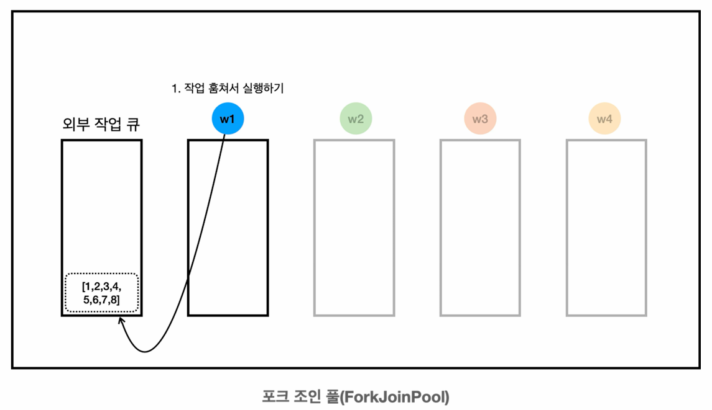

# Fork/Join 프레임워크

자바의 **Fork/Join 프레임워크**는 자바 7부터 도입된 `java.util.concurrent` 패키지의 일부로, 멀티코어 프로세서를 효율적으로
활용하기 위한 **병렬 처리 프레임워크**다.

**✓ 주요 개념**
1. **분할 정복 전략**
   - 큰 작업을 작은 단위로 재귀적으로 분할
   - 각 작은 작업의 결과를 합쳐 최종 결과를 생성
   - 멀티코어 환경에서 작업을 효율적으로 분산 처리
2. **작업 훔치기 알고리즘**
   - 각 스레드는 자신의 작업 큐를 가짐
   - 작업이 없는 스레드는 다른 바쁜 스레드의 큐에서 작업을 훔쳐와서 대신 처리
   - 부하 균형을 자동으로 조절하여 효율성 향상

**✓ 주요 클래스**
1. **ForkJoinPool**
   - Fork/Join 작업을 실행하는 특수한 `ExecutorService` 스레드 풀
   - 작업 스케줄링 및 스레드 관리를 담당
   - 기본적으로 사용 가능한 프로세서 수 만큼 스레드 생성
   - **분할 정복과 작업 훔치기에 특화된 스레드 풀**
2. **ForkJoinTask**
   - Fork/Join 작업의 기본 추상 클래스 (`Future`를 구현함)
   - 개발자는 주로 다음 두 하위 클래스를 구현해서 사용
     - `RecursiveTask<V>` : 결과를 반환하는 작업
     - `RecursiveAction` : 결과를 반환하지 않는 작업

**✓ RecursiveTask / RecursiveAction의 구현 방법**
- `compute()` 메서드를 재정의해서 필요한 작업 로직을 작성한다.
- 일반적으로 일정 기준(임계값)을 두고, **작업 범위가 작으면 직접 처리**하고, **작업 범위가 크면 둘로 분할**하여 각각
병렬적으로 처리하도록 구현한다.

**✓ fork() / join() 메서드**
- `fork()` : 현재 스레드에서 다른 스레드로 작업을 분할하여 보내는 동작 (비동기 실행)
- `join()` : 분할된 작업이 끝날 때까지 기다린 후 결과를 가져오는 동작

---

## Fork/Join 프레임워크 예 - 기본


작업의 크기가 8이고, 임계값이 4라고 가정했을 때를 구현해보자.

**RecursiveTask 상속**
```java
import java.util.List;
import java.util.concurrent.RecursiveTask;

import static util.MyLogger.log;

public class SumTask extends RecursiveTask<Integer> {

    private static final int THRESHOLD = 4; //임계값

    private final List<Integer> list;

    public SumTask(List<Integer> list) {
        this.list = list;
    }

    @Override
    protected Integer compute() {
        //작범 범위가 작으면 직접 계산
        if (list.size() <= THRESHOLD) {
            log("[처리 시작] " + list);
            int sum = list.stream()
                          .mapToInt(HeavyJob::heavyTask) //1초가 걸리는 작업
                          .sum();
            log("[처리 완료] " + list + " -> sum: " + sum);
            return sum;
        }

        //작업 범위가 크면 반으로 나누어 병렬 처리
        int mid = list.size() / 2;
        List<Integer> leftList = list.subList(0, mid);
        List<Integer> rightList = list.subList(mid, list.size());
        log("[분할] " + list + " -> LEFT" + leftList + ", RIGHT" + rightList);

        SumTask leftTask = new SumTask(leftList);
        SumTask rightTask = new SumTask(rightList);

        leftTask.fork(); //왼쪽 작업은 다른 스레드에서 처리 (병렬)
        Integer rightResult = rightTask.compute(); //오른쪽 작업은 현재 스레드에서 처리 (재귀 호출)
        Integer leftResult = leftTask.join(); //왼쪽 작업 결과를 기다림

        //왼쪽과 오른쪽 작업 결과를 합침
        int joinSum = leftResult + rightResult;

        log(String.format("LEFT[%d] + RIGHT[%d] -> sum : %d", leftResult, rightResult, joinSum));
        return joinSum;
    }
}
```

**실행 코드**
```java
import java.util.List;
import java.util.concurrent.ForkJoinPool;
import java.util.stream.IntStream;

import static util.MyLogger.*;

public class ForkJoinMain1 {
    public static void main(String[] args) {
        List<Integer> data = IntStream.rangeClosed(1, 8)
                                      .boxed()
                                      .toList();
        log("[생성] " + data);

        //ForkJoinPool 생성 및 작업 수행
        ForkJoinPool pool = new ForkJoinPool(10);

        long startTime = System.currentTimeMillis();
        SumTask task = new SumTask(data);

        //병렬로 합을 구한 후 결과 출력
        Integer result = pool.invoke(task);
        
        pool.close();

        long endTime = System.currentTimeMillis();
        log("time: " + (endTime - startTime) + "ms, sum: " + result);
        log("pool: " + pool);
    }
}
```

**실행 결과**
```text
13:22:10.685 [     main] [생성] [1, 2, 3, 4, 5, 6, 7, 8]
13:22:10.700 [ForkJoinPool-1-worker-1] [분할] [1, 2, 3, 4, 5, 6, 7, 8] -> LEFT[1, 2, 3, 4], RIGHT[5, 6, 7, 8]
13:22:10.704 [ForkJoinPool-1-worker-2] [처리 시작] [1, 2, 3, 4]
13:22:10.704 [ForkJoinPool-1-worker-1] [처리 시작] [5, 6, 7, 8]
13:22:10.716 [ForkJoinPool-1-worker-2] calculate 1 -> 10
13:22:10.718 [ForkJoinPool-1-worker-1] calculate 5 -> 50
13:22:11.728 [ForkJoinPool-1-worker-1] calculate 6 -> 60
13:22:11.728 [ForkJoinPool-1-worker-2] calculate 2 -> 20
13:22:12.734 [ForkJoinPool-1-worker-1] calculate 7 -> 70
13:22:12.734 [ForkJoinPool-1-worker-2] calculate 3 -> 30
13:22:13.742 [ForkJoinPool-1-worker-2] calculate 4 -> 40
13:22:13.742 [ForkJoinPool-1-worker-1] calculate 8 -> 80
13:22:14.747 [ForkJoinPool-1-worker-2] [처리 완료] [1, 2, 3, 4] -> sum: 100
13:22:14.747 [ForkJoinPool-1-worker-1] [처리 완료] [5, 6, 7, 8] -> sum: 260
13:22:14.754 [ForkJoinPool-1-worker-1] LEFT[100] + RIGHT[260] -> sum : 360
13:22:14.757 [     main] time: 4067ms, sum: 360
13:22:14.757 [     main] pool: java.util.concurrent.ForkJoinPool@5197848c[Terminated, parallelism = 10, size = 0, active = 0, running = 0, steals = 2, tasks = 0, submissions = 0]
```

작업이 2개로 분할 되어 약 4초의 시간이 걸린 것을 확인할 수 있다. 처리 과정을 그림으로 보면 다음과 같다.


- 위와 같이 **Fork/Join 프레임워크**를 사용하면 `RecursiveTask`를 통해 작업을 재귀적으로 분할한다. 예시 코드에서는
작업을 2개로 분할해서 스레드도 동시에 2개를 사용한다.
- 임계값을 더 줄여서 작업을 더 잘게 분할하면 더 많은 스레드를 활용할 수 있다. 물론 이 경우 풀의 스레드 수도 2개보다 많아야
효과가 있다.

---

## Fork/Join 프레임워크 예 - 작업 훔치기

임계값을 4에서 2로 줄여서 같은 코드를 실행해보자.

**임계값 변경**
```java
public class SumTask extends RecursiveTask<Integer> {

    //private static final int THRESHOLD = 4; //임계값
    private static final int THRESHOLD = 2; //임계값 변경
    
    //...
}
```

**실행 결과**
```text
13:34:19.630 [     main] [생성] [1, 2, 3, 4, 5, 6, 7, 8]
13:34:19.647 [ForkJoinPool-1-worker-1] [분할] [1, 2, 3, 4, 5, 6, 7, 8] -> LEFT[1, 2, 3, 4], RIGHT[5, 6, 7, 8]
13:34:19.648 [ForkJoinPool-1-worker-1] [분할] [5, 6, 7, 8] -> LEFT[5, 6], RIGHT[7, 8]
13:34:19.648 [ForkJoinPool-1-worker-2] [분할] [1, 2, 3, 4] -> LEFT[1, 2], RIGHT[3, 4]
13:34:19.649 [ForkJoinPool-1-worker-1] [처리 시작] [7, 8]
13:34:19.649 [ForkJoinPool-1-worker-2] [처리 시작] [3, 4]
13:34:19.649 [ForkJoinPool-1-worker-3] [처리 시작] [5, 6]
13:34:19.649 [ForkJoinPool-1-worker-4] [처리 시작] [1, 2]
13:34:19.660 [ForkJoinPool-1-worker-4] calculate 1 -> 10
13:34:19.660 [ForkJoinPool-1-worker-3] calculate 5 -> 50
13:34:19.660 [ForkJoinPool-1-worker-2] calculate 3 -> 30
13:34:19.661 [ForkJoinPool-1-worker-1] calculate 7 -> 70
13:34:20.669 [ForkJoinPool-1-worker-1] calculate 8 -> 80
13:34:20.669 [ForkJoinPool-1-worker-3] calculate 6 -> 60
13:34:20.669 [ForkJoinPool-1-worker-4] calculate 2 -> 20
13:34:20.669 [ForkJoinPool-1-worker-2] calculate 4 -> 40
13:34:21.689 [ForkJoinPool-1-worker-4] [처리 완료] [1, 2] -> sum: 30
13:34:21.689 [ForkJoinPool-1-worker-2] [처리 완료] [3, 4] -> sum: 70
13:34:21.689 [ForkJoinPool-1-worker-3] [처리 완료] [5, 6] -> sum: 110
13:34:21.689 [ForkJoinPool-1-worker-1] [처리 완료] [7, 8] -> sum: 150
13:34:21.697 [ForkJoinPool-1-worker-2] LEFT[30] + RIGHT[70] -> sum : 100
13:34:21.697 [ForkJoinPool-1-worker-1] LEFT[110] + RIGHT[150] -> sum : 260
13:34:21.697 [ForkJoinPool-1-worker-1] LEFT[100] + RIGHT[260] -> sum : 360
13:34:21.701 [     main] time: 2065ms, sum: 360
13:34:21.701 [     main] pool: java.util.concurrent.ForkJoinPool@5197848c[Terminated, parallelism = 10, size = 0, active = 0, running = 0, steals = 4, tasks = 0, submissions = 0]
```

임계값을 2로 낮춘 결과 작업이 더 잘게 분할되어 더 많은 스레드가 병렬로 작업을 처리하는 것을 확인할 수 있다. 총 4개의
작업으로 분할되고, 총 2초의 시간이 소요되었다.


### 작업 훔치기 알고리즘

- **Fork/Join 풀의 스레드는 각자 자신의 작업 큐를 가진다.** 덕분에 작업을 큐에서 가져가기 위한 스레드간 경합이 줄어든다.
- 자신의 작업이 없는 경우, 즉 스레드가 할 일이 없는 경우에 다른 스레드의 작업 큐에 대기 중인 작업을 훔쳐서 대신 처리한다.





임계값을 낮춤으로써 작업이 더 잘게 분할되고, 그 결과 더 많은 스레드가 병렬로 작업을 처리할 수 있다. 이는 **Fork/Join 프레임워크**의
핵심 개념인 **분할 정복 전략**을 명확하게 보여준다. 적절한 임계값을 잘 설정하면 병렬 처리의 효율성에 큰 영향을 미치므로,
작업의 특성과 시스템 환경에 맞게 조정하는 것이 중요하다.

---

## Fork/Join 프레임워크 예 - 공용 풀

자바 8에서 **공용 풀(Common Pool)** 이라는 개념이 도입되었는데, 이는 **Fork/Join** 작업을 위한 자바가 제공하는 기본 스레드 풀이다.

**✓ Fork/Join 공용 풀의 특징**
1. **시스템 전체에서 공유** : 애플리케이션 내에서 **단일 인스턴스**로 공유되어 사용된다.
2. **자동 생성 :** 별도로 생성하지 않아도 **정적 메서드**를 통해 접근할 수 있다.
3. **편리한 사용** : 별도의 풀을 만들지 않고도 `RecursiveTask` 또는 `RecursiveAction`을 사용할 때 기본적으로 이 공용 풀이 사용된다.
4. **병렬 스트림 활용** : 자바 8의 **병렬 스트림**은 내부적으로 이 공용 풀을 사용한다.
5. **자원 효율성** : 여러 곳에서 별도의 풀을 생성하는 대신 공용 풀을 사용함으로써 시스템 자원을 효율적으로 관리할 수 있다.
6. **병렬 수준 자동 설정** : 기본적으로 시스템의 **가용 프로세서 수에서 1을 뺀 값**으로 병렬 수준이 설정된다.

```java
import java.util.List;
import java.util.concurrent.ForkJoinPool;
import java.util.stream.IntStream;

import static util.MyLogger.log;

public class ForkJoinMain2 {
    public static void main(String[] args) {

        //시스템 가용 프로세서 수
        int processors = Runtime.getRuntime().availableProcessors();
        //공용 풀의 병렬 수준
        ForkJoinPool commonPool = ForkJoinPool.commonPool();
        log("processors = " + processors + ", commonPool = " + commonPool.getParallelism());

        List<Integer> data = IntStream.rangeClosed(1, 8)
                                      .boxed()
                                      .toList();
        log("[생성] " + data);

        //ForkJoinPool 생성 및 작업 수행
        SumTask task = new SumTask(data);
        Integer result = task.invoke(); //공용 풀 사용
        log("최종 결과: " + result);
    }
}
```

**실행 결과**
```text
14:26:11.698 [     main] processors = 6, commonPool = 5
14:26:11.704 [     main] [생성] [1, 2, 3, 4, 5, 6, 7, 8]
14:26:11.712 [     main] [분할] [1, 2, 3, 4, 5, 6, 7, 8] -> LEFT[1, 2, 3, 4], RIGHT[5, 6, 7, 8]
14:26:11.713 [     main] [분할] [5, 6, 7, 8] -> LEFT[5, 6], RIGHT[7, 8]
14:26:11.713 [ForkJoinPool.commonPool-worker-1] [분할] [1, 2, 3, 4] -> LEFT[1, 2], RIGHT[3, 4]
14:26:11.714 [ForkJoinPool.commonPool-worker-1] [처리 시작] [3, 4]
14:26:11.714 [     main] [처리 시작] [7, 8]
14:26:11.717 [ForkJoinPool.commonPool-worker-2] [처리 시작] [1, 2]
14:26:11.718 [ForkJoinPool.commonPool-worker-1] calculate 3 -> 30
14:26:11.718 [     main] calculate 7 -> 70
14:26:11.718 [ForkJoinPool.commonPool-worker-2] calculate 1 -> 10
14:26:11.717 [ForkJoinPool.commonPool-worker-3] [처리 시작] [5, 6]
14:26:11.719 [ForkJoinPool.commonPool-worker-3] calculate 5 -> 50
14:26:12.720 [ForkJoinPool.commonPool-worker-3] calculate 6 -> 60
14:26:12.720 [ForkJoinPool.commonPool-worker-1] calculate 4 -> 40
14:26:12.720 [     main] calculate 8 -> 80
14:26:12.733 [ForkJoinPool.commonPool-worker-2] calculate 2 -> 20
14:26:13.725 [ForkJoinPool.commonPool-worker-3] [처리 완료] [5, 6] -> sum: 110
14:26:13.725 [     main] [처리 완료] [7, 8] -> sum: 150
14:26:13.725 [ForkJoinPool.commonPool-worker-1] [처리 완료] [3, 4] -> sum: 70
14:26:13.733 [     main] LEFT[110] + RIGHT[150] -> sum : 260
14:26:13.734 [ForkJoinPool.commonPool-worker-2] [처리 완료] [1, 2] -> sum: 30
14:26:13.734 [ForkJoinPool.commonPool-worker-1] LEFT[30] + RIGHT[70] -> sum : 100
14:26:13.735 [     main] LEFT[100] + RIGHT[260] -> sum : 360
14:26:13.735 [     main] 최종 결과: 360
```

이전 예제와 달리 `ForkJoinPool` 인스턴스를 명시적으로 생성하지 않고, 대신 공용 풀을 사용한다.

```java
//이전 예제
ForkJoinPool pool = new ForkJoinPool(10);
SumTask task = new SumTask(data);
int result = pool.invoke(task);

//공용 풀 사용
SumTask task = new SumTask(data);
Integer result = task.invoke(); //공용 풀 사용
```

코드를 보면 풀에 작업을 요청하는 것이 아니라 작업(`RecursiveTask`)에 있는 `invoke()`를 직접 호출했다. 코드만 보면
풀을 전혀 사용하지 않는 것처럼 보인다.

- 여기서 사용한 `invoke()` 메서드는 현재 스레드(메인 스레드)에서 작업을 시작하지만, `fork()`로 작업 분할 후에는 공용 풀의 워커 스레드들이
분할된 작업을 처리한다.
  - 메인 스레드가 스레드 풀이 아닌 `RecursiveTask`의 `invoke()`를 직접 호출하면 메인 스레드가 작업의 `compute()`를 호출하게 된다.
  - 이때 내부에서 `fork()`를 호출하면 공용 풀의 워커 스레드로 작업이 분할된다.
- 메인 스레드는 최종 결과가 나올 때까지 대기(블로킹)해야 한다. 따라서 그냥 대기하는 것보다는 작업을 도와주는 편이 더 효율적이다. 
(메인 스레드도 작업 처리에 참여하는 것을 볼 수 있다.)
  - `invoke()` : 호출 스레드가 작업을 도우면서 대기한다. 작업의 결과를 반환 받는다.
  - `fork()` : 작업을 비동기로 호출하려면 `invoke()`대신 `fork()`를 호출하면 된다. `Future(ForkJoinTask)`를 반환 받는다.

공용 풀은 JVM이 종료될 때까지 계속 유지되므로 별도로 풀을 종료하지 않아도 된다. 이렇게 공용 풀을 활용하면 별도로 풀을
생성 및 관리하는 코드를 작성하지 않아도 편리하게 병렬 처리를 구현할 수 있다.

> 👆 **공용 풀 vs 커스텀 풀**
> 
> 1. **자원 관리 :** 커스텀 풀은 명시적으로 생성하고 관리해야 하지만, 공용 풀은 시스템에서 자동으로 관리된다.
> 2. **재사용성** : 공용 풀은 여러 곳에서 공유할 수 있어 자원을 효율적으로 사용할 수 있다.
> 3. **설정 제어** : 커스텀 풀은 병렬 수준(스레드의 숫자), 스레드 팩토리 등을 세부적으로 제어할 수 있지만, 공용 풀은 기본 
> 설정을 사용한다.
> 4. **라이프사이클** : 커스텀 풀은 명시적으로 종료해야 하지만, 공용 풀은 JVM이 관리한다.
> 
> 참고로 공용 풀 설정은 시스템 속성으로 변경할 수 있다. 하지만 권장하지는 않는다.
> ```text
> -Djava.util.concurrent.ForkJoinPool.common.parallelism=3
> ```
> ```java
> System.setProperty("java.util.concurrent.ForkJoinPool.common.parallelism", "3");
> ```

> 🤔 **공용 풀이 CPU - 1만큼 스레드를 생성하는 이유**
> 
> 1. **메인 스레드의 참여**
>    - Fork/Join 작업은 공용 풀의 워커 스레드뿐만 아니라 메인 스레드도 연산에 참여할 수 있다.
>    - 메인 스레드가 단순히 대기하지 않고 직접 작업을 도와주기 때문에 공용 풀에서 모든 스레드를 만들 필요 없이 
>    **`N-1`개의 워커 스레드 + 1개의 메인 스레드**로 충분히 CPU 코어를 활용할 수 있다.
> 2. **다른 프로세스와의 자원 경쟁 고려**
>    - 애플리케이션이 실행되는 환경에서는 OS다 다른 애플리케이션, 또는 GC 같은 내부 작업들도 CPU를 사용해야 한다.
>    - 모든 코어를 최대치로 점유하도록 설정하면 다른 중요한 작업이 지연되거나 컨텍스트 스위치 비용이 증가할 수 있다.
>    - 따라서 하나의 코어를 여유분으로 남겨 두어 전체 시스템 성능을 보다 안정적으로 유지하려는 목적이 있다.
> 3. **효율적인 자원 활용**
>    - 일반적으로는 CPU 코어 수와 동일하게 스레드를 만들더라도 성능상 큰 문제는 없다.
>    - 하지만 공용 풀에서 **CPU 코어 수 - 1**을 기본값으로 설정함으로써, 특정 상황에서도 병목을 일으키지 않는 선에서
>  효율적으로 CPU를 활용할 수 있다.