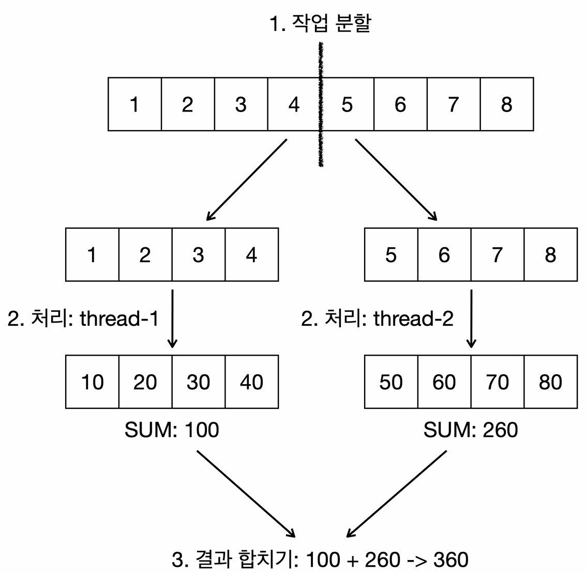

# 단일 스트림

병렬 스트림을 이해하기 위해 먼저 단일 스트림과 직접 스레드를 제어해 보는 예제를 알아보자.

**로거 클래스 - 어떤 스레드에서 작업이 실행되는지 로그로 출력**
```java
import java.time.LocalTime;
import java.time.format.DateTimeFormatter;

public class MyLogger {
    private static final DateTimeFormatter FORMATTER = DateTimeFormatter.ofPattern("HH:mm:ss.SSS");

    public static void log(Object obj) {
        String time = LocalTime.now().format(FORMATTER);
        System.out.printf("%s [%9s] %s\n", time, Thread.currentThread().getName(), obj);
    }
}
```

**각 작업당 1초 정도 소요되는 작업을 수행하는 `HeavyJob` 클래스**
```java
import util.MyLogger;

public class HeavyJob {

    public static int heavyTask(int n) {
        MyLogger.log("calculate " + n + " -> " + (n * 10));
        try {
            Thread.sleep(1000);
        } catch (InterruptedException e) {
            throw new RuntimeException(e);
        }
        return n * 10;
    }

    public static int heavyTask(int n, String name) {
        MyLogger.log("[" + name + "] " + n + " -> " + (n * 10));
        try {
            Thread.sleep(1000);
        } catch (InterruptedException e) {
            throw new RuntimeException(e);
        }
        return n * 10;
    }
}
```

### V1 - 단일 스트림

```java
import java.util.stream.IntStream;

import static util.MyLogger.*;

public class ParallelMain1 {
    public static void main(String[] args) {
        long startTime = System.currentTimeMillis();

        int sum = IntStream.rangeClosed(1, 8)
                           .map(HeavyJob::heavyTask)
                           .reduce(0, Integer::sum);

        long endTime = System.currentTimeMillis();
        log("time: " + (endTime - startTime) + "ms, sum: " + sum);
    }
}
```
```text
16:25:14.591 [     main] calculate 1 -> 10
16:25:15.606 [     main] calculate 2 -> 20
16:25:16.619 [     main] calculate 3 -> 30
16:25:17.623 [     main] calculate 4 -> 40
16:25:18.624 [     main] calculate 5 -> 50
16:25:19.630 [     main] calculate 6 -> 60
16:25:20.633 [     main] calculate 7 -> 70
16:25:21.636 [     main] calculate 8 -> 80
16:25:22.646 [     main] time: 8102ms, sum: 360
```

- `IntStream.rangeClosed(1, 8)`을 사용해 1부터 8까지의 숫자 각각에 대해 `heavyTask()`를 순서대로 수행한다.
- 1초씩 걸리는 작업을 8번 순차로 호출하므로 **약 8초**가 소요된다.
- 또한 단일 스레드(`main` 스레드)에서 작업을 순차적으로 수행하기 때문에 로그에도 `main` 스레드만 표시된다.

### V2 - 스레드 직접 사용

- `V1`에서는 메인 스레드로 1에서 8의 범위를 모두 계산했다.
- 각 스레드는 한번에 하나의 작업만 처리할 수 있다.
- 스레드를 사용해서 1에서 8을 처리하는 큰 단위의 작업을 더 작은 단위의 작업으로 분할하도록 해보자.

```java
import static util.MyLogger.log;

public class ParallelMain2 {
    public static void main(String[] args) throws InterruptedException {
        long startTime = System.currentTimeMillis();

        //1. 작업을 분할한다 (Fork)
        SumTake task1 = new SumTake(1, 4);
        SumTake task2 = new SumTake(5, 8);
        Thread thread1 = new Thread(task1, "thread-1");
        Thread thread2 = new Thread(task2, "thread-2");

        //2. 분할한 작업을 처리한다
        thread1.start();
        thread2.start();

        //3. 처리한 결과를 합친다 (Join)
        thread1.join();
        thread2.join();
        log("main 스레드 대기 완료");

        int sum = task1.result + task2.result;
        long endTime = System.currentTimeMillis();

        log("time: " + (endTime - startTime) + "ms, sum: " + sum);
    }

    static class SumTake implements Runnable {
        int start, end, result;

        public SumTake(int start, int end) {
            this.start = start;
            this.end = end;
        }

        @Override
        public void run() {
            log("작업 시작");
            int sum = 0;
            for (int i = start; i <= end; i++) {
                sum += HeavyJob.heavyTask(i);
            }
            result = sum;
            log("작업 완료 result = " + result);
        }
    }
}
```
```text
16:30:09.764 [ thread-2] 작업 시작
16:30:09.764 [ thread-1] 작업 시작
16:30:09.776 [ thread-2] calculate 5 -> 50
16:30:09.776 [ thread-1] calculate 1 -> 10
16:30:10.785 [ thread-1] calculate 2 -> 20
16:30:10.785 [ thread-2] calculate 6 -> 60
16:30:11.788 [ thread-1] calculate 3 -> 30
16:30:11.788 [ thread-2] calculate 7 -> 70
16:30:12.789 [ thread-2] calculate 8 -> 80
16:30:12.789 [ thread-1] calculate 4 -> 40
16:30:13.793 [ thread-2] 작업 완료 result = 260
16:30:13.793 [ thread-1] 작업 완료 result = 100
16:30:13.793 [     main] main 스레드 대기 완료
16:30:13.798 [     main] time: 4072ms, sum: 360
```

- 두 개의 스레드(`thread-1`, `thread-2`)가 작업을 분할해서 처리하기 때문에 기존에 8초가 걸리던 작업을 4초로 줄일 수 있었다.
- 하지만 이렇게 스레드를 직접 사용하면 스레드 수가 늘어나면 코드도 복잡해지고, 예외 처리, 스레드 풀 관리 등 추가로 관리해야 할
부분들이 생기는 문제가 있다.

### V3 - 스레드 풀 사용

이번에는 자바가 제공하는 `ExecutorService`를 사용해서 더 편리하게 병렬 처리를 해보자.

```java
import java.util.concurrent.Callable;
import java.util.concurrent.ExecutionException;
import java.util.concurrent.ExecutorService;
import java.util.concurrent.Executors;
import java.util.concurrent.Future;

import static util.MyLogger.log;

public class ParallelMain3 {
    public static void main(String[] args) throws InterruptedException, ExecutionException {

        //스레드 풀을 준비 (최대 2개의 스레드)
        ExecutorService es = Executors.newFixedThreadPool(2);

        long startTime = System.currentTimeMillis();

        //1. 작업을 분할한다. (Fork)
        SumTake task1 = new SumTake(1, 4);
        SumTake task2 = new SumTake(5, 8);

        //2. 분할한 작업을 처리한다.
        Future<Integer> future1 = es.submit(task1);
        Future<Integer> future2 = es.submit(task2);

        //3. 처리한 결과를 합친다. (Join)
        //4. 결과가 나올 때까지 대기한다. (get)
        int sum = future1.get() + future2.get();
        log("main 스레드 대기 완료");

        long endTime = System.currentTimeMillis();
        log("time: " + (endTime - startTime) + "ms, sum: " + sum);

        es.close();
    }

    static class SumTake implements Callable<Integer> {
        int start, end;

        public SumTake(int start, int end) {
            this.start = start;
            this.end = end;
        }

        @Override
        public Integer call() {
            log("작업 시작");
            int sum = 0;
            for (int i = start; i <= end; i++) {
                sum += HeavyJob.heavyTask(i);
            }
            log("작업 완료 result = " + sum);
            return sum;
        }
    }
}
```
```text
16:37:32.261 [pool-1-thread-2] 작업 시작
16:37:32.261 [pool-1-thread-1] 작업 시작
16:37:32.273 [pool-1-thread-2] calculate 5 -> 50
16:37:32.273 [pool-1-thread-1] calculate 1 -> 10
16:37:33.274 [pool-1-thread-2] calculate 6 -> 60
16:37:33.274 [pool-1-thread-1] calculate 2 -> 20
16:37:34.281 [pool-1-thread-2] calculate 7 -> 70
16:37:34.281 [pool-1-thread-1] calculate 3 -> 30
16:37:35.285 [pool-1-thread-1] calculate 4 -> 40
16:37:35.285 [pool-1-thread-2] calculate 8 -> 80
16:37:36.289 [pool-1-thread-2] 작업 완료 result = 260
16:37:36.289 [pool-1-thread-1] 작업 완료 result = 100
16:37:36.290 [     main] main 스레드 대기 완료
16:37:36.294 [     main] time: 4061ms, sum: 360
```

- `V2`와 마찬가지로 2개의 스레드가 병렬로 계산을 처리하므로 약 4초가 소요된다.
- `Future`로 반환값을 쉽게 받아올 수 있기 때문에 결과를 합산하는 과정이 더 편리해졌다.
- 하지만 여전히 코드 레벨에서 분할 및 병합 로직을 직접 짜야 하고, 스레드 풀 생성과 관리도 개발자가 직접 해야 하는 문제가 있다.

---

## Fork/Join 패턴

- 스레드는 한번에 하나의 작업만 처리할 수 있다. 따라서 하나의 큰 작업을 여러 스레드가 처리할 수 있는 작은 단위의 작업으로
**분할(Fork)** 해야 한다.
- 그리고 이렇게 분할한 작업을 각각의 스레드가 **처리(Execute)** 하고, 각 스레드의 분할된 작업 처리가 끝나면 분할된 결과를 하나로
**모아야(Join)** 한다.
- 이렇게 **분할(Fork) → 처리(Execute) → 모음(Join)** 의 단계로 이루어진 멀티스레딩 패턴을 **Fork/Join 패턴**이라고 한다.
- 이 패턴은 병렬 프로그래밍에서 매우 효율적인 방식으로, 복잡한 작업을 병렬적으로 처리할 수 있게 해준다.



**자바는 Fork/Join 프레임워크를 제공하여 개발자가 이와 같은 패턴을 더 쉽게 구현할 수 있도록 지원한다.**
