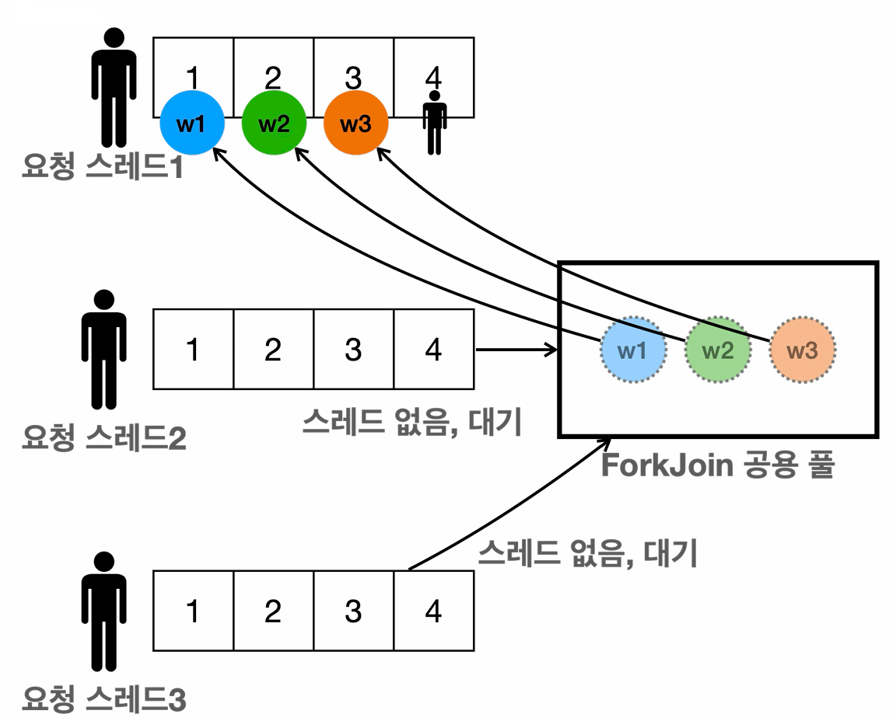

# 자바 병렬 스트림

```java
import java.util.concurrent.ForkJoinPool;
import java.util.stream.IntStream;

import static util.MyLogger.log;

public class ParallelMain4 {
    public static void main(String[] args) {
        int processors = Runtime.getRuntime().availableProcessors();
        ForkJoinPool commonPool = ForkJoinPool.commonPool();
        log("processors = " + processors+", commonPool = " + commonPool.getParallelism());

        long startTime = System.currentTimeMillis();

        int sum = IntStream.rangeClosed(1, 8)
                           .parallel() //병렬 스트림
                           .map(HeavyJob::heavyTask)
                           .reduce(0, Integer::sum);

        long endTime = System.currentTimeMillis();
        log("time: " + (endTime - startTime) + "ms, sum: " + sum);
    }
}
```

**실행 결과**
```text
14:59:24.373 [     main] processors = 6, commonPool = 5
14:59:24.382 [     main] calculate 6 -> 60
14:59:24.383 [ForkJoinPool.commonPool-worker-4] calculate 7 -> 70
14:59:24.383 [ForkJoinPool.commonPool-worker-2] calculate 8 -> 80
14:59:24.383 [ForkJoinPool.commonPool-worker-3] calculate 5 -> 50
14:59:24.384 [ForkJoinPool.commonPool-worker-1] calculate 3 -> 30
14:59:24.384 [ForkJoinPool.commonPool-worker-5] calculate 2 -> 20
14:59:25.387 [ForkJoinPool.commonPool-worker-3] calculate 1 -> 10
14:59:25.387 [ForkJoinPool.commonPool-worker-1] calculate 4 -> 40
14:59:26.397 [     main] time: 2021ms, sum: 360
```

- 실행 결과를 보면 공용 풀의 스레드들이 동시에 일을 처리하고 있다.
- 스트림에 `parallel()` 메서드만 호출하면, 직접 스레드를 만들 필요 없이 스트림이 자동으로 병렬 처리된다.
- 스트림에서 `parallel()`을 선언하면 스트림은 공용 `ForkJoinPool`을 사용하고, 내부적으로 병렬 처리 가능한 스레드 숫자와
작업의 크기 등을 확인하면서 `Spliterator`를 통해 데이터를 자동으로 분할한다.
- 분할 방식은 데이터 소스의 특성에 따라 최적화 되어 있으며, 공용 풀을 통해 적절한 수준으로 분할 및 처리하고, 그 결과를 모은다.
- 이때 요청 스레드(메인 스레드)도 어차피 결과가 나올 때까지 대기해야 한다. 따라서 작업에 참여해서 작업을 도운다.

코드를 보면 복잡한 멀티스레드 코드 하나 없이 `parallel()`만 추가되었다. 개발자가 스트림을 병렬로 처리하고 싶다고 
`parallel()`로 **선언만 하면**, **실제 어떻게 할지는** 자바 스트림이 내부적으로 알아서 처리하는 것이다. 이것이 람다 스트림을
활용한 **선언적 프로그래밍** 방식의 큰 장점이다.

---

## 병렬 스트림 사용시 주의점

**Fork/Join 프레임워크는 주로 CPU 바운드 작업을 처리하기 위해 설계되었다.** 이러한 작업은 CPU 사용률이 높고 I/O 대기 시간이 적다.
**CPU 바운드 작업**의 경우, 물리적인 CPU 코어와 비슷한 수의 스레드를 사용하는 것이 최적의 성능을 발휘할 수 있다.
**스레드 수가 코어 수보다 많아지면** 컨텍스트 스위칭 비용이 증가하고, 스레드 간 경쟁으로 인해 오히려 성능이 저하될 수 있기 때문이다.

I/O 작업처럼 블로킹 대기 시간이 긴 작업을 `ForkJoinPool`에서 처리하면 다음과 같은 문제가 발생한다.
1. **스레드 블로킹에 따른 CPU 낭비**
   - `ForkJoinPool`은 CPU 코어 수에 맞춰 제한된 개수의 스레드를 사용한다. (특히 공용 풀)
   - I/O 작업으로 스레드가 블로킹되면 CPU가 놀게 되어 전체 병렬 처리 효율이 크게 떨어진다.
2. **컨텍스트 스위칭 오버헤드 증가**
   - I/O 작업 때문에 스레드를 늘리면 실제 연산보다 대기 시간이 길어지는 상황이 발생할 수 있다.
   - 스레드가 많아질수록 컨텍스트 스위칭 비용도 증가하여 오히려 성능이 떨어질 수 있다.
3. **작업 훔치기 기법 무력화**
   - `ForkJoinPool`이 제공하는 작업 훔치기 알고리즘은 CPU 바운드 작업에서 빠르게 작업 단위를 계속 처리하도록 설계되었다.
   - I/O 대기 시간이 많은 작업은 스레드가 I/O로 인해 대기하고 있는 경우가 많아 병렬 처리의 장점을 살리기 어렵다.
4. **분할 정복 이점 감소**
   - Fork/Join 방식을 통해 작업을 잘게 나누어도, I/O 병목이 발생하면 CPU 병렬화 이점이 크게 줄어든다.
   - 오히려 분할된 작업들이 각기 I/O 대기를 반복하면서 `fork()`, `join()`에 따른 오버헤드만 증가할 수 있다.

공용 풀은 Fork/Join 프레임워크의 편리한 기능으로, 별도의 풀 생성 없이도 효율적인 병렬 처리를 가능하게 한다.
하지만 블로킹 작업이나 특수한 설정이 필요한 경우에는 커스텀 풀을 고려해야 한다.

### 예제 1

**시나리오**
1. 여러 사용자가 동시에 서버를 호출하는 상황
2. 각 요청은 병렬 스트림을 사용하여 무거운 작업을 처리
3. 모든 요청이 동일한 공용 풀을 공유

```java
import java.util.concurrent.ExecutorService;
import java.util.concurrent.Executors;
import java.util.stream.IntStream;

import static util.MyLogger.log;

public class ParallelMain5 {
    public static void main(String[] args) throws InterruptedException {

        //병렬 수준 3으로 제한
        System.setProperty("java.util.concurrent.ForkJoinPool.common.parallelism", "3");

        //요청 풀 추가
        ExecutorService requestPool = Executors.newFixedThreadPool(100);

        int nThreads = 3;
        for (int i = 1; i <= nThreads; i++) {
            String requestName = "request - " + i;
            requestPool.submit(() -> logic(requestName));
            Thread.sleep(100); //스레드 순서를 확인하기 위해 약간 대기
        }

        requestPool.close();
    }

    private static void logic(String requestName) {
        log("[" + requestName + "] START");
        long startTime = System.currentTimeMillis();

        //1~4 범위의 작업을 처리
        int sum = IntStream.rangeClosed(1, 4)
                           .parallel() //병렬 스트림
                           .map(n -> HeavyJob.heavyTask(n, requestName))
                           .reduce(0, Integer::sum);

        long endTime = System.currentTimeMillis();
        log("[" + requestName + "] time: " + (endTime - startTime) + "ms, sum: " + sum);
    }
}
```

**실행 결과**
```text
15:39:11.002 [pool-1-thread-1] [request - 1] START
15:39:11.015 [ForkJoinPool.commonPool-worker-1] [request - 1] 2 -> 20
15:39:11.015 [ForkJoinPool.commonPool-worker-2] [request - 1] 4 -> 40
15:39:11.016 [ForkJoinPool.commonPool-worker-3] [request - 1] 1 -> 10
15:39:11.016 [pool-1-thread-1] [request - 1] 3 -> 30
15:39:11.090 [pool-1-thread-2] [request - 2] START
15:39:11.090 [pool-1-thread-2] [request - 2] 3 -> 30
15:39:11.203 [pool-1-thread-3] [request - 3] START
15:39:11.203 [pool-1-thread-3] [request - 3] 3 -> 30
15:39:12.018 [ForkJoinPool.commonPool-worker-3] [request - 2] 2 -> 20
15:39:12.018 [ForkJoinPool.commonPool-worker-1] [request - 2] 4 -> 40
15:39:12.018 [ForkJoinPool.commonPool-worker-2] [request - 2] 1 -> 10
15:39:12.022 [pool-1-thread-1] [request - 1] time: 1015ms, sum: 100
15:39:12.204 [pool-1-thread-3] [request - 3] 4 -> 40
15:39:13.025 [ForkJoinPool.commonPool-worker-1] [request - 3] 1 -> 10
15:39:13.025 [ForkJoinPool.commonPool-worker-2] [request - 3] 2 -> 20
15:39:13.025 [pool-1-thread-2] [request - 2] time: 1935ms, sum: 100
15:39:14.028 [pool-1-thread-3] [request - 3] time: 2825ms, sum: 100
```

**확인할 수 있는 문제점**
1. **공용 풀의 제한된 병렬성**
  - 공용 풀은 병렬 수준이 3으로 설정되어 있어서 최대 3개의 작업만 동시에 처리할 수 있다. 여기에 요청 스레드도 자신의 작업에 
   참여하므로 각 작업당 총 4개의 스레드만 사용된다.
  - 따라서 총 12개의 요청을 처리하는데 필요한 스레드 자원이 부족하다.
2. **처리 시간의 불균형**
   - 첫번째 요청은 거의 모든 공용 풀 워커를 사용할 수 있었지만, 이후 요청들은 제한된 공용 풀 자원을 두고 경쟁해야 한다.
   - 따라서 완료 시간이 점점 느려진다.
3. **스레드 작업 분배**
   - 일부 작업은 요청 스레드에서 직접 처리되고, 일부는 공용 풀에서 처리된다.
   - 요청 스레드가 작업을 도와주지만, 공용 풀의 스레드가 매우 부족하기 때문에 한계가 있다.




**핵심 문제점**
1. **공용 풀 병목 현상** : 모든 병렬 스트림이 동일한 공용 풀을 공유하므로, 요청이 많아질수록 병목 현상이 발생한다.
2. **자원 경쟁** : 여러 요청이 제한된 스레드 풀을 두고 경쟁하면서 요청의 성능이 저하된다.
3. **예측 불가능한 성능** : 같은 작업이라도 동시에 실행되는 다른 작업의 수에 따라 처리 시간이 크게 달라진다.

> - `nThreads`를 늘리는 것보다 차라리 `parallel()`을 제거하는 것이 더 빨리 처리될 수 있다.
> - `heavyTask()`는 1초간 스레드가 대기하는 작업으로, 이런 I/O 바운드 종류의 작업은 공용 풀보다는 별도의 풀을 사용하는 것이 좋다.

### 예제 2

별도의 전용 스레드 풀을 사용해서 위 예제의 문제를 해결할 수 있다.

```java
import java.util.List;
import java.util.concurrent.ExecutionException;
import java.util.concurrent.ExecutorService;
import java.util.concurrent.Executors;
import java.util.concurrent.Future;
import java.util.stream.IntStream;

import static util.MyLogger.log;

public class ParallelMain6 {
    public static void main(String[] args) throws InterruptedException {
        //요청 풀
        ExecutorService requestPool = Executors.newFixedThreadPool(100);

        //logic 처리 전용 스레드 풀 추가
        ExecutorService logicPool = Executors.newFixedThreadPool(400);

        int nThreads = 3;
        for (int i = 1; i <= nThreads; i++) {
            String requestName = "request - " + i;
            requestPool.submit(() -> logic(requestName, logicPool));
            Thread.sleep(100); //스레드 순서를 확인하기 위해 약간 대기
        }

        requestPool.close();
        logicPool.close();
    }

    private static void logic(String requestName, ExecutorService es) {
        log("[" + requestName + "] START");
        long startTime = System.currentTimeMillis();

        //1~4 작업을 각각 스레드 풀에 제출
        List<Future<Integer>> futures = IntStream.range(1, 4)
                                                 .mapToObj(i -> es.submit(() -> HeavyJob.heavyTask(i, requestName)))
                                                 .toList();
        //Future 결과 취합
        int sum = futures.stream()
                         .mapToInt(f -> {
                             try {
                                 return f.get();
                             } catch (Exception e) {
                                 throw new RuntimeException(e);
                             }
                         })
                         .sum();

        long endTime = System.currentTimeMillis();
        log("[" + requestName + "] time: " + (endTime - startTime) + "ms, sum: " + sum);
    }
}
```

- 최대 400개의 스레드를 가진 별도의 풀을 생성해서 병렬 작업 처리에 사용한다.
- 병렬 스트림(`parallel()`)을 사용하지 않고 직접 전용 스레드 풀에 작업을 제출한다.
- 각 작업의 별도의 `Future`로 관리되며, `Future.get()`으로 각 작업의 결과를 기다렸다가 취합한다.

**실행 결과**
```text
16:20:40.130 [pool-1-thread-1] [request - 1] START
16:20:40.144 [pool-2-thread-1] [request - 1] 1 -> 10
16:20:40.144 [pool-2-thread-2] [request - 1] 2 -> 20
16:20:40.145 [pool-2-thread-3] [request - 1] 3 -> 30
16:20:40.223 [pool-1-thread-2] [request - 2] START
16:20:40.224 [pool-2-thread-4] [request - 2] 1 -> 10
16:20:40.224 [pool-2-thread-5] [request - 2] 2 -> 20
16:20:40.224 [pool-2-thread-6] [request - 2] 3 -> 30
16:20:40.339 [pool-1-thread-3] [request - 3] START
16:20:40.341 [pool-2-thread-9] [request - 3] 3 -> 30
16:20:40.341 [pool-2-thread-8] [request - 3] 2 -> 20
16:20:40.341 [pool-2-thread-7] [request - 3] 1 -> 10
16:20:41.150 [pool-1-thread-1] [request - 1] time: 1016ms, sum: 60
16:20:41.239 [pool-1-thread-2] [request - 2] time: 1016ms, sum: 60
16:20:41.345 [pool-1-thread-3] [request - 3] time: 1005ms, sum: 60
```

- 모든 요청이 약 1초 내외로 처리되었다. 요청별 처리 시간이 지연되는 문제가 해결되었다.
- 각 요청의 작업들이 전용 풀에서 처리된다.
- 400개의 스레드를 가진 풀을 사용함으로써 동시에 여러 요청을 효율적으로 처리한다. 공용 풀 병목 현상이 발생하지 않았다.

I/O 바운드 작업이나 많은 요청을 처리하는 서버 환경에서는 이러한 접근 방식이 더 효과적이다.

### 참고 - CompletableFuture

- 병렬 스트림은 처음부터 **Fork/Join 공용 풀**과 함께 사용하도록 설계되었다. 따라서 반드시 **CPU 바운드 작업**에 사용해야 한다.
- I/O 대기 작업에 사용하면 **Fork/Join 공용 풀**의 스레드 병목으로 모든 요청이 밀리는 큰 장애가 발생하기 쉽다.
- 복잡한 멀티스레드 코드를 작성할 때 `CompletableFuture`가 도움이 되는데, `CompletableFuture`를 생성할 때는 별도의 스레드 풀을
반드시 지정해야 한다. 그렇지 않으면 **Fork/Join 공용 풀**이 대신 사용된다. 

```java
import java.util.concurrent.CompletableFuture;
import java.util.concurrent.ExecutorService;
import java.util.concurrent.Executors;

import static util.MyLogger.*;

public class CompletableFutureMain {
    public static void main(String[] args) {
        //Fork/Join 공용 풀
        CompletableFuture.runAsync(() -> log("Fork/Join"));

        //별도의 풀
        ExecutorService es = Executors.newFixedThreadPool(100);
        CompletableFuture.runAsync(() -> log("Custom Pool"), es);
        es.close();
    }
}
```

**실행 결과**
```text
16:42:20.915 [ForkJoinPool.commonPool-worker-1] Fork/Join
16:42:20.915 [pool-1-thread-1] Custom Pool
```
`CompletableFuture`에 스레드 풀을 지정하지 않으면 **Fork/Join 공용 풀**이 사용되는 것을 확인할 수 있다.

