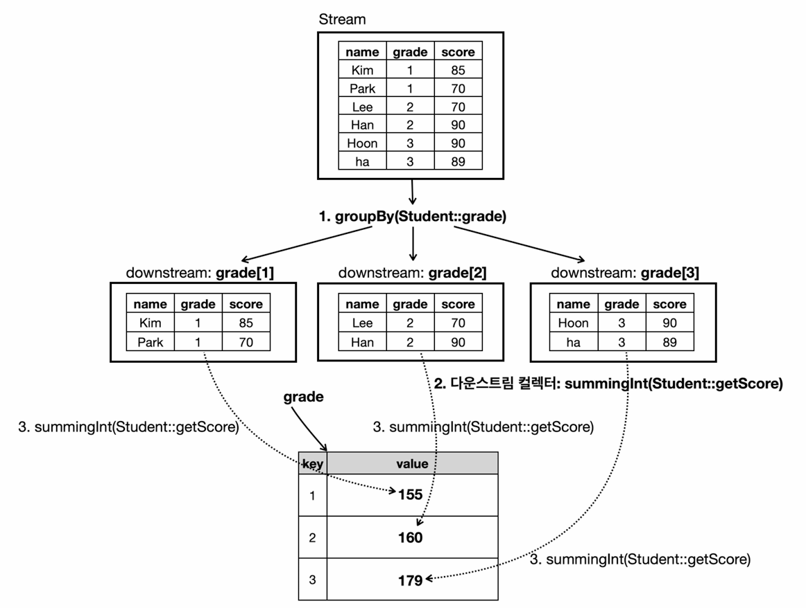
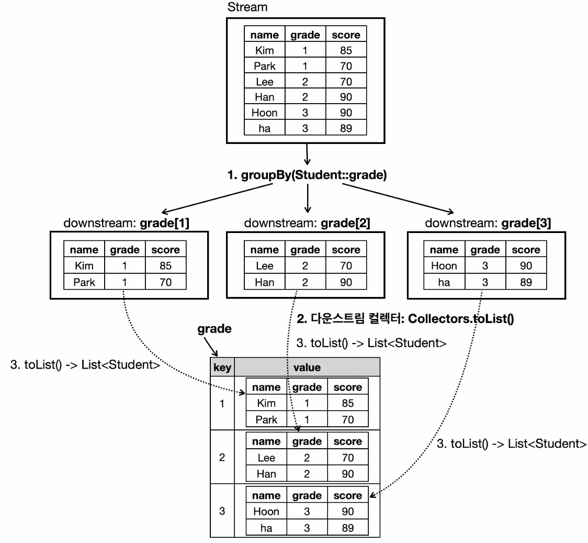
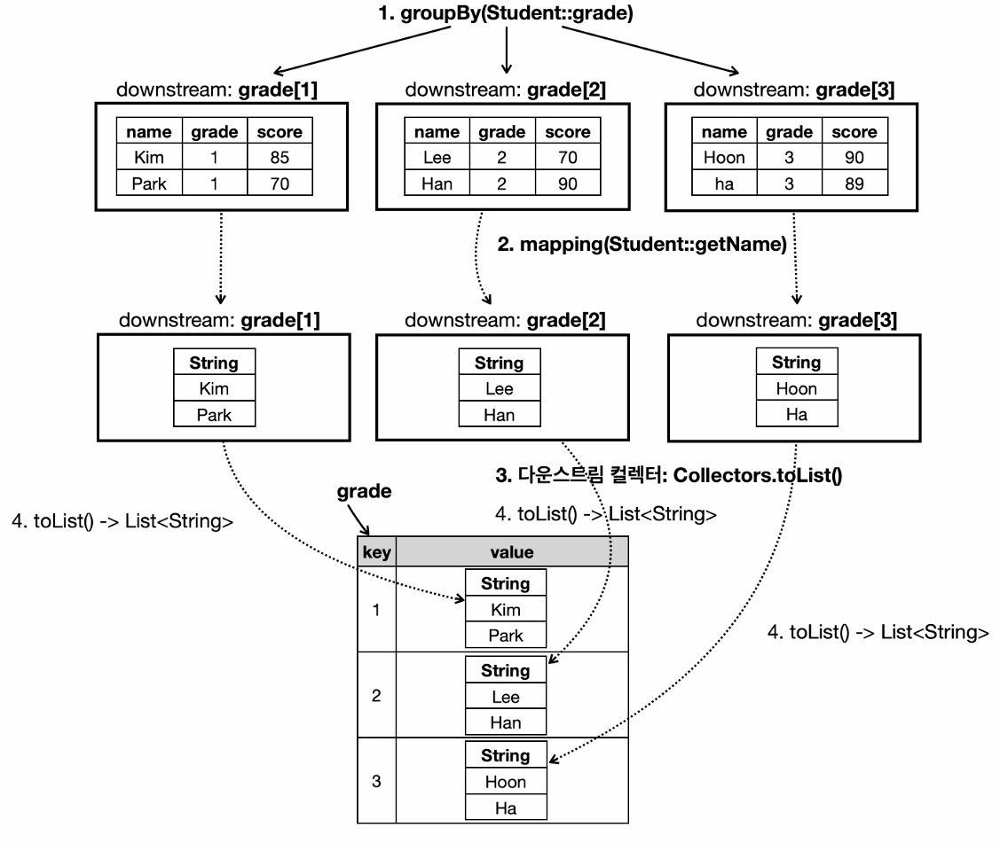
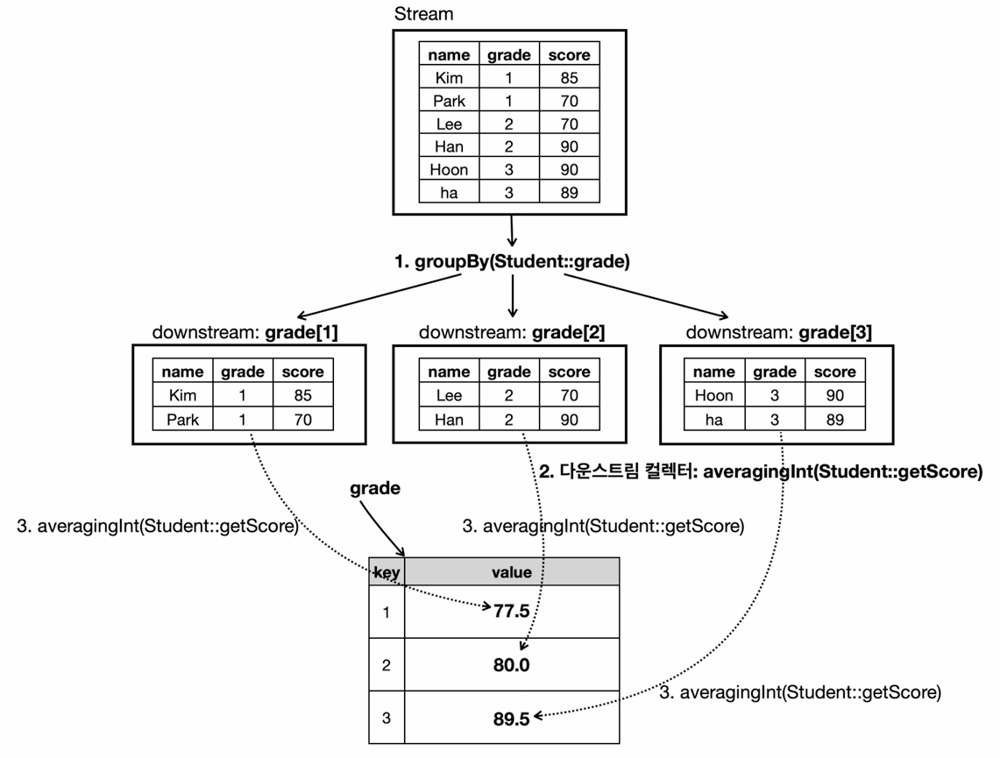
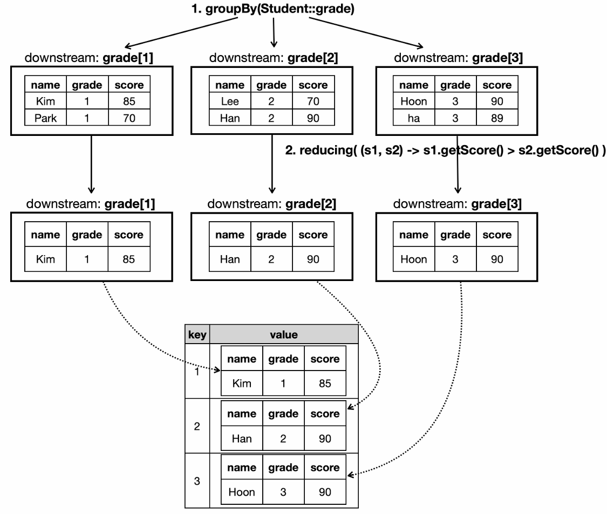

# 스트림 API 컬렉터

스트림이 중간 연산을 거쳐 최종 연산으로써 데이터를 처리할 때, 그 결과물이 필요한 경우가 많다. 이 최종 연산에 `Collectors`를
활용한다.

collect 연산은 반환값을 만들어내는 최종 연산이다. `Collectors` 클래스 안에 준비된 여러 메서드를 통해서 다양한 수집 방식을
적용할 수 있다. 필요한 대부분의 기능이 `Collectors`에 이미 구현되어 있기 때문에, `Collector` 인터페이스를 직접 구현하는 것보다는
`Collectors`의 사용법을 익히는 것이 중요하다.

### 기본적인 수집

```java
import java.util.List;
import java.util.Set;
import java.util.TreeSet;
import java.util.stream.Stream;

import static java.util.stream.Collectors.*;

public class Collectors1Basic {
    public static void main(String[] args) {
        //기본 기능
        List<String> list = Stream.of("Java", "Spring", "JPA").collect(toList());

        //수정 불가능 리스트
        List<Integer> unmodifiableList = Stream.of(1, 2, 3).collect(toUnmodifiableList());
//        unmodifiableList.add(4); //예외 발생

        Set<Integer> set = Stream.of(1, 2, 2, 3, 3, 3).collect(toSet());
        Set<Integer> unmodifiableSet = Stream.of(1, 2, 2, 3, 3, 3).collect(toUnmodifiableSet());

        //타입 지정
        TreeSet<Integer> treeSet = Stream.of(3, 4, 5, 2, 1).collect(toCollection(TreeSet::new));
    }
}
```

`Collectors` 클래스에는 스트림을 다양한 컬렉션으로 수집할 수 있는 API들이 정의되어 있다. 원하는 컬렉션 구현체를
직접 지정할 수도 있으며, `static import`를 사용할 수 있다.

### Map 수집

```java
import java.util.LinkedHashMap;
import java.util.Map;
import java.util.stream.Collectors;
import java.util.stream.Stream;

public class Collectors2Map {
    public static void main(String[] args) {
        Map<String, Integer> map1 = Stream.of("Apple", "Banana", "Tomato")
                                          .collect(Collectors.toMap(
                                                  name -> name, // keyMapper
                                                  String::length        // valueMapper
                                          ));
        System.out.println("map1 = " + map1);

/*
        //키 중복 예외 발생 (java.lang.IllegalStateException: Duplicate key)
        Map<String, Integer> map2 = Stream.of("Apple", "Apple", "Tomato")
                                          .collect(Collectors.toMap(
                                                  name -> name,
                                                  String::length
                                          ));
*/

        //키 중복 대안 (병합)
        Map<String, Integer> map3 = Stream.of("Apple", "Apple", "Tomato")
                                          .collect(Collectors.toMap(
                                                  name -> name, // keyMapper
                                                  String::length,       // valueMapper
                                                  (a, b) -> Integer.sum(a, b) // mergeFunction
                                                  //중복될 경우 : 기존 값 + 새 값
                                          ));
        System.out.println("map3 = " + map3);

        //Map 타입 지정
        LinkedHashMap<String, Integer> map4 = Stream.of("Apple", "Apple", "Tomato")
                                                    .collect(Collectors.toMap(
                                                            name -> name,   // keyMapper
                                                            String::length,         // valueMapper
                                                            (a, b) -> Integer.sum(a, b), // mergeFunction
                                                            LinkedHashMap::new      // mapFactory
                                                            // 결과 Map 타입 지정
                                                    ));
        System.out.println("map4 = " + map4.getClass());
    }
}
```
```text
map1 = {Apple=5, Tomato=6, Banana=6}
map3 = {Apple=10, Tomato=6}
map4 = class java.util.LinkedHashMap
```

### 그룹과 분할 수집

```java
import java.util.List;
import java.util.Map;
import java.util.stream.Collectors;

public class Collectors3Group {
    public static void main(String[] args) {

        // 첫 글자 알파벳을 기준으로 그룹화
        List<String> names = List.of("Apple", "Avocado", "Banana", "Blueberry", "Cherry");

        /*==== 1. groupingBy ====*/
        //특정 기준에 따라 스트림 요소를 여러 그룹으로 묶음
        Map<String, List<String>> grouped = names.stream()
                                                 .collect(Collectors.groupingBy(name -> name.substring(0, 1)));
        System.out.println("grouped = " + grouped);

        // 짝수(even)인지 여부로 분할(파티셔닝)
        List<Integer> numbers = List.of(1, 2, 3, 4, 5, 6);

        /*==== 2. partitioningBy ====*/
        //true와 false 두 그룹으로 나눔
        Map<Boolean, List<Integer>> partitioned = numbers.stream()
                                                         .collect(Collectors.partitioningBy(n -> n % 2 == 0));
        System.out.println("partitioned = " + partitioned);
    }
}
```
```text
grouped = {A=[Apple, Avocado], B=[Banana, Blueberry], C=[Cherry]}
partitioned = {false=[1, 3, 5], true=[2, 4, 6]}
```

### 최솟값, 최댓값 수집

```java
import java.util.stream.Collectors;
import java.util.stream.IntStream;
import java.util.stream.Stream;

public class Collectors4MinMax {
    public static void main(String[] args) {

        /*==== V1 ====*/
        // 다운스트림 컬렉터에서 유용하게 사용
        Integer max1 = Stream.of(1, 2, 3)
                             .collect(Collectors.maxBy(
                                     ((i1, i2) -> i1.compareTo(i2)))
                             )
                             .get();
        System.out.println("max1 = " + max1); //3

        /*==== V2 ====*/
        Integer max2 = Stream.of(1, 2, 3)
                             .max((i1, i2) -> i1.compareTo(i2))
                             .get();
        System.out.println("max2 = " + max2); //3

        /*==== V3 ====*/
        Integer max3 = Stream.of(1, 2, 3)
                             .max(Integer::compareTo)
                             .get();
        System.out.println("max3 = " + max3); //3

        /*==== V4 ====*/
        // 기본형 특화 스트림 사용
        int max4 = IntStream.of(1, 2, 3)
                            .max()
                            .getAsInt();
        System.out.println("max4 = " + max4); //3
    }
}
```

- `Collectors.maxBy()`와 `Collectors.minBy()`를 통해 최소, 최댓값을 구할 수 있다.
- 다만 스트림 자체가 제공하는 `max()`, `min()` 메서드를 쓰면 더 간단하다.
- **기본형 특화 스트림**을 쓰면 `max()`처럼 바로 결과를 얻을 수 있다.
- `Collectors`의 일부 기능은 스트림에서 직접 제공하는 기능과 중복되며, **다운 스트림 컬렉터**에서 유용하게 사용할 수 있다.

### 통계 수집

```java
import java.util.IntSummaryStatistics;
import java.util.OptionalDouble;
import java.util.stream.Collectors;
import java.util.stream.IntStream;
import java.util.stream.Stream;

public class Collectors4Summing {
    public static void main(String[] args) {
        /*==== 개수 - V1 ====*/
        // 다운스트림 컬렉터에서 유용하게 사용
        long count1 = Stream.of(1, 2, 3)
                            .collect(Collectors.counting());
        System.out.println("count1 = " + count1); // 3

        /*==== 개수 - V2 ====*/
        long count2 = Stream.of(1, 2, 3)
                            .count();
        System.out.println("count2 = " + count2); // 3

        /*==== 평균 - V1 ====*/
        // 다운스트림 컬렉터에서 유용하게 사용
        double average1 = Stream.of(1, 2, 3)
                                .collect(Collectors.averagingInt(i -> i));
        System.out.println("average1 = " + average1); // 2.0

        /*==== 평균 - V2 ====*/
        // 기본형 특화 스트림으로 변환
        double average2 = Stream.of(1, 2, 3)
                                .mapToInt(i -> i)
                                .average()
                                .getAsDouble();
        System.out.println("average2 = " + average2); // 2.0

        /*==== 평균 - V3 ====*/
        // 기본형 특화 스트림 사용
        double average3 = IntStream.of(1, 2, 3)
                                   .average()
                                   .getAsDouble();
        System.out.println("average3 = " + average3); // 2.0

        /*==== 통계 ====*/
        IntSummaryStatistics stats = Stream.of("Apple", "Banana", "Tomato")
                                           .collect(Collectors.summarizingInt(String::length));
        System.out.println(stats.getCount());   // 3
        System.out.println(stats.getSum());     // 17
        System.out.println(stats.getMin());     // 5
        System.out.println(stats.getMax());     // 6
        System.out.println(stats.getAverage()); //5.66...
    }
}
```

`Collectors`의 일부 기능은 스트림에서 직접 제공하는 기능과 중복되며, **다운 스트림 컬렉터**에서 유용하게 사용할 수 있다.

### 리듀싱 수집

```java
import java.util.List;
import java.util.stream.Collectors;

public class Collectors5Reducing {
    public static void main(String[] args) {
        List<String> names = List.of("a", "b", "c", "d");
        // 컬렉션의 리듀싱은 주로 다운 스트림에 활용 (스트림이 제공하는 리듀싱이 있으므로)
        // 모든 이름을 하나의 문자열로 이어 붙이기

        /*==== V1 ====*/
        String joined1 = names.stream()
                              .collect(Collectors.reducing(
                                      (s1, s2) -> s1 + "," + s2
                              ))
                              .get();
        System.out.println("joined1 = " + joined1); // a,b,c,d

        /*==== V2 ====*/
        String joined2 = names.stream()
                              .reduce((s1, s2) -> s1 + "," + s2)
                              .get();
        System.out.println("joined2 = " + joined2); // a,b,c,d

        /*==== V3 ====*/
        // 문자열 전용 기능
        String joined3 = names.stream()
                              .collect(Collectors.joining(","));
        System.out.println("joined3: " + joined3); // a,b,c,d

        /*==== V4 ====*/
        String joined4 = String.join(",", "a", "b", "c", "d");
        System.out.println("joined4: " + joined4); // a,b,c,d
    }
}
```

- `Collectors.reducing()`은 최종적으로 하나의 값으로 요소들을 합치는 방식을 지정한다. 스트림 자체의 `reduce()` 메서드와 유사한 기능이다.
- 문자열을 이어붙일 때는 `Collectors.joining()` 또는 `String.join()`을 쓰는 게 더 간편하다.
- `Collectors`의 일부 기능은 스트림에서 직접 제공하는 기능과 중복되며, **다운 스트림 컬렉터**에서 유용하게 사용할 수 있다.

---

## 다운 스트림 컬렉터

### 다운 스트림 컬렉터란?

- `Collectors.groupingBy()` 또는 `Collectors.partitioningBy()`에서 **두번째 인자**로 전달되는 `Collector`를 가리켜 **다운 스트림 컬렉터**라 한다.
- 예를 들어 `Collectors.groupingBy(classifier, downstreamCollector)` 형태로 사용될 때, `downstreamCollector`는 `classifier`에 의해
분류된 각 그룹 내부의 요소들을 **다시 한번 어떻게 처리할지를** 정의하는 역할을 한다.
- 만약 **다운 스트림 컬렉터**를 명시하지 않으면 기본적으로 `Collectors.toList()`가 적용되어 그룹별 요소들을 List로 모은다.
- 그룹별 개수를 세거나, 평균을 구하거나, 특정 필드를 뽑아서 맵핑하는 등의 작업이 필요하다면 적절한 **다운 스트림 컬렉터**를
추가로 지정해야 한다.
- 정리하면 **다운 스트림 컬렉터**는 그룹화(또는 분할)를 먼저 한 뒤, 각 그룹(또는 파티션) **내부의 요소들을 어떻게 처리할 것인가**를 지정하는 데 사용된다. 

### 다운 스트림 컬렉터가 필요한 이유

- `groupingBy()`를 사용하면 일단 요소가 그룹별로 묶이지만, 그룹 내 요소를 어떻게 처리할지는 기본적으로 `toList()`만 적용된다.
- 하지만 보통 "그룹별 **총합, 평균, 최대, 최소, 매핑된 결과, 통계**" 등을 바로 얻고 싶을 때가 많다.
- **다운 스트림 컬렉터**는 그룹화된 이후 그룹 내부에서 추가적인 연산 또는 결과물을 정의하는 역할을 한다.
- 즉 다운 스트림 컬렉터를 사용하면 그룹 내부를 다시 한번 모으거나 집계하여 원하는 결과를 얻을 수 있다.

다음은 `Student` 클래스를 각 학년별로 그룹화한 다음, 그룹화한 학년별 점수의 합을 구하는 예시이다.



### 다운 스트림 컬렉터 예제 - 1

```java
public class Student {
    private String name;
    private int grade, score;

    public Student(String name, int grade, int score) {
        this.name = name;
        this.grade = grade;
        this.score = score;
    }

    @Override
    public String toString() {
        return "Student{" +
            "name='" + name + '\'' +
            ", grade=" + grade +
            ", score=" + score +
            '}';
    }

    public String getName() {
        return name;
    }

    public int getGrade() {
        return grade;
    }

    public int getScore() {
        return score;
    }
}
```

```java
import java.util.List;
import java.util.Map;
import java.util.stream.Collectors;

public class DownStreamMain1 {
    public static void main(String[] args) {
        List<Student> students = List.of(
                new Student("kim", 1, 85),
                new Student("Park", 1, 70),
                new Student("Lee", 2, 70),
                new Student("Han", 2, 90),
                new Student("Hoon", 3, 90),
                new Student("Ha", 3, 89)
        );

        /*==== V1 - toList() ====*/
        //학년별로 학생들을 그룹화
        Map<Integer, List<Student>> result1 = students.stream()
                                                      .collect(Collectors.groupingBy(
                                                              Student::getGrade, // 그룹화 기준(classifier) : 학년
                                                              Collectors.toList() // 다운스트림(downstream) : 학생을 리스트로 수집(생략 가능)
                                                      ));
        System.out.println("result1 = " + result1);

        /*==== V2 - mapping() ====*/
        //학년별로 학생들의 이름을 출력
        Map<Integer, List<String>> result2 = students.stream()
                                                     .collect(Collectors.groupingBy(
                                                             Student::getGrade,     // 그룹화 기준(classifier) : 학년
                                                             Collectors.mapping(
                                                                     Student::getName,      // 다운스트림(downstream)1 : 학생 -> 이름 변환
                                                                     Collectors.toList()    // 다운스트림(downstream)2 : 변환된 값을 List로 수집
                                                             )
                                                     ));
        System.out.println("result2 = " + result2);

        /*==== V3 - 집계(1) ====*/
        //학년별로 학생들의 수를 출력
        Map<Integer, Long> result3 = students.stream()
                                             .collect(Collectors.groupingBy(
                                                     Student::getGrade,     // 그룹화 기준(classifier)
                                                     Collectors.counting() // 다운스트림(downstream)
                                             ));
        System.out.println("result3 = " + result3);

        /*==== V3 - 집계(2) ====*/
        //학년별로 학생들의 평균 성적을 출력
        Map<Integer, Double> result4 = students.stream()
                                               .collect(Collectors.groupingBy(
                                                       Student::getGrade,                            // 그룹화 기준(classifier)
                                                       Collectors.averagingInt(Student::getScore)   // 다운스트림(downstream)
                                               ));
        System.out.println("result4 = " + result4);
    }
}
```
```text
result1 = {
    1=[Student{name='kim', grade=1, score=85}, Student{name='Park', grade=1, score=70}], 
    2=[Student{name='Lee', grade=2, score=70}, Student{name='Han', grade=2, score=90}], 
    3=[Student{name='Hoon', grade=3, score=90}, Student{name='Ha', grade=3, score=89}]
}
result2 = {1=[kim, Park], 2=[Lee, Han], 3=[Hoon, Ha]}
result3 = {1=2, 2=2, 3=2}
result4 = {1=77.5, 2=80.0, 3=89.5}
```

**다운 스트림 컬렉터 - toList()** 



**다운 스트림 컬렉터 - mapping()**



**다운 스트림 컬렉터 - 집계**



### 다운 스트림 컬렉터 예제 - 2

```java
import java.util.Comparator;
import java.util.List;
import java.util.Map;
import java.util.Optional;
import java.util.stream.Collectors;

public class DownStreamMain2 {
    public static void main(String[] args) {
        List<Student> students = List.of(
                new Student("kim", 1, 85),
                new Student("Park", 1, 70),
                new Student("Lee", 2, 70),
                new Student("Han", 2, 90),
                new Student("Hoon", 3, 90),
                new Student("Ha", 3, 89)
        );

        /*==== V1 ====*/
        //학년별로 학생들을 그룹화
        Map<Integer, List<Student>> result1 = students.stream()
                                                      .collect(Collectors.groupingBy(
                                                              Student::getGrade
                                                      ));
        System.out.println("result1 = " + result1);

        /*==== V2 - reducing ====*/
        //학년별로 가장 점수가 높은 학생 (reducing 사용)
        Map<Integer, Optional<Student>> result2 = students.stream()
                                                          .collect(Collectors.groupingBy(
                                                                  Student::getGrade,
                                                                  Collectors.reducing((s1, s2) -> s1.getScore() > s2.getScore() ? s1 : s2)
                                                          ));
        System.out.println("result2 = " + result2);

        /*==== V2 - maxBy ====*/
        //학년별로 가장 점수가 높은 학생 (maxBy 사용)
        Map<Integer, Optional<Student>> result3 = students.stream()
                                                          .collect(Collectors.groupingBy(
                                                                  Student::getGrade,
                                                                    // Collectors.maxBy((s1, s2) -> s1.getScore() > s2.getScore() ? 1 : -1))
                                                                    // Collectors.maxBy(Comparator.comparingInt(student -> student.getScore()))
                                                                 Collectors.maxBy(Comparator.comparingInt(Student::getScore))
                                                          ));
        System.out.println("result3 = " + result3);

        /*==== V3 - collectingAndThen + maxBy ====*/
        //학년별로 가장 점수가 높은 학생의 이름 (collectingAndThen + maxBy 사용)
        //학년별 그룹 -> 그룹별 가장 점수가 높은 학생 -> 그룹별 최고점 학생 -> 그룹별 최고점 학생의 이름
        Map<Integer, String> result4 = students.stream()
                                               .collect(Collectors.groupingBy(
                                                       Student::getGrade,
                                                       Collectors.collectingAndThen(
                                                               Collectors.maxBy(Comparator.comparingInt(Student::getScore)),
                                                               student -> student.get().getName()
                                                       )
                                               ));
        System.out.println("result4 = " + result4);
    }
}
```
```text
result1 = {
    1=[Student{name='kim', grade=1, score=85}, Student{name='Park', grade=1, score=70}], 
    2=[Student{name='Lee', grade=2, score=70}, Student{name='Han', grade=2, score=90}], 
    3=[Student{name='Hoon', grade=3, score=90}, Student{name='Ha', grade=3, score=89}]
}
result2 = {
    1=Optional[Student{name='kim', grade=1, score=85}], 
    2=Optional[Student{name='Han', grade=2, score=90}], 
    3=Optional[Student{name='Hoon', grade=3, score=90}]
}
result3 = {
    1=Optional[Student{name='kim', grade=1, score=85}], 
    2=Optional[Student{name='Han', grade=2, score=90}], 
    3=Optional[Student{name='Hoon', grade=3, score=90}]
}
result4 = {1=kim, 2=Han, 3=Hoon}
```

**다운 스트림 컬렉터 - reduce()**



> **👆 mapping() vs collectingAndThen()**
> 
> - `mapping()` : 그룹화(또는 분할)된 각 그룹 내의 **개별 요소**들을 **다른 값으로 변환**한 뒤, 그 변환된 값들을 다시 **다른 Collector**로
>   수집할 수 있게 해준다.
>   - **주된 목적** : 그룹 내 개별 요소를 변환한 뒤, 해당 변환 결과를 다른 Collector로 수집
>   - **처리 방식** : **그룹화** → **각 요소를 변환(mapping)** → **List나 Set 등으로 수집**
> - `collectingAndThen()` : 다운 스트림 컬렉터가 **최종 결과를 만든 뒤**에 **한 번 더 후처리**할 수 있도록 해준다. 즉 **1차 Collector → 후처리** 함수 순서로 작업한다.
>   - **주된 목적** : 그룹 내 요소들을 이미 한번 수집한 결과를 추가 가공하거나 최종 타입으로 변환
>   - **처리 방식** : **그룹화** → **최댓값/최솟값/합계 등 수집(collecting)** → **결과를 후처리(AndThen)**
> 
> `mapping()`은 **그룹화된 요소 하나하나를 변환**하는 데 유용하고, `collectingAndThen()`은 이미 만들어진 **전체 그룹의 결과를 
> 최종 한번 더 작업**하는 데 사용한다.
