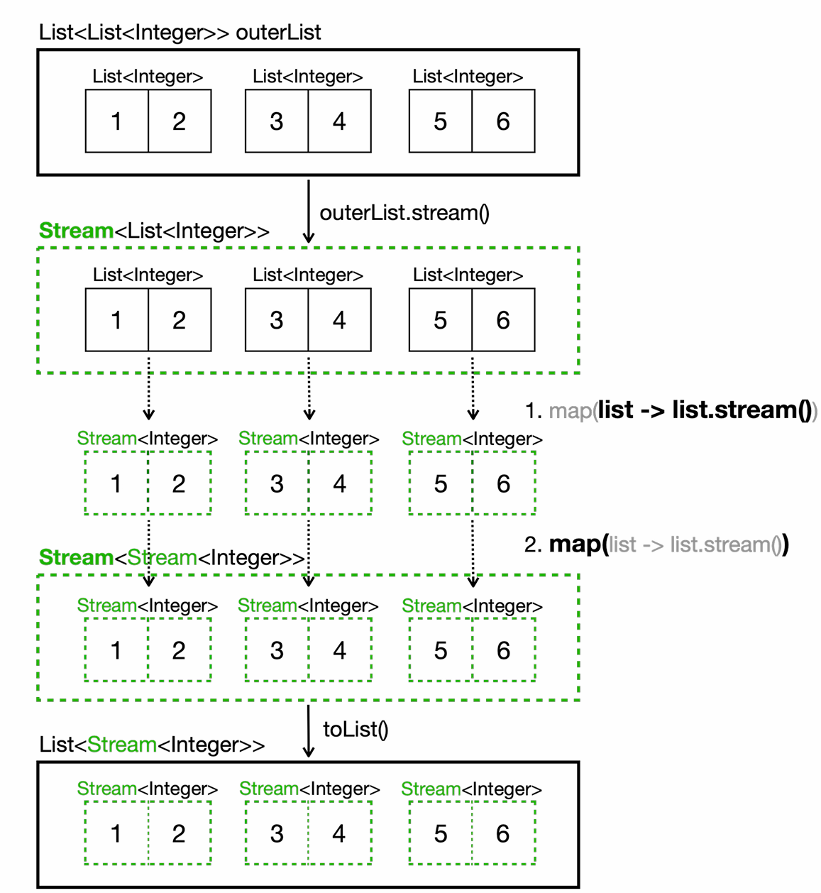
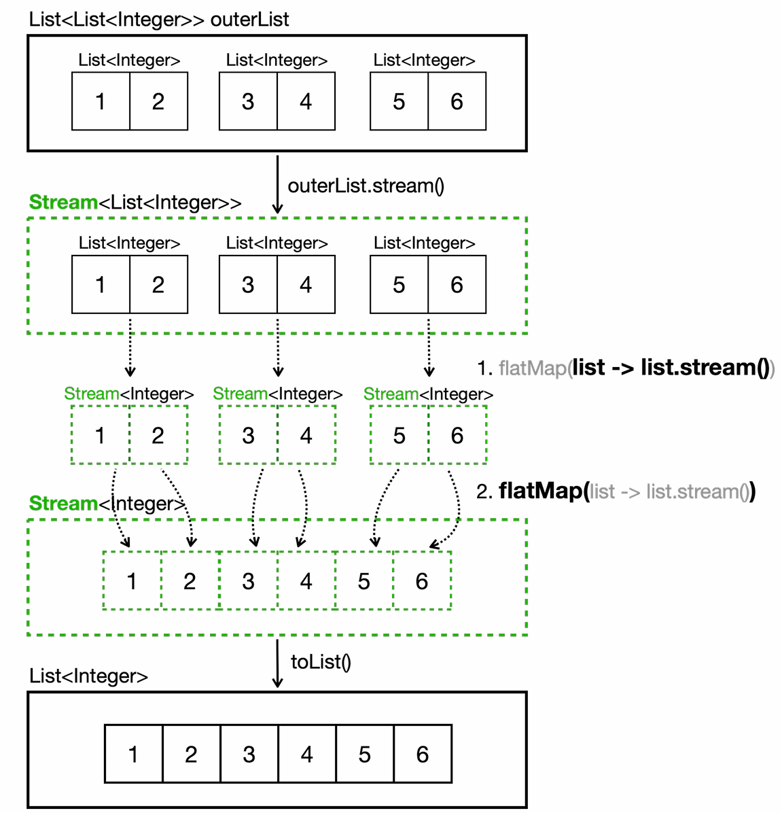

# 스트림 API 기능

## 스트림 생성

스트림을 생성할 수 있는 API는 대표적으로 다음과 같다.

| 생성 방법                 | 코드 예시                           | 특징                          |
|-----------------------|---------------------------------|-----------------------------|
| **컬렉션**               | `list.stream()`                 | `List`,`Set` 등 컬렉션에서 스트림 생성 |
| **배열**                | `Arrays.stream(arr)`            | 배열에서 스트림 생성                 |
| **Stream.of()**       | `Stream.of("A", "B", "C")`      | 직접 요소를 입력해 스트림 생성           |
| **무한 스트림 (iterate)**  | `Stream.iterate(0, n -> n + 2)` | 무한 스트림 생성 (초깃값, 함수)         |
| **무한 스트림 (generate)** | `Stream.generate(Math::random)`  | 무한 스트림 생성 (`Supplier` 사용)     |

```java
import java.util.Arrays;
import java.util.List;
import java.util.stream.Stream;

public class CreateStreamMain {
    public static void main(String[] args) {
        /*==== 1. 컬렉션으로부터 생성 ====*/
        List<String> list = List.of("a", "b", "c");
        Stream<String> stream1 = list.stream();
        stream1.forEach(System.out::println);

       /*==== 2. 배열로부터 생성 ====*/
        String[] arr = {"a", "b", "c"};
        Stream<String> stream2 = Arrays.stream(arr);
        stream2.forEach(System.out::println);

        /*==== 3. Stream.of() 사용 ====*/
        Stream<String> stream3 = Stream.of("a", "b", "c");
        stream3.forEach(System.out::println);

        /*==== 4. 무한 스트림 생성 - iterate() ====*/
        // iterate: 초깃값과 다음 값을 만드는 함수를 지정
        Stream<Integer> infiniteStream = Stream.iterate(0, n -> n + 2); // 짝수 무한 스트림
        infiniteStream.limit(3).forEach(System.out::println);

        /*==== 5. 무한 스트림 생성 - generate() ====*/
        // generate: Supplier를 사용하여 무한하게 생성
        Stream<Double> randomStream = Stream.generate(Math::random);
        randomStream.limit(3).forEach(System.out::println);
    }
}
```

- **컬렉션, 배열, Stream.of()** 는 기본적으로 **유한한** 데이터 소스로부터 스트림을 생성한다.
- **iterate**, **generate는** **무한히** 데이터를 만들어내는 스트림을 생성한다. 별도의 종료 조건이 없으면 무한 루프가 되므로 보통
**limit**와 같은 API와 함께 필요한 만큼만 사용해야 한다.

---

## 중간 연산

**중간 연산**은 스트림 파이프라인에서 **데이터를 변환 필터링, 정렬** 등을 하는 단계이다. **여러 중간 연산을 연결하여** 원하는 형태로
데이터를 가공할 수 있으며 **결과가 즉시 생성되지 않고**, 최종 연산이 호출될 때 **한꺼번에** 처리된다는 특징이 있다. (**지연 연산**)

대표적인 중간 연산 API는 다음과 같다.

| 연산        | 설명                                     |
|-----------|----------------------------------------|
| **filter**    | 조건에 맞는 요소만 남김                          |
| **map**       | 요소를 다른 형태로 변환                          |
| **flatMap**   | 중첩 구조 스트림을 일차원으로 평탄화                   |
| **distinct**  | 중복 요소 제거                               |
| **sorted**    | 요소 정렬                                  |
| **peek**      | 중간 처리 (로그, 디버깅)                        |
| **limit**     | 앞에서 N개의 요소만 추출                         |
| **skip**      | 앞에서 N개의 요소를 건너뛰고 이후 요소만 추출             |
| **takeWhile** | 조건을 만족하는 동안 요소 추출 (Java 9+)            |
| **dropWhile** | 조건을 만족하는 동안 요소를 버리고 이후 요소 추출 (Java 9+) |

```java
import java.util.Comparator;
import java.util.List;
import java.util.stream.Stream;

public class IntermediateOperationsMain {
    public static void main(String[] args) {
        List<Integer> numbers = List.of(1, 2, 2, 3, 4, 5, 5, 6, 7, 8, 9, 10);

        /* ==== 1. filter ==== */
        System.out.println("1. filter - 짝수만 선택");
        numbers.stream()
               .filter(n -> n % 2 == 0)
               .forEach(n -> System.out.print(n + " "));
        System.out.println("\n");

        /* ==== 2. map ==== */
        System.out.println("2. map - 각 숫자를 제곱");
        numbers.stream()
               .map(n -> n * n)
               .forEach(n -> System.out.print(n + " "));
        System.out.println("\n");

        /* ==== 3. distinct ==== */
        System.out.println("3. distinct - 중복 제거");
        numbers.stream()
               .distinct()
               .forEach(n -> System.out.print(n + " "));
        System.out.println("\n");

        /* ==== 4. sorted ==== */
        System.out.println("4. sorted - 기본 정렬");
        Stream.of(3, 1, 4, 1, 5, 9, 2, 6, 5)
              .sorted()
              .forEach(n -> System.out.print(n + " "));
        System.out.println("\n");

        /* ==== 5. sorted with Comparator ==== */
        System.out.println("5. sorted with Comparator - 내림차순 정렬");
        Stream.of(3, 1, 4, 1, 5, 9, 2, 6, 5)
              .sorted(Comparator.reverseOrder())
              .forEach(n -> System.out.print(n + " "));
        System.out.println("\n");

        /* ==== 6. peek ==== */
        System.out.println("6. peek - 동작 확인용");
        numbers.stream()
               .peek(n -> System.out.print("before: " + n + ", "))
               .map(n -> n * n)
               .peek(n -> System.out.print("after: " + n + ", "))
               .limit(5)
               .forEach(n -> System.out.println("최종값: " + n));
        System.out.println();

        /* ==== 7. limit ==== */
        System.out.println("7. limit - 처음 5개 요소만");
        numbers.stream()
               .limit(5)
               .forEach(n -> System.out.print(n + " "));
        System.out.println("\n");

        /* ==== 8. skip ==== */
        System.out.println("8. skip - 처음 5개 요소를 건너뛰기");
        numbers.stream()
               .skip(5)
               .forEach(n -> System.out.print(n + " "));
        System.out.println("\n");
        
        /*------------------------------------------------------------------*/

        List<Integer> numbers2 = List.of(1, 2, 3, 4, 5, 1, 2, 3);

        /* ==== 9. takeWhile (Java 9+) ==== */
        System.out.println("9. takeWhile - 5보다 작은 동안만 선택");
        numbers2.stream()
                .takeWhile(n -> n < 5)
                .forEach(n -> System.out.print(n + " "));
        System.out.println("\n");

        /* ==== 10. dropWhile (Java 9+) ==== */
        System.out.println("10. dropWhile - 5보다 작은 동안 건너뛰기");
        numbers2.stream()
                .dropWhile(n -> n < 5)
                .forEach(n -> System.out.print(n + " "));
    }
}
```
```text
1. filter - 짝수만 선택
2 2 4 6 8 10 

2. map - 각 숫자를 제곱
1 4 4 9 16 25 25 36 49 64 81 100 

3. distinct - 중복 제거
1 2 3 4 5 6 7 8 9 10 

4. sorted - 기본 정렬
1 1 2 3 4 5 5 6 9 

5. sorted with Comparator - 내림차순 정렬
9 6 5 5 4 3 2 1 1 

6. peek - 동작 확인용
before: 1, after: 1, 최종값: 1
before: 2, after: 4, 최종값: 4
before: 2, after: 4, 최종값: 4
before: 3, after: 9, 최종값: 9
before: 4, after: 16, 최종값: 16

7. limit - 처음 5개 요소만
1 2 2 3 4 

8. skip - 처음 5개 요소를 건너뛰기
5 5 6 7 8 9 10 

9. takeWhile - 5보다 작은 동안만 선택
1 2 3 4 

10. dropWhile - 5보다 작은 동안 건너뛰기
5 1 2 3
```

- 중간 연산은 **파이프라인** 형태로 연결할 수 있으며, **스트림을 변경**하지만 원본 데이터 자체를 바꾸지 않는다.
- 중간 연산은 **지연 연산**이므로 **최종 연산**이 실행될 때까지 실제 처리는 일어나지 않는다.
- `peek`은 **디버깅 목적**으로 자주 사용하며 실제 스트림의 요소값을 변경하거나 연산 결과를 반환하지는 않는다.
- `takeWhile`, `dropWhile`은 자바 9부터 추가된 기능으로 **정렬된 스트림**에서 사용할 때 유용하다.
  - `takeWhile` : **조건을 만족하는 동안 요소를 가져온다.** 조건이 처음으로 거짓이 되는 지점에서 스트림을 멈춘다. 스트림이 중간에
                멈추기 때문에 원하는 목적을 빨리 달성하면 성능을 최적화할 수 있다.
  - `dropWhile` : **조건을 만족하는 동안 요소를 버린다.** 조건이 처음으로 거짓이 되는 지점부터 스트림을 구성한다.
  - 정렬되지 않은 스트림에서 쓰면 예측하기가 어렵다.

### FlatMap

`map`은 각 요소를 하나의 값으로 변환하지만, `flatMap`은 각 요소를 스트림(또는 여러 요소)으로 변환한 뒤, 그 결과를 하나의
스트림으로 **평탄화**(flatten)해준다.

```java
import java.util.ArrayList;
import java.util.List;
import java.util.stream.Stream;

public class MapVsFlatMapMain {
    public static void main(String[] args) {
        List<List<Integer>> outerList = List.of(
                List.of(1, 2),
                List.of(3, 4),
                List.of(5, 6)
        );

        System.out.println("outerList = " + outerList);
        
        /*==== for ====*/
        List<Integer> forResult = new ArrayList<>();
        for (List<Integer> list : outerList) {
            for (Integer i : list) {
                forResult.add(i);
            }
        }
        System.out.println("forResult = " + forResult);

        /*==== map ====*/
        List<Stream<Integer>> mapResult = outerList.stream()
                                                   .map(list -> list.stream())
                                                   .toList();
        System.out.println("mapResult = " + mapResult);

        /*==== flatMap ====*/
        List<Integer> flatMapResult = outerList.stream()
                                               .flatMap(list -> list.stream())
                                               .toList();
        System.out.println("flatMapResult = " + flatMapResult);
    }
}
```
```text
outerList = [[1, 2], [3, 4], [5, 6]]
forResult = [1, 2, 3, 4, 5, 6]
mapResult = [java.util.stream.ReferencePipeline$Head@27973e9b, java.util.stream.ReferencePipeline$Head@312b1dae, java.util.stream.ReferencePipeline$Head@7530d0a]
flatMapResult = [1, 2, 3, 4, 5, 6]
```

- `map`을 쓰면 이중 구조가 그대로 유지된다. 즉 각 요소가 `Stream` 형태가 되므로 결과가 `List<Stream<Integer>>`가 된다.
- `mapResult`는 **Stream** 객체 참조값을 출력하는 형태로 보인다.
- `flatMap`을 쓰면 내부의 **Stream**들을 **하나로 합쳐** `List<Integer>`를 얻을 수 있다.

이 과정을 그림으로 보면 다음과 같다.

**map()**



`List<List<Integer>>`가 `List<Stream<Integer>>`가 되었다. 이것은 기대한 결과가 아니다. 중첩 컬렉션을 다룰 때는
`map`대신에 `flatMap`을 사용하면 중첩 컬렉션을 편리하게 하나의 컬렉션으로 변환할 수 있다.

**flatMap()**



`flatMap`은 **중첩 구조를 일차원으로 펼치는 데** 사용된다. 예를 들어 문자열 리스트들이 들어있는 리스트를 평탄화하면,
하나의 연속된 문자열 리스트로 만들 수 있다.

---

## 최종 연산

**최종 연산**은 스트림 파이프라인의 **끝에 호출**되어 **실제 연산을 수행하고 결과**를 만들어낸다. 최종 연산이 실행된 후에 스트림은 
**소모되어 더 이상 사용할 수 없다.**

대표적인 최종 연산 API는 다음과 같다.

| 연산            | 설명                                                 |
|---------------|----------------------------------------------------|
| **collect**   | `Collector`를 사용하여 결과 수집 (다양한 형태로 변환 가능)            |
| **toList**    | 스트림을 불변 리스트로 수집 (Java 16+)                         |
| **toArray**   | 스트림을 배열로 변환                                        |
| **forEach**   | 각 요소에 대해 동작 수행 (반환값 없음)                            |
| **count**     | 요소 개수 반환                                           |
| **min / max** | 최솟값, 최댓값을 `Optional`로 반환                           |
| **reduce**    | 누적 함수를 사용해 모든 요소를 단일 결과로 합침 (초깃값이 없으면 `Optional`로 반환) |
| **findFirst** | 조건에 맞는 첫 번째 요소 (`Optional` 반환)                     |
| **findAny**   | 조건에 맞는 아무 요소를 반환 (`Optional` 반환)                   |
| **anyMatch**  | 하나라도 조건을 만족하는지                                     |
| **allMatch**  | 모두 조건을 만족하는지                                       |
| **noneMatch** | 하나도 조건을 만족하지 않는지                                   |

```java
import java.util.Arrays;
import java.util.List;
import java.util.Optional;
import java.util.stream.Collectors;

public class TerminalOperationMain {
    public static void main(String[] args) {
        List<Integer> numbers = List.of(1, 2, 2, 3, 4, 5, 5, 6, 7, 8, 9, 10);

        /*==== 1. collect ====*/
        System.out.println("1. collect - List 수집");
        List<Integer> evenNumbers1 = numbers.stream()
                                            .filter(n -> n % 2 == 0)
                                            .collect(Collectors.toList());
        System.out.println("짝수 리스트: " + evenNumbers1);

        System.out.println();

        /*==== 2. toList  ====*/
        System.out.println("2. toList() (Java 16+)");
        List<Integer> evenNumbers2 = numbers.stream()
                                            .filter(n -> n % 2 == 0)
                                            .toList(); // 수정 불가능 리스트
        System.out.println("짝수 리스트: " + evenNumbers2);

        System.out.println();

        /*==== 3. toArray ====*/
        System.out.println("3. toArray - 배열로 변환");
        Integer[] arr = numbers.stream()
                               .filter(n -> n % 2 == 0)
                               .toArray(Integer[]::new);
        System.out.println("짝수 배열: " + Arrays.toString(arr));

        System.out.println();

        /*==== 4. forEach ====*/
        System.out.println("4. forEach - 각 요소 처리");
        numbers.stream()
               .limit(5)
               .forEach(n -> System.out.print(n + " "));

        System.out.println("\n");

        /*==== 5. count ====*/
        System.out.println("5. count - 요소 개수");
        long count = numbers.stream()
                            .filter(n -> n > 5)
                            .count();
        System.out.println("5보다 큰 숫자 개수: " + count);

        System.out.println();

        /*==== 6. reduce  ====*/
        System.out.println("6. reduce - 요소들의 합");
        System.out.println("초깃값이 없는 reduce");
        Optional<Integer> sum1 = numbers.stream()
                                        .reduce((a, b) -> a + b);
        System.out.println("합계(초깃값 없음): " + sum1.get());

        System.out.println("초깃값이 있는 reduce");
        int sum2 = numbers.stream()
                          .reduce(100, (a, b) -> a + b);
        System.out.println("합계(초깃값 100): " + sum2);

        System.out.println();

        /*==== 7. min ====*/
        System.out.println("7. min - 최솟값");
        Optional<Integer> min = numbers.stream()
                                       .min(Integer::compareTo);
        System.out.println("최솟값: " + min.get());

        System.out.println();

        /*==== 8. max ====*/
        System.out.println("8. max - 최댓값");
        Optional<Integer> max = numbers.stream()
                                       .max(Integer::compareTo);
        System.out.println("최댓값: " + max.get());

        System.out.println();

        /*==== 9. findFirst ====*/
        System.out.println("9. findFirst - 첫 번째 요소");
        Integer first = numbers.stream()
                               .filter(n -> n > 5)
                               .findFirst()
                               .get();
        System.out.println("5보다 큰 첫 번째 숫자: " + first);

        System.out.println();

        /*==== 10. findAny ====*/
        System.out.println("10. findAny - 아무 요소나 하나 찾기");
        Integer any = numbers.stream()
                             .filter(n -> n > 5)
                             .findAny()
                             .get();
        System.out.println("5보다 큰 아무 숫자: " + any);

        System.out.println();

        /*==== 11. anyMatch ====*/
        System.out.println("11. anyMatch - 조건을 만족하는 요소 존재 여부");
        boolean hasEven = numbers.stream()
                                 .anyMatch(n -> n % 2 == 0);
        System.out.println("짝수가 있나? " + hasEven);

        System.out.println();

        /*==== 12.allMatch  ====*/
        System.out.println("12. allMatch - 모든 요소가 조건을 만족하는지");

        boolean allPositive = numbers.stream()
                                     .allMatch(n -> n > 0);
        System.out.println("모든 숫자가 양수인가? " + allPositive);

        System.out.println();

        /*==== 13. noneMatch ====*/
        System.out.println("13. noneMatch - 조건을 만족하는 요소가 없는지");
        boolean noNegative = numbers.stream()
                                    .noneMatch(n -> n < 0);
        System.out.println("음수가 없나? " + noNegative);
    }
}
```
```text
1. collect - List 수집
짝수 리스트: [2, 2, 4, 6, 8, 10]

2. toList() (Java 16+)
짝수 리스트: [2, 2, 4, 6, 8, 10]

3. toArray - 배열로 변환
짝수 배열: [2, 2, 4, 6, 8, 10]

4. forEach - 각 요소 처리
1 2 2 3 4 

5. count - 요소 개수
5보다 큰 숫자 개수: 5

6. reduce - 요소들의 합
초깃값이 없는 reduce
합계(초깃값 없음): 62
초깃값이 있는 reduce
합계(초깃값 100): 162

7. min - 최솟값
최솟값: 1

8. max - 최댓값
최댓값: 10

9. findFirst - 첫 번째 요소
5보다 큰 첫 번째 숫자: 6

10. findAny - 아무 요소나 하나 찾기
5보다 큰 아무 숫자: 6

11. anyMatch - 조건을 만족하는 요소 존재 여부
짝수가 있나? true

12. allMatch - 모든 요소가 조건을 만족하는지
모든 숫자가 양수인가? true

13. noneMatch - 조건을 만족하는 요소가 없는지
음수가 없나? true
```

- 최종 연산이 호출되면 그 동안 정의된 모든 중간 연산이 한번에 적용되어 결과를 만든다.
- 최종 연산을 한번 수행하면, 해당 스트림은 재사용할 수 없다.
- `reduce`를 사용할 때 초깃값을 지정하면 스트림이 비어 있어도 초깃값이 결과가 된다. 초깃값이 없으면 `Optional`을 반환한다.
  - 초기값이 없는데 스트림이 비어있을 경우 빈 `Optional`을 반환한다.
- `findFirst()`, `findAny()`도 결과가 없을 수 있으므로 `Optional`을 통해 값 유무를 확인해야 한다.
  - 병렬 스트림인 경우 `findAny()`는 더욱 효율적으로 동작할 수 있다.

---

## 기본형 특화 스트림

자바에서는 `IntStream`, `LongStream`, `DoubleStream` 세가지 형태로 **기본 자료형에 특화된 기능의 스트림 API**를 제공한다.

**기본형 특화 스트림**은 **합계, 평균** 등 자주 사용하는 숫자 연산을 편리한 메서드로 제공한다. 또한, **타입 변환**과 **박싱/언박싱** 메서드도 
제공하여 다른 스트림과 연계해 작업하기 수월하다.

대표적인 API는 다음과 같다.

| 연산                   | 설명                               |
|----------------------|----------------------------------|
| **sum**                  | 모든 요소의 합계를 구한다                   |
| **average**              | 모든 요소의 평균을 구한다                   |
| **summaryStatistics**    | 최솟값, 최댓값, 합계, 개수, 평균 등이 담긴 객체 반환 |
| **mapToXXX**             | 타입 변환                            |
| **mapToObj**             | 객체 스트림으로 변환                      |
| **boxed**                | 기본형 특화 스트림을 박싱된 객체 스트림으로 변환      |
| **sum, min, max, count** | 합계, 최솟값, 최댓값, 개수를 반환             |

```java
import java.util.IntSummaryStatistics;
import java.util.stream.DoubleStream;
import java.util.stream.IntStream;
import java.util.stream.LongStream;
import java.util.stream.Stream;

public class PrimitiveStreamMain {
    public static void main(String[] args) {
        /*==== 기본형 특화 스트림 생성 (IntStream, LongStream, DoubleStream) ====*/
        IntStream stream = IntStream.of(1, 2, 3, 4, 5);
        stream.forEach(i -> System.out.print(i + " "));

        System.out.println();

        /*==== 범위 생성 메서드 (IntStream, LongStream 가능) ====*/
        IntStream range1 = IntStream.range(1, 6);// [1,2,3,4,5]
        IntStream range2 = IntStream.rangeClosed(1, 6); // [1,2,3,4,5,6]

        /*==== 1. 통계 관련 메서드 (sum, average, max, min ,count) ====*/
        // sum(): 합계 계산
        int sum = IntStream.range(1, 6).sum();
        System.out.println("sum = " + sum); // 15

        // average(): 평균값 계산
        double avg = IntStream.range(1, 6)
                              .average()
                              .getAsDouble(); //OptionalDouble
        System.out.println("avg = " + avg); // 3.0

        // summaryStatistics(): 모든 통계 정보
        IntSummaryStatistics stats = IntStream.range(1, 6).summaryStatistics();
        System.out.println("합계: " + stats.getSum());        // 15
        System.out.println("평균: " + stats.getAverage());    // 3.0  
        System.out.println("최댓값: " + stats.getMax());      // 5
        System.out.println("최솟값: " + stats.getMin());      // 1
        System.out.println("개수: " + stats.getCount());      // 5

        /*==== 타입 변환 메서드 ====*/
        // IntStream -> LongStream
        LongStream longStream = IntStream.range(1, 5).asLongStream();

        // IntStream -> DoubleStream
        DoubleStream doubleStream = IntStream.range(1, 5).asDoubleStream();

        // IntStream -> Stream<Integer>
        Stream<Integer> boxedStream = IntStream.range(1, 5).boxed();

        /*==== 기본형 특화 매핑 ====*/
        // int -> long 변환 매핑
        LongStream mappedLong = IntStream.range(1, 5)
                                         .mapToLong(i -> i * 10L);
        // int -> double 변환 매핑
        DoubleStream mappedDouble = IntStream.range(1, 5)
                                             .mapToDouble(i -> i * 1.5);
        // int -> 객체 변환 매핑
        Stream<String> mappedObj = IntStream.range(1, 5)
                                            .mapToObj(i -> "Number: " + i);

        /*==== 4. 객체 스트림 -> 기본형 특화 스트림으로 매핑 ====*/
        Stream<Integer> integerStream = Stream.of(1, 2, 3, 4, 5);
        IntStream intStream = integerStream.mapToInt(i -> i);

        /*==== 객체 스트림 -> 기본형 특화 스트림으로 매핑 활용 ====*/
        int result = Stream.of(1, 2, 3, 4, 5)
                           .mapToInt(i -> i)
                           .sum();
        System.out.println("result = " + result); // 15
    }
}
```

- **기본형 특화 스트림**을 사용하면 **합계, 평균, 최대, 최소** 등 숫자 계산을 간편하게 처리하고, **박싱/언박싱** 오버헤드를 줄여 성능상의
이점도 얻을 수 있다.
- `range()`, `rangeClosed()` 같은 메서드를 사용하면 범위를 쉽게 다룰 수 있어 **반복문 대신에** 자주 쓰인다.
- `mapToXXX()`, `boxed()` 등의 메서드를 잘 활용하여 **객체 스트림**과 **기본형 특화 스트림**을 자유롭게 오가며 다양한 작업을 할 수 있다.
- `summaryStatistics()`를 사용하면 합계, 평균, 최솟값, 최댓값 등 통계 정보를 한번에 구할 수 있어 편리하다.

> 🤔 **전통적인 for문 vs 스트림 vs 기본형 특화 스트림**
> - 보통 **전통적인 for문**이 가장 빠르다.
> - 여기서 **스트림**은 `Integer`같은 객체를 다루는 스트림을 말하며, **박싱/언박싱 오버헤드**가 발생한다.
> - **기본형 특화 스트림**(`IntStream` 등)은 전통적인 for문에 가까운 성능을 보여준다.
>   - 전통적인 for문과 거의 비슷하거나 전통적인 for문이 약간 더 빠르다.
>   - **박싱/언박싱 오버헤드**를 피할 수 있으며, 내부적으로 최적화된 연산을 수행할 수 있다.
> 
> 이론적으로는 위와 같지만, 보통 성능 차이를 느끼려면 루프가 최소한 수천만 건 이상이어야 한다. 박싱/언박싱을 많이 유발하지
> 않는 상황이라면 일반 스트림과 기본형 특화 스트림 간 성능 차이는 크지 않을 수 있다. 즉 코드와 가독성과 유지보수성을 위해
> 스트림 API를 사용하는 것이 보통 더 나은 선택이다.