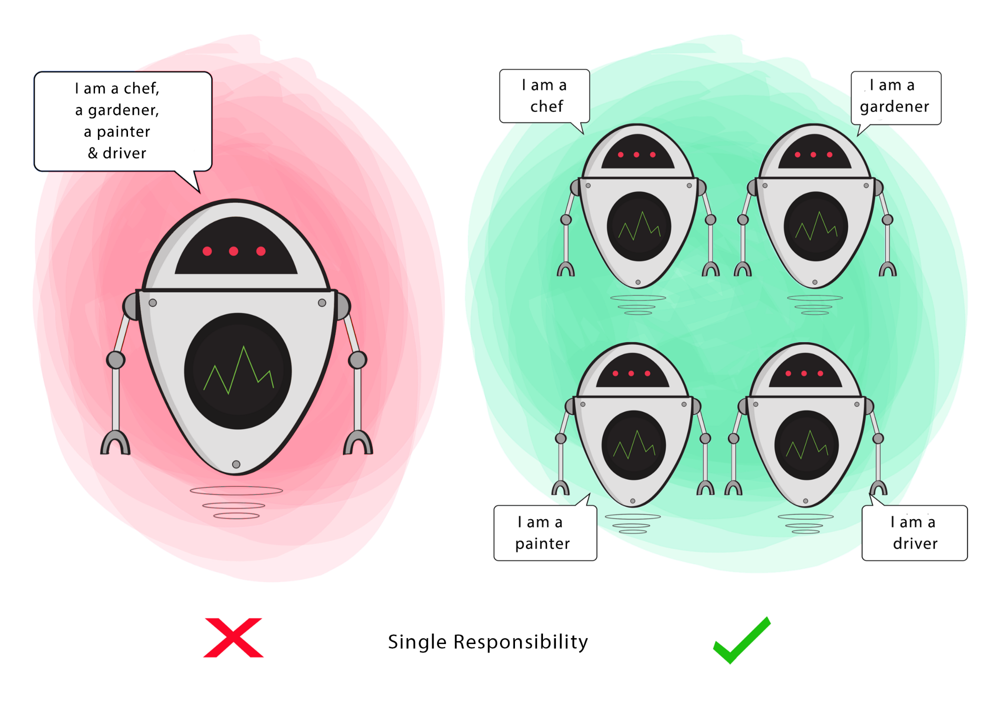
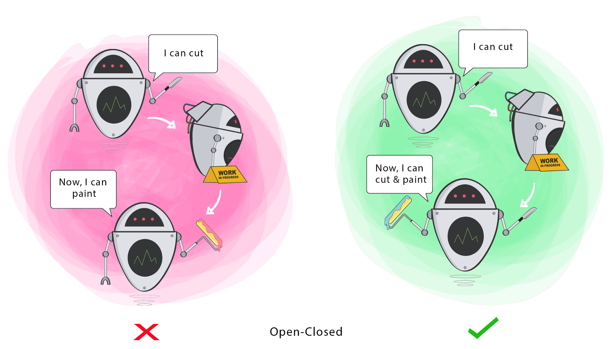
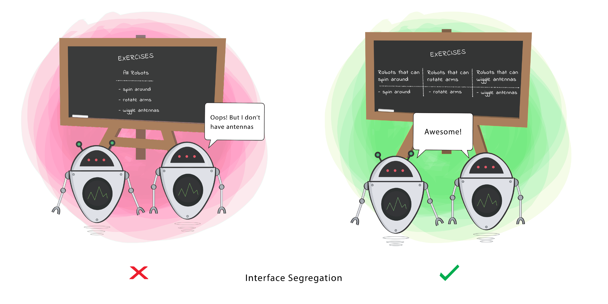
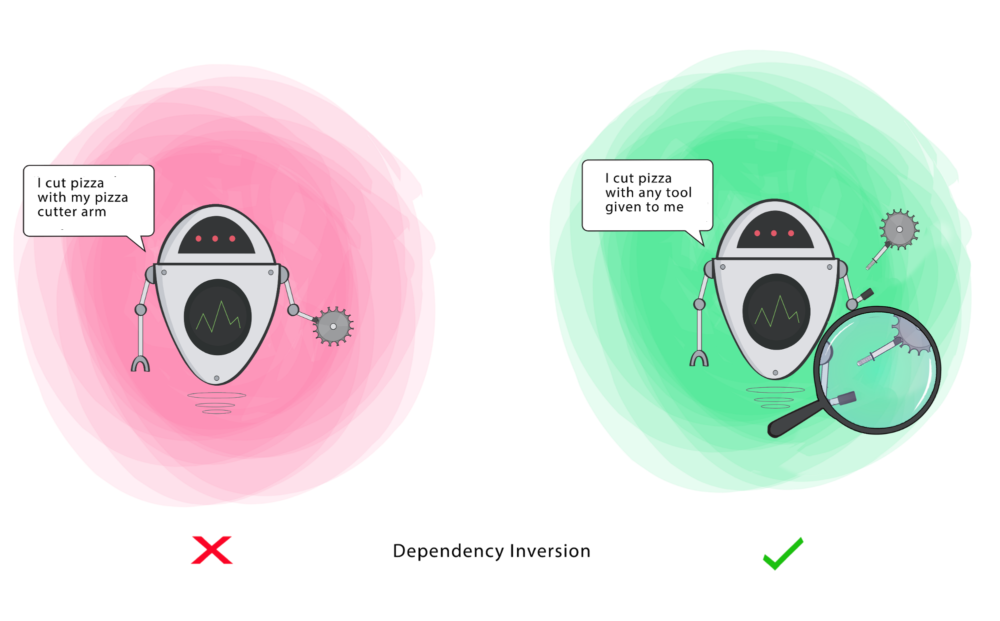
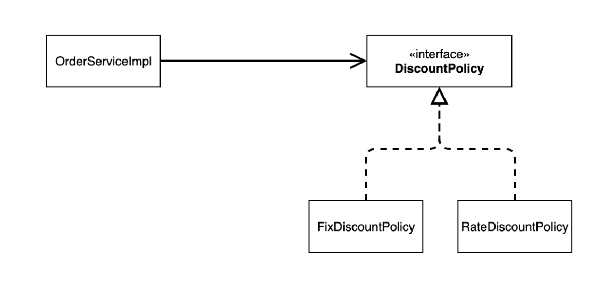

# 좋은 객체 지향 설계의 5가지 원칙(SOLID)

> 개발자는 좋은 설계를 위해 SOLID 객체 지향 원칙을 잘 적용해야 한다. 여기서 말하는 좋은 설계란 **시스템에 새로운 요구사항이나 변경사항이 있을 때, 영향을 받는
> 범위가 적은 구조를 말한다.** 그래서 시스템에 예상하지 못한 변경사항이 발생하더라도 유연하게 대처하고 이후에 확장성이 있는 시스템 구조를 만들 수 있다.

즉, ``SOLID 객체 지향 원칙``을 적용하면 코드를 확장하고 유지 보수 관리하기가 더 쉬워지며, 불필요한 복잡성을 제거해 리팩토링에 소요되는 시간을 줄이게 되어 개발의 생산성을
높일 수 있다.

 

## SOLID란?

- **S**RP(Single Responsibility Principle) : 단일 책임 원칙
- **O**CP(Open Closed Principle) : 개방 폐쇄 원칙
- **L**SP(Liskov Substitution Principle) : 리스코프 치환 법칙
- **I**SP(Interface Segregation Principle) : 인터페이스 분리 원칙
- **D**IP(Dependency Inversion Principle) : 의존관계 역전 원칙

 

## SRP - 단일 책임 원칙
> 하나의 클래스는 하나의 책임만 가져야 한다. 
> **책임**이란 하나의 기능 담당이라고 이해하면 된다. 즉, **하나의 클래스는 하나의 책임을 수행하는데 집중되도록** 클래스를 따로따로 여러 개로 설계해야 한다.

단일 책임 원칙을 잘 지켰느냐에 대한 기준이 될 수 있는 것은 **기능 변경(수정)이 일어났을 때 파급 효과**이다. 
객체 하나에 책임이 많아질수록 클래스 내부에서 서로 다른 역할을 수행하는 코드끼리 강하게 결합될 가능성이 높아지게 되어 시스템이 복잡해질 수 있게 된다.
그래서 그 객체에 하는 기능에 변경사항이 생기면 이 기능을 사용하는 다른 부분의 코드도 살펴보고 수정해야 될 수도 있다.

단일 책임 원칙을 적용한다면 각 객체마다 알맞는 책임을 가지게 되어 책임 영역이 확실해지게 된다. 그래서 한 역할에 대해 기능변경이 발생했을 때, 변경 영향을 받는
기능만 모아둔 클래스라면 그 책임을 수행하는 클래스만 수정해주면 될 것이다.

정리해서 한 줄로 표현하면, ``어떤 변화에 의해 클래스를 변경해야 하는 이유는 오직 하나뿐이어야 한다.``

이러한 단일 책임 원칙은 가독성 향상, **유지보수 용이**라는 이점일 가질 수 있다.

SRP 원칙을 적용하여 클래스를 세세하게 나누다 보면 전체 코드 길이가 길어질 수 있지만 하나의 클래스에 서로 관련 없는 기능들을 모아두는 것보다는
여러 개의 클래스를 사용하는 것이 더 효율적이다. 그래야 각 클래스의 의미를 파악하기도 쉽고 유지보수가 용이해진다.

생활용품에 예를 들면 맥가이버 칼처럼 하나에 칼, 드라이버, 가위 등 여러 개의 기능들을 모아서 쓰지 말고 각 기능에 맞게 구분하여 사용해도록 해야한다.

 

## OCP - 개방 폐쇄 원칙
> 클래스는 확장에는 개방적이어야 하고, 변경에는 폐쇄적이어야 한다.(기존의 코드를 변경하지 않으면서, 기능을 추가할 수 있도록 설계되어야 함.) 
> 여기서 말하는 **확장**이란 새로운 기능이 추가됨을 의미한다.

OCP는 다형성과 확장을 가능하게 하는 객체지향의 장점을 극대화하는 설계 원칙이라고 할 수 있다. 클래스를 추가해야 한다면 기존 코드를 수정할 필요 없이
적절하게 상속 관계에 맞춰 추가만 한다면 유연한 확장이 가능한 것이다.

예를 들어 할인 정책을 변경할 때 할인 기능을 사용하는 클래스에서는 변경이 없거나 최소화 되어야 한다.

OCP 원칙을 지키기 위해서는 
1. 변경(확장)될 것과 변하지 않을 것을 엄격히 구분한다.
2. 이 두 모듈이 만나는 지점에 추상화(추상 클래스나 인터페이스)를 정의한다.
3. 구현체에 의존하면 안 되고 추상화에 의존하도록 코드를 작성해야 한다.

정답이 있는 것이 아니기 때문에 많은 경험이 필요할 것이다.

 

## LSP - 리스코프 치환 법칙
> 서브 타입(자식)은 언제나 기반 타입(부모)으로 교체할 수 있어야 한다. 
> 다형성의 특징을 이용하기 위해 상위 클래스 타입으로 객체를 선언하여 하위 클래스로 인스턴스를 받으면 업캐스팅 된 상태에서 부모의 메서드를 사용해도
> 동작이 의도대로 되어야 한다는 것을 의미한다.

자바에서는 **컬렉션 프레임워크(Collection Framework)** 라는 LSP원칙을 잘 적용한 예제가 있다.

Collection이라는 인터페이스 타입으로 변수를 선언하면 LinkedList에서 전혀 다른 HashSet 자료형으로 바꿔도 ``add()``메서드를 보장받을 수 있다.

LSP 원칙을 적용할 때 주의할 점은 상속을 통한 재사용은 기반 클래스와 서브 클래스 사이에 ``IS-A``관계가 있을 경우로만 제한 되어야 한다.

자바8부터는 인터페이스에 디폴트 메서드 기능이 나오면서 상속보다는 **합성**을 이용하라는 말이 지배적이다.

[참고](https://inpa.tistory.com/entry/OOP-%F0%9F%92%A0-%EA%B0%9D%EC%B2%B4-%EC%A7%80%ED%96%A5%EC%9D%98-%EC%83%81%EC%86%8D-%EB%AC%B8%EC%A0%9C%EC%A0%90%EA%B3%BC-%ED%95%A9%EC%84%B1Composition-%EC%9D%B4%ED%95%B4%ED%95%98%EA%B8%B0)

 

## ISP - 인터페이스 분리 원칙
> 인터페이스를 각각 사용에 맞게끔 잘게 분리해야 한다. 
> SRP 원칙이 클래스의 단일 책임을 의미한다면, ISP는 인터페이스의 단일 책임을 의미한다.

인터페이스의 추상 메서드들을 범용적으로 이것저것 구현한다면, 그 인터페이스를 구현하는 구현체는 자신과 관련 없는 메서드마저 억지로 구현을 해야 한다.

또한 사용하지도 않는 인터페이스의 추상 메서드가 변경된다면 클래스에서도 수정이 필요하게 된다.

즉 인터페이스를 잘게 분리해서 클라이언트의 목적과 용도에 적합한 인터페이스 만을 제공해야 한다.

ISP 원칙의 주의해야 할 점은 한 번 인터페이스를 분리하여 구성해놓고 나중에 수정사항이 생겨서 또 인터페이스들을 분리하는 말아야 한다.

또 분리한다면 이미 해당 인터페이스를 구현하고 있는 클래스들과 이를 사용하는 클라이언트 코드에 문제가 일어날 수 있다.

인터페이스라는 것은 **한 번 구성하였으면 웬만해서는 변하면 안 되는 정책 같은 개념이다.**

 

## DIP - 의존관계 역전 원칙
> 객체에서 다른 객체를 참조해서 사용해야 할 떄 그 객체를 직접 참조하기보다는 추상화에 의존해야 한다

클라이언트 코드는 의존관계를 갖고 있는 객체의 메서드를 사용할 때 저수준의 구체적인 객체에 의존하기보다는 고수준의 상위 인터페이스 타입에 
의존해야 하도록 설계해야 한다.

스프링에서는 **스프링 컨테이너**와 **빈(bean)** 이라는 것으로 이러한 원칙을 잘 설계할 수 있도록 해준다.

[전체 참고](https://inpa.tistory.com/entry/OOP-%F0%9F%92%A0-%EA%B0%9D%EC%B2%B4-%EC%A7%80%ED%96%A5-%EC%84%A4%EA%B3%84%EC%9D%98-5%EA%B0%80%EC%A7%80-%EC%9B%90%EC%B9%99-SOLID)