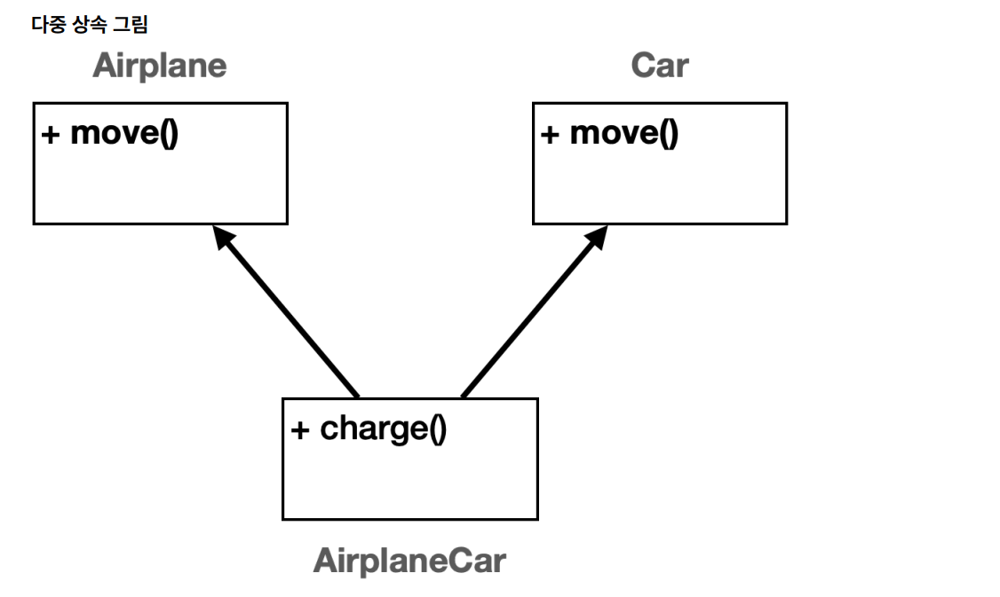
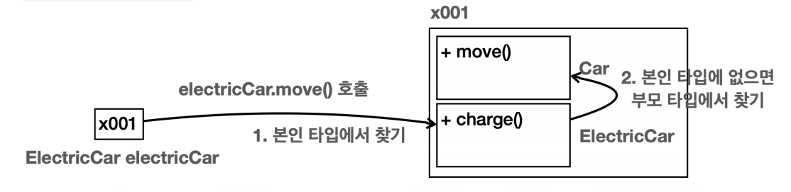
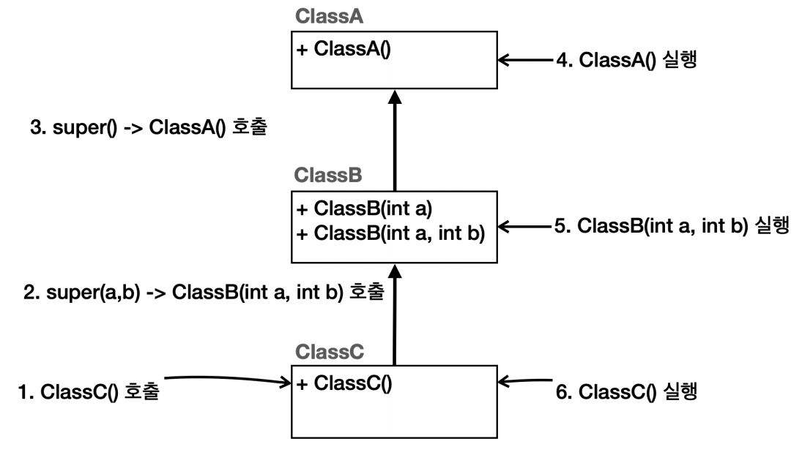

# 자바 상속

- 상속은 객체 지향 프로그래밍의 핵심 요소 중 하나로, 기존 클래스의 필드와 메서드를 새로운 클래스에서 재사용하게 해준다.
- 이름 그대로 기존 클래스의 속성과 기능을 그대로 물려받는 것이다.
- **용어**
  - **부모 클래스** : 상속을 통해 자신의 필드와 메서드를 다른 클래스에 제공하는 클래스, **슈퍼 클래스**라고도 한다.
  - **자식 클래스** : 부모 클래스로부터 필드와 메서드를 상속받는 클래스, **서브 클래스**라고도 한다.

```java
public class Car {
    public void move() {
        System.out.println("차를 이동합니다.");
    } 
}
```
- 부모 클래스가 될 클래스로, 자동차의 공통 기능인 `move()`가 있다.

```java
public class ElectricCar extends Car {
    public void charge() {
         System.out.println("충전합니다.");
    } 
}
```
```java
public class GasCar extends Car {
    public void fillUp() {
        System.out.println("기름을 주유합니다.");
    } 
}
```
```java
public class Main {
    public static void main(String[] args) { 
        ElectricCar electricCar = new ElectricCar();
        electricCar.move();
        electricCar.charge();
        
        GasCar gasCar = new GasCar();
        gasCar.move(); 
        gasCar.fillUp(); 
    }
}
```
- 전기차와 가솔린차는 `Car`를 상속 받아 `move()`기능을 사용할 수 있다.

상속은 부모의 기능을 자식이 물려 받는 것이다. 따라서 자식의 부모의 기능을 물려 받아서 사용할 수 있다.<br>
반대로 부모 클래스는 자식 클래스에 접근할 수 없다. 자식 클래스는 부모 클래스의 기능을 물려 받기 때문에 접근할 수 있지만, 부모 클래스는 자식에 대한 정보가 하나도 없기 때문에
접근할 수 없다. 반면에 자식 코드는 `extends (Class)`를 통해서 부모를 알고 있다.

자바는 다중 상속을 지원하지 않는다.(**단일 상속**) 그래서 `extends` 대상은 하나만 선택할 수 있다.<br>
부모를 하나만 선택할 수 있다는 뜻이다. 부모가 또 다른 부모를 하나 가지는 것은 상관없다.



- 만약 다중 상속을 사용하게 되면 어떤 부모의 `move()`를 사용해야 할지 명확하지 않은 애매한 문제가 발생한다. 이것을 다이아몬드 문제라 한다.
- 그리고 다중 상속을 사용하면 클래스 계층 구조가 매우 복잡해질 수 있다.
- 이런 문제점 때문에 자바는 클래스의 다중 상속을 허용하지 않는다.
- 대신 `인터페이스`의 다중 구현을 허용해서 이런 문제를 피한다.

## 상속 메모리 구조

```java
ElectricCar electricCar = new ElectricCar();
```


- `electricCar`는 `ElectricCar` 뿐만 아니라 부모 클래스인 `Car` 까지 함께 포함해서 인스턴스를 생성한다.
- 참조값은 하나이지만 실제로 그 안에서는 두 가지 클래스 정보가 공존하는 것이다.
- 상속이라고 해서 단순하게 부모의 필드와 메서드만 물려받는 것이 아니라 상속 관계를 사용하면 부모 클래스도 함께 포함해서 생성한다.
- 외부에서 볼때는 하나의 인스턴스를 생성하는 것 같지만 내부에서는 부모와 자식이 모두 생성되고 공간도 구분된다.

```java
electricCar.charge();
```


- 먼저 참조값을 확인해서 `인스턴스 주소.charge()`를 호출한다. 따라서 인스턴스 주소를 찾아서 `charge()` 메서드를 호출하면 된다.
- 그런데 상속 관계에 경우에는 내부에 부모와 자식이 모두 존재한다. 이때 둘 중 어디를 통해서 메서드를 찾을지 선택해야 한다.
- 이때는 **호출하는 변수의 타입(클래스)을 기준으로 선택한다.** 타입이 `ElectricCar`이므로 인스턴스 내부에 같은 타입인 `ElectricCar`를 통해서 메서드를 호출한다.

```java
electricCar.move();
```


- 먼저 참조값을 확인해서 `인스턴스 주소.move()`를 호출한다. 내부에는 두 가지 타입이 있는데 이때 호출하는 변수의 타입이 `ElectricCar`이므로 이 타입을 선택한다.
- 그런데 `ElectricCar`에는 찾는 메서드가 없다. 상속 관계에서는 자식 타입에 해당 기능이 없으면 부모 타입으로 올라가서 찾는다.

만약 부모에서도 해당 기능을 찾지 못하면 더 상위 부모로 올라가 필요한 기능을 찾아본다. 부모에 부모로 계속 올라가면서 필드나 메서드를 찾는 것이다.
당연히 계속 찾아도 없으면 컴파일 오류가 발생한다.

**정리**
- 상속 관계의 객체를 생성하면 그 내부에는 부모와 자식이 모두 생성된다.
- 상속 관계의 객체를 호출할 때, 대상 타입을 정해야 한다. 이때는 호출자의 타입을 통해 대상 타입을 찾는다.
- 현재 타입에서 기능을 찾지 못하면 상위 부모 타입으로 기능을 찾아서 실행한다. 기능을 찾지 못하면 컴파일 오류가 발생한다.

<br>

## super - 생성자

- 상속 관계의 인스턴스를 생성하면 결국 메모리 내부에는 자식과 부모 클래스가 각각 다 만들어진다. 
- `Child`를 만들면 부모인 `Parent`까지 함께 만들어지는 것이다. 따라서 각각의 생성자도 모두 호출되어야 한다.
- **상속 관계를 사용하면 자식 클래스의 생성자에서 부모 클래스의 생성자를 반드시 호출해야 한다** 라는 규칙이 존재한다.
- 상속 관계에서 부모의 생성자를 호출할 때는 `super()`를 사용하면 된다.

```java
public class A {
    public A() {
        System.out.println("A 생성자 호출");
    }
}
```
- 최상위 부모 클래스

```java
public class B extends A{
    public B(int a) {
        super(); // 생략 가능
        System.out.println("B 생성자 호출 - a = " + a);
    }

    public B(int a, int b) {
        super(); // 생략 가능
        System.out.println("B 생성자 호출 - a = " + a + ", b = " + b);
    }
}
```
- `B`는 `A`를 상속 받았다. 상속을 받으면 **생성자의 첫 줄에** `super()`를 사용해서 부모 클래스의 생성자를 호출해야 한다.
  - 예외로 생성자 첫 줄에 `this()`를 사용할 수도 있는데, `super()`는 자식의 생성자 안에서 언젠가는 반드시 호출해야 한다.
- **부모 클래스에 생성자가 기본 생성자인 경우에는 `super()`를 생략할 수 있다.**
  - 상속 관계에서 첫 줄에 `super()`를 생략하면 자바는 부모의 기본 생성자를 호출하는 `super()`를 자동으로 만들어준다.
  - 기본 생성자를 많이 사용하기 때문에 편의상 이런 기능을 제공한다.

```java
public class C extends B{
    public C() {
        super(10, 20); //생략 불가능
        System.out.println("C 생성자 호출");
    }
}
```
- `C`는 `B`를 상속 받았다. `B`에는 두 개의 생성자가 있었다.
- 생성자는 하나만 호출할 수 있고, 두 생성자 중에 하나를 선택하면 된다.
- `B`에는 기본 생성자가 없고 생성자를 직접 정의했다. 따라서 부모의 기본 생성자를 호출하는 `super()`를 사용하거나 생략할 수 없다.

```java
public class Main {
    public static void main(String[] args) {
        C c = new C();
    }
}
```
```text
A 생성자 호출
B 생성자 호출 - a = 10, b = 20
C 생성자 호출
```

실행해보면 `A` -> `B` -> `C` 순서로 실행된다. 생성자의 실행 순서가 결과적으로 최상위 부모부터 하나씩 아래로 내려오는 것이다.<br>
따라서 초기화는 최상위 부모부터 이루어진다. 왜냐하면 자식 생성자의 첫 줄에서 부모의 생성자를 호출해야 하기 때문이다.



**정리**
- 상속 관계의 생성자 호출은 결과적으로 부모에서 자식 순서로 실행된다. 따라서 부모의 데이터를 먼저 초기화하고 그 다음에 자식 데이터를 초기화한다.
- 상속 관계에서 자식 클래스의 생성자 첫 줄에 반드시 `super(..)`를 호출해야 한다. 단, 기본 생성자(`super()`)인 경우 생략할 수 있다.
- 예외로 자식의 생성자 첫 줄에 `this(..)`를 사용할 수 있는데, 반드시 언젠가 한 번은 `super()`를 호출하게 되어 있다.


> 내용 참고 : [인프런 - 김영한의 실전 자바 - 기본편](https://www.inflearn.com/course/%EA%B9%80%EC%98%81%ED%95%9C%EC%9D%98-%EC%8B%A4%EC%A0%84-%EC%9E%90%EB%B0%94-%EA%B8%B0%EB%B3%B8%ED%8E%B8/dashboard)