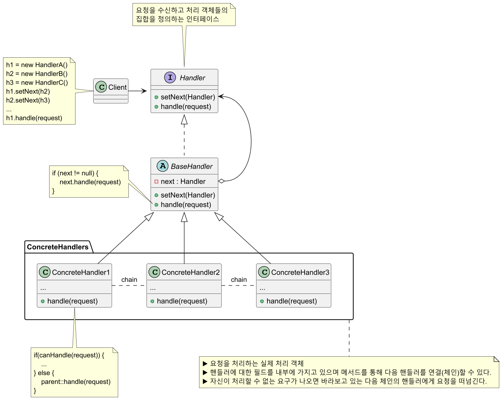
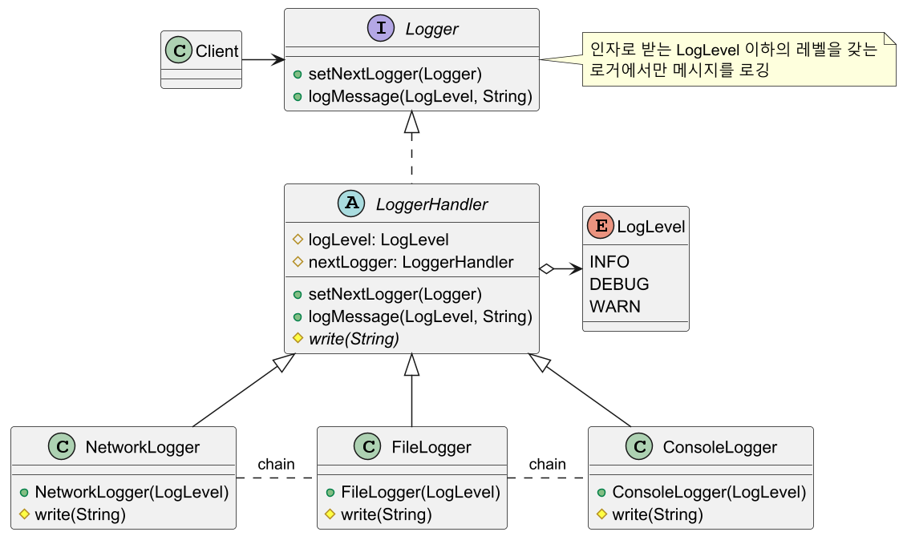
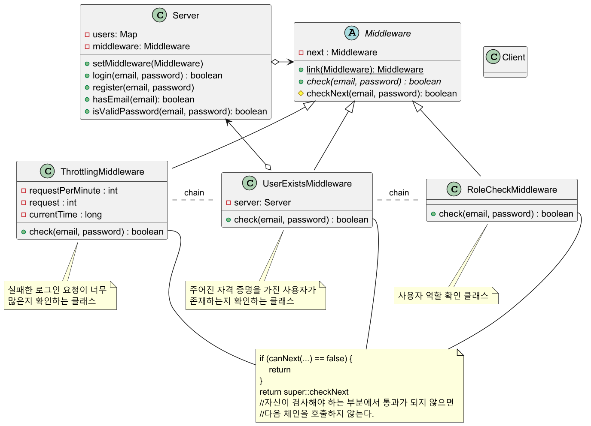

# 책임 연쇄 패턴

## 책임 연쇄 패턴 정의

핸들러들의 체인을 따라 요청을 전달할 수 있게 해주는 패턴으로,
각 핸들러는 요청을 받으면 요청을 처리할지 아니면 체인의 다음 핸들러로 전달할지를 결정한다.

## 책임 연쇄 패턴 구조



## 책임 연쇄 패턴 예제 코드 - 1



```java
public enum LogLevel {
    INFO, DEBUG, WARN
}
```
```java
public interface Logger {
    Logger setNextLogger(Logger nextLogger);
    void logMessage(LogLevel logLevel, String message);
}
```
```java
public abstract class LoggerHandler implements Logger {

    protected Logger nextLogger;
    protected LogLevel logLevel;

    @Override
    public Logger setNextLogger(Logger nextLogger) {
        this.nextLogger = nextLogger;
        return nextLogger;  //메서드 체인을 위해 다시 반환
    }

    @Override
    public void logMessage(LogLevel logLevel, String message) {
        
        if (this.logLevel.ordinal() <= logLevel.ordinal()) {
            write(message);
        }

        if (nextLogger != null) {
            nextLogger.logMessage(logLevel, message);
        }
    }

    protected abstract void write(String message);
}
```
```java
public class NetworkLogger extends LoggerHandler {

    public NetworkLogger(LogLevel logLevel) {
        this.logLevel = logLevel;
    }

    @Override
    protected void write(String message) {
        System.out.println("File::Logger: " + message);
    }
}
```
```java
public class FileLogger extends LoggerHandler {

    public FileLogger(LogLevel logLevel) {
        this.logLevel = logLevel;
    }

    @Override
    protected void write(String message) {
        System.out.println("File::Logger: " + message);
    }
}
```
```java
public class ConsoleLogger extends LoggerHandler {

    public ConsoleLogger(LogLevel logLevel) {
        this.logLevel = logLevel;
    }

    @Override
    protected void write(String message) {
        System.out.println("Console::Logger: " + message);
    }
}
```
```java
public class Client {

    public static void main(String[] args) {

        Logger loggerChain = getChainOfLoggers();
        //NetworkLogger(WARN) -> FileLogger(DEBUG) -> ConsoleLogger(INFO)

        loggerChain.logMessage(LogLevel.INFO, "This is an information");
        //Console::Logger: This is an information

        loggerChain.logMessage(LogLevel.DEBUG, "This is a debug level information");
        //File::Logger: This is a debug level information
        //Console::Logger: This is a debug level information

        loggerChain.logMessage(LogLevel.WARN, "This is a warning information");
        //Network::Logger: This is a warning information
        //File::Logger: This is a warning information
        //Console::Logger: This is a warning information
    }

    private static Logger getChainOfLoggers() {

        Logger networkLogger = new NetworkLogger(LogLevel.WARN);
        Logger fileLogger = new FileLogger(LogLevel.DEBUG);
        Logger consoleLogger = new ConsoleLogger(LogLevel.INFO);

        networkLogger.setNextLogger(fileLogger)
                     .setNextLogger(consoleLogger);

        return networkLogger;
    }
}
```

## 책임 연쇄 패턴 예제 코드 - 2



```java
public abstract class Middleware {

    private Middleware next;

    public static Middleware link(Middleware first, Middleware... chain) {

        Middleware head = first;

        //순서대로 체인 연결
        for (Middleware nextChain : chain) {
            head.next = nextChain;
            head = nextChain;
        }

        return first;
    }

    public abstract boolean check(String email, String password);

    protected boolean checkNext(String email, String password) {
        if (next != null) {
            return next.check(email, password);
        }
        return true;
    }
}
```
```java
public class ThrottlingMiddleware extends Middleware {

    private final int requestPerMinute;
    private int request;
    private long currentTime;

    public ThrottlingMiddleware(int requestPerMinute) {
        this.requestPerMinute = requestPerMinute;
        this.currentTime = System.currentTimeMillis();
    }

    @Override
    public boolean check(String email, String password) {

        //첫 요청으로부터 1분이 지나면 요청 수와 요청 시간 초기화
        if (System.currentTimeMillis() > currentTime + 60_000) {
            request = 0;
            currentTime = System.currentTimeMillis();
        }

        request++;

        //1분 내에 요청이 허용된 수를 초과하면 에러 메시지 출력 후 메인 스레드 종료
        if (request > requestPerMinute) {
            System.err.println("[Request limit exceeded!]");
            Thread.currentThread().stop();
        }

        return super.checkNext(email, password);
    }
}
```
```java
public class UserExistsMiddleware extends Middleware {

    private final Server server;

    public UserExistsMiddleware(Server server) {
        this.server = server;
    }

    @Override
    public boolean check(String email, String password) {

        if (!server.hasEmail(email)) {
            System.out.println("[This email is not registered!]");
            return false;
        }

        if (!server.isValidPassword(email, password)) {
            System.out.println("[Wrong password!]");
            return false;
        }

        return super.checkNext(email, password);
    }
}
```
```java
public class RoleCheckMiddleware extends Middleware {

    @Override
    public boolean check(String email, String password) {

        //admin 계정은 추가적인 검사를 건너뜀
        if (email.equals("admin@example.com")) {
            System.out.println("[Hello, admin!]");
            return true;
        }

        System.out.println("[Hello, user!]");

        return super.checkNext(email, password);
    }
}
```
```java
public class Server {

    private final Map<String, String> users = new HashMap<>();
    private Middleware middleware;

    public void setMiddleware(Middleware middleware) {
        this.middleware = middleware;
    }

    public boolean login(String email, String password) {
        if (middleware.check(email, password)) {
            System.out.println("[Authorization have been successful!]");

            //모든 검사가 성공적으로 수행되어 승인된 사용자에게 추가 로직 수행...

            return true;
        }

        return false;
    }

    public void register(String email, String password) {
        users.put(email, password);
    }

    public boolean hasEmail(String email) {
        return users.containsKey(email);
    }

    public boolean isValidPassword(String email, String password) {
        return users.get(email).equals(password);
    }
}
```
```java
public class Client {
    public static void main(String[] args) throws IOException {

        Server server = new Server();
        init(server);

        BufferedReader br = new BufferedReader(new InputStreamReader(System.in));

        boolean success;

        do {
            System.out.print("Enter email: ");
            String email = br.readLine();
            System.out.print("Input password: ");
            String password = br.readLine();

            success = server.login(email, password);
        } while (!success);
    }

    private static void init(Server server) {

        server.register("admin@example.com", "admin_pass");
        server.register("user@example.com", "user_pass");

        Middleware middleware = Middleware.link(
            new ThrottlingMiddleware(2), //1분에 최대 2번의 요청만 받을 수 있음
            new UserExistsMiddleware(server),
            new RoleCheckMiddleware()
        );
        //Throttling -> UserExists -> RoleCheck

        server.setMiddleware(middleware);
    }
}
```
```text
Enter email: admin@example.com
Input password: admin_pass
[Hello, admin!]
[Authorization have been successful!]

---------------------------------------

Enter email: admin@example.com
Input password: wrong_pass
[Wrong password!]

Enter email: wrong@example.com
Input password: wrong_pass
[This email is not registered!]

Enter email: wrong@example.com
Input password: wrong_pass
[Request limit exceeded!]
```

## 책임 연쇄 패턴 장단점

### 책임 연쇄 패턴 장점

- 클라이언트는 처리 객체의 체인 집합 내부 구조를 알 필요가 없다.
- 각각의 체인은 자신이 해야하는 일만 하기 때문에 새로운 요청에 대한 처리객체 생성이 편리해진다.
- 클라이언트 코드를 변경하지 않고 핸들러를 체인에 동적으로 추가하거나 처리 순서를 변경하거나
삭제할 수 있어 유연해진다.(**OCP** 준수)
- 작업을 호출하는 클래스와 작업을 수행하는 클래스를 분리할 수 있다.(**SRP** 준수)

### 책임 연쇄 패턴 단점

- 실행 시에 코드의 흐름이 많아져서 디버깅 및 테스트가 쉽지 않다.
- 잘못 설계한 경우 집합 내부에서 무한 사이클이 발생할 수 있다.
- 요청이 반드시 수행된다는 보장이 없다. 체인 끝까지 갔는데도 처리되지 않을 수 있다.

## 실전에서 사용되는 책임 연쇄 패턴

- `java.util.logging.Logger.log()`
- `javax.servlet.Filter.doFilter()`

---

### 참고

- [참고 블로그](https://inpa.tistory.com/entry/GOF-%F0%9F%92%A0-Chain-Of-Responsibility-%ED%8C%A8%ED%84%B4-%EC%99%84%EB%B2%BD-%EB%A7%88%EC%8A%A4%ED%84%B0%ED%95%98%EA%B8%B0)
- [참고 사이트](https://refactoring.guru/ko/design-patterns/chain-of-responsibility)
- [참고 강의](https://www.inflearn.com/course/%EA%B0%9D%EC%B2%B4%EC%A7%80%ED%96%A5-%EB%94%94%EC%9E%90%EC%9D%B8-%ED%8C%A8%ED%84%B4-%EC%96%84%EC%BD%94/dashboard)
- [참고 책](https://www.yes24.com/Product/Goods/108192370)