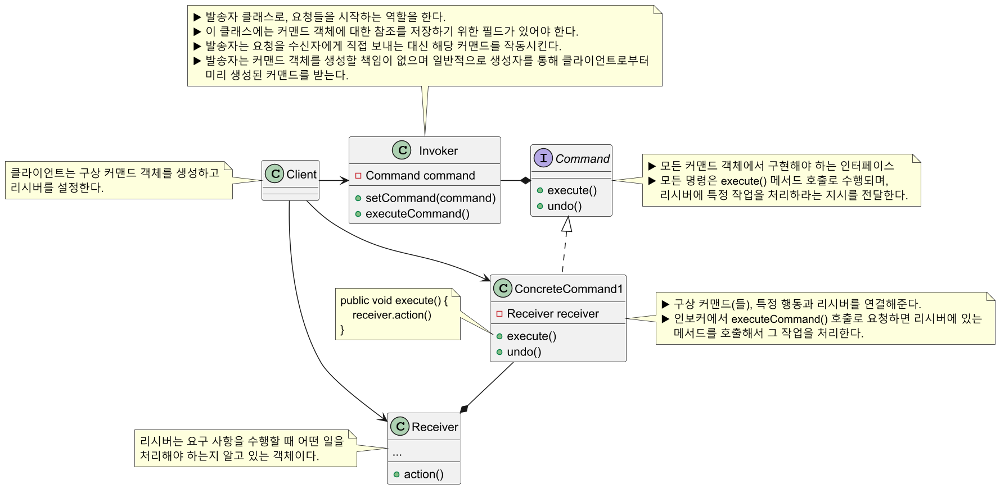
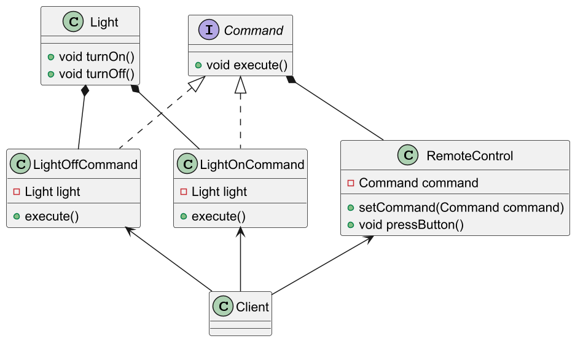
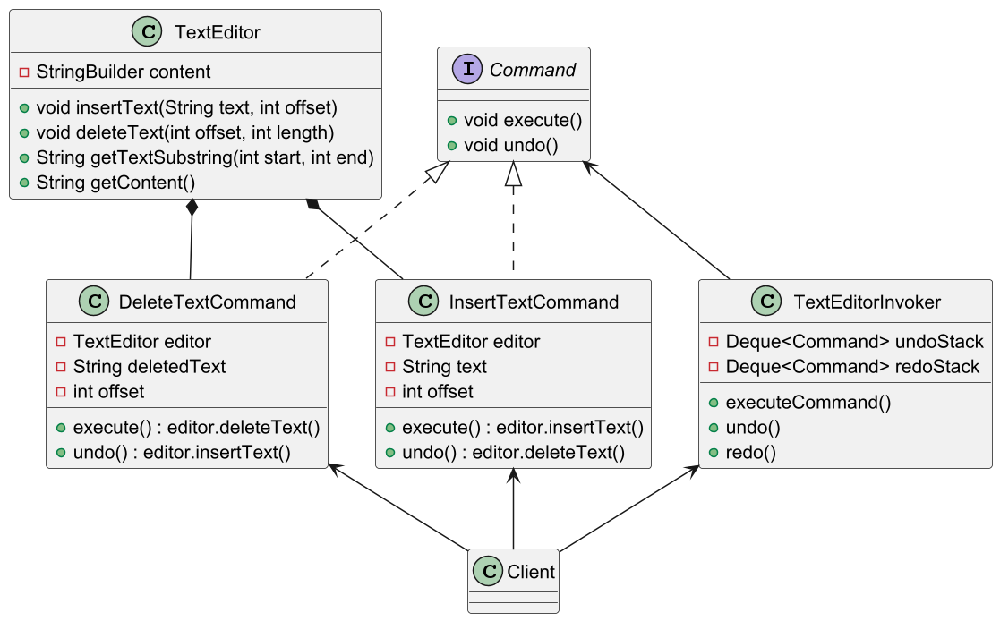

# 커맨드 패턴

## 커맨드 패턴 정의

**명령(Command)** 을 객체로 캡슐화하고, 이를 전달하는 **호출자**와 명령을 처리하는
**수행자**로 클래스를 분리하는 패턴

요청 내역을 객체로 캡슐화해서 객체를 서로 다른 요청 내역에 따라 매개변수화할 수 있다.
이러면 요청을 큐에 저장하거나 로그로 기록하거나 작업 취소 기능을 사용할 수 있다.

## 커맨드 패턴 구조



## 커맨드 패턴 예제 코드 - 1



```java
//Command
public interface Command {
    void execute();
}
```

```java
//Concrete Command
public class LightOnCommand implements Command {

    private final Light light;

    public LightOnCommand(Light light) {
        this.light = light;
    }

    @Override
    public void execute() {
        light.turnOn();
    }
}
```

```java
//Concrete Command
public class LightOffCommand implements Command {

    private final Light light;

    public LightOffCommand(Light light) {
        this.light = light;
    }

    @Override
    public void execute() {
        light.turnOff();
    }
}
```

```java
//Invoker
public class RemoteControl {

    private Command command;

    public void setCommand(Command command) {
        this.command = command;
    }

    public void pressButton() {
        command.execute();
    }
}
```

```java
//Client
public class Client {
    public static void main(String[] args) {

        Light light = new Light();  //Receiver

        //Concrete Commands
        LightOnCommand lightOnCommand = new LightOnCommand(light);
        LightOffCommand lightOffCommand = new LightOffCommand(light);

        RemoteControl remote = new RemoteControl(); //Invoker

        remote.setCommand(lightOnCommand);
        remote.pressButton();   //Light is ON

        remote.setCommand(lightOffCommand);
        remote.pressButton();   //Light if OFF
    }
}
```

## 커맨드 패턴 예제 코드 - 2



```java
//Command
public interface Command {
    void execute();
    void undo();
}
```

```java
//Receiver
public class TextEditor {

    private final StringBuilder content;

    public TextEditor() {
        this.content = new StringBuilder();
    }

    public void insertText(String text, int offset) {
        content.insert(offset, text);
    }

    public void deleteText(int offset, int length) {
        content.delete(offset, offset + length);
    }

    public String getTextSubstring(int start, int end) {
        return content.substring(start, end);
    }

    public String getContent() {
        return content.toString();
    }
}
```

```java
//Concrete Command
public class InsertTextCommand implements Command {

    private final TextEditor editor;
    private final String text;
    private final int offset;

    public InsertTextCommand(TextEditor editor, String text, int offset) {
        this.editor = editor;
        this.text = text;
        this.offset = offset;
    }

    @Override
    public void execute() {
        editor.insertText(text, offset);
    }

    @Override
    public void undo() {
        editor.deleteText(offset, text.length());
    }
}
```

```java
//Concrete Command
public class DeleteTextCommand implements Command {

    private final TextEditor editor;
    private final String deletedText;
    private final int offset;

    public DeleteTextCommand(TextEditor editor, int offset, int length) {
        this.editor = editor;
        this.offset = offset;
        this.deletedText = editor.getTextSubstring(offset, offset + length);
    }

    @Override
    public void execute() {
        editor.deleteText(offset, deletedText.length());
    }

    @Override
    public void undo() {
        editor.insertText(deletedText, offset);
    }
}
```

```java
//Invoker
public class TextEditorInvoker {

    private final Deque<Command> undoStack = new ArrayDeque<>(); //실행 취소 스택
    private final Deque<Command> redoStack = new ArrayDeque<>(); //다시 실행 스택

    //새 커맨드 실행
    public void executeCommand(Command command) {
        command.execute();          //커맨드를 실행
        undoStack.push(command);    //실행 취소할 수 있도록 실행 취소 스택에 추가
        redoStack.clear();          //다시 실행은 실행 취소 직후에만 할 수 있는 것이므로 다시 실행 스택은 비워준다.
    }

    //실행 취소(뒤로 가기)
    public void undo() {
        if (undoStack.isEmpty()) return;

        Command command = undoStack.pop();  //최근에 실행된 커맨드
        command.undo();                     //해당 커맨드 실행 취소
        redoStack.push(command);            //다시 실행 스택에 추가
    }

    //다시 실행(앞으로 가기)
    public void redo() {
        if (redoStack.isEmpty()) return;

        Command command = redoStack.pop();  //최근에 취소된 커맨드
        command.execute();                  //해당 커맨드 다시 실행
        undoStack.push(command);            //실행 취소 스택에 추가
    }
}
```

```java
//Client
public class Client {
    public static void main(String[] args) {

        TextEditor editor = new TextEditor(); //Receiver
        TextEditorInvoker invoker = new TextEditorInvoker(); //Invoker

        //Concrete Command
        Command insertHello = new InsertTextCommand(editor, "Hello, ", 0);
        Command insertWorld = new InsertTextCommand(editor, "World!", 7);

        invoker.executeCommand(insertHello); //Hello,
        invoker.executeCommand(insertWorld); //Hello, World!

        System.out.println("Current text: " + editor.getContent()); //Hello, World!

        invoker.undo(); //실행 취소(뒤로 가기)
        System.out.println("After undo: " + editor.getContent()); //Hello,

        invoker.redo(); //다시 실행(앞으로 가기)
        System.out.println("After redo: " + editor.getContent()); //Hello, World!

        //Concrete Command
        Command deleteCommand = new DeleteTextCommand(editor, 0, 7);
        invoker.executeCommand(deleteCommand); //World!

        System.out.println("After delete: " + editor.getContent()); //World!

        invoker.undo(); //실행 취소(뒤로 가기)
        System.out.println("Final text: " + editor.getContent()); //Hello, World!
    }
}
```

## 커맨드 패턴 장단점

### 커맨드 패턴 장점

- 작업을 호출하는 클래스들을 작업을 수행하는 클래스들로부터 분리할 수 있다.(**SRP** 준수)
- 기존 클라이언트 코드를 수정하지 않고 새 커맨드를 도입할 수 있다.(**OCP** 준수)
- 실행 취소 / 다시 실행을 구현할 수 있다.
- 간단한 커맨드들의 집합을 복잡한 커맨드로 조합할 수 있다.

### 커맨드 패턴 단점

- 발송자(`Invoker`)와 수신자(`Receiver`) 사이에 완전히 새로운 레이어를 도입하기 때문에 코드가 복잡해질 수 있다.

## 실전에서 사용되는 커맨드 패턴

- `java.lang.Runnable`의 모든 구현
- `javax.swing.Action`의 모든 구현

---

### 참고

- [참고 사이트](https://refactoring.guru/ko/design-patterns/command)
- [참고 강의](https://www.inflearn.com/course/%EA%B0%9D%EC%B2%B4%EC%A7%80%ED%96%A5-%EB%94%94%EC%9E%90%EC%9D%B8-%ED%8C%A8%ED%84%B4-%EC%96%84%EC%BD%94/dashboard)
- [참고 책](https://www.yes24.com/Product/Goods/108192370)