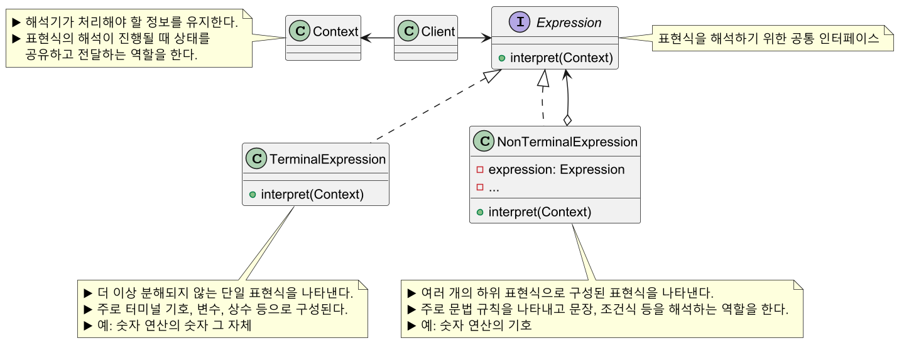
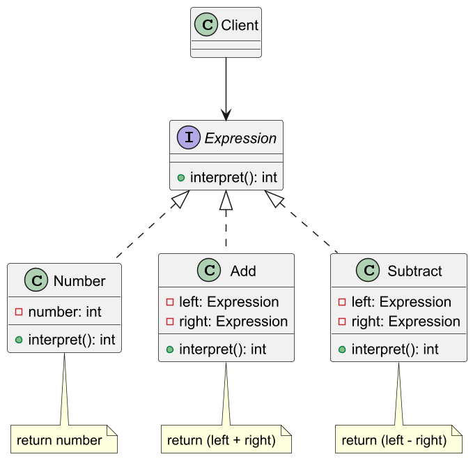
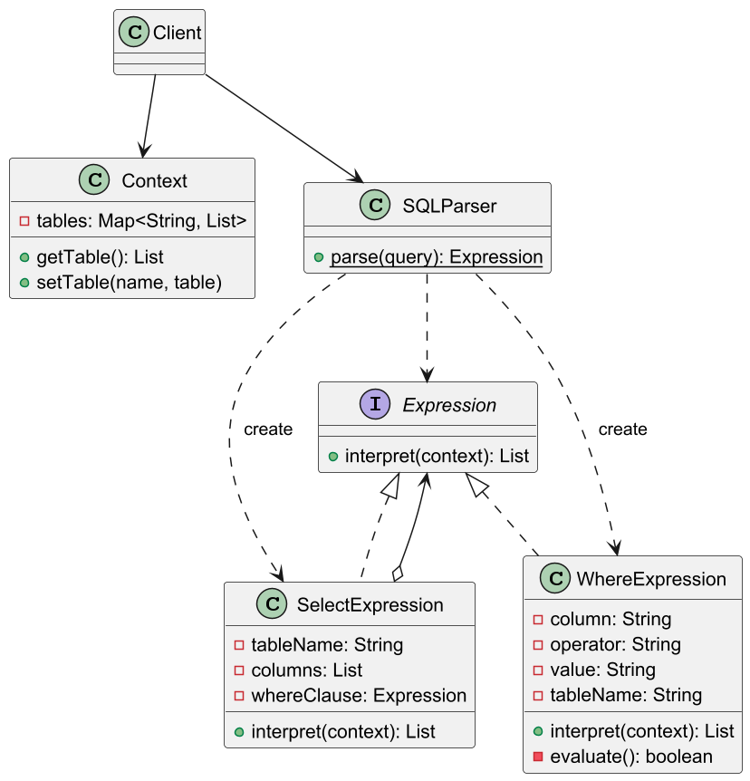

# 인터프리터 패턴

## 인터프리터 패턴 정의

문법과 구문을 번역하는 인터프리터 클래스를 기반으로 간단한 언어를 정의한다.
언어에 속하는 규칙을 나타내는 클래스를 사용해서 언어를 표현한다.

즉 인터프리터 패턴의 목적은 자주 사용되는 특정한 문법적 규칙이 존재한다면, 이를 일련의 규칙을 통해
언어/문법으로 규격화하여 해석하는 목적을 가진다.

## 인터프리터 패턴 구조



## 인터프리터 패턴 예제 코드 - 1



```java
public interface Expression {
    int interpret();
}
```
```java
public class Number implements Expression {

    private final int number;

    public Number(int number) {
        this.number = number;
    }

    @Override
    public int interpret() {
        return this.number;
    }
}
```
```java
public class Add implements Expression {

    private final Expression left;
    private final Expression right;

    public Add(Expression left, Expression right) {
        this.left = left;
        this.right = right;
    }

    @Override
    public int interpret() {
        return left.interpret() + right.interpret();
    }
}
```
```java
public class Subtract implements Expression {

    private final Expression left;
    private final Expression right;

    public Subtract(Expression left, Expression right) {
        this.left = left;
        this.right = right;
    }

    @Override
    public int interpret() {
        return left.interpret() - right.interpret();
    }
}
```
```java
public class Client {
    public static void main(String[] args) {

        Expression five = new Number(5);
        Expression two = new Number(2);
        Expression three = new Number(3);

        Expression add = new Add(five, two);
        Expression sub = new Subtract(add, three);

        System.out.println("5 + 2 - 3 = " + sub.interpret());
        //5 + 2 - 3 = 4
    }
}
```

## 인터프리터 패턴 예제 코드 - 2



```java
public class Context {

    private final Map<String, List<Map<String, String>>> tables = new HashMap<>();

    public List<Map<String, String>> getTable(String name) {
        return tables.get(name);
    }

    public void setTable(String name, List<Map<String, String>> table) {
        tables.put(name, table);
    }
}
```
```java
public interface Expression {
    List<Map<String, String>> interpret(Context context);
}
```
```java
public class SelectExpression implements Expression {

    private final String tableName;         //조회 대상 테이블명
    private final List<String> columns;     //조회 대상 컬럼
    private final Expression whereClause;   //WHERE 절

    public SelectExpression(String tableName, List<String> columns, Expression whereClause) {
        this.tableName = tableName;
        this.columns = columns;
        this.whereClause = whereClause;
    }

    @Override
    public List<Map<String, String>> interpret(Context context) {

        List<Map<String, String>> table = context.getTable(tableName); //조회할 테이블
        List<Map<String, String>> result = new ArrayList<>();

        for (Map<String, String> row : table) {

            //임시 context
            Context rowContext = new Context();
            rowContext.setTable(tableName, List.of(row));

            //where 절이 없거나 조건에 맞는 데이터가 검색이 되었을 때만
            if (whereClause == null || !whereClause.interpret(rowContext).isEmpty()) {

                Map<String, String> newRow = new HashMap<>();

                for (String column : columns) {
                    if (column.equals("*")) { //asterisk
                        newRow.putAll(row);
                    } else {
                        newRow.put(column, row.get(column));
                    }
                }

                result.add(newRow);
            }
        }

        return result;
    }
}
```
```java
public class WhereExpression implements Expression {

    private final String column;    //연산 대상 컬럼        
    private final String operator;  //연산자
    private final String value;     //비교값
    private final String tableName; //조회할 테이블 대상    

    public WhereExpression(String tableName, String column, String operator, String value) {
        this.tableName = tableName;
        this.column = column;
        this.operator = operator;
        this.value = value;
    }

    @Override
    public List<Map<String, String>> interpret(Context context) {

        List<Map<String, String>> result = new ArrayList<>();
        List<Map<String, String>> table = context.getTable(tableName);

        for (Map<String, String> row : table) {
            if (evaluate(row.get(column), operator, value)) {
                result.add(row);
            }
        }

        return result;
    }

    private boolean evaluate(String columnValue, String operator, String value) {
        return switch (operator) {
            case "=" -> columnValue.equals(value);
            case ">" -> Integer.parseInt(columnValue) > Integer.parseInt(value);
            case "<" -> Integer.parseInt(columnValue) < Integer.parseInt(value);
            default -> false;
        };
    }
}
```
```java
public class SQLParser {

    public static Expression parse(String query) {

        //공백(\\s)으로 구분
        String[] parts = query.split("\\s+");

        if (!parts[0].equalsIgnoreCase("SELECT")) {
            throw new RuntimeException();
        }

        //조회 컬럼들
        List<String> columns = List.of(parts[1].split(","));
        //테이블명
        String tableName = parts[3];

        Expression whereClause = getWhereClause(parts, tableName);

        return new SelectExpression(tableName, columns, whereClause);
    }

    private static Expression getWhereClause(String[] parts, String tableName) {

        //where절이 있을 때만
        if (parts.length > 4 && parts[4].equalsIgnoreCase("WHERE")) {
            return new WhereExpression(tableName, parts[5], parts[6], parts[7]);
        }

        return null;
    }
}
```
```java
public class Client {
    public static void main(String[] args) {

        Context context = new Context();
        init(context);
        /*
         * Table: users
         * +----+------+-----+
         * | id | name | age |
         * +----+------+-----+
         * | 1  | John | 30  |
         * | 2  | Jane | 25  |
         * +----+------+-----+
         */

        printResult("SELECT * FROM users", context);
        /*
         * Result of query: SELECT * FROM users
         * {name=John, id=1, age=30}
         * {name=Jane, id=2, age=25}
         */

        printResult("SELECT name,age FROM users WHERE age > 27", context);
        /*
         * Result of query: SELECT name,age FROM users WHERE age > 27
         * {name=John, age=30}
         */
    }

    public static void printResult(String query, Context context) {

        Expression expr = SQLParser.parse(query);
        List<Map<String, String>> result = expr.interpret(context);

        System.out.println("Result of query: " + query);
        for (Map<String, String> row : result) {
            System.out.println(row);
        }
    }

    public static void init(Context context) {

        List<Map<String, String>> users = List.of(
            Map.ofEntries(
                Map.entry("id", "1"),
                Map.entry("name", "John"),
                Map.entry("age", "30")
            ),
            Map.ofEntries(
                Map.entry("id", "2"),
                Map.entry("name", "Jane"),
                Map.entry("age", "25")
            )
        );

        context.setTable("users", users);
    }
}
```

## 인터프리터 패턴 장단점

### 인터프리터 패턴 장점

- 문법과 해석을 별도의 클래스로 캡슐화할 수 있다.
- `Expression` 인터페이스를 구현한 클래스를 새로 추가하여 쉽게 확장할 수 있다.
- 문법과 규칙을 계층구조로 명시적으로 모델링하여 코드의 가독성이 높아진다.

### 인터프리터 패턴 단점

- 클래스 수가 많아져 코드가 복잡해진다.
- 규모가 크거나 복잡한 표현식의 경우 재귀나 객체 생성 과정에서 오버헤드가 발생한다.
- 인터프리터 패턴만으로는 에러 핸들링, 최적화와 같은 측면을 처리하기 어려울 수 있다.
- 문법이 너무 자주 진화하는 경우 유지보수 비용이 더 들수 있다.

## 실전에서 사용되는 인터프리터 패턴

- 자바 정규표현식(`Pattern` 클래스 등)
- 스프링 SpEL

---

### 참고

- [참고 블로그](https://jake-seo-dev.tistory.com/508)
- [참고 강의](https://www.inflearn.com/course/%EA%B0%9D%EC%B2%B4%EC%A7%80%ED%96%A5-%EB%94%94%EC%9E%90%EC%9D%B8-%ED%8C%A8%ED%84%B4-%EC%96%84%EC%BD%94/dashboard)
- [참고 책](https://www.yes24.com/Product/Goods/108192370)