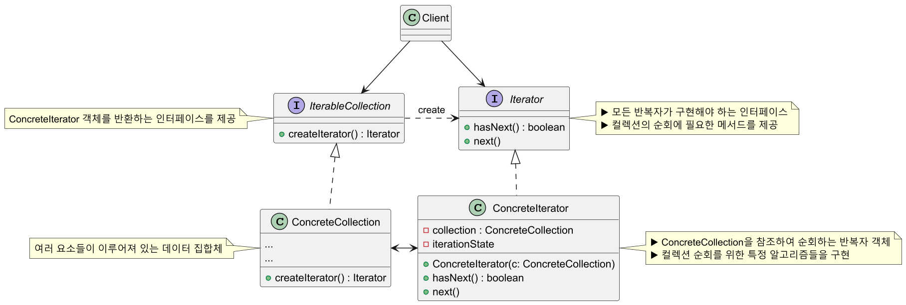
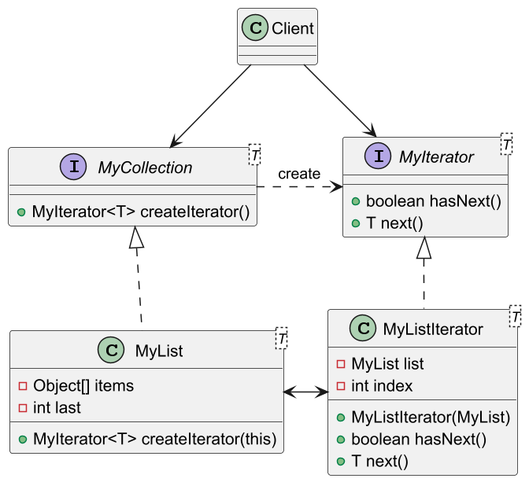
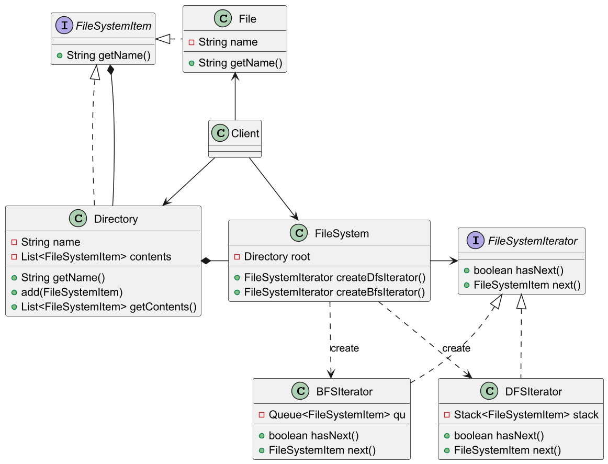
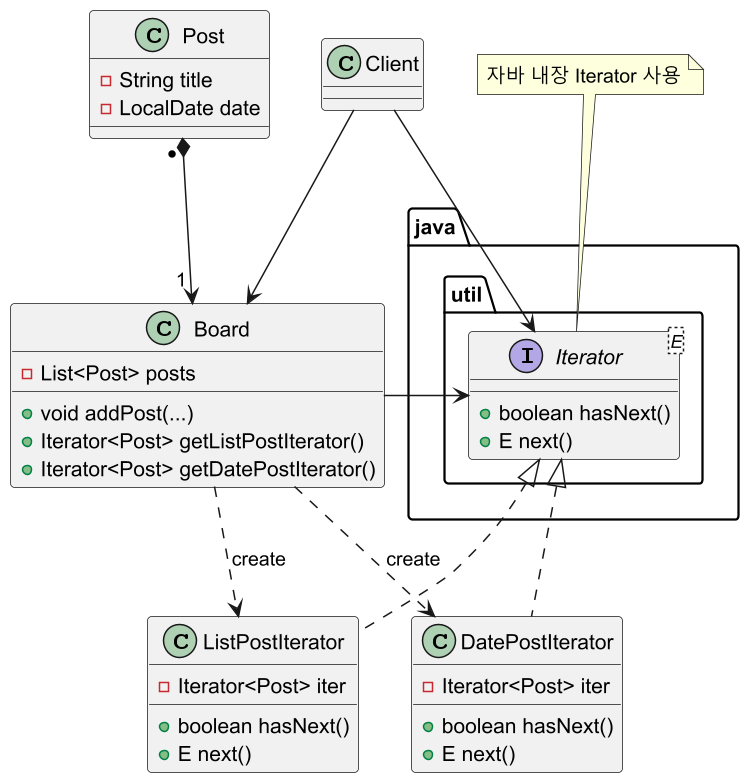

# 반복자 패턴

## 반복자 패턴 정의

컬렉션의 구현 방법을 노출하지 않으면서 집합체 내의 모든 항목에 접근하는 방법을 제공한다.

## 반복자 패턴 구조



## 반복자 패턴 예제 코드 - 1



```java
//Iterable Collection
public interface MyCollection<T> {
    MyIterator<T> createIterator();
}
```
```java
//Concrete Collection
public class MyList<T> implements MyCollection<T> {

    private final Object[] items;
    private int last = 0;

    public MyList(int size) {
        this.items = new Object[size];
    }

    public void add(T item) {
        if (last >= items.length) {
            throw new ArrayIndexOutOfBoundsException();
        }

        items[last++] = item;
    }

    @SuppressWarnings("unchecked")
    public T get(int index) {
        if (index < 0 || index >= items.length) {
            throw new ArrayIndexOutOfBoundsException();
        }
        return (T) items[index];
    }

    public int size() {
        return last;
    }

    //Iterator가 컬렉션을 참조할 수 있도록 컬렉션 자신을 전달
    @Override
    public MyIterator<T> createIterator() {
        return new MyListIterator<>(this);
    }
}
```
```java
//Iterator
public interface MyIterator<T> {
    boolean hasNext();
    T next();
}
```
```java
//Concrete Iterator
public class MyListIterator<T> implements MyIterator<T> {

    private final MyList<T> list;
    private int index;

    public MyListIterator(MyList<T> list) {
        this.list = list;
        this.index = 0;
    }

    @Override
    public boolean hasNext() {
        return index < list.size();
    }

    @Override
    public T next() {
        if (hasNext()) {
            return list.get(index++);
        }
        return null;
    }
}
```
```java
//Client
public class Client {
    public static void main(String[] args) {

        MyList<Integer> list = new MyList<>(3);
        list.add(1);
        list.add(2);
        list.add(3);
        //list.add(4);    //ArrayIndexOutOfBoundsException

        print(list.createIterator());
    }

    public static void print(MyIterator<Integer> iterator) {
        while (iterator.hasNext()) {
            System.out.println(iterator.next());
        }
    }
}
```

## 반복자 패턴 예제 코드 - 2



```java
//Item Interface
public interface FileSystemItem {
    String getName();
}
```
```java
//Concrete Item(File)
public class File implements FileSystemItem {

    private final String name;

    public File(String name) {
        this.name = name;
    }

    @Override
    public String getName() {
        return name;
    }
}
```
```java
//Concrete Item(Directory)
public class Directory implements FileSystemItem {

    private final String name;
    private final List<FileSystemItem> contents = new ArrayList<>();

    public Directory(String name) {
        this.name = name;
    }

    public void add(FileSystemItem item) {
        contents.add(item);
    }

    public List<FileSystemItem> getContents() {
        return contents;
    }

    @Override
    public String getName() {
        return name;
    }
}
```
```java
//Iterator
public interface FileSystemIterator {
    boolean hasNext();
    FileSystemItem next();
}
```
```java
//Concrete Iterator
public class BFSIterator implements FileSystemIterator {

    private final Queue<FileSystemItem> qu = new ArrayDeque<>();

    public BFSIterator(Directory root) {
        qu.offer(root);
    }

    @Override
    public boolean hasNext() {
        return !qu.isEmpty();
    }

    @Override
    public FileSystemItem next() {
        if (!hasNext()) {
            throw new NoSuchElementException();
        }

        FileSystemItem current = qu.poll();

        if (current instanceof Directory) {
            qu.addAll(((Directory) current).getContents());
        }

        return current;
    }
}
```
```java
//Concrete Iterator
public class DFSIterator implements FileSystemIterator {

    private final Deque<FileSystemItem> stack = new ArrayDeque<>();

    public DFSIterator(Directory root) {
        stack.push(root);
    }

    @Override
    public boolean hasNext() {
        return !stack.isEmpty();
    }

    @Override
    public FileSystemItem next() {
        if (!hasNext()) {
            throw new NoSuchElementException();
        }

        FileSystemItem current = stack.pop();

        if (current instanceof Directory) {
            List<FileSystemItem> contents = ((Directory) current).getContents();
            for (int i = contents.size() - 1; i >= 0; i--) {
                stack.push(contents.get(i));
            }
        }

        return current;
    }
}
```
```java
//Iterator 생성 팩토리 클래스
public class FileSystem {

    private final Directory root;

    public FileSystem(Directory root) {
        this.root = root;
    }

    public FileSystemIterator createDfsIterator() {
        return new DFSIterator(root);
    }

    public FileSystemIterator createBfsIterator() {
        return new BFSIterator(root);
    }
}
```
```java
//Client
public class Client {
    public static void main(String[] args) {

        Directory root = new Directory("root");
        Directory home = new Directory("home");
        Directory user = new Directory("user");

        File file1 = new File("file1.txt");
        File file2 = new File("file2.txt");
        File file3 = new File("file3.txt");

        root.add(home);
        home.add(user);
        user.add(file1);
        user.add(file2);
        home.add(file3);

        FileSystem fileSystem = new FileSystem(root);

        /*
         * root
         *  ↳ home
         *     ↳ user
         *        ↳ file1.txt
         *        ↳ file2.txt
         *     ↳  file3.txt
         */

        print(fileSystem.createDfsIterator());
        //Output
        //root
        //home
        //user
        //file1.txt
        //file2.txt
        //file3.txt

        print(fileSystem.createBfsIterator());
        //Output
        //root
        //home
        //user
        //file3.txt
        //file1.txt
        //file2.txt
    }

    public static void print(FileSystemIterator iterator) {
        while (iterator.hasNext()) {
            System.out.println(iterator.next().getName());
        }
    }
}
```

## 반복자 패턴 예제 코드 - 3



```java
public class Post {

    private final String title;
    private final LocalDate date;

    public Post(String title, LocalDate date) {
        this.title = title;
        this.date = date;
    }

    public String getTitle() {
        return title;
    }

    public LocalDate getDate() {
        return date;
    }
}
```
```java
public class ListPostIterator implements Iterator<Post> {

    private final Iterator<Post> iter;

    public ListPostIterator(List<Post> posts) {
        iter = posts.iterator();
    }

    @Override
    public boolean hasNext() {
        return iter.hasNext(); //Arrays.ArrayItr에 위임
    }

    @Override
    public Post next() {
        return iter.next(); //Arrays.ArrayItr에 위임
    }
}
```
```java
public class DatePostIterator implements Iterator<Post> {

    private final Iterator<Post> iter;

    public DatePostIterator(List<Post> posts) {
        posts.sort((p1, p2) -> p2.getDate().compareTo(p1.getDate()));
        iter = posts.iterator();
    }

    @Override
    public boolean hasNext() {
        return iter.hasNext(); //Arrays.ArrayItr에 위임
    }

    @Override
    public Post next() {
        return iter.next(); //Arrays.ArrayItr에 위임
    }
}
```
```java
public class Board {

    private final List<Post> posts = new ArrayList<>();

    public void addPost(String title, LocalDate date) {
        posts.add(new Post(title, date));
    }

    public Iterator<Post> getListPostIterator() {
        return new ListPostIterator(posts);
    }

    public Iterator<Post> getDatePostIterator() {
        return new DatePostIterator(posts);
    }
}
```
```java
public class Client {
    public static void main(String[] args) {

        Board board = new Board();

        board.addPost("디자인 패턴 강의 리뷰", LocalDate.of(2021, 1, 30));
        board.addPost("게임 하실분", LocalDate.of(2022, 2, 6));
        board.addPost("이거 어떻게 하나요?(1)", LocalDate.of(2023, 6, 1));
        board.addPost("이거 어떻게 하나요?(2)", LocalDate.of(2024, 12, 22));

        //게시글 발행 순서 조회
        print(board.getListPostIterator());
        //Output
        //디자인 패턴 강의 리뷰 / 2021-01-30
        //게임 하실분 / 2022-02-06
        //이거 어떻게 하나요?(1) / 2023-06-01
        //이거 어떻게 하나요?(2) / 2024-12-22

        //최근 발행 게시글 순서 조회
        print(board.getDatePostIterator());
        //Output
        //이거 어떻게 하나요?(2) / 2024-12-22
        //이거 어떻게 하나요?(1) / 2023-06-01
        //게임 하실분 / 2022-02-06
        //디자인 패턴 강의 리뷰 / 2021-01-30
    }

    public static void print(Iterator<Post> iterator) {
        while(iterator.hasNext()) {
            Post post = iterator.next();
            System.out.println(post.getTitle() + " / " + post.getDate());
        }
    }
}
```

## 반복자 패턴 장단점

### 반복자 패턴 장점

- 일관된 반복자 인터페이스(`Iterator`)를 사용해 여러 형태의 컬렉션에 대해
동일한 순회 방법을 제공한다.
- 클라이언트는 컬렉션의 내부 구조 및 순회 방식을 알지 않아도 된다.
- 집합체의 구현과 접근하는 처리 부분을 반복자 객체로 분리해 결합도를 줄일 수 있다.
- 순회 알고리즘을 별도의 반복자 객체에 추출하여 각 클래스의 책임을 분리할 수 있다.(**SRP** 준수)
- 데이터 저장 컬렉션 종류가 변경되어도 클라이언트 구현 코드는 수정할 필요 없다.(**OCP** 준수)

### 반복자 패턴 단점

- 클래스가 늘어나고 복잡도가 증가한다.
- 구현 방법에 따라 캡슐화를 위배할 수 있다.
- 반복자를 사용하는 것이 직접 탐색하는 것보다 덜 효율적일 수 있다.

## 실전에서 사용되는 반복자 패턴

- `java.util.Iterator`, `java.util.Enumeration`
- `java.util.Scanner`

---

### 참고

- [참고 블로그](https://inpa.tistory.com/entry/GOF-%F0%9F%92%A0-%EB%B0%98%EB%B3%B5%EC%9E%90Iterator-%ED%8C%A8%ED%84%B4-%EC%99%84%EB%B2%BD-%EB%A7%88%EC%8A%A4%ED%84%B0%ED%95%98%EA%B8%B0)
- [참고 사이트](https://refactoring.guru/ko/design-patterns/iterator)
- [참고 강의](https://www.inflearn.com/course/%EA%B0%9D%EC%B2%B4%EC%A7%80%ED%96%A5-%EB%94%94%EC%9E%90%EC%9D%B8-%ED%8C%A8%ED%84%B4-%EC%96%84%EC%BD%94/dashboard)
- [참고 책](https://www.yes24.com/Product/Goods/108192370)