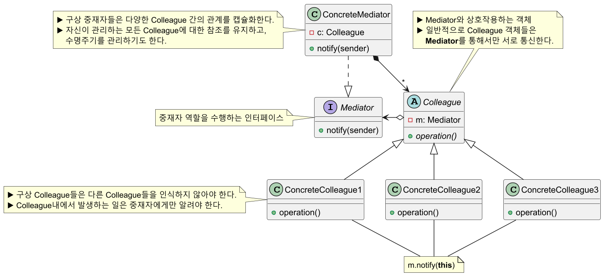
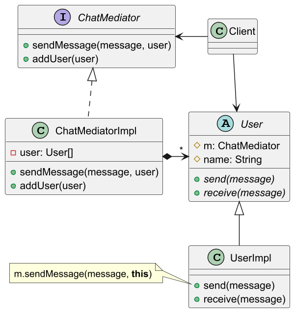
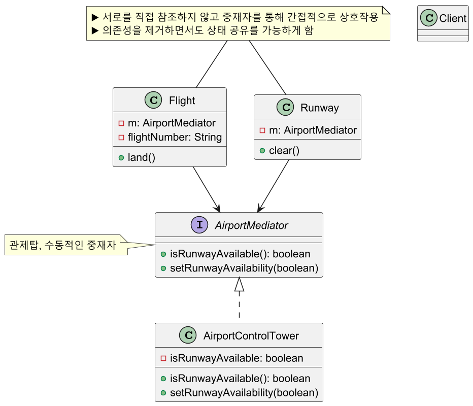

# 중재자 패턴

## 중재자 패턴 정의

객체 간의 복잡한 의존 관계들을 줄일 수 있는 패턴으로, 객체 간의 직접 통신을 제한하고 중재자 객체를 통해서만 협력하도록 한다.

## 중재자 패턴 구조



## 중재자 패턴 예제 코드 - 1



```java
public interface ChatMediator {
    void sendMessage(String message, User user);
    void addUser(User user);
}
```
```java
public class ChatMediatorImpl implements ChatMediator {

    private final List<User> users;

    public ChatMediatorImpl() {
        this.users = new ArrayList<>();
    }

    @Override
    public void sendMessage(String message, User user) {
        users.stream()
             .filter(u -> u != user) //발신자를 제외한 나머지 사용자에게 수신을 알림
             .forEach(u -> u.receive(message));
    }

    @Override
    public void addUser(User user) {
        users.add(user);
    }
}
```
```java
public abstract class User {

    protected ChatMediator mediator;
    protected String name;

    public User(ChatMediator mediator, String name) {
        this.mediator = mediator;
        this.name = name;
    }

    public abstract void send(String message);
    public abstract void receive(String message);
}
```
```java
public class UserImpl extends User {

    public UserImpl(ChatMediator mediator, String name) {
        super(mediator, name);
    }

    @Override
    public void send(String message) {
        System.out.println(this.name + " Sending Message: " + message);
        mediator.sendMessage(message, this);
    }

    @Override
    public void receive(String message) {
        System.out.println(this.name + " Received Message: " + message);
    }
}
```
```java
public class Client {
    public static void main(String[] args) {

        ChatMediator mediator = new ChatMediatorImpl();

        User john = new UserImpl(mediator, "John");
        User jane = new UserImpl(mediator, "Jane");
        User bob = new UserImpl(mediator, "Bob");
        User alice = new UserImpl(mediator, "Alice");

        mediator.addUser(john);
        mediator.addUser(jane);
        mediator.addUser(bob);
        mediator.addUser(alice);

        john.send("Hello, everyone");
        /*
         * John Sending Message: Hello, everyone
         * Jane Received Message: Hello, everyone
         * Bob Received Message: Hello, everyone
         * Alice Received Message: Hello, everyone
         */

        bob.send("I'm fine thank you, and you?");
        /*
         * Bob Sending Message: I'm fine thank you, and you?
         * John Received Message: I'm fine thank you, and you?
         * Jane Received Message: I'm fine thank you, and you?
         * Alice Received Message: I'm fine thank you, and you?
         */
    }
}
```

## 중재자 패턴 예제 코드 - 2



```java
public interface AirportMediator {
    boolean isRunwayAvailable();
    void setRunwayAvailability(boolean status);
}
```
```java
public class AirportControlTower implements AirportMediator {

    private boolean isRunwayAvailable = true;

    @Override
    public boolean isRunwayAvailable() {
        return isRunwayAvailable;
    }

    @Override
    public void setRunwayAvailability(boolean status) {
        isRunwayAvailable = status;
    }
}
```
```java
public class Flight {

    private final AirportMediator mediator;
    private final String flightNumber;

    public Flight(AirportMediator mediator, String flightNumber) {
        this.mediator = mediator;
        this.flightNumber = flightNumber;
    }

    public void land() {
        if (mediator.isRunwayAvailable()) {
            System.out.println("Flight " + flightNumber + " is landing.");
            mediator.setRunwayAvailability(false);
        } else {
            System.out.println("Flight " + flightNumber + " is waiting to land.");
        }
    }
}
```
```java
public class Runway {

    private final AirportMediator mediator;

    public Runway(AirportMediator mediator) {
        this.mediator = mediator;
    }

    public void clear() {
        System.out.println("Runway is clear.");
        mediator.setRunwayAvailability(true);
    }
}
```
```java
public class Client {
    public static void main(String[] args) {

        AirportMediator controlTower = new AirportControlTower();

        Flight flight1 = new Flight(controlTower, "KE123");
        Flight flight2 = new Flight(controlTower, "OZ456");
        Runway runway = new Runway(controlTower);

        flight1.land();
        flight2.land();
        runway.clear();
        flight2.land();
        /*
         * Flight KE123 is landing.
         * Flight OZ456 is waiting to land.
         * Runway is clear.
         * Flight OZ456 is landing.
         */
    }
}
```

## 중재자 패턴 장단점

### 중재자 패턴 장점

- 객체들이 서로 직접 통신하지 않고 중재자를 통해 통신하므로 객체 간의 결합도가 낮아진다.
- 객체 간의 복잡한 상호작용을 중재자에서 관리하므로 각 객체는 자신의 역할에 집중할 수 있다.(**SRP** 준수)
- 객체들의 변경 없이 새로운 중재자를 도입할 수 있다.(**OCP** 준수)

### 중재자 패턴 단점

- 중재자가 God Object가 될 수 있다.

## 실전에서 사용되는 중재자 패턴

- `java.util.Time` (모든 `scheduleXxx()` 메서드들)
- `java.util.concurrent.Executor.execute()`
- `java.util.concurrent.ExecutorService` (`invokeXxx()`와 `submit()` 메서드들)
- `java.util.concurrent.ScheduledExecutorService` (모든 `scheduleXxx()` 메서드들)
- `java.lang.reflect.Method.invoke()`
- 스프링 MVC - `dispatcherServlet`

---

### 참고

- [참고 사이트](https://refactoring.guru/ko/design-patterns/mediator)
- [참고 강의](https://www.inflearn.com/course/%EA%B0%9D%EC%B2%B4%EC%A7%80%ED%96%A5-%EB%94%94%EC%9E%90%EC%9D%B8-%ED%8C%A8%ED%84%B4-%EC%96%84%EC%BD%94/dashboard)
- [참고 책](https://www.yes24.com/Product/Goods/108192370)