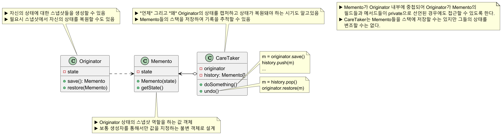
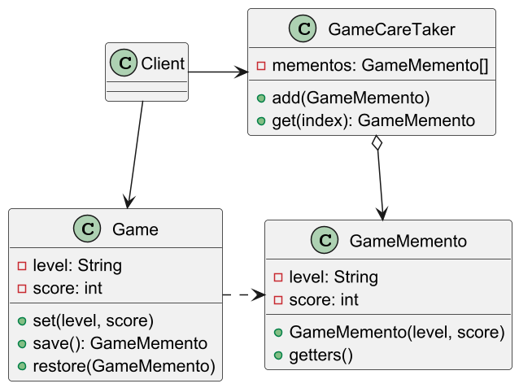
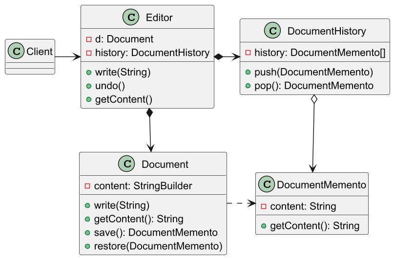

# 메멘토 패턴

## 메멘토 패턴 정의

객체의 구현 세부 사항을 공개하지 않으면서 해당 객체의 이전 상태를 저장하고 복원할 수 있게 해주는 패턴

시스템에서 핵심적인 기능을 담당하는 객체의 상태를 저장하고 캡슐화를 유지하는 데 목적을 가진다.


## 메멘토 패턴 구조



## 메멘토 패턴 예제 코드 - 1



```java
//Originator
public class Game {

    private String level;
    private int score;

    public void set(String level, int score) {
        this.level = level;
        this.score = score;
        System.out.printf(
            "Game state set to - Level: %s, Score: %d\n",
            level, score
        );
    }

    public GameMemento save() {
        return new GameMemento(level, score);
    }

    public void restore(GameMemento memento) {
        this.level = memento.getLevel();
        this.score = memento.getScore();
        System.out.printf(
            "Game state restored to - Level: %s, Score: %d\n",
            level, score
        );
    }
}
```
```java
//Memento, 불변으로 설계
public final class GameMemento {

    private final String level;
    private final int score;

    public GameMemento(String level, int score) {
        this.level = level;
        this.score = score;
    }

    public int getScore() {
        return score;
    }

    public String getLevel() {
        return level;
    }
}
```
```java
//CareTaker
public class GameCareTaker {

    private final List<GameMemento> mementoList = new ArrayList<>();

    public void add(GameMemento memento) {
        mementoList.add(memento);
    }

    public GameMemento get(int index) {
        return mementoList.get(index);
    }
}
```
```java
public class Client {
    public static void main(String[] args) {

        Game game = new Game();
        GameCareTaker careTaker = new GameCareTaker();

        game.set("Level 1", 100);
        careTaker.add(game.save());
        //Game state set to - Level: Level 1, Score: 100

        game.set("Level 2", 200);
        careTaker.add(game.save());
        //Game state set to - Level: Level 2, Score: 200

        game.set("Level 3", 300);
        //Game state set to - Level: Level 3, Score: 300

        game.restore(careTaker.get(1));
        //Game state restored to - Level: Level 2, Score: 200

        game.restore(careTaker.get(0));
        //Game state restored to - Level: Level 1, Score: 100
    }
}
```

## 메멘토 패턴 예제 코드 - 2



```java
//Originator
public class Document {

    private StringBuilder content;

    public Document() {
        this.content = new StringBuilder();
    }

    public void write(String text) {
        content.append(text);
    }

    public String getContent() {
        return content.toString();
    }

    public DocumentMemento save() {
        return new DocumentMemento(getContent());
    }

    public void restore(DocumentMemento memento) {
        this.content = new StringBuilder(memento.getContent());
    }
}
```
```java
//Memento
public final class DocumentMemento {

    private final String content;

    public DocumentMemento(String content) {
        this.content = content;
    }

    public String getContent() {
        return content;
    }
}
```
```java
//CareTaker
public class DocumentHistory {

    private final Deque<DocumentMemento> history = new ArrayDeque<>();

    public void push(DocumentMemento memento) {
        history.push(memento);
    }

    //가장 최근에 캡처되었던 스냅샷 반환
    public DocumentMemento pop() {
        if (history.isEmpty()) {
            return null;
        }

        return history.pop();
    }
}
```
```java
public class Editor {

    private final Document document;
    private final DocumentHistory history;

    public Editor() {
        this.document = new Document();
        this.history = new DocumentHistory();
    }

    public void write(String text) {
        //이전 상태를 내역에 저장한 후에 쓰기 작업 실행
        history.push(document.save());
        document.write(text);
    }

    public void undo() {
        DocumentMemento memento = history.pop();
        if (memento != null) {
            document.restore(memento);
        }
    }

    public String getContent() {
        return document.getContent();
    }
}
```
```java
public class Main {
    public static void main(String[] args) {

        Editor editor = new Editor();
        editor.write("Hello, ");
        editor.write("this is Memento pattern.");
        System.out.println(editor.getContent());
        //Hello, this is Memento pattern.

        editor.undo();
        System.out.println(editor.getContent());
        //Hello, 

        editor.write("This is an example implemented in Java.");
        System.out.println(editor.getContent());
        //Hello, This is an example implemented in Java.
    }
}
```

## 메멘토 패턴 장단점

### 메멘토 패턴 장점

- 캡슐화를 위반하지 않고 객체 상태의 스냅샷들을 생성할 수 있다.
- 저장된 상태를 핵심 객체와는 다른 별도의 객체에 보관할 수 있어 안전하다.
- 복구 기능을 구현하기 쉽다.
- `CareTaker`가 `Originator`의 상태를 유지하도록 하여 `Originator`의 코드를 단순화할 수 있다.
- 자바에서는 시스템의 상태를 저장할 때 직렬화를 사용하는 것이 좋다.

### 메멘토 패턴 단점

- 클라이언트에서 메멘토를 너무 자주 생성하면 많은 메모리를 소모한다.
- 상태를 저장하고 복구하는 데 시간이 오래 걸릴 수 있다.
- `CareTaker`는 더 이상 쓸모없는 메멘토들을 파괴할 수 있도록 `Originator`의 수명주기를 추적해야 한다.

## 실전에서 사용되는 메멘토 패턴

- `java.io.Serializable`
- `javax.faces.component.StateHolder`

---

### 참고

- [참고 블로그](https://thalals.tistory.com/429)
- [참고 사이트](https://refactoring.guru/ko/design-patterns/memento)
- [참고 강의](https://www.inflearn.com/course/%EA%B0%9D%EC%B2%B4%EC%A7%80%ED%96%A5-%EB%94%94%EC%9E%90%EC%9D%B8-%ED%8C%A8%ED%84%B4-%EC%96%84%EC%BD%94/dashboard)
- [참고 책](https://www.yes24.com/Product/Goods/108192370)