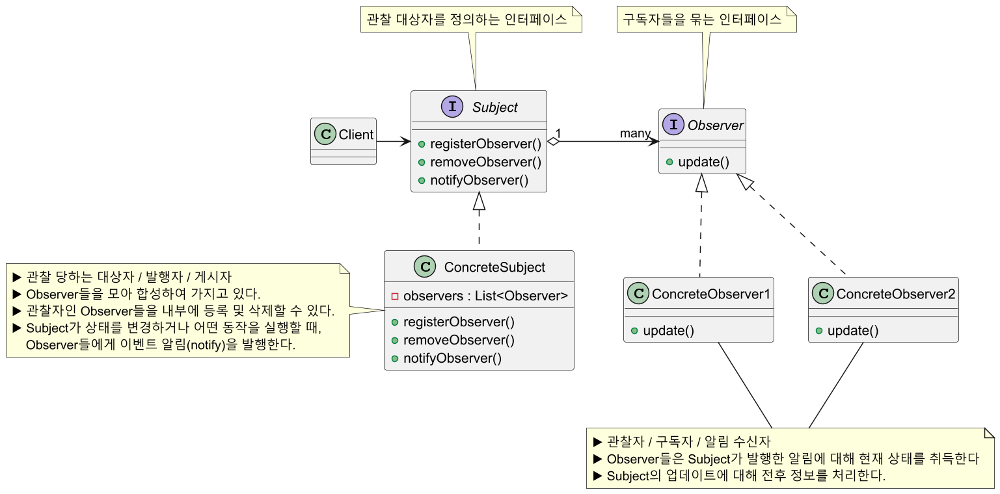
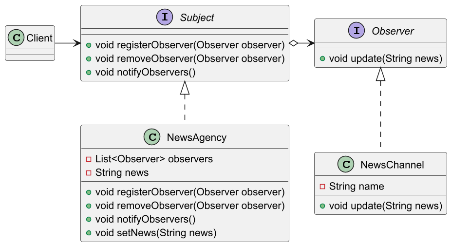
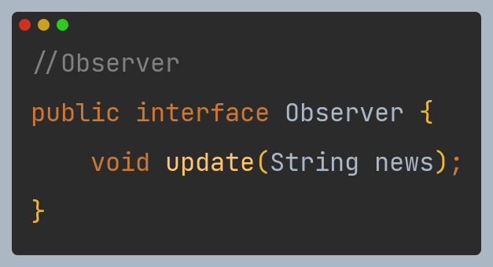

# 옵저버 패턴

## 옵저버 패턴 정의

한 객체의 상태가 바뀌면 그 객체에 의존하는 다른 객체에게 연락이 가고 자동으로 내용이 갱신되는 방식으로 **일대다** 의존성을 정의한다.

## 옵저버 패턴 구조



## 옵저버 패턴 예제 코드 - 1

**구독자에게만 새로운 소식 전달하기**



```java
//Subject
public interface Subject {
    void registerObserver(Observer observer);
    void removeObserver(Observer observer);
    void notifyObservers();
}
```
```java
//Observer
public interface Observer {
    void update(String news);
}
```
```java
//Concrete Subject
public class NewsAgency implements Subject {

  private final List<Observer> observers = new ArrayList<>();
  private String news;

  @Override
  public void registerObserver(Observer observer) {
    observers.add(observer);
  }

  @Override
  public void removeObserver(Observer observer) {
    observers.remove(observer);
  }

  @Override
  public void notifyObservers() {
    for (Observer observer : observers) {
      observer.update(news);
    }
  }

  public void setNews(String news) {
    this.news = news;
    notifyObservers();
  }
}
```
```java
//Concrete Observer
public class NewsChannel implements Observer {

    private final String name;

    public NewsChannel(String name) {
        this.name = name;
    }

    @Override
    public void update(String news) {
        System.out.printf("%s received news: %s\n", name, news);
    }
}
```
```java
//Client
public class Client {
    public static void main(String[] args) {

        NewsAgency agency = new NewsAgency();

        NewsChannel channel1 = new NewsChannel("Channel 1");
        NewsChannel channel2 = new NewsChannel("Channel 2");

        //Channel 1,2 구독
        agency.registerObserver(channel1);
        agency.registerObserver(channel2);

        //구독자들에게 새로운 소식 발행
        agency.setNews("[Breaking news: Observer Pattern in action!]");
        //Channel 1 received news: [Breaking news: Observer Pattern in action!]
        //Channel 2 received news: [Breaking news: Observer Pattern in action!]

        //Channel 2 구독 취소
        agency.removeObserver(channel2);

        //Channel 1에게만 새로운 소식 발행
        agency.setNews("[Another update: Channel 2 unsubscribed.]");
        //Channel 1 received news: [Another update: Channel 2 unsubscribed.]
    }
}
```

## 옵저버 패턴 예제 코드 - 2

**날씨 정보가 변경됨에 따라 각각의 옵저버들이 다르게 표현하기**



```java
//Subject
public interface WeatherSubject {
    void registerObserver(WeatherObserver observer);
    void removeObserver(WeatherObserver observer);
    void notifyObservers();
}
```
```java
//Observer
public interface WeatherObserver {
    void update(float temp, float humidity, float pressure);
}
```
```java
//Concrete Subject
public class WeatherData implements WeatherSubject {

    private final List<WeatherObserver> observers = new ArrayList<>();
    private float temp, humidity, pressure;

    public void setMeasurements(float temp, float humidity, float pressure) {
        this.temp = temp;
        this.humidity = humidity;
        this.pressure = pressure;
        notifyObservers();
    }

    @Override
    public void registerObserver(WeatherObserver observer) {
        observers.add(observer);
    }

    @Override
    public void removeObserver(WeatherObserver observer) {
        observers.remove(observer);
    }

    @Override
    public void notifyObservers() {
        for (WeatherObserver observer : observers) {
            observer.update(temp, humidity, pressure);
        }
    }
}
```
```java
//Concrete Observer
public class CurrentConditionsDisplay implements WeatherObserver {

    @Override
    public void update(float temp, float humidity, float pressure) {
        System.out.printf("Current: %.1fF, %.1f%% humidity\n", temp, humidity);
    }
}
```
```java
//Concrete Observer
public class StatisticsDisplay implements WeatherObserver {

    @Override
    public void update(float temp, float humidity, float pressure) {
        System.out.printf("Avg/Max/Min temp: %.1f/%.1f/%.1f\n", temp, (temp + 2), (temp - 2));
    }
}
```
```java
//Concrete Observer
public class ForecastDisplay implements WeatherObserver {

    @Override
    public void update(float temp, float humidity, float pressure) {
        System.out.printf("Forecast: %s\n", (pressure < 29.92 ? "Rain" : "Sunny"));
    }
}
```
```java
//Client
public class Client {
    public static void main(String[] args) {

        //Subject
        WeatherData weatherData = new WeatherData();

        //Observers
        CurrentConditionsDisplay currentDisplay = new CurrentConditionsDisplay();
        StatisticsDisplay statisticsDisplay = new StatisticsDisplay();
        ForecastDisplay forecastDisplay = new ForecastDisplay();

        weatherData.registerObserver(currentDisplay);
        weatherData.registerObserver(statisticsDisplay);
        weatherData.registerObserver(forecastDisplay);

        weatherData.setMeasurements(80, 65, 30.4f);
        //Current: 80.0F, 65.0% humidity
        //Avg/Max/Min temp: 80.0/82.0/78.0
        //Forecast: Sunny

        System.out.println("\nremove statisticsDisplay\n");

        weatherData.removeObserver(statisticsDisplay);
        weatherData.setMeasurements(70, 60, 28.9f);
        //remove statisticsDisplay
        //
        //Current: 70.0F, 60.0% humidity
        //Forecast: Rain
    }
}
```

## 옵저버 패턴 장단점

### 장점

- `Subject`의 상태 변경을 주기적으로 조회하지 않고 자동으로 감지할 수 있다.
- 발행자의 코드를 변경하지 않고 새 구독자 클래스를 도입할 수 있어 **OCP** 원칙을 준수한다.
- 런타임 시점에 발행자와 구독 알림 관계를 맺을 수 있다.
- 상태를 변경하는 객체(`Subject`)와 변경을 감지하는 객체(`Observer`)의 관계를 느슨하게 유지할 수 있다.

### 단점

- 구독자는 알림 순서를 제어할 수 없고, 무작위 순서로 알림을 받는다.
  - 하드 코딩으로 구현할 수 있겠지만, 권장되지는 않는 방법이다.
  - 또한 **`Observer`는 알림 순서에 의존하면 안된다.**
- 옵저버 패턴을 자주 구성하면 구조와 동작을 알아보기 힘들어져 코드 복잡도가 증가한다.
- 다수의 옵저버 객체를 등록 이후 해지하지 않는다면 메모리 누수가 발생할 수도 있다.

## 실전에서 사용되는 옵저버 패턴

- `java.util.Observer` / `java.util.Observable`
  - 자바에서 내장 객체로 옵저버 패턴을 지원하지만, 거의 사용되지 않는다.
- `java.util.EventListener`
- `javax.servlet.http.HttpSessionBindingListener`
- `javax.servlet.http.HttpSessionAttributeListener`
- `javax.faces.event.PhaseListener`

---

### 참고

- [참고 블로그](https://inpa.tistory.com/entry/GOF-%F0%9F%92%A0-%EC%98%B5%EC%A0%80%EB%B2%84Observer-%ED%8C%A8%ED%84%B4-%EC%A0%9C%EB%8C%80%EB%A1%9C-%EB%B0%B0%EC%9B%8C%EB%B3%B4%EC%9E%90)
- [참고 사이트](https://refactoring.guru/ko/design-patterns/observer)
- [참고 강의](https://www.inflearn.com/course/%EA%B0%9D%EC%B2%B4%EC%A7%80%ED%96%A5-%EB%94%94%EC%9E%90%EC%9D%B8-%ED%8C%A8%ED%84%B4-%EC%96%84%EC%BD%94/dashboard)
- [참고 책](https://www.yes24.com/Product/Goods/108192370)