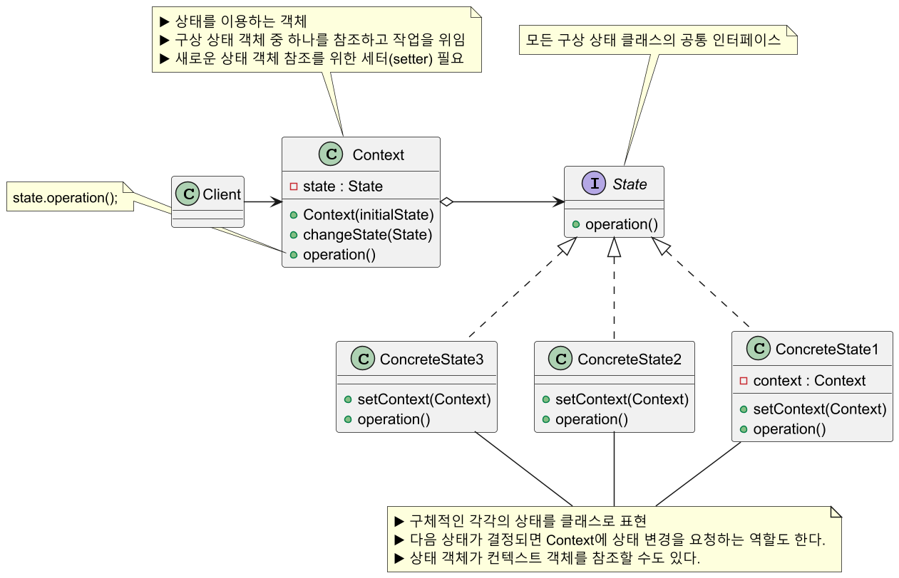
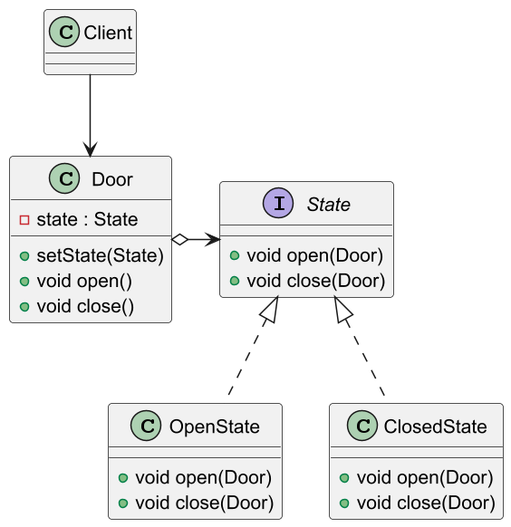
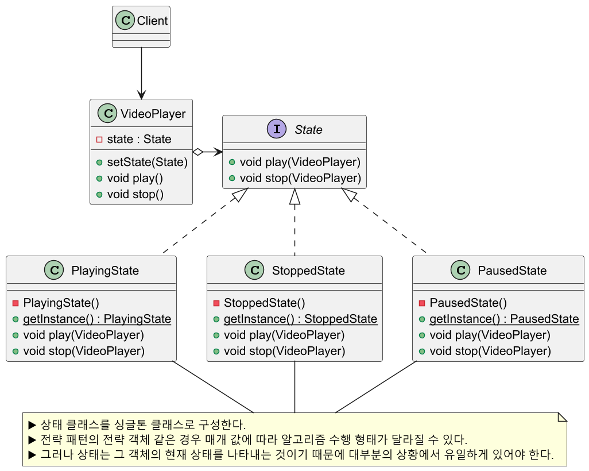
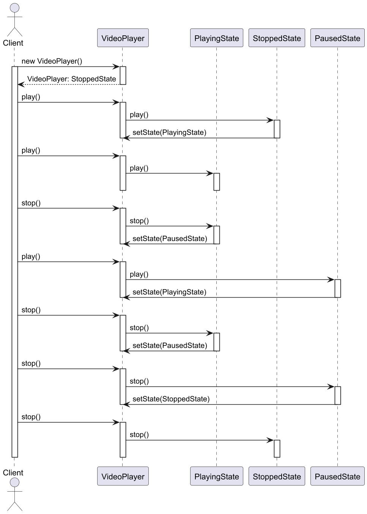

# 상태 패턴

## 상태 패턴 정의

상태 패턴을 사용하면 객체의 내부 상태가 바뀜에 따라서 객체의 행동을 바꿀 수 있다.
클라이언트는 마치 객체의 클래스가 바뀌는 것과 같은 결과를 얻을 수 있다.

[전략 패턴](https://github.com/genesis12345678/TIL/blob/main/Java/java8/designpattern/behavioral/strategy/Strategy.md)이 "전략 알고리즘"을 클래스로 표현한 패턴이라면, **상태 패턴**은 객체 상태를
클래스로 표현한 패턴이다.

## 상태 패턴 구조



## 상태 패턴 예제 코드 - 1



```java
//State
public interface State {
    void open(Door door);
    void close(Door door);
}
```
```java
//Concrete State
public class OpenState implements State {

    @Override
    public void open(Door door) {
        System.out.println("Door is already Open.");
    }

    @Override
    public void close(Door door) {
        System.out.println("Door is now Closed.");
        door.setState(new ClosedState()); //컨텍스트 상태 변경
    }
}
```
```java
//Concrete State
public class ClosedState implements State {

    @Override
    public void open(Door door) {
        System.out.println("Door is now Open.");
        door.setState(new OpenState()); //컨텍스트 상태 변경
    }

    @Override
    public void close(Door door) {
        System.out.println("Door is already Closed.");
    }
}
```
```java
//Context
public class Door {

    private State state;

    //초기 상태
    public Door() {
        this.state = new ClosedState();
    }

    public void setState(State state) {
        this.state = state;
    }

    public void open() {
        state.open(this);
    }

    public void close() {
        state.close(this);
    }
}
```
```java
//Client
public class Client {
    public static void main(String[] args) {

        Door door = new Door(); //Closed State

        door.open();    //Door is now Open.(Open State)
        door.open();    //Door is already Open.
        
        door.close();   //Door is now Closed.(Closed State)
        door.close();   //Door is already Closed.
    }
}
```

## 상태 패턴 예제 코드 - 2



```java
//State
public interface State {
    void play(VideoPlayer player);
    void stop(VideoPlayer player);
}
```
```java
//Concrete State
public class PlayingState implements State {

    private PlayingState() {}

    private static class SingletonInstanceHolder {
        private static final PlayingState INSTANCE = new PlayingState();
    }

    public static PlayingState getInstance() {
        return SingletonInstanceHolder.INSTANCE;
    }

    @Override
    public void play(VideoPlayer player) {
        System.out.println("Video is already playing.");
    }

    @Override
    public void stop(VideoPlayer player) {
        System.out.println("Pausing the video.");
        player.setState(PausedState.getInstance());
    }
}
```
```java
//Concrete State
public class StoppedState implements State {

    private StoppedState() {}

    private static class SingletonInstanceHolder {
        private static final StoppedState INSTANCE = new StoppedState();
    }

    public static StoppedState getInstance() {
        return SingletonInstanceHolder.INSTANCE;
    }

    @Override
    public void play(VideoPlayer player) {
        System.out.println("Starting the video.");
        player.setState(PlayingState.getInstance());
    }

    @Override
    public void stop(VideoPlayer player) {
        System.out.println("Video is already stopped.");
    }
}
```
```java
//Concrete State
public class PausedState implements State{

    private PausedState() {}

    private static class SingletonInstanceHolder {
        private static final PausedState INSTANCE = new PausedState();
    }

    public static PausedState getInstance() {
        return SingletonInstanceHolder.INSTANCE;
    }

    @Override
    public void play(VideoPlayer player) {
        System.out.println("Resuming the video.");
        player.setState(PlayingState.getInstance());
    }

    @Override
    public void stop(VideoPlayer player) {
        System.out.println("Stopping the video.");
        player.setState(StoppedState.getInstance());
    }
}
```
```java
//Context
public class VideoPlayer {

    private State state;

    public VideoPlayer() {
        this.state = StoppedState.getInstance();
    }

    public void setState(State state) {
        this.state = state;
    }

    public void play() {
        state.play(this);
    }

    public void stop() {
        state.stop(this);
    }
}
```
```java
//Client
public class Client {
    public static void main(String[] args) {

        VideoPlayer player = new VideoPlayer(); //Stopped State

        player.play();  //Starting the video.(Playing State)
        player.play();  //Video is already playing.

        player.stop();  //Pausing the video.(Paused State)

        player.play();  //Resuming the video.(Playing State)

        player.stop();  //Pausing the video.(Paused State)
        player.stop();  //Stopping the video.(Stopped State)
        player.stop();  //Video is already stopped.
    }
}
```



상태 패턴을 적용하지 않았다면 다음과 같이 `if`문 또는 `switch`문을 사용했을 것이다.
이와 같은 구조는 여러 문제가 있다.

1. 객체 지향적 코드가 아닌 하드코딩 스타일이다.
2. 상태 전환이 복잡한 조건 분기문에 나열되어 있어 가독성이 좋지 않다.
3. 바뀌는 부분들이 캡슐화 되어있지 않고 노출되어있다.
4. 상태 기능을 새로 추가할 경우 메서드 전체를 수정해야 하기 때문에 **OCP**를 위반한다.

```java
public class VideoPlayer {
    
    private String state;

    public VideoPlayer() {
        this.state = "Stopped";
    }

    public void play() {
        if (state.equals("Stopped")) {
            System.out.println("Starting the video.");
            state = "Playing";
        } else if (state.equals("Playing")) {
            System.out.println("Video is already playing.");
        } else if (state.equals("Paused")) {
            System.out.println("Resuming the video.");
            state = "Playing";
        }
    }

    public void stop() {
        if (state.equals("Playing")) {
            System.out.println("Pausing the video.");
            state = "Paused";
        } else if (state.equals("Paused")) {
            System.out.println("Stopping the video.");
            state = "Stopped";
        } else if (state.equals("Stopped")) {
            System.out.println("Video is already stopped.");
        }
    }
}
```

## 상태 패턴 장단점

### 상태 패턴 장점

- 상태에 따른 동작을 개별 클래스로 옮겨서 관리할 수 있다.
- 상태와 관련된 모든 동작을 각각의 상태 클래스에 분산시켜 코드 복잡도를 줄일 수 있다.
- 특정 상태와 관련된 코드를 별도의 클래스로 구성할 수 있다.(**SRP** 준수)
- 기존 상태 클래스나 컨텍스트를 변경하지 않고 새 상태를 도입할 수 있다.(**OCP** 준수)
- 하나의 상태 객체만 사용하여 상태 변경을 하므로 일관성 없는 상태 주입을 방지하는 데 도움이 된다.

### 상태 패턴 단점

- 상태별로 클래스를 만들어야 하므로 관리해야 할 클래스 수가 증가한다.
- 상태 클래스 개수가 많고 상태 규칙이 자주 변경된다면 컨텍스트의 상태 변경
코드가 복잡해질 수 있다.
- 객체에 적용할 상태가 몇 가지밖에 없거나 거의 상태 변경이 이루어지지 않는 경우
상태 패턴을 적용하는 것이 오히려 복잡해질 수 있다.

## 실전에서 사용되는 상태 패턴

- `javax.faces.lifecycle.LifeCycle.execute()`

---

### 참고

- [참고 블로그](https://inpa.tistory.com/entry/GOF-%F0%9F%92%A0-%EC%83%81%ED%83%9CState-%ED%8C%A8%ED%84%B4-%EC%A0%9C%EB%8C%80%EB%A1%9C-%EB%B0%B0%EC%9B%8C%EB%B3%B4%EC%9E%90)
- [참고 사이트](https://refactoring.guru/ko/design-patterns/state)
- [참고 강의](https://www.inflearn.com/course/%EA%B0%9D%EC%B2%B4%EC%A7%80%ED%96%A5-%EB%94%94%EC%9E%90%EC%9D%B8-%ED%8C%A8%ED%84%B4-%EC%96%84%EC%BD%94/dashboard)
- [참고 책](https://www.yes24.com/Product/Goods/108192370)