# 전략 패턴

## 전략 패턴 정의

알고리즘군을 정의하고 캡슐화해서 각각의 알고리즘군을 수정해서 쓸 수 있게 해준다. 전략 패턴을 사용하면
클라이언로부터 알고리즘을 분리해서 독립적으로 변경할 수 있다.

## 전략 패턴 구조

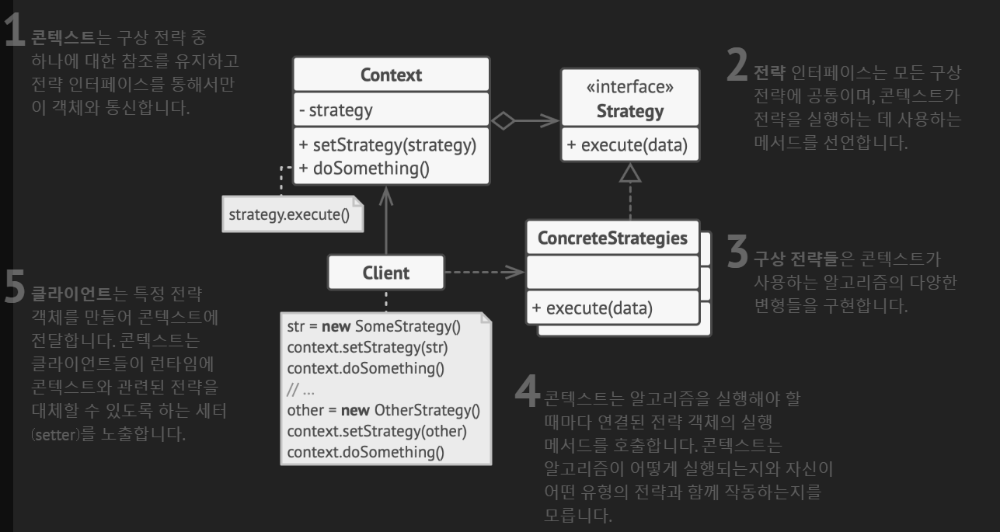

## 전략 패턴 예제 코드 - 1

**전략 패턴을 사용한 다양한 결제 전략 선택하기**

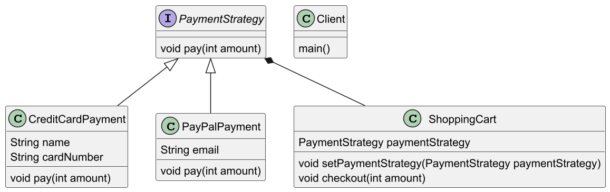

### Strategy

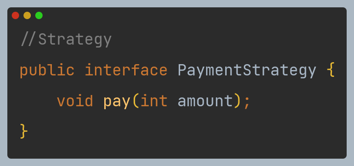

### ConcreteStrategies

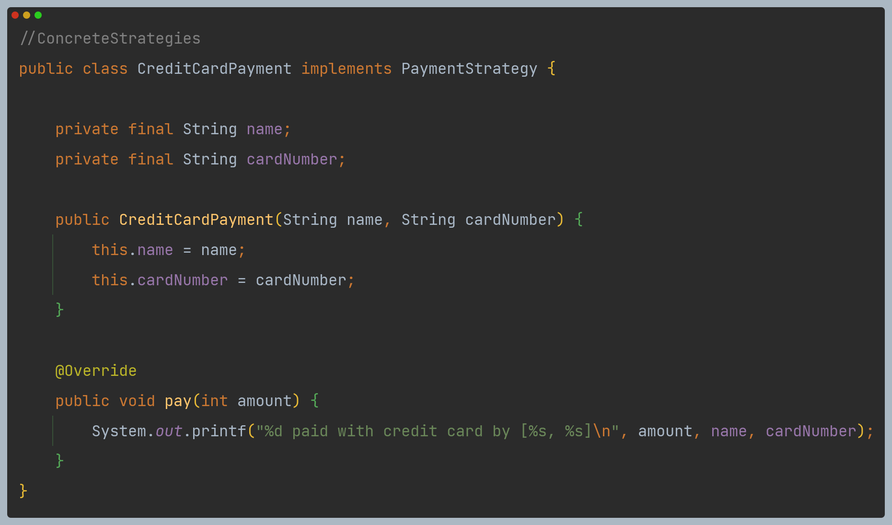

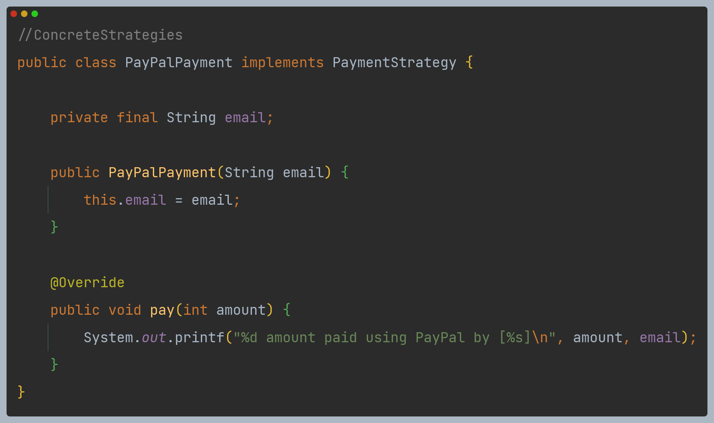

### Context

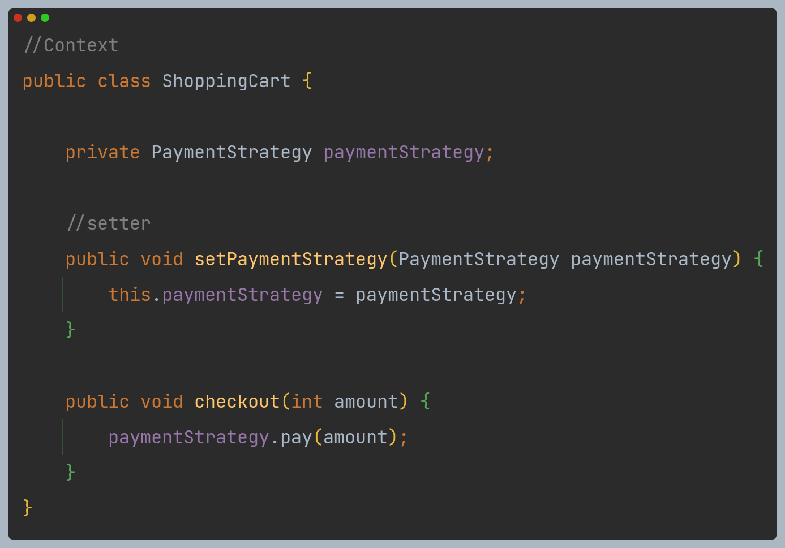

### Client

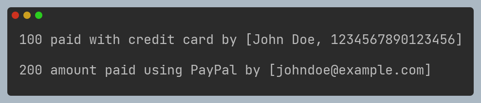

- 전략의 수정이 필요하면 해당 전략만 수정하면 되고, 다른 방법이 추가되어도 새로운 전략만 만들면 된다.

## 전략 패턴 예제 코드 - 2

**전략 패턴을 사용한 주어진 문자열을 특정 알고리즘을 이용해 다른 문자열로 변환**

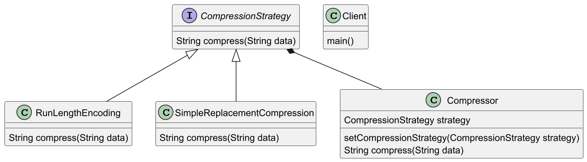

### Strategy

### ConcreteStrategies

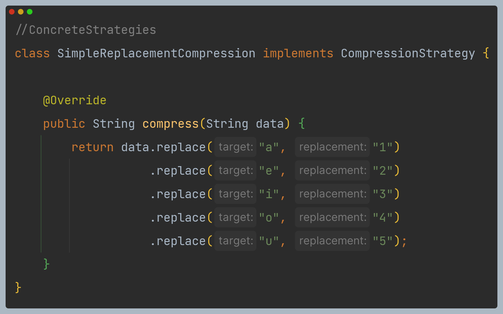

### Context

### Client

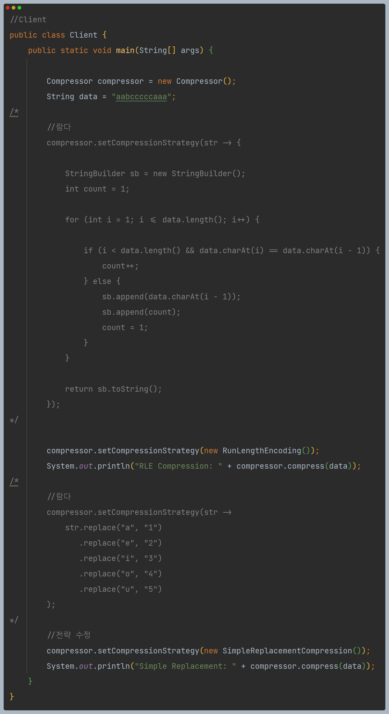

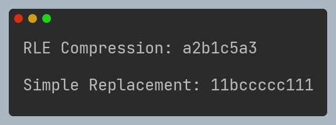

---

## 전략 패턴 장단점

### 장점

- 런타임에 한 객체 내부에서 사용되는 알고리즘을 쉽게 교체할 수 있다.
- 알고리즘을 사용하는 코드에서 알고리즘의 구현 세부 정보들을 자세히 몰라도 된다.
- 상속을 합성으로 대체할 수 있다.
- `Context`를 변경하지 않고도 새로운 전략들을 추가하기 용이하다.(**OCP** 원칙 준수)

### 단점

- 알고리즘 개수가 많지 않고 자주 변경되지 않는다면, 새로운 클래스와 인터페이스를 만들어
프로그램을 복잡하게 만들 이유가 없다.
- 클라이언트는 적절한 전략을 선택하기 위해 전략 간의 차이점을 파악하고 있어야 한다.

---

## 실전에서 사용되는 전략 패턴

- 정렬할 때 사용하는 `Comparator` 구현체
- `javax.servlet.http.HttpServlet`에서 `service()`와 모든 `doXxx()` 메서드
- `javax.servlet.Filter`의 `doFilter()` 메서드

---

### 참고

- [참고 블로그](https://inpa.tistory.com/entry/GOF-%F0%9F%92%A0-%EC%A0%84%EB%9E%B5Strategy-%ED%8C%A8%ED%84%B4-%EC%A0%9C%EB%8C%80%EB%A1%9C-%EB%B0%B0%EC%9B%8C%EB%B3%B4%EC%9E%90#%EC%8B%A4%EB%AC%B4%EC%97%90%EC%84%9C_%EC%B0%BE%EC%95%84%EB%B3%B4%EB%8A%94_strategy_%ED%8C%A8%ED%84%B4)
- [참고 사이트](https://refactoring.guru/ko/design-patterns/strategy)
- [참고 강의](https://www.inflearn.com/course/%EA%B0%9D%EC%B2%B4%EC%A7%80%ED%96%A5-%EB%94%94%EC%9E%90%EC%9D%B8-%ED%8C%A8%ED%84%B4-%EC%96%84%EC%BD%94/dashboard)
- [참고 책](https://www.yes24.com/Product/Goods/108192370)