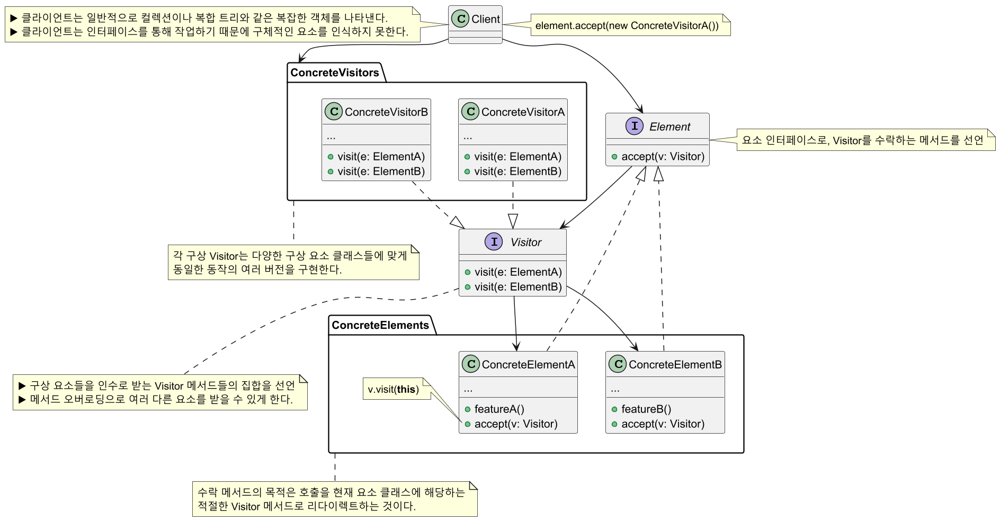
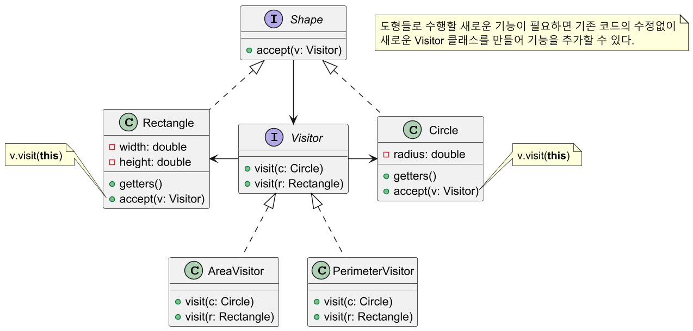
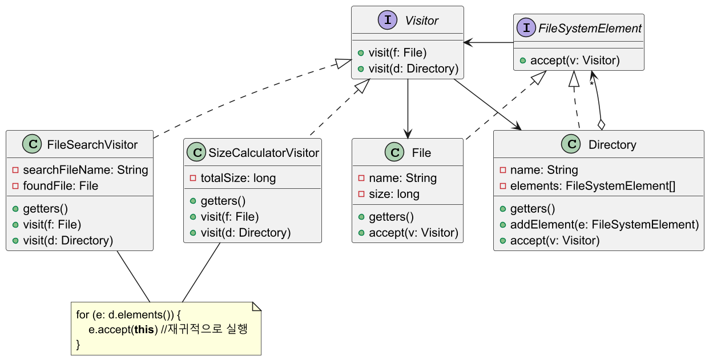

# 비지터 패턴

## 비지터 패턴 정의

기존 코드를 건들이지 않고 새로운 기능을 추가하는 메커니즘을 제공하는 패턴으로, 비즈니스 로직을
객체 구조에서 분리시킨다.

비슷한 종류의 객체들을 가진 그룹에서 작업을 수행해야 할 때 주로 사용된다.

## 비지터 패턴 구조



## 비지터 패턴 예제 코드 - 1



```java
//Element
public interface Shape {
    void accept(Visitor visitor);
}
```
```java
//Concrete Element
public class Circle implements Shape {

    private double radius;

    public Circle(double radius) {
        this.radius = radius;
    }

    public double getRadius() {
        return radius;
    }

    @Override
    public void accept(Visitor visitor) {
        visitor.visit(this);
    }
}
```
```java
//Concrete Element
public class Rectangle implements Shape {

    private double width;
    private double height;

    public Rectangle(double width, double height) {
        this.width = width;
        this.height = height;
    }

    public double getWidth() {
        return width;
    }

    public double getHeight() {
        return height;
    }

    @Override
    public void accept(Visitor visitor) {
        visitor.visit(this);
    }
}
```
```java
//Visitor
public interface Visitor {
    void visit(Circle circle);
    void visit(Rectangle rectangle);
}
```
```java
/**
 * Concrete Visitor
 * 면적을 구하는 기능(비지터)
 */
public class AreaVisitor implements Visitor {

    @Override
    public void visit(Circle circle) {
        double area = Math.PI * circle.getRadius() * circle.getRadius();
        System.out.println("Circle Area: " + area);
    }

    @Override
    public void visit(Rectangle rectangle) {
        double area = rectangle.getWidth() * rectangle.getHeight();
        System.out.println("Rectangle Area: " + area);
    }
}
```
```java
/**
 * Concrete Visitor
 * 둘레를 구하는 기능(비지터)
 */
public class PerimeterVisitor implements Visitor {
    
    @Override
    public void visit(Circle circle) {
        double perimeter = 2 * Math.PI * circle.getRadius();
        System.out.println("Circle perimeter: " + perimeter);
    }

    @Override
    public void visit(Rectangle rectangle) {
        double perimeter = 2 * (rectangle.getWidth() * rectangle.getHeight());
        System.out.println("Rectangle perimeter: " + perimeter);
    }
}
```
```java
public class Client {
    public static void main(String[] args) {

        Circle circle = new Circle(5);
        Rectangle rectangle = new Rectangle(4, 6);

        Visitor areaVisitor = new AreaVisitor();
        Visitor perimeterVisitor = new PerimeterVisitor();

        circle.accept(areaVisitor);
        rectangle.accept(areaVisitor);
        //Circle Area: 78.53981633974483
        //Rectangle Area: 24.0

        circle.accept(perimeterVisitor);
        rectangle.accept(perimeterVisitor);
        //Circle perimeter: 31.41592653589793
        //Rectangle perimeter: 48.0
    }
}
```

## 비지터 패턴 예제 코드 - 2



```java
//Element
public interface FileSystemElement {
    void accept(Visitor visitor);
}
```
```java
//Concrete Element
public class File implements FileSystemElement {

    private String name;
    private long size;

    public File(String name, long size) {
        this.name = name;
        this.size = size;
    }

    public String getName() {
        return name;
    }

    public long getSize() {
        return size;
    }

    @Override
    public void accept(Visitor visitor) {
        visitor.visit(this);
    }
}
```
```java
//Concrete Element
public class Directory implements FileSystemElement {

    private String name;
    private List<FileSystemElement> elements;

    public Directory(String name) {
        this.name = name;
        this.elements = new ArrayList<>();
    }

    public String getName() {
        return name;
    }

    public List<FileSystemElement> getElements() {
        return elements;
    }

    public void addElement(FileSystemElement element) {
        elements.add(element);
    }

    @Override
    public void accept(Visitor visitor) {
        visitor.visit(this);
    }
}
```
```java
//Visitor
public interface Visitor {
    void visit(File file);
    void visit(Directory directory);
}
```
```java
/**
 * Concrete Visitor
 * 전체 파일의 크기를 구하는 기능(비지터)
 */
public class SizeCalculatorVisitor implements Visitor {

    private long totalSize = 0;

    @Override
    public void visit(File file) {
        totalSize += file.getSize();
    }

    @Override
    public void visit(Directory directory) {
        for (FileSystemElement element : directory.getElements()) {
            element.accept(this);
        }
    }

    public long getTotalSize() {
        return totalSize;
    }
}
```
```java
/**
 * Concrete Visitor
 * 특정 파일을 찾는 기능(비지터)
 */
public class FileSearchVisitor implements Visitor {

    private String searchFileName;
    private File foundFile;

    public FileSearchVisitor(String searchFileName) {
        this.searchFileName = searchFileName;
    }

    @Override
    public void visit(File file) {
        if (file.getName().equals(searchFileName)) {
            foundFile = file;
        }
    }

    @Override
    public void visit(Directory directory) {
        for (FileSystemElement element : directory.getElements()) {
            element.accept(this);
        }
    }

    public File getFoundFile() {
        return foundFile;
    }
}
```
```java
public class Client {
    public static void main(String[] args) {

        Directory rootDir = getDirectory();
        /*
         * ↳ Root
         *   ↳ Folder1
         *     ↳ file1.txt / 100KB
         *     ↳ file2.txt / 200KB
         *   ↳ Folder2
         *     ↳ file3.txt / 300KB
         */

        SizeCalculatorVisitor sizeVisitor = new SizeCalculatorVisitor();
        rootDir.accept(sizeVisitor);

        System.out.println("Total size of file system: " + sizeVisitor.getTotalSize() + " bytes");
        //Total size of file system: 600 bytes

        FileSearchVisitor searchVisitor = new FileSearchVisitor("file3.txt");
        rootDir.accept(searchVisitor);

        File foundFile = searchVisitor.getFoundFile();

        if (foundFile != null) {
            System.out.printf(
                "File found: %s, Size: %d bytes\n",
                foundFile.getName(), foundFile.getSize()
            );
            //File found: file3.txt, Size: 300 bytes
        }
        else {
            System.out.println("File not found.");
        }
    }

    private static Directory getDirectory() {

        File file1 = new File("file1.txt", 100);
        File file2 = new File("file2.txt", 200);
        File file3 = new File("file3.txt", 300);

        Directory dir1 = new Directory("Folder1");
        dir1.addElement(file1);
        dir1.addElement(file2);

        Directory dir2 = new Directory("Folder2");
        dir2.addElement(file3);

        Directory rootDir = new Directory("root");
        rootDir.addElement(dir1);
        rootDir.addElement(dir2);

        return rootDir;
    }
}
```

## 비지터 패턴 장단점

### 비지터 패턴 장점

- 구조를 변경하지 않으면서도 복합 객체 구조에 새로운 기능을 추가할 수 있다.(**OCP** 준수)
- 비교적 손쉽게 새로운 기능을 추가할 수 있다.
- 비지터가 수행하는 기능과 관련된 코드를 한곳에 모아 둘 수 있다.

### 비지터 패턴 단점

- 새로운 요소(element)를 추가하거나 제거할 때 모든 Visitor 코드를 변경해야 한다.
- `visit` 메서드의 리턴 타입을 각각 파악하고 있어야 한다.

## 실전에서 사용되는 비지터 패턴

- `javax.lang.model.element.AnnotationValue`, `AnnotationValueVisitor`
- `javax.lang.model.element.Element`, `ElementVisitor`
- `javax.lang.model.type.TypeMirror`, `TypeVisitor`
- `java.nio.file.FileVisitor`, `SimpleFileVisitor`
- `javax.faces.component.visit.VisitContext`, `VisitCallback`

---

### 참고

- [참고 사이트](https://refactoring.guru/design-patterns/visitor)
- [참고 강의](https://www.inflearn.com/course/%EA%B0%9D%EC%B2%B4%EC%A7%80%ED%96%A5-%EB%94%94%EC%9E%90%EC%9D%B8-%ED%8C%A8%ED%84%B4-%EC%96%84%EC%BD%94/dashboard)
- [참고 책](https://www.yes24.com/Product/Goods/108192370)