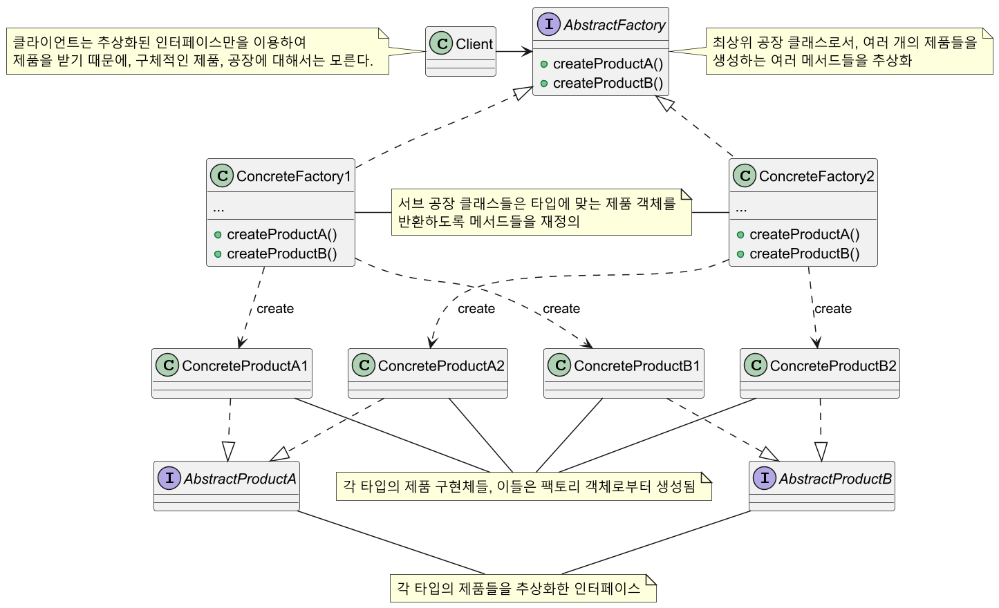
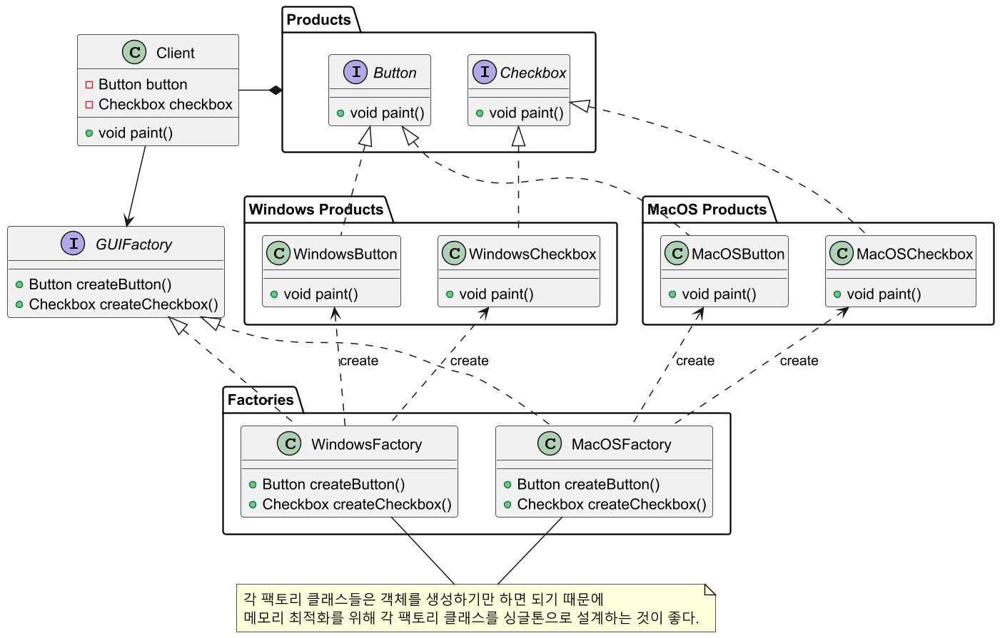

# 추상 팩토리 패턴

## 추상 팩토리 패턴 정의

구상 클래스에 의존하지 않고도 서로 연관되거나 의존적인 객체로 이루어진 제품군을 생산하는 
인터페이스를 제공한다. 구상 클래스는 서브 클래스에서 만든다.

## 추상 팩토리 패턴 구조



## 추상 팩토리 패턴 예제 코드 - 1



만약 새로운 리눅스 제품군이 추가되어야 한다면 리눅스에 맞는 제품들과 팩토리 클래스만 추가해주면 된다.
클라이언트 코드는 변경할 필요가 없다.

```java
//Abstract Product
public interface Button {
    void paint();
}
```
```java
//Abstract Product
public interface Checkbox {
    void paint();
}
```
```java
//Concrete Product
public class WindowsButton implements Button {

    @Override
    public void paint() {
        System.out.println("Rendering a button in Windows style");
    }
}
```
```java
//Concrete Product
public class WindowsCheckbox implements Checkbox {

    @Override
    public void paint() {
        System.out.println("Rendering a checkbox in Windows style");
    }
}
```
```java
//Concrete Product
public class MacOSButton implements Button {

    @Override
    public void paint() {
        System.out.println("Rendering a button in MacOS style");
    }
}
```
```java
//Concrete Product
public class MacOSCheckbox implements Checkbox {

    @Override
    public void paint() {
        System.out.println("Rendering a checkbox in MacOS style");
    }
}
```
```java
//Abstract Factory
public interface GUIFactory {
    Button createButton();
    Checkbox createCheckbox();
}
```
```java
//Concrete Factory
public class WindowsFactory implements GUIFactory {

    @Override
    public Button createButton() {
        return new WindowsButton();
    }

    @Override
    public Checkbox createCheckbox() {
        return new WindowsCheckbox();
    }
}
```
```java
//Concrete Factory
public class MacOSFactory implements GUIFactory {

    @Override
    public Button createButton() {
        return new MacOSButton();
    }

    @Override
    public Checkbox createCheckbox() {
        return new MacOSCheckbox();
    }
}
```
```java
//Client
public class Application {

    private final Button button;
    private final Checkbox checkbox;

    public Application(GUIFactory factory) {
        this.button = factory.createButton();
        this.checkbox = factory.createCheckbox();
    }

    public void paint() {
        button.paint();
        checkbox.paint();
    }
}
```
```java
public class Main {
    public static void main(String[] args) {

        paint(new WindowsFactory());

        System.out.println("------------------------------");

        paint(new MacOSFactory());
        
        //Output
        //Rendering a button in Windows style
        //Rendering a checkbox in Windows style
        //------------------------------
        //Rendering a button in MacOS style
        //Rendering a checkbox in MacOS style
    }

    public static void paint(GUIFactory factory) {
        new Application(factory).paint();
    }
}
```

## 추상 팩토리 패턴 예제 코드 - 2


```java
//Abstract Product
public interface Connection {
    void open();
    void close();
}
```
```java
//Abstract Product
public interface Command {
    void execute(String query);
}
```
```java
//Abstract Product
public interface ResultSet {
    void getResults();
}
```
```java
//Concrete Product
public class MySQLConnection implements Connection {

    @Override
    public void open() {
        System.out.println("Opening MySQL connection");
    }

    @Override
    public void close() {
        System.out.println("Closing MySQL connection");
    }
}
```
```java
//Concrete Product
public class MySQLCommand implements Command {

    @Override
    public void execute(String query) {
        System.out.println("Executing MySQL query: " + query);
    }
}
```
```java
//Concrete Product
public class MySQLResultSet implements ResultSet {

    @Override
    public void getResults() {
        System.out.println("Getting results from MySQL database");
    }
}
```
```java
//Concrete Product
public class PostgreSQLConnection implements Connection {

    @Override
    public void open() {
        System.out.println("Opening PostgreSQL connection");
    }

    @Override
    public void close() {
        System.out.println("Closing PostgreSQL connection");
    }
}
```
```java
//Concrete Product
public class PostgreSQLCommand implements Command {

    @Override
    public void execute(String query) {
        System.out.println("Executing PostgreSQL query: " + query);
    }
}
```
```java
//Concrete Product
public class PostgreSQLResultSet implements ResultSet {

    @Override
    public void getResults() {
        System.out.println("Getting results from PostgreSQL database");
    }
}
```
```java
//Abstract Factory
public interface DatabaseFactory {
    Connection createConnection();
    Command createCommand();
    ResultSet createResultSet();
}
```
```java
//Concrete Factory
public class MySQLFactory implements DatabaseFactory {

    @Override
    public Connection createConnection() {
        return new MySQLConnection();
    }

    @Override
    public Command createCommand() {
        return new MySQLCommand();
    }

    @Override
    public ResultSet createResultSet() {
        return new MySQLResultSet();
    }
}
```
```java
//Concrete Factory
public class PostgreSQLFactory implements DatabaseFactory {

    @Override
    public Connection createConnection() {
        return new PostgreSQLConnection();
    }

    @Override
    public Command createCommand() {
        return new PostgreSQLCommand();
    }

    @Override
    public ResultSet createResultSet() {
        return new PostgreSQLResultSet();
    }
}
```
```java
//Client
class DatabaseClient {

    private final Connection connection;
    private final Command command;
    private final ResultSet resultSet;

    public DatabaseClient(DatabaseFactory factory) {
        connection = factory.createConnection();
        command = factory.createCommand();
        resultSet = factory.createResultSet();
    }

    public void performDatabaseOperations() {
        connection.open();
        command.execute("SELECT * FROM users");
        resultSet.getResults();
        connection.close();
    }
}
```
```java
public class Main {
    public static void main(String[] args) {

        perform(new MySQLFactory());

        System.out.println("\nSwitching to PostgreSQL...\n");

        perform(new PostgreSQLFactory());
        
        //Output
        //Opening MySQL connection
        //Executing MySQL query: SELECT * FROM users
        //Getting results from MySQL database
        //Closing MySQL connection
        //
        //Switching to PostgreSQL...
        //
        //Opening PostgreSQL connection
        //Executing PostgreSQL query: SELECT * FROM users
        //Getting results from PostgreSQL database
        //Closing PostgreSQL connection
    }

    public static void perform(DatabaseFactory factory) {
        new DatabaseClient(factory).performDatabaseOperations();
    }
}
```

## 추상 팩토리 패턴 장단점

### 추상 팩토리 장점

- 객체를 생성하는 코드를 분리하여 클라이언트 코드와 결합도를 낮출 수 있다.
- 팩토리에서 생성되는 제품들의 상호 호한을 보장할 수 있다.
- 제품 생성 코드를 한 곳으로 캡슐화하여 유지보수에 용이한 코드를 만들 수 있다.(**SRP** 준수)
- 기존 클라이언트 코드를 변경하지 않고 새로운 제품군을 확장할 수 있다.(**OCP** 준수)

### 추상 팩토리 단점

- 각 제품마다 팩토리 객체들을 모두 구현해주어야 하기 때문에 클래스가 증가하여 코드가 복잡해질 수 있다.
- 추상 팩토리의 세부사항이 변경되면 모든 팩토리 브 클래스에 대한 수정이 필요하다.
- 새로운 종류의 제품 확장이 어렵다. 기존 팩토리에 새로운 제품을 추가하면 모든 팩토리 클래스에
메서드를 추가해야 한다.

## 실전에서 사용되는 추상 팩토리 패턴

- `javax.xml.parsers.DocumentBuilderFactory.newInstance()`
- `javax.xml.transform.TransformerFactory.newInstance()`
- `javax.xml.xpath.XPathFactory.newInstance()`

---

### 참고

- [참고 블로그](https://inpa.tistory.com/entry/GOF-%F0%9F%92%A0-%EC%B6%94%EC%83%81-%ED%8C%A9%ED%86%A0%EB%A6%ACAbstract-Factory-%ED%8C%A8%ED%84%B4-%EC%A0%9C%EB%8C%80%EB%A1%9C-%EB%B0%B0%EC%9B%8C%EB%B3%B4%EC%9E%90)
- [참고 사이트](https://refactoring.guru/ko/design-patterns/abstract-factory)
- [참고 강의](https://www.inflearn.com/course/%EA%B0%9D%EC%B2%B4%EC%A7%80%ED%96%A5-%EB%94%94%EC%9E%90%EC%9D%B8-%ED%8C%A8%ED%84%B4-%EC%96%84%EC%BD%94/dashboard)
- [참고 책](https://www.yes24.com/Product/Goods/108192370)