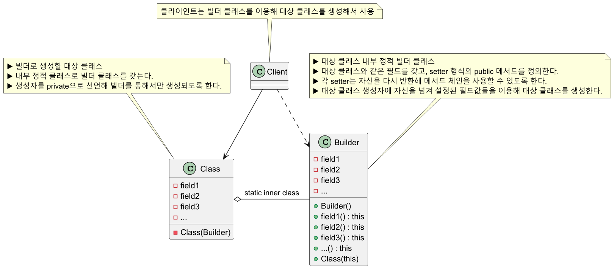
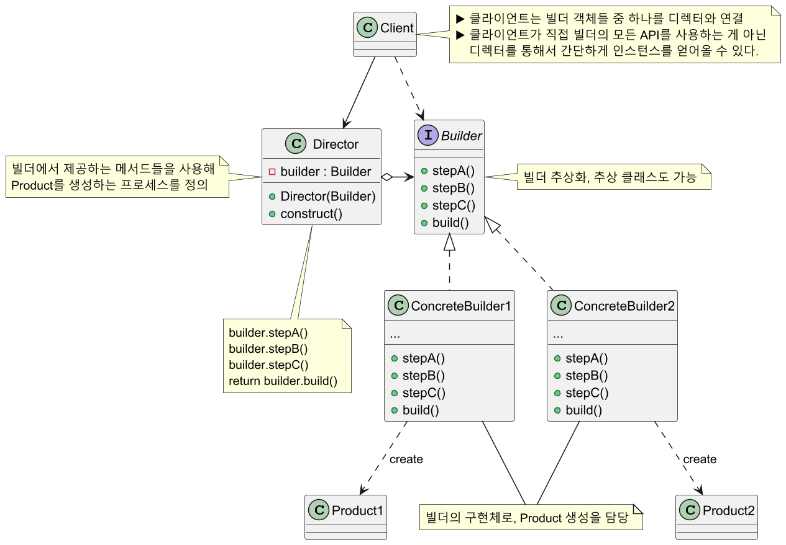
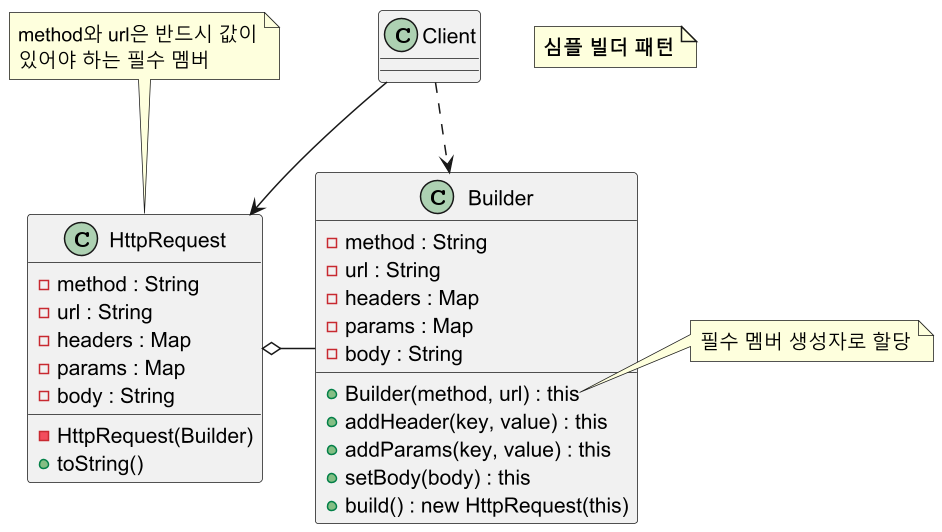
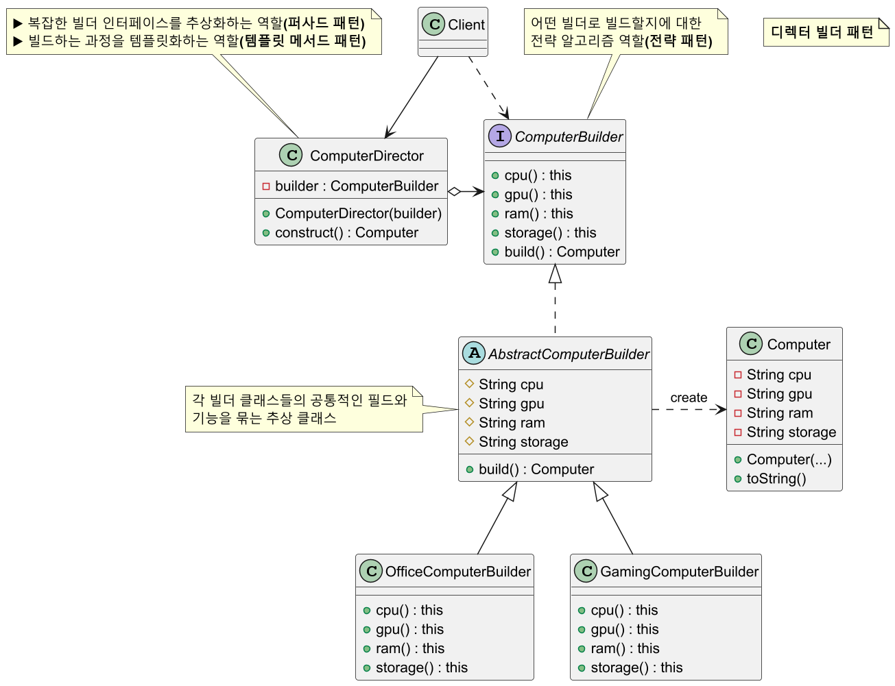

# 빌더 패턴

## 빌더 패턴 정의

복잡한 객체의 생성 과정과 표현 방법을 분리하여 다양한 구성의 인스턴스를 만드는 패턴

생성자에 들어갈 매개변수를 메서드로 하나씩 받아들이고 마지막에 통합 빌드해서 객체를 생성하는 방식이다.

## 빌더 패턴 구조

### 심플 빌더 패턴



### 디렉터 빌더 패턴



## 빌더 패턴 예제 코드 - 1


```java
public class Pizza {

    private final String dough;
    private final String sauce;
    private final String topping;

    private Pizza(Builder builder) {
        this.dough = builder.dough;
        this.sauce = builder.sauce;
        this.topping = builder.topping;
    }

    @Override
    public String toString() {
        return "Pizza{" +
            "dough='" + dough + '\'' +
            ", sauce='" + sauce + '\'' +
            ", topping='" + topping + '\'' +
            '}';
    }

    public static class Builder {

        private String dough;
        private String sauce;
        private String topping;

        public Builder dough(String dough) {
            this.dough = dough;
            return this;
        }

        public Builder sauce(String sauce) {
            this.sauce = sauce;
            return this;
        }

        public Builder topping(String topping) {
            this.topping = topping;
            return this;
        }

        public Pizza build() {
            return new Pizza(this);
        }
    }
}
```
```java
public class Client {
    public static void main(String[] args) throws IOException {

        Pizza pizza = new Pizza.Builder()
                               .dough("Thin Crust")
                               .sauce("Tomato")
                               .topping("Cheese")
                               .build();
        System.out.println("pizza = " + pizza);
        //pizza = Pizza{dough='Thin Crust', sauce='Tomato', topping='Cheese'}

        //유연하게 다양한 구성의 인스턴스를 생성하는 시나리오
        BufferedReader br = new BufferedReader(new InputStreamReader(System.in));
        String orderType = br.readLine();

        Pizza.Builder builder = new Pizza.Builder()
                                         .dough("Regular");

        if (orderType.equalsIgnoreCase("Veggie")) {
            builder.topping("Vegetables");
        }
        else {
            builder.topping("Pepperoni");
        }

        builder.sauce("Pesto");

        Pizza pizza1 = builder.build();
        System.out.println("pizza1 = " + pizza1);
        //pizza1 = Pizza{dough='Regular', sauce='Pesto', topping='Vegetables'}
    }
}
```

## 빌더 패턴 예제 코드 - 2



```java
public class HttpRequest {

    //필수 멤버
    private final String method;
    private final String url;

    //선택적 멤버
    private Map<String, String> headers;
    private Map<String, String> params;
    private String body;

    private HttpRequest(Builder builder) {
        this.method = builder.method;
        this.url = builder.url;
        this.headers = builder.headers;
        this.params = builder.params;
        this.body = builder.body;
    }

    @Override
    public String toString() {
        return "HttpRequest{" +
            "method='" + method + '\'' +
            ", url='" + url + '\'' +
            ", headers=" + headers +
            ", params=" + params +
            ", body='" + body + '\'' +
            '}';
    }

    public static class Builder {

        private final String method;
        private final String url;
        private final Map<String, String> headers = new HashMap<>();
        private final Map<String, String> params = new HashMap<>();
        private String body;

        //초기화가 필수인 멤버를 빌더의 생성자로 받게 하여 필수 멤버를 설정해주어야
        //빌더 객체가 생성되도록 유도
        public Builder(String method, String url) {
            this.method = method;
            this.url = url;
        }

        public Builder addHeader(String key, String value) {
            this.headers.put(key, value);
            return this;
        }

        public Builder addParams(String key, String value) {
            this.params.put(key, value);
            return this;
        }

        public Builder setBody(String body) {
            this.body = body;
            return this;
        }

        public HttpRequest build() {
            return new HttpRequest(this);
        }
    }
}
```
```java
public class Client {
    public static void main(String[] args) {

        HttpRequest getRequest = new HttpRequest.Builder("GET", "https://example.com/api")
                                                .addHeader("Authorization", "Bearer Token")
                                                .addParams("query", "builder-pattern")
                                                .build();

        System.out.println("getRequest = " + getRequest);
        /*
         * getRequest = HttpRequest{
         *      method='GET',
         *      url='https://example.com/api',
         *      headers={Authorization=Bearer Token},
         *      params={query=builder-pattern},
         *      body='null'
         * }
         */

        HttpRequest postRequest = new HttpRequest.Builder("POST", "https://example.com/api")
                                                 .addHeader("Authorization", "Bearer Token")
                                                 .setBody("{\"name\" : \"John\", \"age\" : 30}")
                                                 .build();

        System.out.println("postRequest = " + postRequest);
        /*
         * postRequest = HttpRequest{
         *      method='POST',
         *      url='https://example.com/api',
         *      headers={Authorization=Bearer Token},
         *      params={},
         *      body='{"name" : "John", "age" : 30}'
         * }
         */
    }
}
```

## 빌더 패턴 예제 코드 - 3



```java
public class Computer {

    private final String cpu;
    private final String gpu;
    private final String ram;
    private final String storage;

    public Computer(String cpu, String gpu, String ram, String storage) {
        this.cpu = cpu;
        this.gpu = gpu;
        this.ram = ram;
        this.storage = storage;
    }

    @Override
    public String toString() {
        return "Computer {" +
            "CPU='" + cpu + '\'' +
            ", GPU='" + gpu + '\'' +
            ", RAM='" + ram + '\'' +
            ", Storage='" + storage + '\'' +
            '}';
    }
}
```
```java
public interface ComputerBuilder {
    ComputerBuilder cpu();
    ComputerBuilder gpu();
    ComputerBuilder ram();
    ComputerBuilder storage();
    Computer build();
}
```
```java
public abstract class AbstractComputerBuilder implements ComputerBuilder {

    protected String cpu;
    protected String gpu;
    protected String ram;
    protected String storage;

    @Override
    public Computer build() {
        return new Computer(cpu, gpu, ram, storage);
    }
}
```
```java
public class OfficeComputerBuilder extends AbstractComputerBuilder {

    @Override
    public ComputerBuilder cpu() {
        this.cpu = "Intel i5-13400";
        return this;
    }

    @Override
    public ComputerBuilder gpu() {
        this.gpu = "Integrated Graphics";
        return this;
    }

    @Override
    public ComputerBuilder ram() {
        this.ram = "16GB DDR4";
        return this;
    }

    @Override
    public ComputerBuilder storage() {
        this.storage = "512GB SSD";
        return this;
    }
}
```
```java
public class GamingComputerBuilder extends AbstractComputerBuilder {

    @Override
    public ComputerBuilder cpu() {
        this.cpu = "Intel i9-13900K";
        return this;
    }

    @Override
    public ComputerBuilder gpu() {
        this.gpu = "NVIDIA RTX 4090";
        return this;
    }

    @Override
    public ComputerBuilder ram() {
        this.ram = "32GB DDR5";
        return this;
    }

    @Override
    public ComputerBuilder storage() {
        this.storage = "2TB NVMe SSD";
        return this;
    }
}
```
```java
public class ComputerDirector {

    private final ComputerBuilder builder;

    public ComputerDirector(ComputerBuilder builder) {
        this.builder = builder;
    }

    public Computer construct() {

        return builder.cpu()
                      .gpu()
                      .ram()
                      .storage()
                      .build();
    }
}
```
```java
public class Client {
    public static void main(String[] args) {

        ComputerDirector computerDirector;

        //게이밍 컴퓨터 빌더 선택
        computerDirector = new ComputerDirector(new GamingComputerBuilder());

        Computer gamingComputer = computerDirector.construct();
        System.out.println("gamingComputer = " + gamingComputer);
        //gamingComputer = Computer {CPU='Intel i9-13900K', GPU='NVIDIA RTX 4090', RAM='32GB DDR5', Storage='2TB NVMe SSD'}

        //사무용 컴퓨터 빌더 선택
        computerDirector = new ComputerDirector(new OfficeComputerBuilder());

        Computer OfficeComputer = computerDirector.construct();
        System.out.println("OfficeComputer = " + OfficeComputer);
        //OfficeComputer = Computer {CPU='Intel i5-13400', GPU='Integrated Graphics', RAM='16GB DDR4', Storage='512GB SSD'}
    }
}
```

## 빌더 패턴 장단점

### 빌더 패턴 장점

- 객체 생성 과정을 일관된 프로세스로 표현할 수 있다.
- 필수 멤버와 선택적 멤버를 분리할 수 있다.
- 객체 생성 단계를 지연할 수 있다.
- 초기화 검증을 멤버별로 분리할 수 있다.
- 멤버에 대한 변경 가능성 최소화를 추구한다.

### 빌더 패턴 단점

- 클래스마다 빌더 클래스를 만들어야 해서 관리해야 할 클래스 수가 많아진다.
- 생성자보다는 성능이 떨어진다.
- 클래스의 필드가 많지 않고(4개 이하 정도), 필드의 변경 가능성이 없다면 차라리 
생성자나 정적 팩토리 메서드를 이용하는 것이 더 좋을 수 있다.

## 실전에서 사용되는 빌더 패턴

- `java.lang.StringBuilder.append()`
- `java.lang.StringBuffer.append()`
- `java.nio.ByteBuffer.put()`
  - `CharBuffer`, `ShortBuffer`, `IntBuffer`, `LongBuffer`, `FloatBuffer`, `DoubleBuffer`에도 사용
- `javax.swing.GroupLayout.Group.addComponent()`
- `java.lang.Appendable` 구현체
- `java.util.stream.Stream.Builder`

---

### 참고

- [참고 블로그](https://inpa.tistory.com/entry/GOF-%F0%9F%92%A0-%EB%B9%8C%EB%8D%94Builder-%ED%8C%A8%ED%84%B4-%EB%81%9D%ED%8C%90%EC%99%95-%EC%A0%95%EB%A6%AC)
- [참고 사이트](https://refactoring.guru/ko/design-patterns/builder)
- [참고 강의](https://www.inflearn.com/course/%EA%B0%9D%EC%B2%B4%EC%A7%80%ED%96%A5-%EB%94%94%EC%9E%90%EC%9D%B8-%ED%8C%A8%ED%84%B4-%EC%96%84%EC%BD%94/dashboard)
- [참고 책](https://www.yes24.com/Product/Goods/108192370)