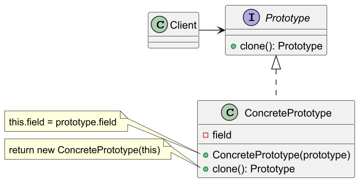
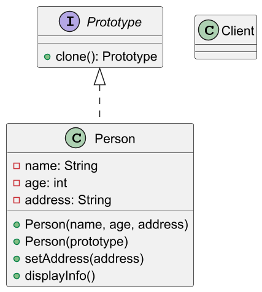
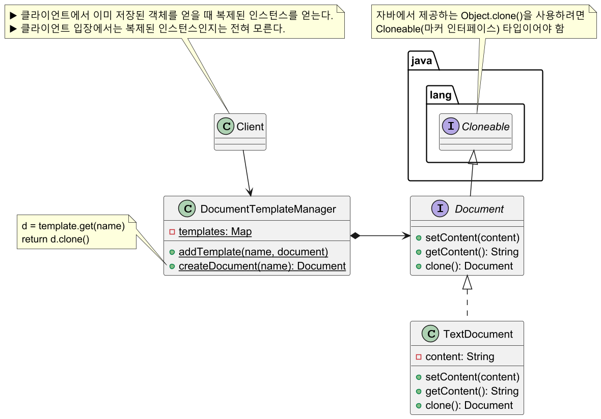

# 프로토타입 패턴

## 프로토타입 패턴 정의

기존 인스턴스를 복제하여 새로운 인스턴스를 만드는 메커니즘을 제공하는 패턴으로,
기존 인스턴스를 복사하기만 해도 새로운 인스턴스를 만들 수 있다.

클라이언트 코드에서 어떤 클래스의 인스턴스를 만드는지 전혀 모르는 상태에서도 새로운
인스턴스를 만들 수 있다.

## 프로토타입 패턴 구조



## 프로토타입 패턴 예제 코드 - 1



```java
public interface Prototype {
    Prototype myClone();
}
```
```java
public class Person implements Prototype {

    private String name;
    private int age;
    private String address;

    public Person(String name, String address, int age) {
        this.name = name;
        this.address = address;
        this.age = age;
    }

    public Person(Person other) {
        this.name = other.name;
        this.address = other.address;
        this.age = other.age;
    }

    @Override
    public Person myClone() {
        return new Person(this);
    }

    public void setAddress(String address) {
        this.address = address;
    }

    public void displayInfo() {
        System.out.printf(
            "Name: %s, Age: %d, Address: %s\n",
            name, age, address
        );
    }

    @Override
    public boolean equals(Object o) {
        if (this == o) return true;
        if (!(o instanceof Person person)) return false;
        return age == person.age && Objects.equals(name, person.name) && Objects.equals(address, person.address);
    }

    @Override
    public int hashCode() {
        return Objects.hash(name, age, address);
    }
}
```
```java
public class Client {
    public static void main(String[] args) {

        Person original = new Person("John", "123 Main St", 30);
        original.displayInfo();
        //Name: John, Age: 30, Address: 123 Main St

        Person cloned = original.myClone();

        System.out.println(original.equals(cloned)); //true
        System.out.println(original == cloned); //false

        cloned.setAddress("456 Clone St");

        original.displayInfo();
        //Name: John, Age: 30, Address: 123 Main St

        cloned.displayInfo();
        //Name: John, Age: 30, Address: 456 Clone St
    }
}
```

## 프로토타입 패턴 예제 코드 - 2



```java
public interface Document extends Cloneable {
    void setContent(String content);
    String getContent();
    Document clone(); //Object의 clone 메서드
}
```
```java
public class TextDocument implements Document {

    private String content;

    public TextDocument(String content) {
        this.content = content;
    }

    @Override
    public String getContent() {
        return content;
    }

    @Override
    public void setContent(String content) {
        this.content = content;
    }

    @Override
    public Document clone() {
        try {
            return (Document) super.clone();
            //참조형 필드가 있다면 직접 깊은 복사 코드 추가 필요
        } catch (CloneNotSupportedException e) {
            throw new RuntimeException(e);
        }
    }
}
```
```java
public class DocumentTemplateManager {

    private static final Map<String, Document> templates = new HashMap<>();

    public static void addTemplate(String name, Document document) {
        templates.put(name, document);
    }

    public static Document createDocument(String templateName) {
        Document template = templates.get(templateName);

        if (template == null) {
            throw new IllegalArgumentException();
        }

        return template.clone();
    }
}
```
```java
public class Client {
    public static void main(String[] args) {

        DocumentTemplateManager.addTemplate(
            "welcome",
            new TextDocument("Welcome, {name}!")
        );
        DocumentTemplateManager.addTemplate(
            "meeting",
            new TextDocument("Meeting scheduled on {date} at {time}")
        );

        Document welcomeDoc = DocumentTemplateManager.createDocument("welcome");

        welcomeDoc.setContent(
            welcomeDoc.getContent()
                      .replace("{name}", "John Doe")
        );

        System.out.println("Welcome Document: " + welcomeDoc.getContent());
        //Welcome Document: Welcome, John Doe!

        Document meetingDoc = DocumentTemplateManager.createDocument("meeting");
        
        meetingDoc.setContent(
            meetingDoc.getContent()
                      .replace("{date}", "2030-11-11")
                      .replace("{time}", "14:00")
        );

        System.out.println("Meeting Document: " + meetingDoc.getContent());
        //Meeting Document: Meeting scheduled on 2030-11-11 at 14:00
    }
}
```

## 프로토타입 패턴 장단점

### 프로토타입 패턴 장점

- 클라이언트는 새로운 인스턴스를 만드는 과정을 몰라도 된다.
- 클라이언트는 구체적인 형식을 몰라도 객체를 생성할 수 있다.
- 상황에 따라서 객체를 새로 생성하는 것보다 객체를 복사하는 것이 더 효율적일 수 있다.

### 프로토타입 패턴 단점

- 객체의 복사본을 만드는 일이 매우 복잡할 수도 있다.

## 실전에서 사용되는 프로토타입 패턴

- `ArrayList` 등 컬렉션 생성자 복사
- `ModelMapper`

---

### 참고

- [참고 사이트](https://refactoring.guru/ko/design-patterns/prototype)
- [참고 강의](https://www.inflearn.com/course/%EA%B0%9D%EC%B2%B4%EC%A7%80%ED%96%A5-%EB%94%94%EC%9E%90%EC%9D%B8-%ED%8C%A8%ED%84%B4-%EC%96%84%EC%BD%94/dashboard)
- [참고 책](https://www.yes24.com/Product/Goods/108192370)