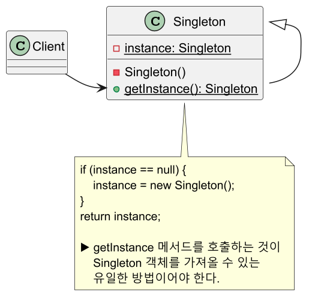
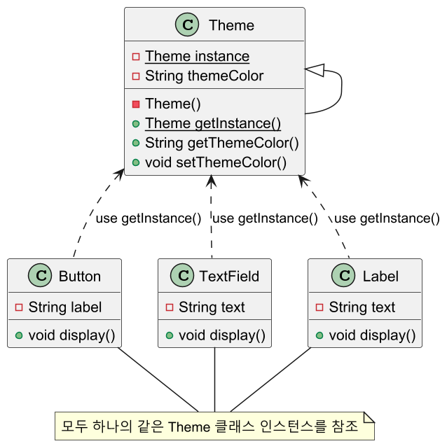
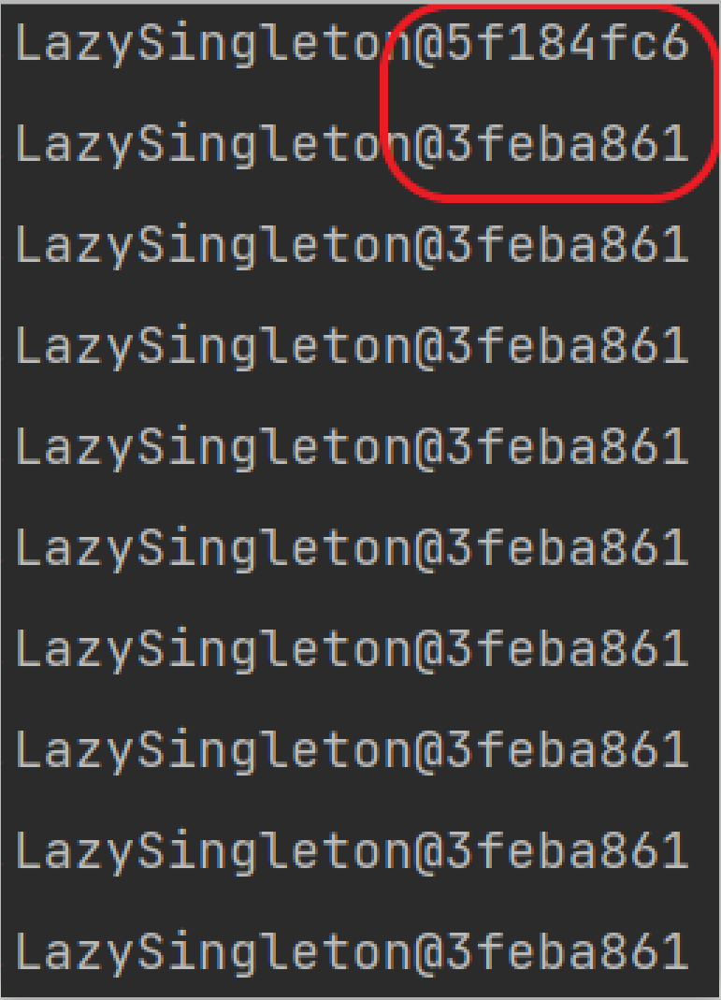

# 싱글톤 패턴

## 싱글톤 패턴 정의

클래스 인스턴스를 하나만 만들고, 그 인스턴스로의 전역 접근을 제공한다.

## 싱글톤 패턴 구조



## 싱글톤 패턴 예제 코드



```java
//Singleton
public class Theme {

    private static Theme instance;
    private String themeColor;

    private Theme() {
        this.themeColor = "light"; //Default theme
    }

    public static Theme getInstance() {
        if (instance == null) {
            instance = new Theme();
        }
        return instance;
    }

    public String getThemeColor() {
        return themeColor;
    }

    public void setThemeColor(String themeColor) {
        this.themeColor = themeColor;
    }
}
```

```java
//Client
public class Button {

    private final String label;

    public Button(String label) {
        this.label = label;
    }

    public void display() {
        String themeColor = Theme.getInstance().getThemeColor();
        System.out.println(
            "Button [" + label + "] displayed in " + themeColor + " theme."
        );
    }
}
```
```java
//Client
public class TextField {

    private final String text;

    public TextField(String text) {
        this.text = text;
    }

    public void display() {
        String themeColor = Theme.getInstance().getThemeColor();
        System.out.println(
            "TextField [" + text + "] displayed in " + themeColor + " theme."
        );
    }
}
```
```java
//Client
public class Label {

    private final String text;

    public Label(String text) {
        this.text = text;
    }

    public void display() {
        String themeColor = Theme.getInstance().getThemeColor();
        System.out.println(
            "Label [" + text + "] displayed in " + themeColor + " theme."
        );
    }
}
```
```java
public class Main {
    public static void main(String[] args) {

        Button button = new Button("Submit");
        TextField textField = new TextField("Enter your name");
        Label label = new Label("Username");

        button.display();
        textField.display();
        label.display();

        System.out.println("\n.............setThemeColor.............\n");

        Theme.getInstance().setThemeColor("dark");

        button.display();
        textField.display();
        label.display();
        
        //Output
        //Button [Submit] displayed in light theme.
        //TextField [Enter your name] displayed in light theme.
        //Label [Username] displayed in light theme.
        //
        //.............setThemeColor.............
        //
        //Button [Submit] displayed in dark theme.
        //TextField [Enter your name] displayed in dark theme.
        //Label [Username] displayed in dark theme.
    }
}
```

## 싱글톤 패턴 구현 기법 종류

싱글톤 패턴은 정말 간단하게 구현할 수 있지만 잘못 사용하면 많은 문제가 발생할 수 있는 패턴이다.

특히 멀티스레딩 환경에서 싱글톤 패턴 구현에 신경을 써야한다.

다음은 싱글톤 패턴을 가장 간단한 방법부터 점점 단점을 보완해나가는 7가지 코드 기법들이다.

1. Eager initialization
2. Static block initialization
3. Lazy Initialization
4. Thread safe Initialization
5. Double-Checked Locking
6. **Bill Pugh Solution**
7. **Enum 이용**

### 1. Eager initialization

- 가장 직관적이면서 심플한 기법으로, 한번만 **미리** 만들어두는 방식이다.
- `static final`이기 때문에 멀티 스레드 환경에서 안전하다.
- 하지만 `static` 멤버는 당장 객체를 사용하지 않더라도 메모리에 적재하기 때문에
객체 생성에 큰 리소스가 필요한 경우, 공간 자원 낭비가 발생한다.
- 또 예외 처리를 할 수 없다.
- 싱글톤을 적용한 객체가 크지 않은 객체라면 이 기법을 적용해도 무리는 없다.

```java
public class EagerSingleton {

    private static final EagerSingleton INSTANCE = new EagerSingleton();

    private EagerSingleton() { }

    public static EagerSingleton getINSTANCE() {
        return INSTANCE;
    }
}
```

### 2. Static block initialization

- `static block` : 클래스가 로딩되고 클래스 변수가 준비된 후 자동으로 실행되는 블록
- `static block`을 이용해 예외를 잡을 수 있다.
- 여전히 `static`의 특성으로 사용하지 않는데도 공간을 차지한다.

```java
public class StaticSingleton {

    private static StaticSingleton instance;

    private StaticSingleton() { }

    static {
        try {
            instance = new StaticSingleton();
        }catch (Exception e) {
            throw new RuntimeException("싱글톤 객체 생성 중 오류 발생");
        }
    }

    public static StaticSingleton getInstance() {
        return instance;
    }
}
```

### 3. Lazy Initialization

- 객체 생성에 대한 관리를 내부적으로 처리하는 기법
- 메서드를 호출했을 때 인스턴스 변수의 `null` 여부에 따라 초기화 또는 생성된 객체를 반환한다.
- 위에서 본 미사용 객체의 고정 메모리 차지 한계를 극복할 수 있다.
- **그러나 스레드 세이프하지 않는 치명적인 단점이 있다.**

```java
public class LazySingleton {

    private static LazySingleton instance;

    private LazySingleton() {
    }

    public static LazySingleton getInstance() {
        if (instance == null) {
            instance = new LazySingleton();
        }
        return instance;
    }
}
```

- 첫 스레드가 처음 인스턴스를 생성하기 직전에 다른 스레드가 `if`문으로 진입하면서
또 다른 새로운 객체를 생성할 수 있는 문제가 있다.
- 다음은 그 문제를 확인해보는 코드다.

```java
class Test {
    public static void main(String[] args) throws InterruptedException {

        ThreadSafeSingleton[] singletons = new ThreadSafeSingleton[10];

        ExecutorService service = Executors.newFixedThreadPool(3);

        for (int i = 0; i < singletons.length; i++) {
            final int idx = i;
            service.submit(() -> singletons[idx] = ThreadSafeSingleton.getInstance());
        }

        service.shutdown();
        service.awaitTermination(5, TimeUnit.SECONDS);

        for (ThreadSafeSingleton singleton : singletons) {
            System.out.println(singleton);
        }
    }
}
```



이와 같이 항상 싱글톤임을 보장하지 않는다.

### 4. Thread safe Initialization

- `synchronized` 키워드를 이용해 메서드에 스레드들이 하나씩 접근하게 하도록 설정한다. (동기화)
- 하지만 매번 객체를 가져올 때 `synchronized` 메서드를 호출해 동기화 처리 작업에
오버헤드가 발생해 **성능 하락**이 발생한다.

```java
public class ThreadSafeSingleton {

    private static ThreadSafeSingleton instance;

    private ThreadSafeSingleton() { }

    //synchronized 키워드 추가
    public static synchronized ThreadSafeSingleton getInstance() {
        if (instance == null) {
            instance = new ThreadSafeSingleton();
        }
        return instance;
    }
}
```

### 5. Double-Checked Locking

- 매번 `synchronized` 동기화를 실행하는 문제를 해결하기 위해 최초 초기화할때만 동기화를 적용하고
이미 만들어진 인스턴스를 반환할때는 동기화를 사용하지 않도록 하는 기법
- 인스턴스 필드에 `volatile` 키워드를 붙여 I/O 불일치 문제를 해결한다.
- 그러나 `volatile` 키워드를 이용하기 위해 JVM 1.5 이상이어야 한다. 
- 또한 JVM에 따라서 여전히 스레드 세이프 하지 않는 경우가 발생하기 때문에 
**사용하기를 지양하는** 기법이다.

```java
public class DCLSingleton {

    private static volatile DCLSingleton instance;

    private DCLSingleton() { }

    public static DCLSingleton getInstance() {
        if (instance == null) {
            synchronized (DCLSingleton.class) {
                if (instance == null) {
                    instance = new DCLSingleton();
                }
            }
        }

        return instance;
    }
}
```

### 6. Bill Pugh Solution (★)

- **권장되는 방법 1**
- 멀티스레드 환경에서 안전하며 `Lazy Loading`도 가능한 완벽한 싱글톤 기법이다.
- 클래스 안에 `holder` 내부 클래스를 두어 JVM의 클래스 로더 메커니즘과
클래스가 로드되는 시점을 이용한 방법이다.(스레드 세이프)
- `static` 메서드는 `static` 멤버만을 호출할 수 있기 때문에 내부 클래스를 `static`으로 설정한다. 
또한, 내부 `static` 클래스는 내부 클래스의 치명적인 메모리 누수 문제를 해결한다.
- **다만 클라이언트가 Reflection API, 직렬화/역직렬화를 통해 임의로 싱글톤을 파괴할 수 있다는 단점이 있다.**

```java
public class BillPughSingleton {

    private BillPughSingleton() {}

    private static class SingletonInstanceHolder {
        private static final BillPughSingleton INSTANCE = new BillPughSingleton();
    }

    public static BillPughSingleton getInstance() {
        return SingletonInstanceHolder.INSTANCE;
    }
}
```

1. 내부 클래스를 `static`으로 선언했기 때문에, 싱글톤 클래스가 초기화되어도
`Holder` 내부 클래스는 메모리에 로드되지 않는다.
2. `getInstance()`를 호출할 때, `Holder` 내부 클래스의 `static` 멤버를 가져와 리턴하는데,
이때 내부 클래스가 한번만 초기화되면서 싱글톤 객체를 최초로 생성 및 리턴하게 된다.
3. 또한 `final`로 지정하여 다시 값이 할당되지 않도록 방지한다.

### 7. Enum 이용 (★)

- **권장되는 방법 2**
- `enum`은 애초에 멤버를 만들 때 `private`으로 만들고 한번만 초기화하기 때문에 스레드 세이프하다.
- `enum` 내에서 상수 뿐만 아니라, 변수나 메서드를 선언해 사용이 가능하기 때문에 
이를 이용해 싱글톤 클래스처럼 응용 가능하다.
- 바로 위 기법과는 달리, 클라이언트에서 `Reflection`을 통한 공격에도 안전하다.
- **하지만 싱글톤 클래스를 일반 클래스로 변경해야할 때 처음부터 코드를 다시 짜야되는
단점이 있다.**
- **또 클래스 상속이 필요할 때, `enum` 외의 클래스 상속은 불가능하다.**

```java
public enum EnumSingleton {
    
    INSTANCE; //필드는 한개

    private int count;

    public void doSomeThing() { }

    public void increment() {
        count++;
    }

    public int getCount() {
        return count;
    }

    public static void main(String[] args) {
        EnumSingleton singleton = EnumSingleton.INSTANCE;
        singleton.doSomeThing();
        singleton.increment();
        int count = singleton.getCount();
    }
}
```

## 싱글톤 패턴 장단점

### 싱글톤 장점

- 클래스가 하나의 인스턴스만 갖는다는 것을 확신할 수 있다.
- 싱글톤 클래스는 고정된 메모리 영역을 가지고 하나의 인스턴스만 사용해 메모리 
낭비를 방지할 수 있다.

### 싱글톤 단점

- 대부분 싱글톤을 이용하는 경우 인터페이스가 아닌 클래스의 객체를 미리 생성하고 
정적 메서드를 이용해 사용하기 때문에 클래스 사이에 강한 의존성과 높은 결합이 생기게 된다.
- 싱글톤 인스턴스 자체가 하나만 생성되기 때문에 여러가지 책임을 지니게 되는 경우가 많다.(**SRP** 위반)
- 싱글톤 인스턴스가 혼자 너무 많은 일을 하거나, 많은 데이터를 공유시키면 다른
클래스들 간의 결합도가 높아지게 된다.(**OCP** 위반)
- 의존 관계상 클라이언트가 추상화가 아닌, 구체 클래스에 의존하게 된다.(**DIP** 위반)
- **테스트가 어렵다.** 단위 테스트시, 테스트는 서로 독립적으로 순서에 의존하면 안되는데 싱글톤 인스턴스는
자원을 공유하고 있다. 

## 실전에서 사용되는 싱글톤 패턴

- `java.lang.Runtime.getRuntime()`
- `java.awt.Desktop.getDesktop()`
- `java.lang.System.getSecurityManager()`

---

### 참고

- [참고 블로그](https://inpa.tistory.com/entry/GOF-%F0%9F%92%A0-%EC%8B%B1%EA%B8%80%ED%86%A4Singleton-%ED%8C%A8%ED%84%B4-%EA%BC%BC%EA%BC%BC%ED%95%98%EA%B2%8C-%EC%95%8C%EC%95%84%EB%B3%B4%EC%9E%90#%EC%8B%B1%EA%B8%80%ED%86%A4_%ED%8C%A8%ED%84%B4%EC%9D%80_%EC%95%88%ED%8B%B0_%ED%8C%A8%ED%84%B4?)
- [참고 사이트](https://refactoring.guru/ko/design-patterns/singleton)
- [참고 강의](https://www.inflearn.com/course/%EA%B0%9D%EC%B2%B4%EC%A7%80%ED%96%A5-%EB%94%94%EC%9E%90%EC%9D%B8-%ED%8C%A8%ED%84%B4-%EC%96%84%EC%BD%94/dashboard)
- [참고 책](https://www.yes24.com/Product/Goods/108192370)