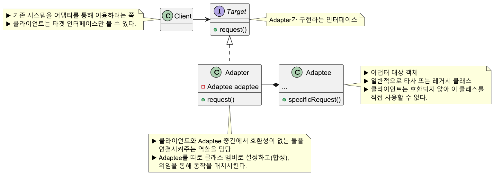
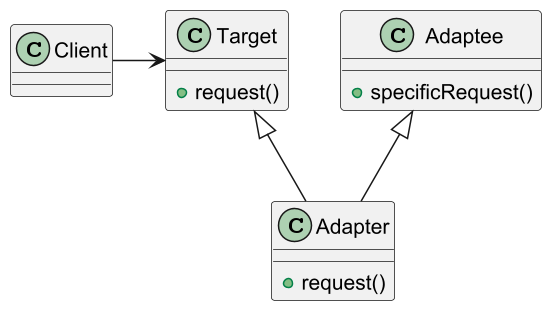
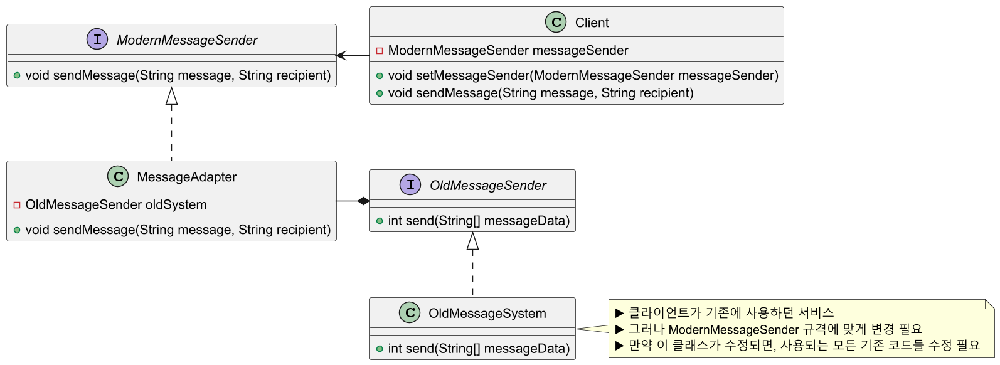
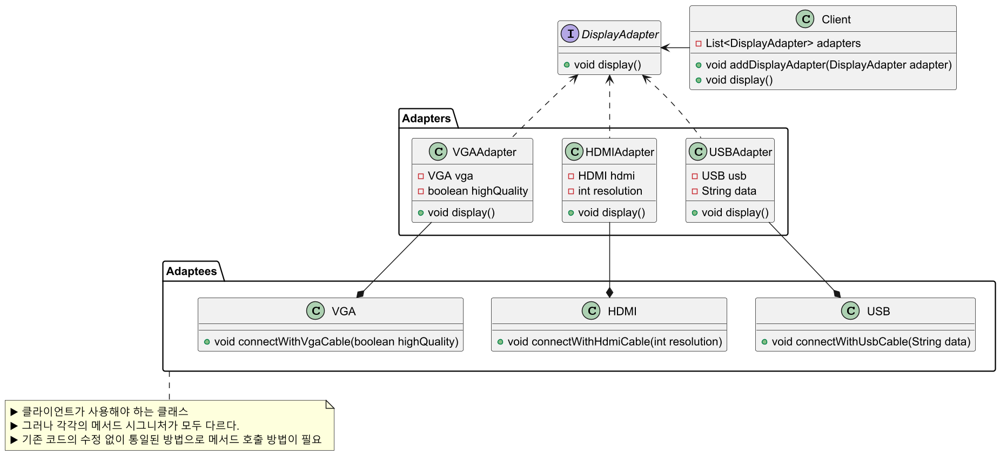
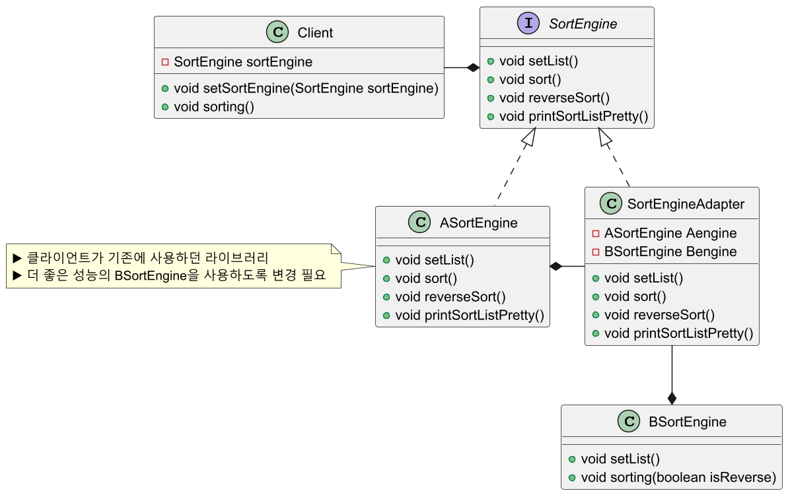

# 어댑터 패턴

## 어댑터 패턴 정의

특정 클래스 인터페이스를 클라이언트에서 요구하는 다른 인터페이스로 변환한다.
인터페이스가 호환되지 않아 같이 쓸 수 없었던 클래스를 사용할 수 있게 도와준다.

## 어댑터 패턴 구조

### 객체 어댑터 (Object Adapter) (★)

- 합성(Composition)된 멤버에게 위임을 이용한 어댑터 패턴
- 합성을 활용했기 때문에 런타임 중에 `Adaptee`가 결정되어 유연하다.
- 그러나 `Adaptee` 객체를 필드 변수로 저쟁해야 되기 때문에 공간 차지 비용이 든다.



### 클래스 어댑터 (Class Adapter)

- 클래스 상속을 이용한 어댑터 패턴
- `Adaptee`를 상속했기 때문에 따로 객체 구현없이 바로 코드 재사용이 가능하다.
- 다중 상속을 지원하는 언어에서만 구현할 수 있다.



## 어댑터 패턴 예제 코드 - 1



```java
//Adaptee
public interface OldMessageSender {
    int send(String[] messageData);
}
```
```java
//Target
public interface ModernMessageSender {
    void sendMessage(String message, String recipient);
}
```
```java
//Concrete Adaptee
public class OldMessageSystem implements OldMessageSender {

    @Override
    public int send(String[] messageData) {
        System.out.printf(
            "OldMessageSystem: Sending message: %s to %s\n",
            messageData[0], messageData[1]
        );

        return 1; //Success code
    }
}
```
```java
//Adapter
public class MessageAdapter implements ModernMessageSender {

    //Composition Adaptee
    private final OldMessageSender oldSystem;

    public MessageAdapter(OldMessageSender oldSystem) {
        this.oldSystem = oldSystem;
    }

    @Override
    public void sendMessage(String message, String recipient) {

        int result = oldSystem.send(new String[]{message, recipient});

        if (result != 1) {
            System.out.println("Failed to send message");
        }
    }
}
```
```java
//Client
public class Client {

    ModernMessageSender messageSender;

    void setMessageSender(ModernMessageSender messageSender) {
        this.messageSender = messageSender;
    }

    void sendMessage(String message, String recipient) {
        messageSender.sendMessage(message, recipient);
    }

    public static void main(String[] args) {

        Client client = new Client();

        ModernMessageSender adapter = new MessageAdapter(new OldMessageSystem());
/*
        //람다 사용
        ModernMessageSender adapter = new MessageAdapter(messageData -> {
            System.out.printf(
                "OldMessageSystem: Sending message: %s to %s\n",
                messageData[0], messageData[1]
            );

            return 1; //Success code
        });
*/
        client.setMessageSender(adapter);
        client.sendMessage("Hello, World!", "john@example.com");

        //Output
        //OldMessageSystem: Sending message: Hello, World! to john@example.com
    }
}
```

## 어댑터 패턴 예제 코드 - 2



```java
//Adaptee
public class VGA {
    public void connectWithVgaCable(boolean highQuality) {
        System.out.println(
            "Displaying via VGA with high quality: " + highQuality
        );
    }
}
```
```java
//Adaptee
public class HDMI {
    public void connectWithHdmiCable(int resolution) {
        System.out.println(
            "Displaying via HDMI with resolution: " + resolution + "p"
        );
    }
}
```
```java
//Adaptee
public class USB {
    public void connectWithUsbCable(String data) {
        System.out.println("Displaying via USB with data: " + data);
    }
}
```
```java
//Target
public interface DisplayAdapter {
    void display();
}
```
```java
//Adapter
public class VGAAdapter implements DisplayAdapter {

    private final VGA vga;
    private final boolean highQuality;

    public VGAAdapter(VGA vga, boolean highQuality) {
        this.vga = vga;
        this.highQuality = highQuality;
    }

    @Override
    public void display() {
        vga.connectWithVgaCable(highQuality);
    }
}
```
```java
//Adapter
public class HDMIAdapter implements DisplayAdapter {

    private final HDMI hdmi;
    private final int resolution;

    public HDMIAdapter(HDMI hdmi, int resolution) {
        this.hdmi = hdmi;
        this.resolution = resolution;
    }

    @Override
    public void display() {
        hdmi.connectWithHdmiCable(resolution);
    }
}
```
```java
//Adapter
public class USBAdapter implements DisplayAdapter {

    private final USB usb;
    private final String data;

    public USBAdapter(USB usb, String data) {
        this.usb = usb;
        this.data = data;
    }

    @Override
    public void display() {
        usb.connectWithUsbCable(data);
    }
}
```
```java
//Client
public class Client {

    List<DisplayAdapter> adapters = new ArrayList<>();

    void addDisplayAdapter(DisplayAdapter adapter) {
        this.adapters.add(adapter);
    }

    void display() {
        this.adapters.forEach(DisplayAdapter::display);
    }

    public static void main(String[] args) {

        Client client = new Client();

        USB usb = new USB();
        HDMI hdmi = new HDMI();
        VGA vga = new VGA();
/*
        //람다 사용
        client.addDisplayAdapter(() -> usb.connectWithUsbCable("Video Data"));
        client.addDisplayAdapter(() -> hdmi.connectWithHdmiCable(1080));
        client.addDisplayAdapter(() -> vga.connectWithVgaCable(true));
*/
        client.addDisplayAdapter(new USBAdapter(usb, "Video Data"));
        client.addDisplayAdapter(new HDMIAdapter(hdmi, 1080));
        client.addDisplayAdapter(new VGAAdapter(vga, true));

        client.display();
        
        //Output
        //Displaying via USB with data: Video Data
        //Displaying via HDMI with resolution: 1080p
        //Displaying via VGA with high quality: true
    }
}
```

## 어댑터 패턴 예제 코드 - 3



```java
//Target
public interface SortEngine {
    void setList();
    void sort();
    void reverseSort();
    void printSortListPretty();
}
```
```java
//Adaptee
public class ASortEngine implements SortEngine {

    @Override
    public void setList() {...}

    @Override
    public void sort() {...}

    @Override
    public void reverseSort() {...}

    @Override
    public void printSortListPretty() {...}
}
```
```java
//Adaptee
public class BSortEngine {
    public void setList() {...}
    public void sorting(boolean isReverse) {...}
}
```
```java
//Adapter
public class SortEngineAdapter implements SortEngine {

    private final ASortEngine Aengine;
    private final BSortEngine Bengine;

    public SortEngineAdapter(ASortEngine Aengine, BSortEngine Bengine) {
        this.Aengine = Aengine;
        this.Bengine = Bengine;
    }

    @Override
    public void setList() {
        Bengine.setList();
    }

    @Override
    public void sort() {
        Bengine.sorting(false);
    }

    @Override
    public void reverseSort() {
        Bengine.sorting(true);
    }

    @Override
    public void printSortListPretty() {
        Aengine.printSortListPretty();
    }
}
```
```java
//Client
public class Client {

    SortEngine sortEngine;

    void setSortEngine(SortEngine sortEngine) {
        this.sortEngine = sortEngine;
    }

    void sorting() {
        sortEngine.setList();

        sortEngine.sort();
        sortEngine.printSortListPretty();

        sortEngine.reverseSort();
        sortEngine.printSortListPretty();
    }

    public static void main(String[] args) {

        Client client = new Client();

        SortEngine sortEngine = new SortEngineAdapter(new ASortEngine(), new BSortEngine());
        client.setSortEngine(sortEngine);

        client.sorting();
    }
}
```

## 어댑터 패턴 장단점

### 어댑터 패턴 장점

- 프로그램의 기본 비즈니스 로직에서 인터페이스 또는 데이터 변환 코드를 
분리할 수 있다.(**SRP** 준수)
- 기존 클래스 코드를 건들지 않고 클라이언트 인터페이스를 통해 어댑터와 작동한다.(**OCP** 준수)
- 추가로 필요한 메서드가 있다면 어댑터에 빠르게 만들 수 있다. 만약 버그가 발생해도
어댑터 역할의 클래스 위주로 디버깅하면 된다.

### 어댑터 패턴 단점

- 새로운 인터페이스와 어댑터 클래스 세트를 도입해야 하기 때문에 코드의 복잡성이 증가한다.
- 때로는 직접 `Adaptee` 클래스를 변경하는 것이 간단할 수 있다.

## 실전에서 사용되는 어댑터 패턴

- `java.util.Arrays.asList()`
- `java.util.Collections.list()`
- `java.util.Collections.enumeration()`
- `java.io.InputStreamReader(InputStream)` (`Reader` 객체를 반환)
- `java.io.OutputStreamWriter(OutputStream)` (`Write` 객체를 반환)
- `javax.xml.bind.annotation.adapters.XmlAdapter.marshal()`과 `unmarshal()`

---

### 참고

- [참고 블로그](https://inpa.tistory.com/entry/GOF-%F0%9F%92%A0-%EC%96%B4%EB%8C%91%ED%84%B0Adaptor-%ED%8C%A8%ED%84%B4-%EC%A0%9C%EB%8C%80%EB%A1%9C-%EB%B0%B0%EC%9B%8C%EB%B3%B4%EC%9E%90)
- [참고 사이트](https://refactoring.guru/ko/design-patterns/adapter)
- [참고 강의](https://www.inflearn.com/course/%EA%B0%9D%EC%B2%B4%EC%A7%80%ED%96%A5-%EB%94%94%EC%9E%90%EC%9D%B8-%ED%8C%A8%ED%84%B4-%EC%96%84%EC%BD%94/dashboard)
- [참고 책](https://www.yes24.com/Product/Goods/108192370)