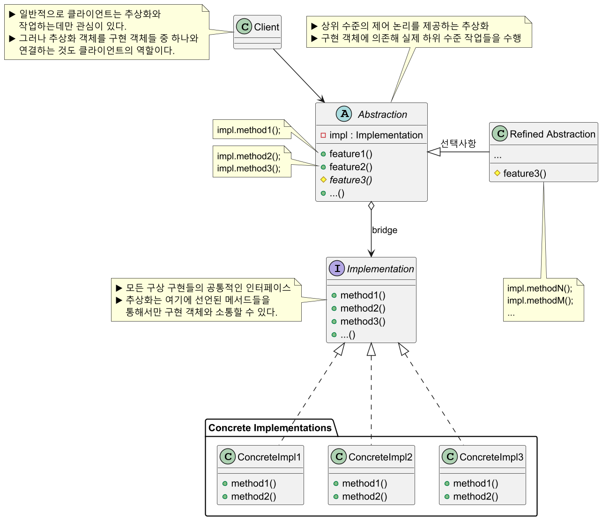
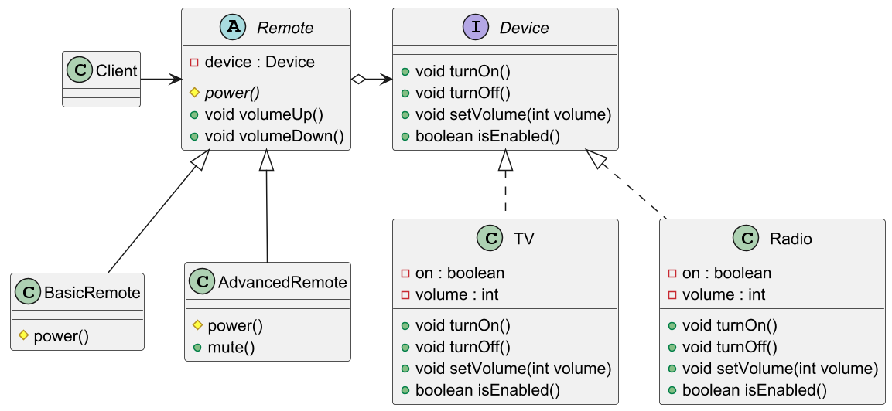
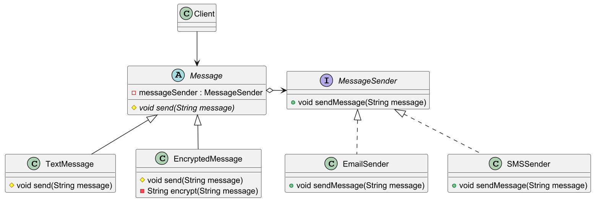

# 브리지 패턴

## 브리지 패턴 정의

밀접하게 관련된 클래스들의 집합을 두 개의 개별 계층구조로 나눈 후 각각 독립적으로
개발할 수 있도록 한다.

브리지 패턴을 사용하면 추상화된 부분과 구현 부분을 서로 다른 클래스 계층구조로 분리해서
그 둘을 모두 변경할 수 있다.

## 브리지 패턴 구조



## 브리지 패턴 예제 코드 - 1



```java
//Implementation
public interface Device {
    void turnOn();
    void turnOff();
    void setVolume(int volume);
    boolean isEnabled();
}
```
```java
//Concrete Implementation
public class TV implements Device {

    private boolean on = false;
    private int volume = 30;

    @Override
    public void turnOn() {
        on = true;
        System.out.println("TV is now ON.");
    }

    @Override
    public void turnOff() {
        on = false;
        System.out.println("TV is now OFF.");
    }

    @Override
    public void setVolume(int volume) {
        this.volume = volume;
        System.out.println("TV volume set to " + volume);
    }

    @Override
    public boolean isEnabled() {
        return on;
    }
}
```
```java
//Concrete Implementation
public class Radio implements Device {

    private boolean on = false;
    private int volume = 30;

    @Override
    public void turnOn() {
        on = true;
        System.out.println("Radio is now ON.");
    }

    @Override
    public void turnOff() {
        on = false;
        System.out.println("Radio is now OFF.");
    }

    @Override
    public void setVolume(int volume) {
        this.volume = volume;
        System.out.println("Radio volume set to " + volume);
    }

    @Override
    public boolean isEnabled() {
        return on;
    }
}
```
```java
//Abstraction
public abstract class Remote {

    //Composition Implementation
    protected Device device;

    protected Remote(Device device) {
        this.device = device;
    }

    protected abstract void power();

    public void volumeUp() {
        device.setVolume(device.isEnabled() ? 1 : 0);
    }

    public void volumeDown() {
        device.setVolume(device.isEnabled() ? -1 : 0);
    }
}
```
```java
//Refined Abstraction
public class BasicRemote extends Remote {

    protected BasicRemote(Device device) {
        super(device);
    }

    @Override
    protected void power() {
        if (device.isEnabled()) {
            device.turnOff();
        } else {
            device.turnOn();
        }
    }
}
```
```java
//Refined Abstraction
public class AdvancedRemote extends Remote {

    protected AdvancedRemote(Device device) {
        super(device);
    }

    @Override
    protected void power() {
        if (device.isEnabled()) {
            device.turnOff();
        } else {
            device.turnOn();
        }
    }

    public void mute() {
        device.setVolume(0);
        System.out.println("Device is muted.");
    }
}
```
```java
//Client
public class Client {
    public static void main(String[] args) {

        //기본 리모컨
        Remote basicRemote = new BasicRemote(new TV());//추상화에 구현 객체 연결

        basicRemote.power();    //TV is now ON.
        basicRemote.volumeUp(); //TV volume set to 1

        //고급 리모컨
        AdvancedRemote advancedRemote = new AdvancedRemote(new Radio());//추상화에 구현 객체 연결

        advancedRemote.power(); //Radio is now ON.
        advancedRemote.mute();
        //Radio volume set to 0
        //Device is muted.
    }
}
```

## 브리지 패턴 예제 코드 - 2



```java
//Implementation
public interface MessageSender {
    void sendMessage(String message);
}
```
```java
//Concrete Implementation
public class SMSSender implements MessageSender {

    @Override
    public void sendMessage(String message) {
        System.out.println("Sending SMS with message: " + message);
    }
}
```
```java
//Concrete Implementation
public class EmailSender implements MessageSender {

    @Override
    public void sendMessage(String message) {
        System.out.println("Sending email with message: " + message);
    }
}
```
```java
//Abstraction
public abstract class Message {

    protected MessageSender messageSender;

    protected Message(MessageSender messageSender) {
        this.messageSender = messageSender;
    }

    protected abstract void send(String message);
}
```
```java
//Refined Abstraction
public class TextMessage extends Message{

    protected TextMessage(MessageSender messageSender) {
        super(messageSender);
    }

    @Override
    protected void send(String message) {
        messageSender.sendMessage("Text Message: " + message);
    }
}
```
```java
//Refined Abstraction
public class EncryptedMessage extends Message{

    protected EncryptedMessage(MessageSender messageSender) {
        super(messageSender);
    }

    @Override
    protected void send(String message) {
        messageSender.sendMessage("Encrypted Message: " + encrypt(message));
    }

    private String encrypt(String message) {
        return new StringBuilder(message).reverse().toString();
    }
}
```
```java
//Client
public class Client {
    public static void main(String[] args) {

        String message = "Hello World!";

        Message textMessage = new TextMessage(new EmailSender());
        textMessage.send(message);

        Message encryptedMessage = new EncryptedMessage(new SMSSender());
        encryptedMessage.send(message);
    }
}
```

## 브리지 패턴 장단점

### 브리지 패턴 장점

- 구현과 인터페이스를 완전히 결합하지 않았기에 구현과 추상화 부분을 분리할 수 있다.
- 추상화된 부분과 실제 구현 부분을 독립적으로 확장할 수 있다.
- 추상화 부분을 구현한 구상 클래스가 바뀌어도 클라이언트에는 영향을 끼치지 않는다.
- 인터페이스와 실제 구현할 부분을 서로 다른 방식으로 변경해야 할 때 유용하게 쓰인다.
- 새로운 추상화들과 구현들을 상호 독립적으로 도입할 수 있다.(**OCP** 준수)

### 브리지 패턴 단점

- 결합도가 높은 클래스에 패턴을 적용하면 코드가 더 복잡해질 수 있다.

---

### 참고

- [참고 사이트](https://refactoring.guru/ko/design-patterns/bridge)
- [참고 강의](https://www.inflearn.com/course/%EA%B0%9D%EC%B2%B4%EC%A7%80%ED%96%A5-%EB%94%94%EC%9E%90%EC%9D%B8-%ED%8C%A8%ED%84%B4-%EC%96%84%EC%BD%94/dashboard)
- [참고 책](https://www.yes24.com/Product/Goods/108192370)