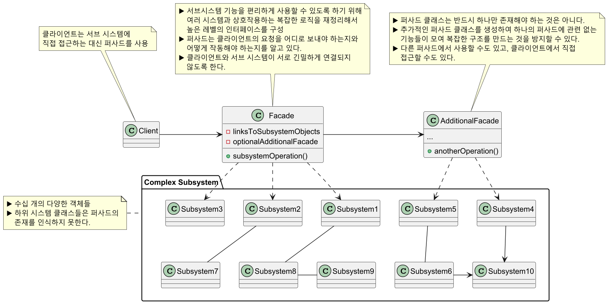
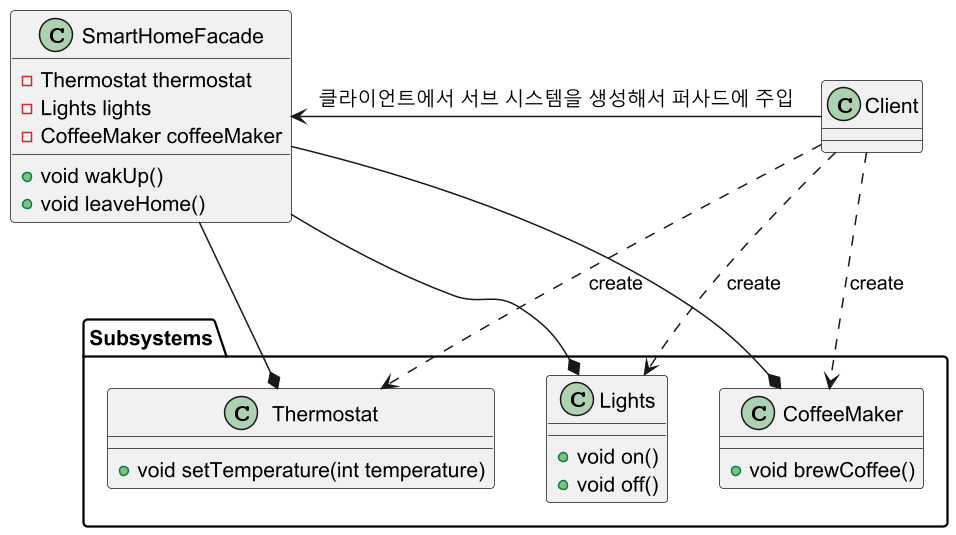
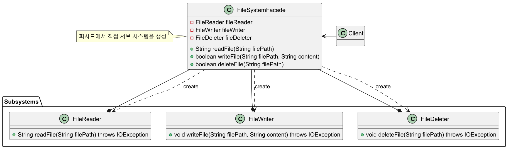

# 퍼사드 패턴

## 퍼사드 패턴 정의

서브시스템에 있는 일련의 인터페이스를 통합 인터페이스로 묶어 준다. 또한 고수준
인터페이스도 정의하므로 서브시스템을 더 편리하게 사용할 수 있다.

## 퍼사드 패턴 구조



## 퍼사드 패턴 예제 코드 - 1



```java
//Subsystem
public class Thermostat {

    public void setTemperature(int temperature) {
        System.out.println("Setting thermostat to " + temperature + " degrees.");
    }
}
```
```java
//Subsystem
public class Lights {

    public void on() {
        System.out.println("Lights are on.");
    }

    public void off() {
        System.out.println("Lights are off.");
    }
}
```
```java
//Subsystem
public class CoffeeMaker {

    public void brewCoffee() {
        System.out.println("Brewing Coffee.");
    }
}
```
```java
//Facade
public class SmartHomeFacade {

    private final Thermostat thermostat;
    private final Lights lights;
    private final CoffeeMaker coffeeMaker;

    public SmartHomeFacade(Thermostat thermostat, Lights lights, CoffeeMaker coffeeMaker) {
        this.thermostat = thermostat;
        this.lights = lights;
        this.coffeeMaker = coffeeMaker;
    }

    public void wakUp() {
        System.out.println("Waking up...");
        thermostat.setTemperature(22);
        lights.on();
        coffeeMaker.brewCoffee();
    }

    public void leaveHome() {
        System.out.println("Leaving home...");
        thermostat.setTemperature(18);
        lights.off();
    }
}
```
```java
//Client
public class Client {
    public static void main(String[] args) {

        SmartHomeFacade homeFacade = new SmartHomeFacade(
            new Thermostat(),
            new Lights(),
            new CoffeeMaker()
        );

        homeFacade.wakUp();
        //Output
        //Waking up...
        //Setting thermostat to 22 degrees.
        //Lights are on.
        //Brewing Coffee.

        homeFacade.leaveHome();
        //Output
        //Leaving home...
        //Setting thermostat to 18 degrees.
        //Lights are off.
    }
}
```

## 퍼사드 패턴 예제 코드 - 2



```java
import java.io.IOException;
import java.nio.file.Files;
import java.nio.file.Paths;

//Subsystem
public class FileReader {

    public String readFile(String filePath) throws IOException {
        return new String(Files.readAllBytes(Paths.get(filePath)));
    }
}
```
```java
import java.io.IOException;
import java.nio.file.Files;
import java.nio.file.Paths;

//Subsystem
public class FileWriter {

    public void writeFile(String filePath, String content) throws IOException {
        Files.write(Paths.get(filePath), content.getBytes());
    }
}
```
```java
import java.io.IOException;
import java.nio.file.Files;
import java.nio.file.Paths;

//Subsystem
public class FileDeleter {

    public void deleteFile(String filePath) throws IOException {
        Files.delete(Paths.get(filePath));
    }
}
```
```java
import java.io.IOException;

//Facade
public class FileSystemFacade {

    private final FileReader fileReader;
    private final FileWriter fileWriter;
    private final FileDeleter fileDeleter;

    //퍼사드 클래스에서 서브 시스템들을 생성
    public FileSystemFacade() {
        this.fileReader = new FileReader();
        this.fileWriter = new FileWriter();
        this.fileDeleter = new FileDeleter();
    }

    public String readFile(String filePath) {
        try {
            return fileReader.readFile(filePath);
        } catch (IOException e) {
            System.err.println("Error reading file: " + e.getMessage());
            return null;
        }
    }

    public boolean writeFile(String filePath, String content) {
        try {
            fileWriter.writeFile(filePath, content);
            return true;
        } catch (IOException e) {
            System.err.println("Error writing file: " + e.getMessage());
            return false;
        }
    }

    public boolean deleteFile(String filePath) {
        try {
            fileDeleter.deleteFile(filePath);
            return true;
        } catch (IOException e) {
            System.err.println("Error deleting file: " + e.getMessage());
            return false;
        }
    }
}
```
```java
//Client
public class Client {
    public static void main(String[] args) {

        FileSystemFacade fs = new FileSystemFacade();

        boolean writeSuccess = fs.writeFile("test.txt", "Hello, Facade Pattern!");
        System.out.println("File write success: " + writeSuccess);
        //File write success: true

        String content = fs.readFile("test.txt");
        System.out.println("File content: " + content);
        //File content: Hello, Facade Pattern!

        boolean deleteSuccess = fs.deleteFile("test.txt");
        System.out.println("File delete success: " + deleteSuccess);
        //File delete success: true
    }
}
```

> - 알아야 할 점은 퍼사드는 하위 시스템 클래스들을 캡슐화 하는 것이 아니다.
> - 단지 서브 시스템들을 사용할 간단한 인터페이스를 제공할 뿐이다.
> - 사용자가 서브 시스템 내부의 클래스를 직접 사용하는 것을 제한할 수는 없다.
>   그래서 오히려 추상화에 가깝다고 볼 수 있다.

> 대부분의 경우 퍼사드 객체는 하나만 있어도 충분하므로, 퍼사드 클래스를
> **싱글톤**으로 구성해주면 좋다.

## 퍼사드 패턴 장단점

### 퍼사드 패턴 장점

- 하위 시스템의 복잡성에서 코드를 분리하여, 외부에서 시스템을 사용하기 쉬워진다.
- 하위 시스템 간의 의존 관계가 많을 경우 이를 감소시키고 의존성을 한 곳으로 모을 수 있다.
- 복잡한 코드를 감춤으로써, 클라이언트가 시스템의 코드를 모르더라도 퍼사드 클래스만
이해하고 사용할 수 있다.

### 퍼사드 패턴 단점

- 퍼사드가 앱의 모든 클래스에 결합된 God Object가 될 수 있다.
- 퍼사드 클래스 자체가 서브 시스템에 대한 의존성을 가지게 되어 의존성을
완전히 피할 수는 없다.
- 추가적인 코드가 늘어나는 것이기 때문에 유지보수 측면에서 공수가 더 많이 들게 된다.
  - 추상화 하고자 하는 시스템이 얼마나 복잡한지, 퍼사드 패턴을 통해서 얻게 되는 이점과
    유지보수 비용의 트레이드 오프를 잘 고려해야 한다.

## 실전에서 사용되는 퍼사드 패턴

- `javax.faces.context.FacesContext`
- `javax.faces.context.ExternalContext`

---

### 참고

- [참고 블로그](https://inpa.tistory.com/entry/GOF-%F0%9F%92%A0-%ED%8D%BC%EC%82%AC%EB%93%9CFacade-%ED%8C%A8%ED%84%B4-%EC%A0%9C%EB%8C%80%EB%A1%9C-%EB%B0%B0%EC%9B%8C%EB%B3%B4%EC%9E%90)
- [참고 사이트](https://refactoring.guru/ko/design-patterns/facade)
- [참고 강의](https://www.inflearn.com/course/%EA%B0%9D%EC%B2%B4%EC%A7%80%ED%96%A5-%EB%94%94%EC%9E%90%EC%9D%B8-%ED%8C%A8%ED%84%B4-%EC%96%84%EC%BD%94/dashboard)
- [참고 책](https://www.yes24.com/Product/Goods/108192370)