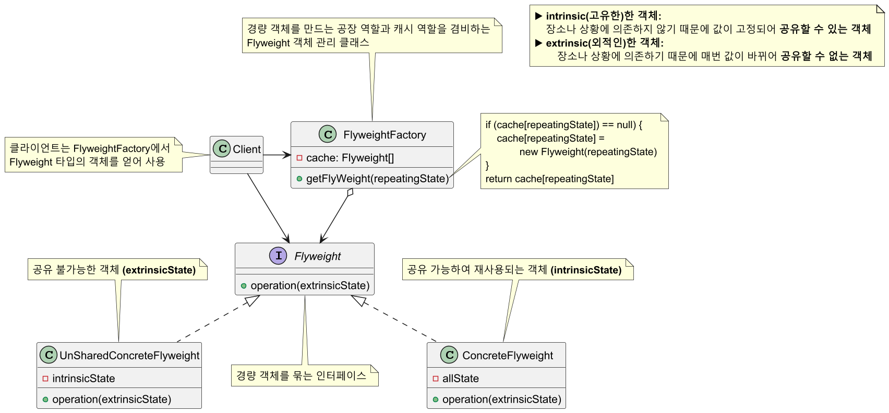
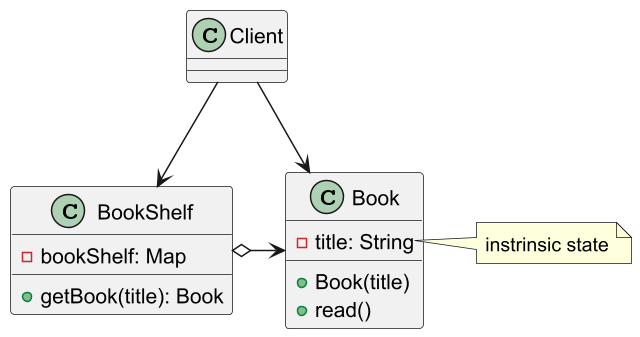
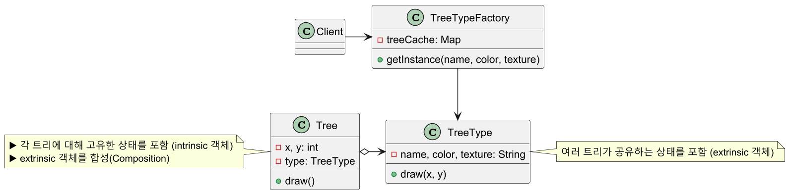

# 플라이웨이트 패턴

## 플라이웨이트(경량) 패턴 정의

재사용 가능한 객체 인스턴스를 공유시켜 메모리 사용량을 최소화하는 구조 패턴으로, 캐시 개념을 패턴화 
한것으로 볼 수 있다.

**자주 변화하는 속성(extrinsic)** 과 **변하지 않는 속성(intrinsic)** 을 분리하고 변하지 않는 속성을
캐시하여 재사용해 메모리 사용을 줄이는 방식이다. 그래서 동일하거나 유사한 객체들 사이에 가능한
많은 데이터를 서로 공유하여 사용하도록 하여 최적화를 노린다.

## 플라이웨이트 패턴 구조



## 플라이웨이트 패턴 예제 코드 - 1



```java
//Flyweight class
public class Book {

    private final String title; //intrinsic state (shared)

    public Book(String title) {
        this.title = title;
    }

    public void read() {
        System.out.println("Reading the book titled: " + title);
    }
}
```
```java
//FlyweightFactory class
public class BookShelf {

    private static final Map<String, Book> bookshelf = new HashMap<>();

    public static Book getBook(String title) {

        Book book = bookshelf.get(title);

        if (book == null) {
            book = new Book(title);
            bookshelf.put(title, book);
            System.out.println("Adding a new book to the bookshelf: " + title);
        }
        else {
            System.out.println("Reusing existing book from the bookshelf: " + title);
        }

        return book;
    }
}
```
```java
public class Client {
    public static void main(String[] args) {

        Book book1 = BookShelf.getBook("Effective Java");
        book1.read();
        //Adding a new book to the bookshelf: Effective Java
        //Reading the book titled: Effective Java

        Book book2 = BookShelf.getBook("Effective Java");
        book2.read();
        //Reusing existing book from the bookshelf: Effective Java
        //Reading the book titled: Effective Java

        Book book3 = BookShelf.getBook("Clean Code");
        book3.read();
        //Adding a new book to the bookshelf: Clean Code
        //Reading the book titled: Clean Code

        System.out.println(book1 == book2); //true
        System.out.println(book1 == book3); //false
    }
}
```

## 플라이웨이트 패턴 예제 코드 - 2



```java
public class Tree {

    private final int x;
    private final int y;
    private final TreeType type;

    public Tree(int x, int y, TreeType type) {
        this.x = x;
        this.y = y;
        this.type = type;
    }

    public void draw() {
        type.draw(x, y);
    }
}
```
```java
public class TreeType {

    private final String name;  
    private final String color; 
    private final String texture;

    public TreeType(String name, String color, String texture) {
        this.name = name;
        this.color = color;
        this.texture = texture;
    }

    public void draw(int x, int y) {
        System.out.printf(
            "Drawing %s tree at (%d, %d) with %s color and %s texture\n",
            name, x, y, color, texture
        );
    }
}
```
```java
public class TreeTypeFactory {

    private static final Map<String, TreeType> treeCache = new HashMap<>();

    public static TreeType getInstance(String name, String color, String texture) {
        String key = name + "-" + color + "-" + texture;
        treeCache.putIfAbsent(key, new TreeType(name, color, texture));
        return treeCache.get(key);
    }
}
```
```java
public class Client {
    public static void main(String[] args) {

        TreeType oak = TreeTypeFactory.getInstance("Oak", "Green", "Rough");
        TreeType pine = TreeTypeFactory.getInstance("Pine", "Dark Green", "Smooth");

        List<Tree> forest = new ArrayList<>();

        //초기 두번만 oak과 pine을 생성하고 이후 캐시된 객체 공유해서 사용
        for (int i = 0; i < 5; i++) {
            int x = (int) (Math.random() * 100); //0 ~ 99
            int y = (int) (Math.random() * 100); //0 ~ 99
            TreeType type = (i % 2 == 0) ? oak : pine;
            forest.add(new Tree(x, y, type));
        }

        for (Tree tree : forest) {
            tree.draw();
        }
        //Drawing Oak tree at (97, 45) with Green color and Rough texture        (oak 객체 생성)
        //Drawing Pine tree at (74, 53) with Dark Green color and Smooth texture (pine 객체 생성)
        //Drawing Oak tree at (12, 68) with Green color and Rough texture        (캐시된 oak 객체 사용)
        //Drawing Pine tree at (40, 4) with Dark Green color and Smooth texture  (캐시된 pine 객체 사용)
        //Drawing Oak tree at (31, 42) with Green color and Rough texture        (캐시된 oak 객체 사용)
    }
}
```

> **참고**
> 
> - `HashMap`에 캐시되어 있는 `TreeType` 인스턴스는 관리되고 있는 인스턴스이다.
> - 즉, **GC 처리되지 않는다는 점을 주의해야 한다.**
> - 예를 들어 필요한 나무를 모두 생성했다면 `TreeTypeFactory`에 잔존해있는 **Flyweight Pool**을
> 비워줄 필요가 있다.
> - 메모리 최적화를 위해 플라이웨이트 패턴을 적용하는 것이기 때문에 이런 세세한 부분을 잘 고려해야 한다.

## 플라이웨이트 패턴 장단점

### 플라이웨이트 패턴 장점

- 애플리케이션에서 사용하는 메모리를 줄일 수 있다.
- 여러 가상 객체의 상태를 한곳에 모아 둘 수 있다.
- 어떤 클래스의 인스턴스가 아주 많이 필요하지만 모두 똑같은 방식으로 제어해야 할 때 유용하다.

### 플라이웨이트 패턴 단점

- 코드의 복잡도가 증가한다.
- 특정 인스턴스만 다른 인스턴스와 다르게 행동하게 할 수 없다.

## 실전에서 사용되는 플라이웨이트 패턴

- `Java String Constant Pool`
- `java.lang.Integer.valueOf()`
  - 내부적으로 `-128 ~ 127` 범위를 캐싱해서 사용

---

### 참고

- [참고 블로그](https://inpa.tistory.com/entry/GOF-%F0%9F%92%A0-Flyweight-%ED%8C%A8%ED%84%B4-%EC%A0%9C%EB%8C%80%EB%A1%9C-%EB%B0%B0%EC%9B%8C%EB%B3%B4%EC%9E%90)
- [참고 사이트](https://refactoring.guru/ko/design-patterns/flyweight)
- [참고 강의](https://www.inflearn.com/course/%EA%B0%9D%EC%B2%B4%EC%A7%80%ED%96%A5-%EB%94%94%EC%9E%90%EC%9D%B8-%ED%8C%A8%ED%84%B4-%EC%96%84%EC%BD%94/dashboard)
- [참고 책](https://www.yes24.com/Product/Goods/108192370)