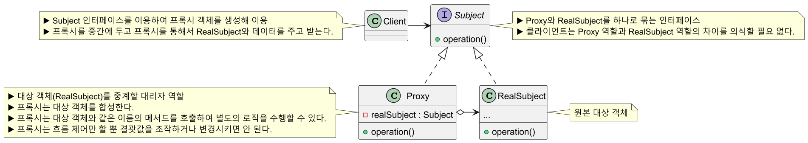
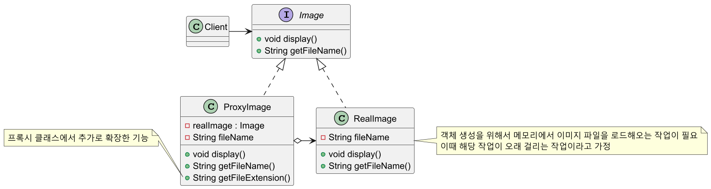
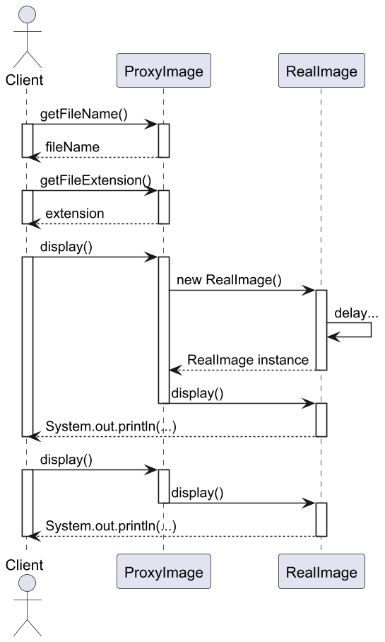
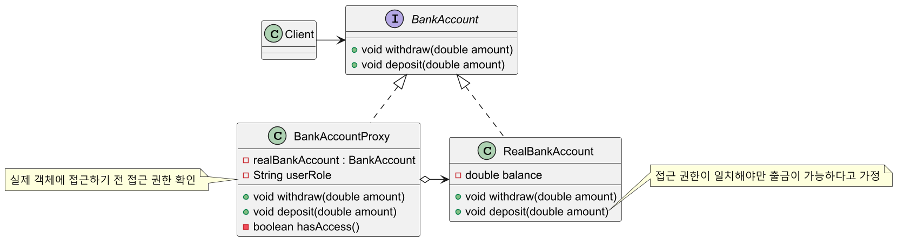
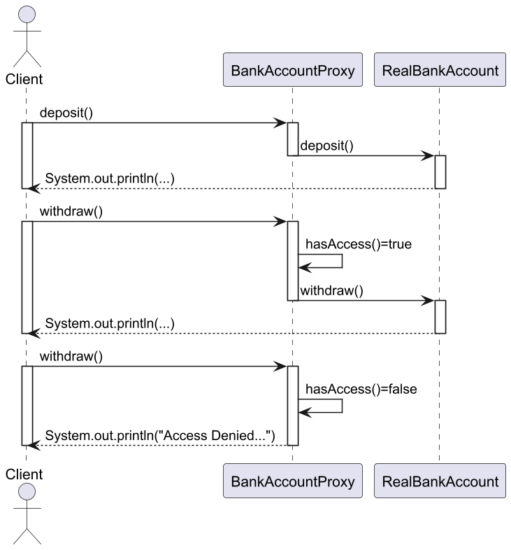
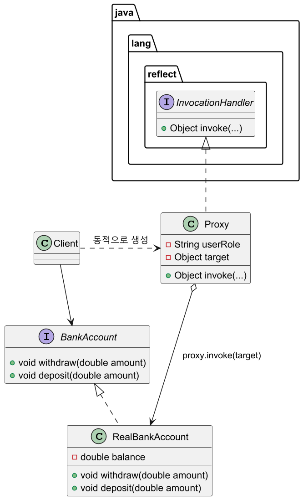

# 프록시 패턴

## 프록시 패턴 정의

특정 객체로의 접근을 제어하는 대리인(특정 객체를 대변하는 객체)을 제공한다.

프록시 패턴은 기본형 프록시를 어떤 방식으로 변형하느냐에 따라 프록시 종류를 나눌 수 있다.

**가상 프록시**
- 지연 초기화 방식
- 가끔 필요하지만 항상 메모리에 적재되어 있는 무거운 서비스 객체가 있는 경우
- 실제 객체의 생성에 많은 자원이 소모 되지만 사용 빈도는 낮을 때 쓰는 방식
- 서비스가 시작될 때 객체를 생성하는 대신에 객체 초기화가 실제로 필요한 시점에
초기화될 수 있도록 지연할 수 있다.

**보호 프록시**
- 프록시 대상 객체에 대한 자원으로의 액세스 제어
- 특정 클라이언트만 서비스 객체를 사용할 수 있도록 하는 경우
- 프록시 객체를 통해 클라이언트의 자격 증명이 기준과 일치하는 경우에만 서비스 객체에
요청을 전달할 수 있게 한다.

**로깅 프록시**
- 대상 객체에 대한 로깅을 추가하려는 경우
- 프록시는 대상 객체 메서드를 실행하기 전에 로깅 기능을 추가하여 재정의한다.

**원격 프록시**
- 프록시 클래스는 로컬에 있고, 대상 객체는 원격 서버에 존재하는 경우
- 프록시 객체는 네트워크를 통해 클라이언트의 요청을 전달하여 네트워크과 관련된
불필요한 작업들을 처리하고 결괏값만 반환한다.
- 클라이언트 입장에서는 원격이든 로컬이든 신경 쓸 필요가 없으며, 프록시는 진짜
객체와 통신을 대리하게 된다.

**캐싱 프록시**
- 데이터가 큰 경우 캐싱하여 재사용을 유도한다.
- 클라이언트 요청의 결과를 캐시하고 이 캐시의 수명 주기를 관리한다.

## 프록시 패턴 구조



## 프록시 패턴 예제 코드 - 1



```java
//Subject
public interface Image {
    void display();
    String getFileName();
}
```
```java
//Real Subject
public class RealImage implements Image {

    private final String fileName;

    public RealImage(String fileName) {
        this.fileName = fileName;
        loadFromDisk();
    }

    private void loadFromDisk() {
        delay();
        System.out.println("Loading " + fileName);
    }

    private void delay() {
        try {
            Thread.sleep(1500);
        } catch (InterruptedException e) {
            throw new RuntimeException(e);
        }
    }

    @Override
    public void display() {
        System.out.println("Displaying " + fileName);
    }

    @Override
    public String getFileName() {
        return fileName;
    }
}
```
```java
//Proxy
public class ProxyImage implements Image {

    private Image realImage;
    private final String fileName;

    public ProxyImage(String fileName) {
        this.fileName = fileName;
    }

    @Override
    public void display() {
        if (realImage == null) {
            realImage = new RealImage(fileName);
        }
        realImage.display();
    }

    @Override
    public String getFileName() {
        return fileName;
    }

    //프록시 클래스에서 추가로 확장한 기능
    public String getFileExtension() {
        int lastIndex = fileName.lastIndexOf('.');
        if (lastIndex == -1) {
            return "";
        }
        return fileName.substring(lastIndex + 1);
    }
}
```
```java
//Client
public class Client {
    public static void main(String[] args) {

        ProxyImage image = new ProxyImage("test_image.jpg");

        System.out.println("File name: " + image.getFileName());           //File name: test_image.jpg
        System.out.println("File extension: " + image.getFileExtension()); //File extension: jpg

        image.display();
        //(1s delay...)
        //Loading test_image.jpg(첫 요청 실제 객체 호출)
        //Displaying test_image.jpg

        image.display();
        //Displaying test_image.jpg
    }
}
```



## 프록시 패턴 예제 코드 - 2



```java
//Subject
public interface BankAccount {
    void withdraw(double amount);
    void deposit(double amount);
}
```
```java
//Real Subject
public class RealBankAccount implements BankAccount {

    private double balance;

    public RealBankAccount(double balance) {
        this.balance = balance;
    }

    @Override
    public void withdraw(double amount) {

        if (amount > balance) {
            System.out.println("Insufficient balance.");
            return;
        }

        balance -= amount;
        System.out.println(amount + " withdrawn, Current balance: " + balance);
    }

    @Override
    public void deposit(double amount) {
        balance += amount;
        System.out.println(amount + " deposited, Current balance: " + balance);
    }
}
```
```java
//Proxy
public class BankAccountProxy implements BankAccount {

    private final BankAccount realBankAccount;
    private final String userRole;

    public BankAccountProxy(String userRole, double initialBalance) {
        this.userRole = userRole;
        this.realBankAccount = new RealBankAccount(initialBalance);
    }

    @Override
    public void withdraw(double amount) {
        if (!hasAccess()) {
            System.out.println("Access Denied, Only Admin can withdraw.");
            return;
        }

        realBankAccount.withdraw(amount);
    }

    private boolean hasAccess() {
        return "Admin".equalsIgnoreCase(userRole);
    }

    @Override
    public void deposit(double amount) {
        realBankAccount.deposit(amount);
    }
}
```
```java
//Client
public class Client {
    public static void main(String[] args) {

        BankAccount adminAccount = new BankAccountProxy("Admin", 1000);
        adminAccount.deposit(500);  //500.0 deposited, Current balance: 1500.0
        adminAccount.withdraw(300); //300.0 withdrawn, Current balance: 1200.0

        BankAccount userAccount = new BankAccountProxy("User", 1000);
        userAccount.deposit(500);   //500.0 deposited, Current balance: 1500.0
        userAccount.withdraw(300);  //Access Denied, Only Admin can withdraw.
    }
}
```



### Dynamic Proxy

개발자가 직접 프록시 패턴을 구현해도 되지만, 자바에서는 **동적 프록시**라는 별도로 프록시 객체 구현
기능을 지원한다.

동적 프록시는 개발자가 직접 일일이 프록시 객체를 생성하지 않고 애플리케이션 실행 도중
자바 기술을 사용하여 동적으로 프록시 인스턴스를 만들어 등록하는 방법이다.

`java.lang.reflect.Proxy` 패키지에서 제공하는 API를 사용하며, 자바의 리플렉션 API 기법을 응용한
개념이다. 별도의 프록시 클래스 정의없이 런타임에 프록시 객체를 동적으로 생성해 이용할 수 있다는 장점이 있다.



```java
import java.lang.reflect.InvocationHandler;
import java.lang.reflect.Method;

//Proxy
public class BankAccountInvocationHandler implements InvocationHandler {

    private final String userRole;
    private final Object target;

    public BankAccountInvocationHandler(String userRole, Object target) {
        this.userRole = userRole;
        this.target = target;
    }

    @Override
    public Object invoke(Object proxy, Method method, Object[] args) throws Throwable {

        if (method.getName().equals("withdraw")) {
            if (!hasAccess()) {
                System.out.println("Access Denied, Only Admin can withdraw.");
                return null;
            }
        }

        return method.invoke(target, args);
    }

    private boolean hasAccess() {
        return "Admin".equalsIgnoreCase(userRole);
    }
}
```
```java
import java.lang.reflect.Proxy;

//Client
public class DynamicProxyClient {
    public static void main(String[] args) {

        BankAccount adminAccount = (BankAccount) Proxy.newProxyInstance(
            BankAccount.class.getClassLoader(),
            new Class[]{BankAccount.class},
            new BankAccountInvocationHandler("Admin", new RealBankAccount(1000))
        );

        adminAccount.deposit(500);  //500.0 deposited, Current balance: 1500.0
        adminAccount.withdraw(300); //300.0 withdrawn, Current balance: 1200.0

        BankAccount userAccount = (BankAccount) Proxy.newProxyInstance(
            BankAccount.class.getClassLoader(),
            new Class[]{BankAccount.class},
            new BankAccountInvocationHandler("User", new RealBankAccount(1000))
        );

        userAccount.deposit(500);   //500.0 deposited, Current balance: 1500.0
        userAccount.withdraw(300);  //Access Denied, Only Admin can withdraw.
    }
}
```

## 프록시 패턴 장단점

### 프록시 패턴 장점

- 기존 대상 객체의 코드를 변경하지 않고 새로운 기능을 추가할 수 있다.(**OCP** 준수)
- 대상 객체는 자신의 기능에만 집중하고 그 외의 부가적인 기능을 제공하는 역할을 프록시 객체에
위임하여 다중 책임을 회피할 수 있다.(**SRP** 준수)
- 원래 하려던 기능을 수행하며 그 외의 부가적인 작업(로깅, 인증, 네트워크 통신 등)을 수행하는데 유용하다.

### 프록시 패턴 단점

- 많은 프록시 클래스를 도입해야 하므로 코드의 복잡도가 증가한다.
  - 여러 클래스에 로깅 기능을 추가하고 싶다면 동일한 코드를 각각의 클래스에 해당하는
    프록시 클래스를 만들어서 적용해야 하기 때문에 코드량이 많아지고 중복이 발생한다.
  - 자바에서는 **동적 프록시** 기법을 이용해서 해결할 수 있다.
- 프록시 클래스 자체에 들어가는 자원이 많다면 실제 객체로부터 응답이 늦어질 수 있다.

## 실전에서 사용되는 프록시 패턴

- `java.lang.reflect.Proxy`
- `java.rmi.*`
- `javax.ejb.EJB`
- `javax.inject.Inject`
- `javax.persistence.PersistenceContext`

---

### 참고

- [참고 블로그](https://inpa.tistory.com/entry/GOF-%F0%9F%92%A0-%ED%94%84%EB%A1%9D%EC%8B%9CProxy-%ED%8C%A8%ED%84%B4-%EC%A0%9C%EB%8C%80%EB%A1%9C-%EB%B0%B0%EC%9B%8C%EB%B3%B4%EC%9E%90)
- [참고 사이트](https://refactoring.guru/ko/design-patterns/proxy)
- [참고 강의](https://www.inflearn.com/course/%EA%B0%9D%EC%B2%B4%EC%A7%80%ED%96%A5-%EB%94%94%EC%9E%90%EC%9D%B8-%ED%8C%A8%ED%84%B4-%EC%96%84%EC%BD%94/dashboard)
- [참고 책](https://www.yes24.com/Product/Goods/108192370)