# 함수형 인터페이스 API - Consumer

- 역할 : 매개값을 받아서 처리 (리턴값 X)
- 실행 메서드 : `accept()`

## Consumer<T>

> 객체 `T`를 받아 소비

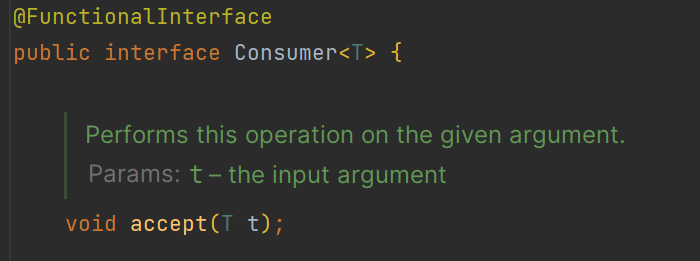

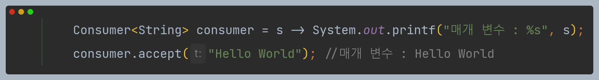

## BiConsumer<T, U>

> 객체 `T`와 `U`를 받아 소비

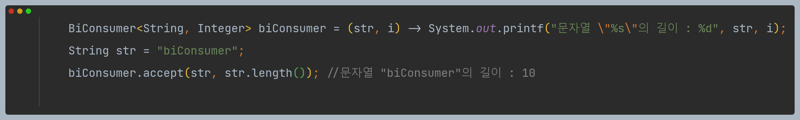

## DoubleConsumer

> `double` 값을 받아 소비

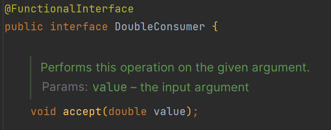

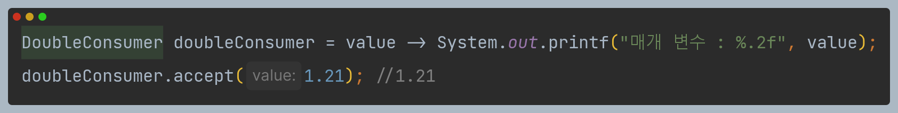

## IntConsumer

> `int` 값을 받아 소비

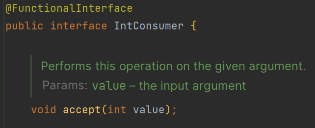

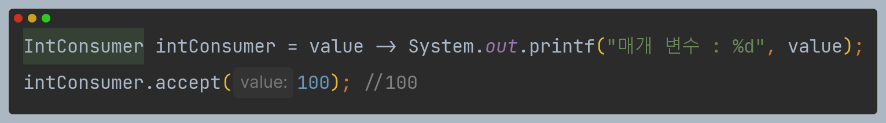

## LongConsumer

> `long` 값을 받아 소비

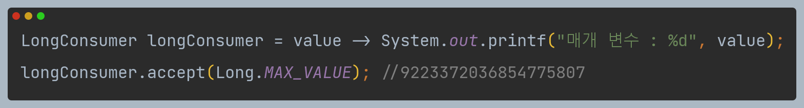

## ObjIntConsumer<T>

> 객체 `T`와 `int` 값을 받아 소비

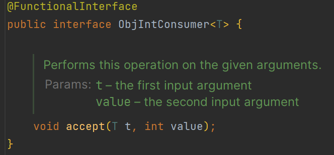

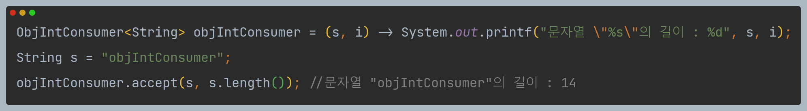

## ObjDoubleConsumer<T>

> 객체 `T`와 `double` 값을 받아 소비

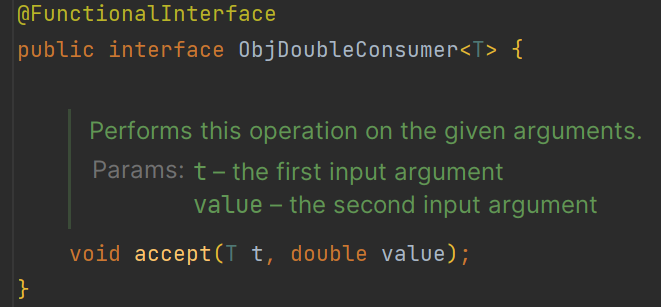

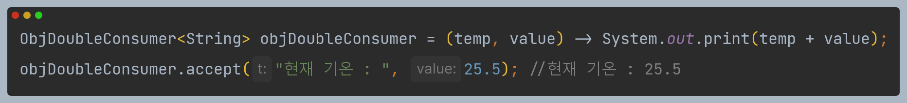

## ObjLongConsumer<T>

> 객체 `T`와 `long` 값을 받아 소비

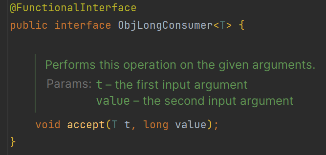

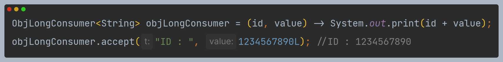

---

# Consumer 디폴트 메서드 - andThen()

- `Consumer`, `IntConsumer`, `DoubleConsumer`, `LongConsumer`, `BiConsumer`에는 디폴트 메서드 `andThen()`이 있다.
- 이 디폴트 메서드로 두 개 이상의 `accept()` 메서드를 실행시킬 수 있다.
- 메서드 체인으로 연결이 가능하다.

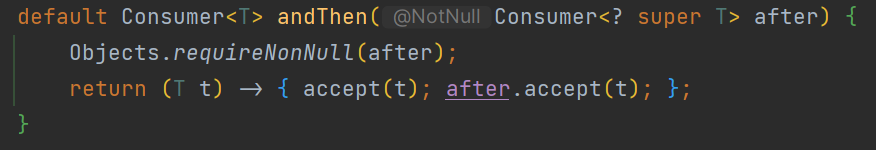

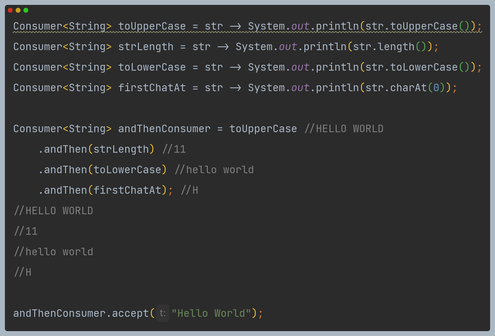
