# 함수형 인터페이스 API - Function

- 역할 : 매핑(타입 변환)
- 실행 메서드 : `apply()`, `applyAsXxx()`

## Function<T, R>

- 객체 `T`를 객체 `R`로 매핑

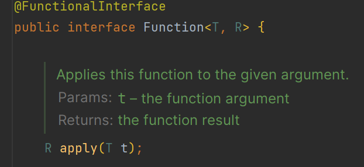

## BiFunction<T, U, R>

- 객체 `T`와 `U`를 객체 `R`로 매핑

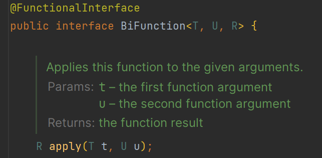

## IntFunction<R>

- `int`를 객체 `R`로 매핑

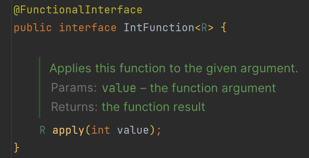

## DoubleFunction<R>

- `double`을 객체 `R`로 매핑

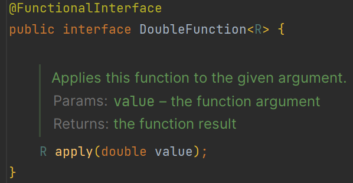

## LongFunction<R>

- `long`을 객체 `R`로 매핑

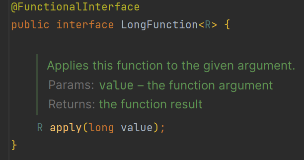

## ToIntFunction<T>

- 객체 `T`를 `int`로 매핑

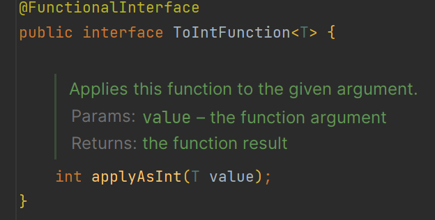

## ToDoubleFunction<T>

- 객체 `T`를 `double`로 매핑

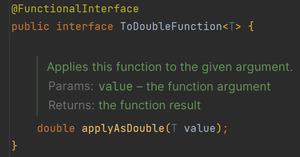

## ToLongFunction<T>

- 객체 `T`를 `long`으로 매핑

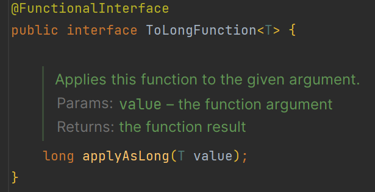

## IntToDoubleFunction

- `int`를 `double`로 매핑

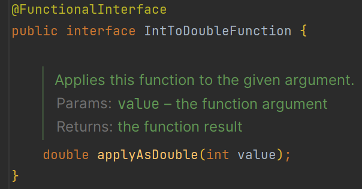

## IntToLongFunction

- `int`를 `long`으로 매핑

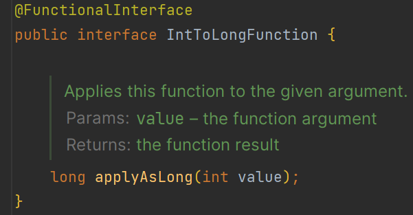

## DoubleToIntFunction

- `double`을 `int`로 매핑

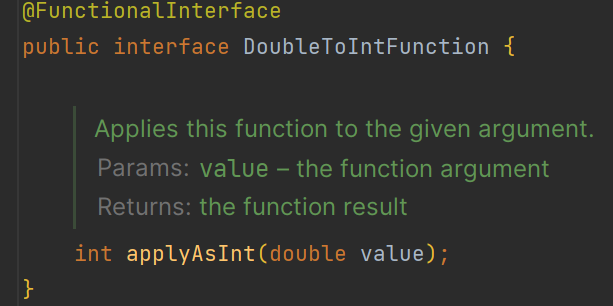

## DoubleToLongFunction

- `double`을 `long`으로 매핑

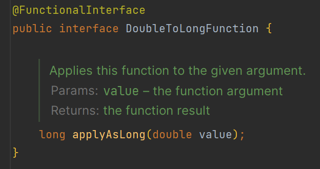

## LongToIntFunction

- `long`을 `int`로 매핑

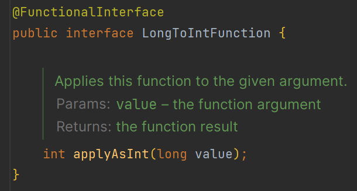

## LongToDoubleFunction

- `long`을 `double`로 매핑

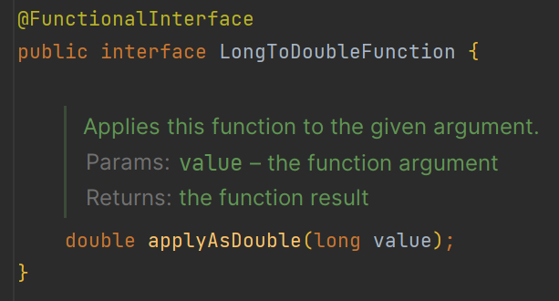

## ToIntBiFunction<T, U>

- 객체 `T`와 `U`를 `int`로 매핑

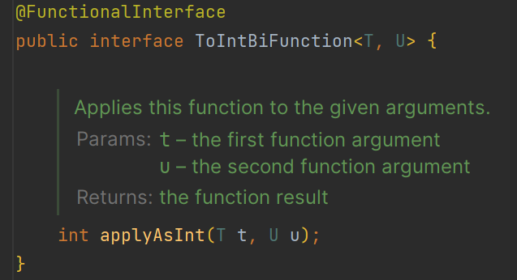

## ToDoubleBiFunction<T, U>

- 객체 `T`와 `U`를 `double`로 매핑

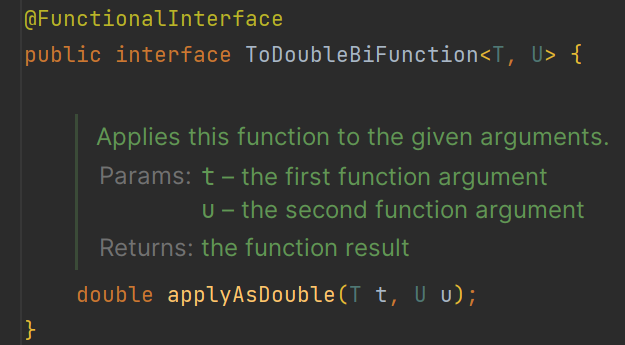

## ToLongBiFunction<T, U>

- 객체 `T`와 `U`를 `long`으로 매핑

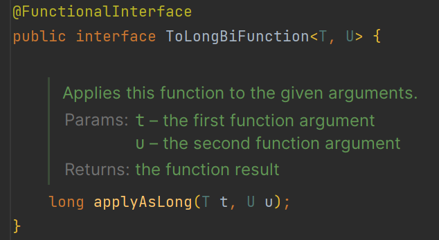

---

# Function 디폴트 메서드 - andThen()

- `Function`과 `BiFunction` 에는 디폴트 메서드 `andThen()`이 있다.
- 이 디폴트 메서드로 두 개 이상의 `apply()` 메서드를 실행시킬 수 있다.
- 메서드 체인으로 연결이 가능하다.

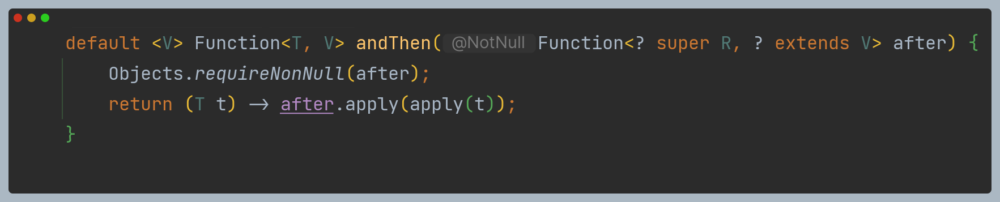

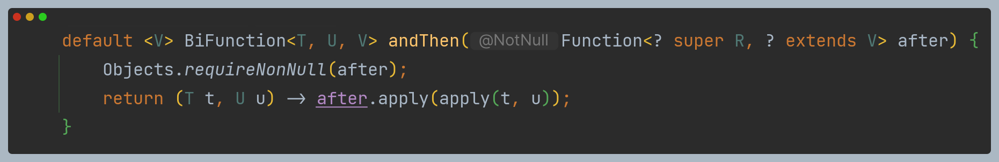

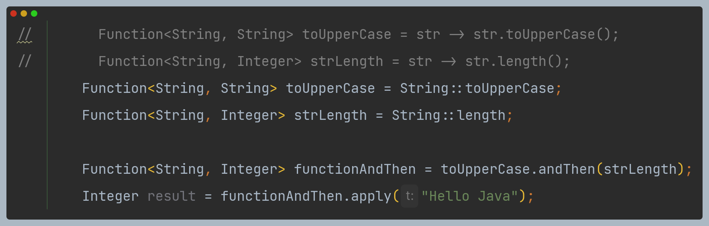

문자열을 먼저 대문자로 변환하고, 문자열의 길이를 구한다.

# Function 디폴트 메서드 - compose()

- `Function`에는 디폴트 메서드 `compose()`이 있다.
- 이 디폴트 메서드로 두 개 이상의 `apply()` 메서드를 실행시킬 수 있다.
- 메서드 체인으로 연결이 가능하다.
- `andThen`과 차이점은 함수 실행 순서이다.

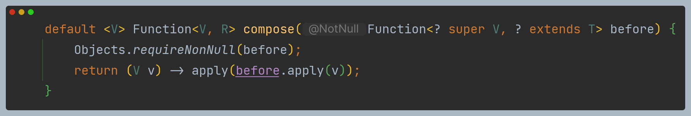

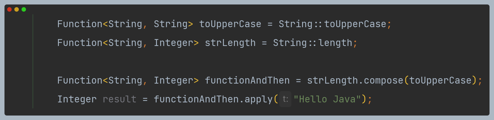

문자열 길이를 구하기 전에 문자열을 대문자로 변환한다.

# Function 정적 메서드 - identity()

- `Function`에는 정적 메서드 `identity()`가 있다.
- 주로 `stream`에서 `map`으로 구조 변경 시 자기 자신을 인자로 넘겨주는 경우에 사용되는데, `i -> i`와 비교했을 때 가독성이나
명확한 의도 표현에 유리하다는 장점이 있다.

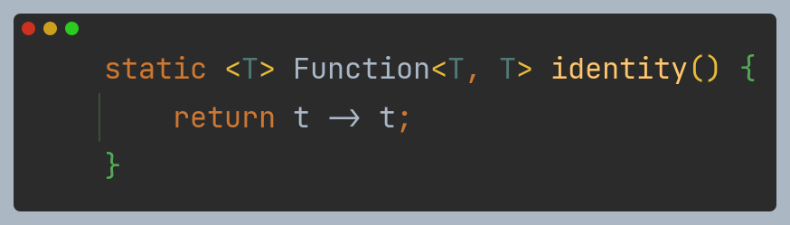