# 함수형 인터페이스 API - Operator

- 역할 : 매개값 계산해서 동일한 타입으로 리턴하기
- 실행 메서드 : `apply()`, `applyAsXxx()`

## UnaryOperator<T>

> `T`를 연산해서 `T` 리턴

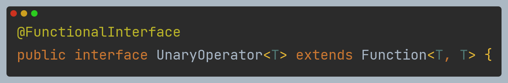

`Function<T, R>`의 하위 인터페이스로, `Function`과 같은 기능의 함수형 인터페이스이다. 차이점은 입력과 출력 타입이 같다는 것을 명확히 알 수 있다.

## BinaryOperator<T>

> `T`와 `T`를 연산해서 `T` 리턴

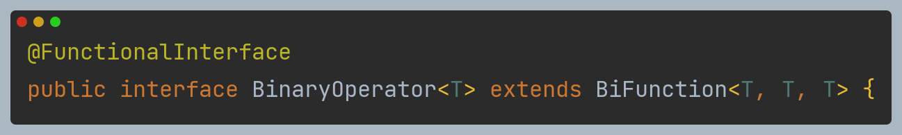

`BiFunction<T, U, R>`의 하위 인터페이스로, `BiFunction`과 같은 기능의 함수형 인터페이스이다. 차이점은 입력과 출력 타입이 같다는 것을 명확히 알 수 있다.

## IntUnaryOperator

> 한 개의 `int`를 연산

## IntBinaryOperator

> 두 개의 `int`를 연산

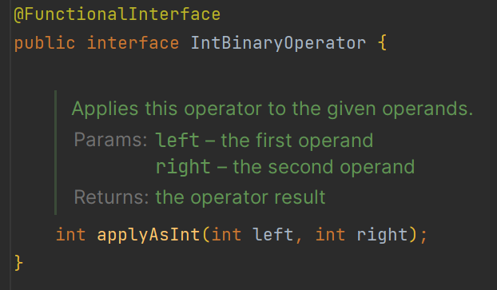

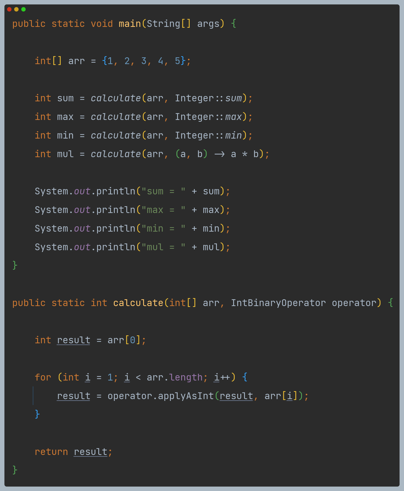

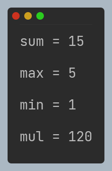

## DoubleUnaryOperator

> 한 개의 `double`을 연산

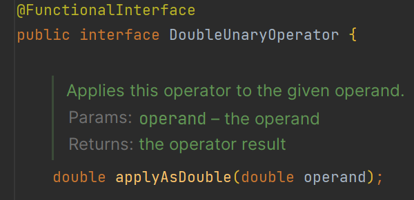

## DoubleBinaryOperator

> 두 개의 `double`을 연산

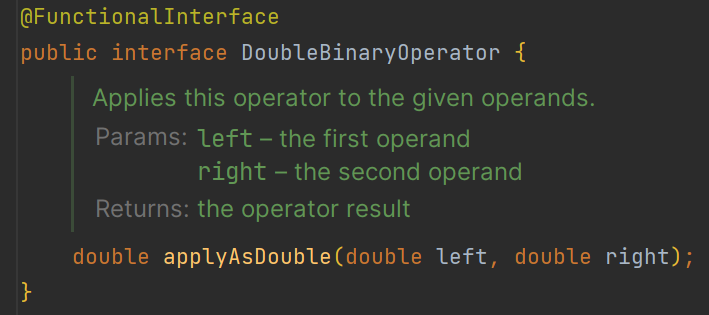

## LongUnaryOperator

> 한 개의 `long`을 연산

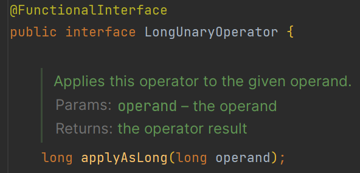

## LongBinaryOperator

> 두 개의 `long`을 연산

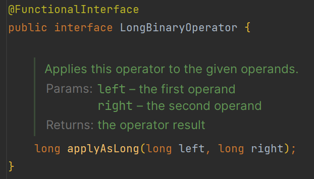

---

# Operator 정적 메서드 - identity()

- `UnaryOperator`, `IntUnaryOperator`, `DoubleUnaryOperator`, `LongUnaryOperator` 에는 정적 메서드 `identity()`가 있다.
- `Function`의 `identity()`는 더 일반적인 상황에서 활용 가능하며, `UnaryOperator`의 `identity()`는 입출력 타입이 동일한 상황에
특화되어 있다.

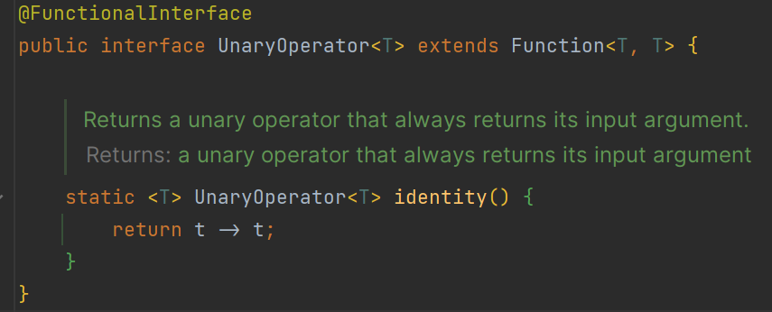

# Operator 정적 메서드 - minBy()와 maxBy()

- `BinaryOperator`에는 정적 메서드 `minBy()`와 `maxBy()`가 있다.
- 비교자(`Comparator`)를 인수로 받아 두 값을 비교하는 데 사용할 수 있다.

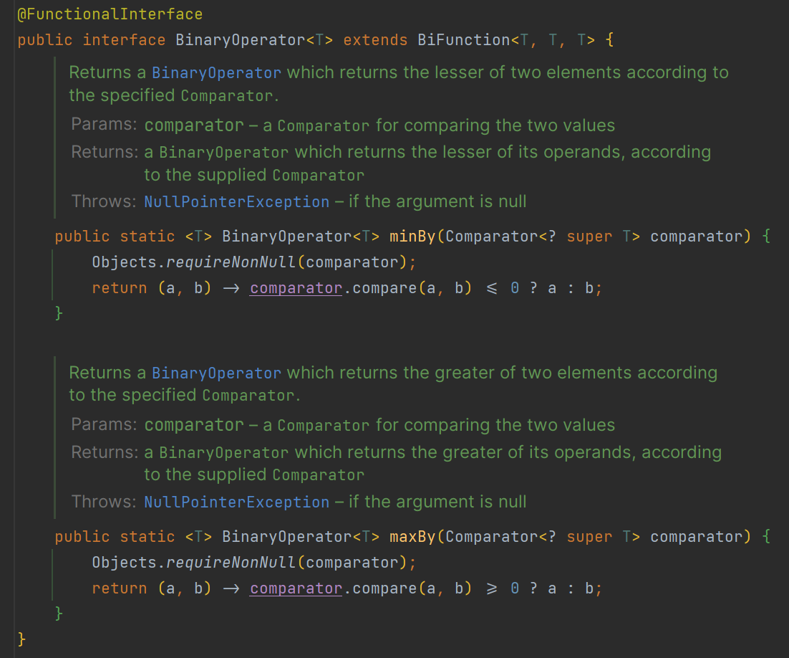

# Operator 디폴트 메서드 - compose()와 andThen()

- `IntUnaryOperator`, `DoubleUnaryOperator`, `LongUnaryOperator` 에는 디폴트 메서드 `compose()`와 `andThen()`이 있다.
- `AOperator.andThen(BOperator)`라면, `AOperator`가 실행된 후에 `BOperator`가 실행된다.
- `AOperator.compose(BOperator)`라면, 반대로 `BOperator`가 실행된 후에 `AOperator`가 실행된다.

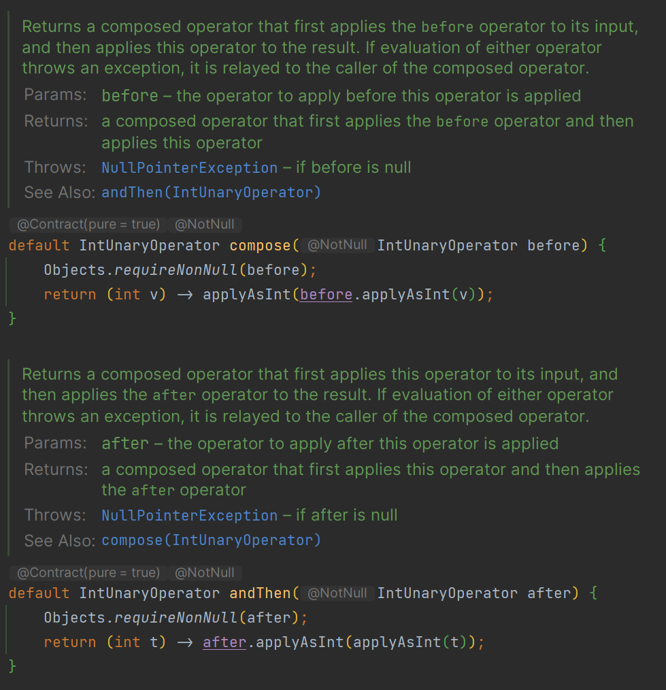