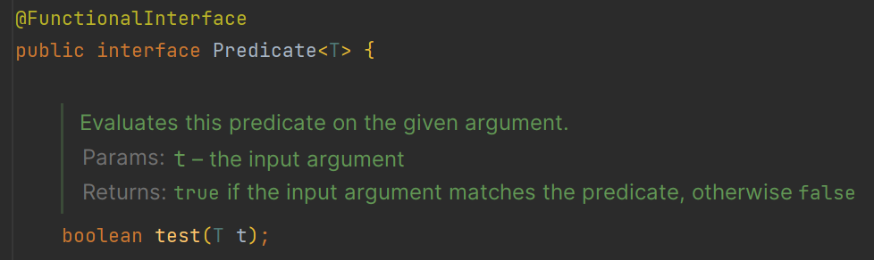
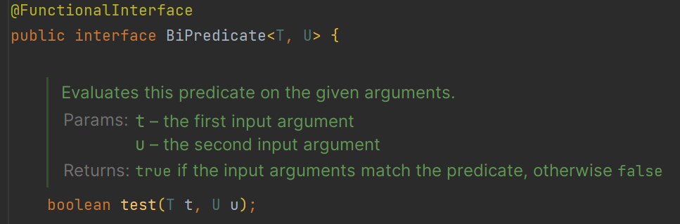
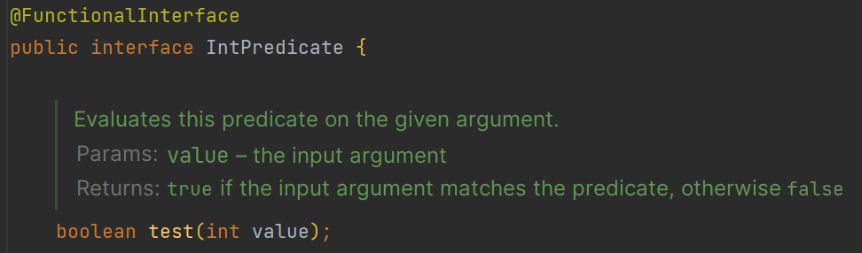
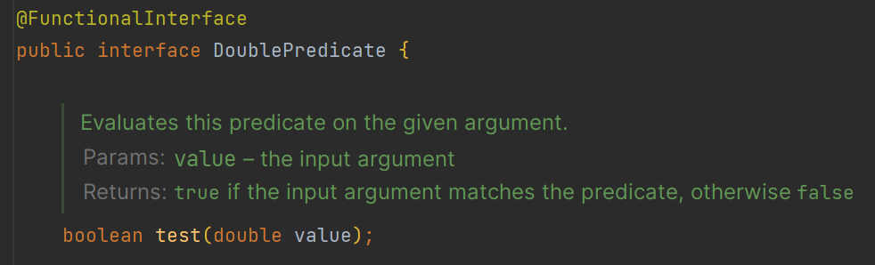
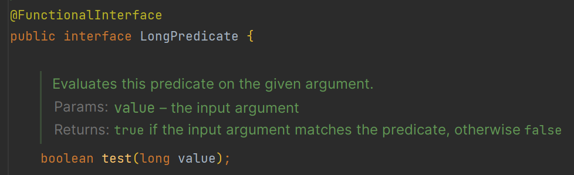
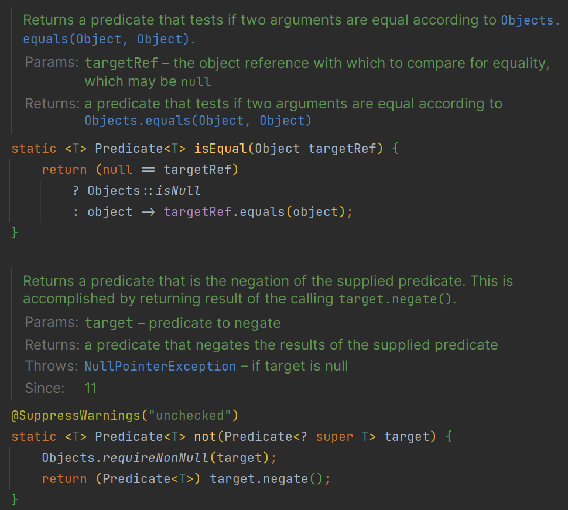
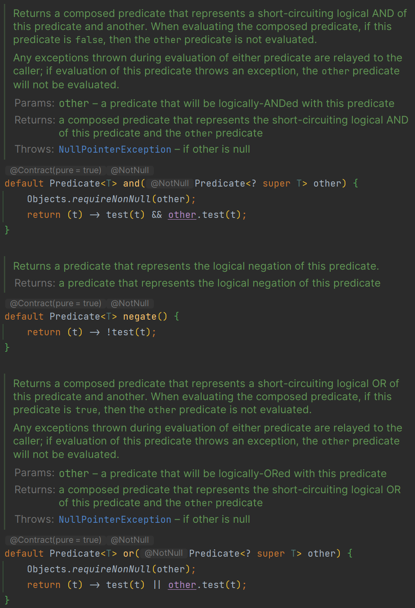

# 함수형 인터페이스 API - Predicate

- 매개값을 받아서 true 또는 false 리턴
- 실행 메서드 : `test()`

## Predicate<T>

> 객체 `T`를 검사

## BiPredicate<T, U>

> 객체 `T`와 `U`를 검사

## IntPredicate

> `int` 값을 검사

## DoublePredicate

> `double` 값을 검사

## LongPredicate

>`long` 값을 검사

---

# Predicate 정적 메서드 isEqual()과 not()

- `Predicate`에는 정적 메서드 `isEqual()`과 `not()`(자바11)이 있다.
- `isEqual()`은 두 객체 간의 동등성을 판단하고, `not()`은 `test()` 메서드의 부정을 리턴한다.

# Predicate 디폴트 메서드 and(), or(), negate()

- 모든 `Predicate` 인터페이스에는 `and()`와 `or()`, `negate()` 디폴트 메서드가 있다.
- 메서드 체인으로 `AND(&&)`, `OR(||)`, `NOT(!)`을 수행할 수 있다.

