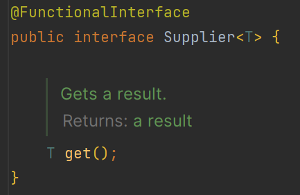
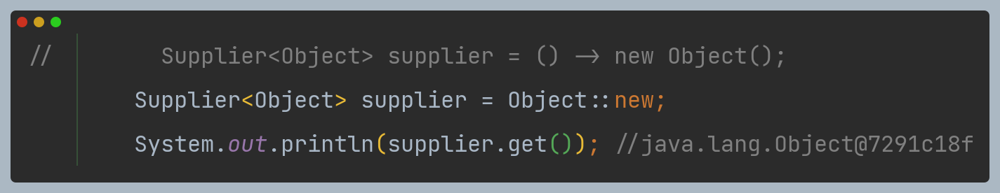
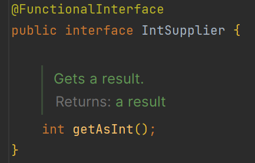
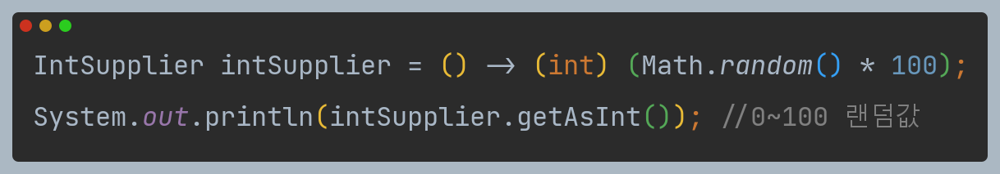
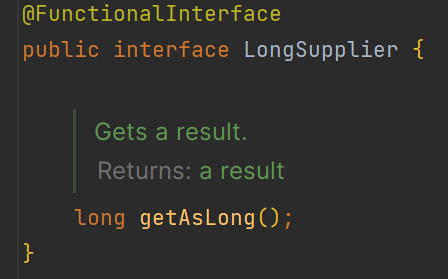
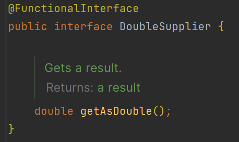
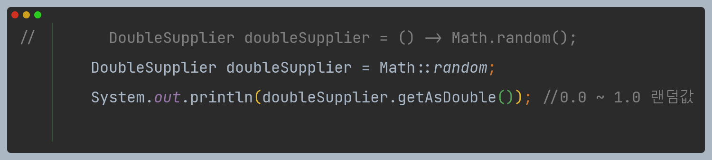
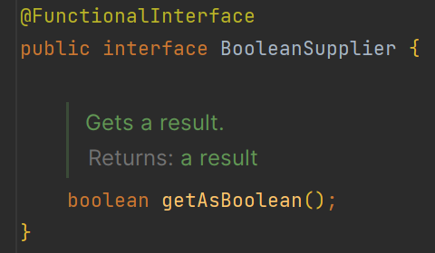
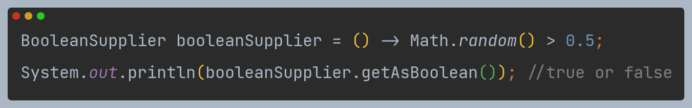

# 함수형 인터페이스 API - Supplier

- 역할 : 매개값 없이 리턴값만을 반환
- 실행 메서드 : `get()`, `getAsXxx()`

## Supplier<T>

> `T` 객체를 리턴

## IntSupplier

> `int` 값을 리턴

## LongSupplier

> `long` 값을 리턴

## DoubleSupplier

> `double` 값을 리턴

## BooleanSupplier

> `boolean` 값을 리턴

